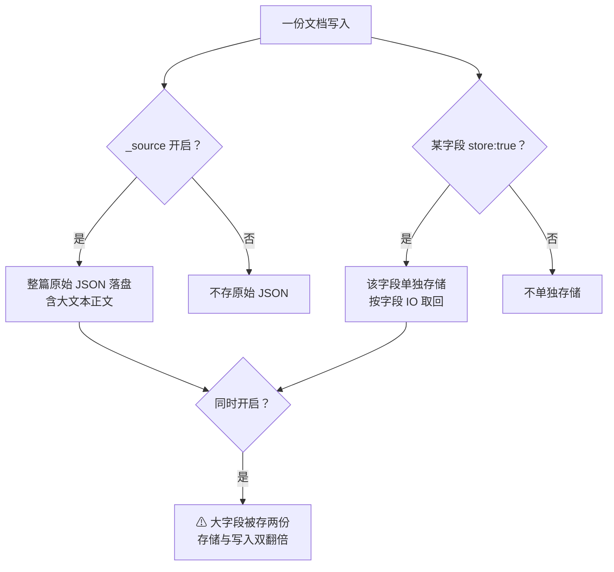
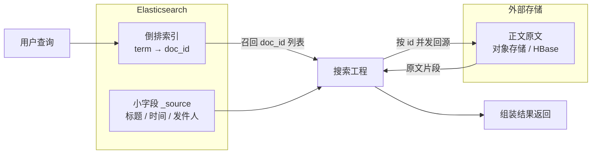
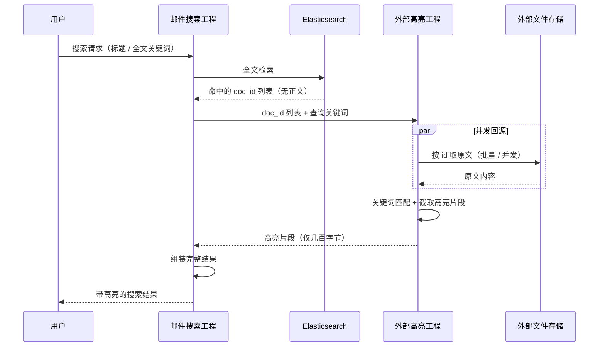
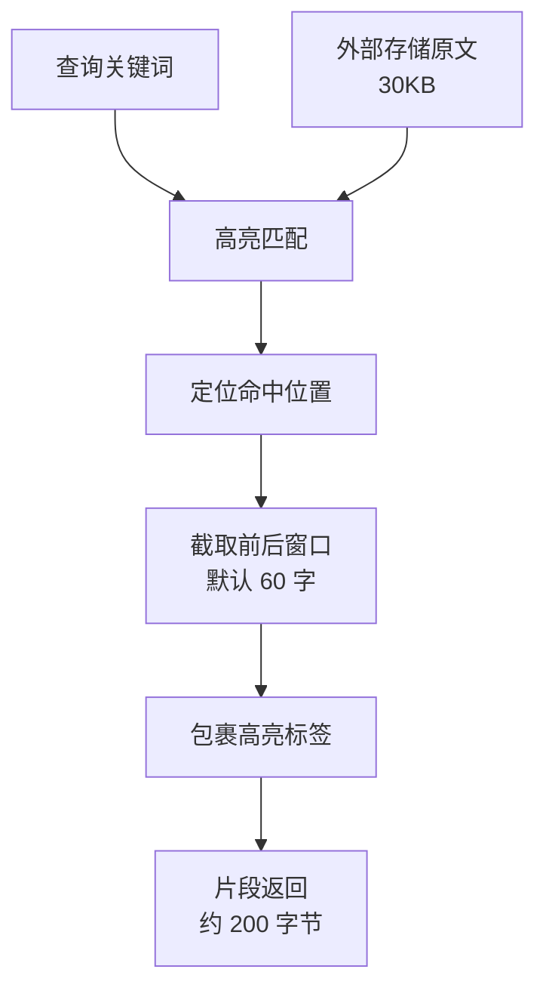

# Go 项目开发: 倒排索引与列存储分离，降低 Elasticsearch 存储压力

大文本搜索有两个绕不开的老问题：**数据膨胀过快**、**高亮效率过低**。它们的根源是同一个 —— 我们把几十 KB 的正文原文，也塞进了 Elasticsearch。

要减存储，第一步是**不存文档的原始值 `_source`**。在关掉它之前，得先分清两个常被混为一谈的开关。

## 纲要

- 大文本场景的两座大山：数据膨胀与高亮低效
- `_source` 与 `store`：两个容易混淆的存储开关
- 关掉 `_source` 之前要想清楚什么
- 大文本原文外置：成本没省，压力转移了
- 为什么"外置"仍然值得：写入更省、召回更快
- 检索与原文的分离：查询链路重排
- 外置原文的延伸用途：外部高亮
- 外置原文的附加价值：淘汰用户快速重建
- Go 侧：倒排留 ES、原文走外存的高亮服务实现

## `_source` 与 `store`：两个容易混淆的存储开关

两者都管"要不要存字段原始值"，但**粒度和 IO 特性完全不同**。

| 对比项 | `_source` | `store` |
| --- | --- | --- |
| 作用范围 | **整篇文档** | **单个字段** |
| 默认值 | **开启** | **关闭** |
| 内容 | 写入时的原始 JSON，包含全部字段 | 被显式标记的字段值 |
| 取多个字段的 IO | **一次 IO** 拿全 | **每个字段一次 IO** |
| 典型用途 | 返回结果、高亮、reindex、`update` | 只想要少数几个大字段的原始值 |

三条实践结论：

- `_source` **默认开启**，它包含 ES 的全部字段。一次 IO 就能拿到多个字段值，这是它最大的价值。
- `store` **默认关闭**，需要哪个字段单独存，就在 mapping 里给它标 `"store": true`。
- **`_source` 和 `store` 同时开启，字段值会被存两份**。文档里有大字段时，这份重复就是纯浪费。

对大文本场景来说，结论很直接：**包含大字段的文档，别让 `_source` 把原文也吞进去**。



## 关掉 `_source` 之前要想清楚什么

关掉 `_source` 不是免费的。它会连带影响这些能力：

| 能力 | 依赖 `_source` | 关掉后的替代 |
| --- | --- | --- |
| 搜索结果直接返回字段 | 是 | 用 `store` 字段，或外置存储回源 |
| 高亮 | 是（默认从 `_source` 取） | 外部高亮工程 |
| `update` / `upsert` | 是 | 只能整条覆盖，或用 `store` 字段 |
| `_reindex` | 是 | 需从源端重新灌数据 |
| 故障后自愈重建 | 是 | 从外部存储重建 |

所以更稳妥的做法不是"全关"，而是**精确排除大字段**：

```json
{
  "mappings": {
    "_source": {
      "excludes": ["content"]
    }
  }
}
```

这样小字段照常享受 `_source` 的一次 IO，只有 `content` 这个几十 KB 的大字段被排除在外。

## 大文本原文外置：成本没省，压力转移了

那么问题来了：**有些场景又不得不存大字段原文**。为了减轻 ES 的压力，可以把大文本的存储**外置** —— 用高效的第三方存储（对象存储、分布式文件系统、HBase 这类）来放大字段的原始值。

于是集群里形成一种分工：

- **ES 只存大文本的倒排**（用于检索）；
- **字段原始值的"列存储"放到外部存储实现**（用于回源）。



**这里必须诚实：存储成本并没有凭空省下来。** 原文从 ES 搬到对象存储，字节数一个都没少，只是单价更低、扩容更自由。

那这么做的意义在哪？**让集群的资源服务于搜索。**

## 为什么外置仍然值得

压测结果是：外置之后，集群整体性能大幅提升。原因有三层。

**需要存储的字段变小，写入消耗的资源就更少。** 写入链路上的分词、buffer、translog、refresh 都只为倒排和小字段服务，不再被几十 KB 的正文拖累。

**召回字段时，避免大字段跟其他字段一起被加载。** 即使查询语句里指定了"只返回某几个字段"，只要大字段还在 `_source` 里，一次 `_source` 读取就可能把几十 KB 的内容拉进内存 —— 这是最容易忽略的隐性 IO。

**取大文本原文这件事，本来就不该由 ES 来做。** 正文原文很大，查询时返回它会占用大量内存与网络 IO，**查询速度甚至能慢到几十秒**。所以即便 ES 里存了原文，想通过 ES 查询来召回它也是不现实的 —— 这条路从设计上就走不通。

一句话概括：**ES 负责"找到"，外部存储负责"拿到"。**

## 检索与原文的分离：查询链路重排

链路重排之后，一次搜索变成两段：



对比一下两段的体积差异：ES 侧返回的是**几十个 doc_id**（字节级），外部高亮返回的是**每个片段几百字节**。整篇原文（几十 KB）**从未进入过搜索链路的内存与网络**。

## 外置原文的延伸用途：外部高亮

高亮是外置方案最直接受益的场景。

**ES 的内置高亮**需要从 `_source` 或 `store` 字段里读原文，大文本场景下这既是 IO 负担，也可能因为偏移量配置不当而失效。**外部高亮工程**则完全绕开 ES：拿到 `doc_id` → 并发从文件存储取原文 → 用查询关键词做匹配 → 截取命中位置前后的片段 → 返回。

它的好处：

- **并发回源**，多条文档的原文获取互不阻塞；
- **只返回片段**，网络传输量从 KB 级降到百字节级；
- **高亮逻辑自主可控**，不依赖 ES 的 `index_options` 配置（不需要为了高亮开 `offsets` 而增加索引体积）。



## 外置原文的附加价值：淘汰用户快速重建

前面讲过，为控制硬件成本会淘汰一段时间不使用搜索的用户数据，用户回归时需要**重建全部邮件索引**。

如果原文在外置存储里，重建就不需要从关系型数据库里慢慢捞 —— **直接从高性能外部存储并发读取原文**即可。重建速度不再受源库吞吐限制，这一步的收益在千亿级数据规模下非常可观。

## API 速览

| 能力 | API / 参数 |
| --- | --- |
| 排除大字段不进 `_source` | `mappings._source.excludes: ["content"]` |
| 单字段单独存储 | `"content": { "type": "text", "store": true }` |
| 只返回指定字段 | `"_source": ["subject", "send_time"]` |
| 返回 `store` 字段 | `"stored_fields": ["content"]` |
| 关闭高亮（走外部高亮） | 不传 `highlight`，由外部工程处理 |
| 降低索引体积 | `"index_options": "docs"`（不需要 offsets / 词频时） |
| 检索只拿 id | `"_source": false` + `"size": N` |
| 重建索引 | `_reindex`（源端从外部存储读取原文） |

## Demo 示例

一个完整的 Go 程序：**ES 只存倒排与小字段 → 原文放外部存储 → 外部高亮工程并发回源并抽取高亮片段**，同时对比「整篇回源」与「只取片段」的传输体积。纯标准库，可直接跑。

**运行说明**

- 需要 Go 1.20+（用到 `sync.WaitGroup`、`sort.Slice`，1.21 验证通过）。
- 无第三方依赖，保存为 `main.go` 后 `go run main.go`。
- `ObjectStore` 用内存 map 模拟对象存储，生产环境换成 S3 / MinIO / HBase 客户端即可，接口不变。
- `ESIndex` 只保存 doc_id 与标题，**不含正文** —— 这正是本文架构的核心约束。

```go
package main

import (
	"fmt"
	"sort"
	"strings"
	"sync"
)

// Doc 是 ES 侧存储的文档：只有 id 与小字段，正文不进 ES。
type Doc struct {
	ID      string
	Subject string
}

// ESIndex 模拟 Elasticsearch：只存倒排 + 小字段，全文检索返回 doc_id。
type ESIndex struct {
	mu   sync.Mutex
	docs map[string]Doc
}

func NewESIndex() *ESIndex {
	return &ESIndex{docs: make(map[string]Doc)}
}

func (ix *ESIndex) Index(d Doc) {
	ix.mu.Lock()
	ix.docs[d.ID] = d
	ix.mu.Unlock()
}

// Search 全文检索：命中标题即返回 id。真实环境返回的是相关性排序后的 id 列表。
func (ix *ESIndex) Search(kw string) []string {
	ix.mu.Lock()
	defer ix.mu.Unlock()
	var ids []string
	for id, d := range ix.docs {
		if strings.Contains(d.Subject, kw) {
			ids = append(ids, id)
		}
	}
	sort.Strings(ids) // 保证输出稳定，便于观察
	return ids
}

// ObjectStore 模拟外部高性能文件存储：mail_id -> 正文原文。
type ObjectStore struct {
	mu   sync.Mutex
	data map[string]string
}

func NewObjectStore() *ObjectStore {
	return &ObjectStore{data: make(map[string]string)}
}

func (o *ObjectStore) Put(id, body string) {
	o.mu.Lock()
	o.data[id] = body
	o.mu.Unlock()
}

// Get 取原文。真实环境这里是 S3 GetObject / HBase Get。
func (o *ObjectStore) Get(id string) (string, bool) {
	o.mu.Lock()
	defer o.mu.Unlock()
	b, ok := o.data[id]
	return b, ok
}

// Snippet 是外部高亮工程返回的一个高亮片段。
type Snippet struct {
	ID    string
	Frag  string
	Found bool
}

// Highlighter 外部高亮工程：按 doc_id 并发回源，抽取关键词上下文片段。
type Highlighter struct {
	store *ObjectStore
}

func NewHighlighter(s *ObjectStore) *Highlighter {
	return &Highlighter{store: s}
}

// Highlight 并发回源 + 高亮抽取。
// 用结果切片的固定下标写入而不是 append，既避免加锁，也保证输出顺序与入参一致。
func (h *Highlighter) Highlight(ids []string, kw string, window int) []Snippet {
	out := make([]Snippet, len(ids))
	var wg sync.WaitGroup
	for i, id := range ids {
		wg.Add(1)
		go func(i int, id string) {
			defer wg.Done()
			body, ok := h.store.Get(id)
			if !ok {
				out[i] = Snippet{ID: id}
				return
			}
			out[i] = Snippet{ID: id, Frag: extract(body, kw, window), Found: strings.Contains(body, kw)}
		}(i, id)
	}
	wg.Wait()
	return out
}

// extract 定位关键词在原文中的位置，截取前后窗口并包裹高亮标签。
// 用 []rune 而非字节下标处理，中文按字切分才不会截断成乱码。
func extract(body, kw string, window int) string {
	r := []rune(body)
	k := []rune(kw)
	if len(k) == 0 {
		return ""
	}

	idx := -1
	for i := 0; i+len(k) <= len(r); i++ {
		hit := true
		for j := range k {
			if r[i+j] != k[j] {
				hit = false
				break
			}
		}
		if hit {
			idx = i
			break
		}
	}
	if idx < 0 {
		return ""
	}

	start := idx - window
	if start < 0 {
		start = 0
	}
	end := idx + len(k) + window
	if end > len(r) {
		end = len(r)
	}

	var b strings.Builder
	if start > 0 {
		b.WriteString("…")
	}
	b.WriteString(strings.ReplaceAll(string(r[start:end]), kw, "<em>"+kw+"</em>"))
	if end < len(r) {
		b.WriteString("…")
	}
	return b.String()
}

func main() {
	long := strings.Repeat("本季度海外市场表现超出预期，详细的分区域数据见附件表格。", 40)

	ix := NewESIndex()
	store := NewObjectStore()

	mails := []Doc{
		{ID: "m1001", Subject: "季度经营分析报告"},
		{ID: "m1002", Subject: "季度财报同步"},
		{ID: "m1003", Subject: "团队建设通知"},
	}
	for i, m := range mails {
		ix.Index(m)
		// 正文只写外部存储，不进 ES
		store.Put(m.ID, fmt.Sprintf("尊敬的领导：\n%s\n第 %d 封，请查阅。", long, i+1))
	}

	kw := "季度"
	ids := ix.Search(kw)
	fmt.Printf("=== ES 检索命中（不含正文）===\n  ids=%v\n", ids)

	hl := NewHighlighter(store)
	snippets := hl.Highlight(ids, kw, 30)

	fmt.Println("\n=== 外部高亮工程返回片段 ===")
	var fragBytes, fullBytes int
	for _, s := range snippets {
		fmt.Printf("  [%s] %s\n", s.ID, s.Frag)
		fragBytes += len(s.Frag)
		if body, ok := store.Get(s.ID); ok {
			fullBytes += len(body)
		}
	}

	fmt.Printf("\n=== 传输体积对比 ===\n")
	fmt.Printf("  整篇原文回源：%d 字节（%.1f KB）\n", fullBytes, float64(fullBytes)/1024)
	fmt.Printf("  只返回片段　：%d 字节（%.2f KB）\n", fragBytes, float64(fragBytes)/1024)
	fmt.Printf("  压缩比：%.1f%%\n", float64(fragBytes)/float64(fullBytes)*100)
}
```

**代码说明**

- `ESIndex` 里**没有正文字段** —— 这不是简化，而是架构约束：ES 只负责"找到"，不负责"拿到"。
- `Highlight` 用 `out[i] = ...` **按固定下标写入**而不是 `append`。并发场景下既不用加锁，又能保证输出顺序和入参 id 顺序一致（append 的顺序是不确定的）。
- 闭包里把 `i` 和 `id` 都作为参数传入 goroutine，避免直接捕获循环变量 —— Go 1.22 之前这是经典陷阱。
- `extract` 全程用 `[]rune` 处理中文：用字节下标截取会把三字节的汉字切掉一部分，输出乱码。
- 关键词匹配是**朴素逐个 rune 比对**，生产环境可换成 Aho-Corasick 做多关键词一次扫描。
- `sort.Strings(ids)` 让输出稳定可复现；真实环境这里应该是 ES 返回的相关性排序，不要覆盖掉。
- 体积对比那段是本文论点的量化：**片段只有整篇的百分之几**，而整篇原文从未进入搜索链路。

**技术点总结**

- `_source` 管**整篇**、`store` 管**单字段**；两者同时开启会让大字段**存两份**。
- 减存储的首选是 `_source.excludes` **精确排除大字段**，而不是一刀切关掉。
- 外置**不省字节，省的是集群压力**：写入更轻、召回不加载大字段、查询链路不扛大 IO。
- 取大文本原文**不应走 ES 查询**，几十秒的延迟是设计层面的必然结果。
- 外部高亮工程靠**并发回源 + 只传片段**把高亮从 ES 的负担变成独立可扩展的服务。
- 外置原文顺带解决**淘汰用户快速重建**：源库吞吐不再成为重建速度的瓶颈。

## 倒排与列存储分离的结构示意

```dir
inverted-columnar-split/
├── 存储开关 storage
│   ├── _source             整篇原始 JSON
│   └── store               单字段原始值
├── 原文外置 externalize
│   ├── 对象存储 OSS        原文落外存
│   └── 回链 objectKey
├── 检索/原文分离 query-link
│   ├── ES 只留倒排         召回 docID
│   └── 外部取原文          按 key 回源
└── 延伸用途 extended
    ├── 外部高亮
    └── 冷用户快速重建
```

## 总结

倒排索引与列存储分离，本质是**职责分离**：ES 只保留它最擅长的倒排检索能力，把"存原文"和"做高亮"这两件事交给更适合的对象存储和独立服务。

落地顺序建议是：**先用 `_source.excludes` 把大字段摘出去 → 再把原文落到外部存储 → 最后把高亮搬到外部工程**。三步可以逐步推进，每一步都能独立看到收益。

需要记住的一个判断标准是：**当某次查询需要返回几十 KB 的原文时，这条路基本已经走错了。**

