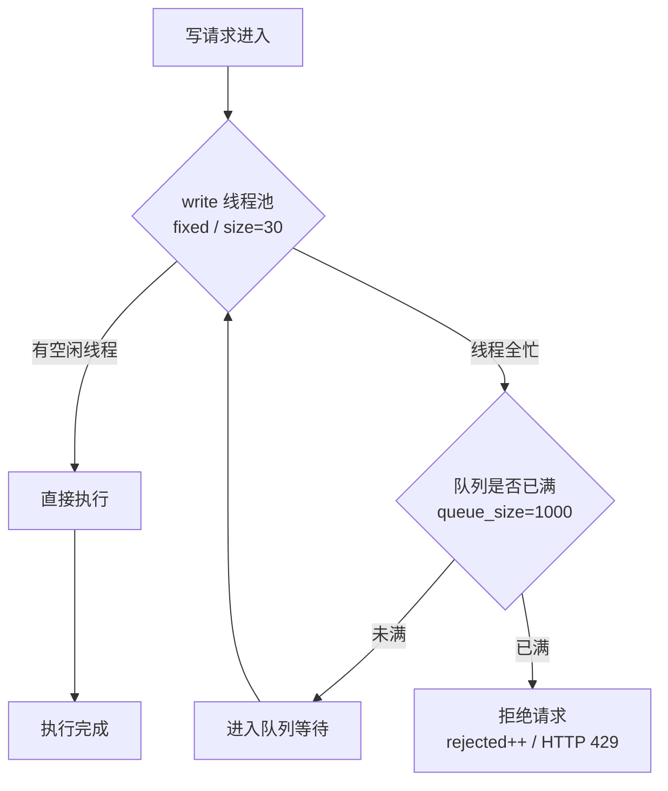
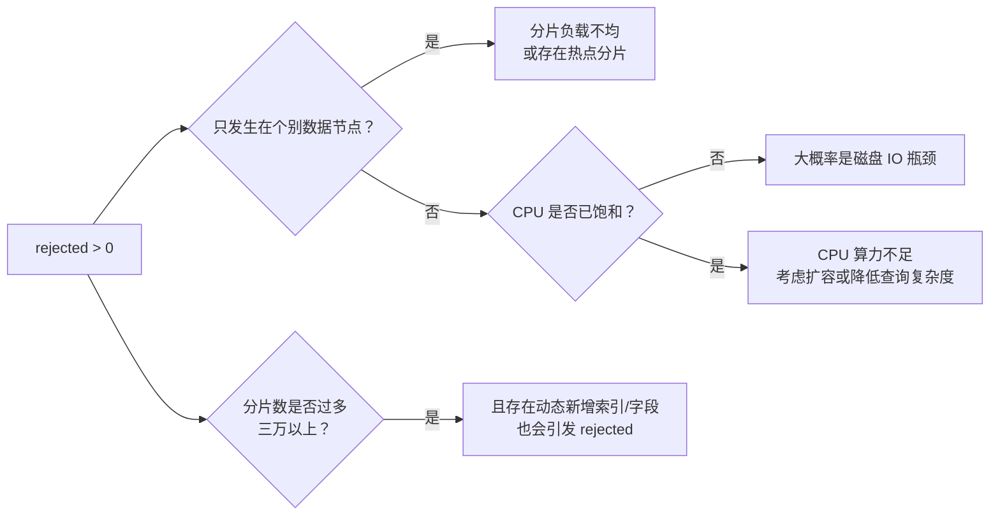

# Go 项目开发: 大文本索引数据在集群层面的优化点

大文本索引和常规索引对集群的压力完全不同。常规索引的瓶颈通常在查询侧，而大文本索引**写入本身就是重活** —— 分词、建倒排、刷 segment、段合并，每一步都在吃 CPU、堆内存、网络 IO 和磁盘 IO。

所以大文本场景的集群配置不能照抄通用模板。下面按**堆内存 → 内存与模块 → 传输 → CPU → 线程池 → 写入速率 → 硬件**的顺序，把需要格外注意的点梳理一遍。

## 纲要

- 堆内存溢出与 heap dump 的落盘位置
- 关掉用不上的机器学习模块
- 开启节点间传输压缩
- 锁定内存，杜绝内存交换
- 单机多节点部署时的 CPU 分配
- 容器环境拿不到 CPU 核数的坑
- 线程池：fixed 与 scaling 的区别
- 什么时候才需要调线程池
- 监控 rejected：最有价值的稳定性信号
- rejected 的定位思路
- 用 bulk 提交并主动限流
- 内存与磁盘的分配建议

## 堆内存溢出与 heap dump 的落盘位置

大文本场景**容易出现堆内存溢出**。当内存不足抛异常时，ES 会在**安装目录**下把 heap dump 文件保存到当前安装目录的 `data` 目录里。

问题就出在这里：**这个文件通常非常大，而系统盘的空间一般都不大**。一次 OOM 生成的 dump 可能几十 GB，直接把系统盘写满，导致**节点故障** —— 原本只是内存问题，演变成了磁盘问题。

所以这个路径必须手动改掉。修改 `jvm.options` 配置文件，通过 JVM 参数自定义 heap dump 的输出路径：

```bash
# config/jvm.options
-XX:HeapDumpPath=/data/es/heapdump
```

把路径指到大容量数据盘上，并确保**目录存在且 ES 进程有写权限**（`systemd` 部署时还要注意 `PrivateTmp` / 权限沙箱）。

## 关掉用不上的机器学习模块

机器学习模块会**常驻占用一部分堆内存**。绝大多数搜索业务并没有用到它，白白消耗资源。

在主配置文件里直接关掉：

```yaml
# config/elasticsearch.yml
xpack.ml.enabled: false
```

改完需要**重启节点**生效。这是一笔几乎零成本的收益：不用就别让它占着堆。

## 开启节点间传输压缩

数据压缩之后再在节点之间传输，**传输效率更高，能节省很大一部分网络 IO**。

大文本场景下节点间的数据传输特别消耗网络 IO —— 一次查询的 scatter/gather 阶段，协调节点要从各数据节点拉回大量文档内容；副本同步时同样要搬运大量数据。开启压缩后这部分开销显著下降：

```yaml
# config/elasticsearch.yml
transport.tcp.compress: true
```

代价是**多一点点 CPU**：压缩和解压缩都要算力。但在大文本场景里，网络 IO 通常比 CPU 先到瓶颈，这笔交换是划算的。

## 锁定内存，杜绝内存交换

这是反复强调、也最容易被漏掉的一条：

```yaml
# config/elasticsearch.yml
bootstrap.memory_lock: true
```

它的作用是**保证 ES 启动时，就按 JVM 里配置的堆大小把内存锁定住**，避免发生内存交换（swap）。

为什么这条对 ES 尤其致命？ES 的查询性能高度依赖**缓存命中**。一旦堆内存被操作系统换出到磁盘，一次本该是纳秒级的内存访问变成毫秒级的磁盘 IO，节点延迟会断崖式上升，还可能触发节点间的心跳超时、把节点踢出集群。

配套还要在操作系统层做两件事：

```bash
# 关闭 swap
swapoff -a

# 尽量不换出：1 = 除非必要才用 swap（0 表示完全禁用，OOM 风险更高）
sysctl -w vm.swappiness=1
```

`memory_lock` 生效后，可以在启动日志里确认，也可以用 `GET _nodes?filter_path=**.mlockall` 检查是否所有节点都锁住了。

## 单机多节点部署时的 CPU 分配

在**单机多节点**部署场景下，需要显式配置 `node.processors`：

```yaml
# config/elasticsearch.yml
node.processors: 8   # 物理机 32 核 / 4 个 ES 实例
```

取值规则是：**物理机处理器核心数 ÷ 当前机器上的 ES 实例数**。也就是把物理机的 CPU 资源**平均分配**给这台机器上的各个实例。

还有一个容易被忽略的默认限制：**ES 默认识别的处理核心数上限是 32**。如果物理机核心数超过 32，为了让 ES 充分利用 CPU，就要通过 `node.processors` 显式设成实际的处理器核心数。

## 容器环境拿不到 CPU 核数的坑

在容器环境中，ES 服务**可能无法正确获取物理机的 CPU 核数**，导致 `write`、`search` 这些线程池被设得很小。

症状很有辨识度：**系统 CPU 和 IO 都上不去，但搜索或写入性能极差**。资源明明是空闲的，吞吐却卡在一个很低的水位上。

排查方式是查看集群当前的线程池设置：

```http
GET /_cat/thread_pool?v&h=node_name,name,size,queue,queue_size,rejected,type
```

返回结果里能看到每类线程池使用的 CPU 线程数（`size`）、队列大小（`queue_size`）以及类型（`type`）。比如 `search` 的 `size` 是 7、`write` 的 `size` 是 4 —— 如果物理机明明有 32 核，这个数字就明显不对了。

Linux 下可以用这条命令确认机器的 CPU 线程数：

```bash
grep -c processor /proc/cpuinfo
```

## 线程池：fixed 与 scaling

从 ES 8 开始，线程池类型分为两类：**fixed** 和 **scaling**（`fixed_auto_queue_size` 这个类型从 8 开始被废弃，8 之前是存在的）。

两者的区别在于**线程数和队列大小的设置规则**：

| 类型 | 线程数 | 队列 | 典型代表 |
| --- | --- | --- | --- |
| **fixed** | 固定 | 固定大小 | `search`、`write` |
| **scaling** | 动态，跟随 CPU 核数 | 按工作负载自动调节 | `refresh`、`flush`、`warmer` |

**fixed 类型**：线程数和队列大小都固定。写请求量大的时候会先进入队列排队，**队列满了之后进来的写请求会被直接拒绝**。

```yaml
# config/elasticsearch.yml
thread_pool.write.size: 30
thread_pool.write.queue_size: 1000
```

上面这组配置表示：`write` 线程池有 30 个线程，队列最多排 1000 条。超过 1000 条之后进来的写请求会被拒绝。

**scaling 类型**：线程数量可变，ES 根据工作负载自动调节。

```yaml
# config/elasticsearch.yml
thread_pool.warmer.min: 1
thread_pool.warmer.max: 8
```

含义是 `warmer` 线程使用的线程数在 1 到 8 之间动态浮动。



## 什么时候才需要调线程池

**通常情况下，不需要增加线程数和队列大小。** 盲目调大只会让节点堆积更多请求、延迟更高，甚至更容易 OOM。

只有这几种情况才需要动它：

- **系统资源利用率达不到峰值** —— CPU、IO 都在低位，吞吐却上不去；
- **系统无法识别正确的 CPU 核数** —— 容器部署时尤其要关注 `node.processors`；
- **单机多节点部署** —— 需要把物理机 CPU 平均分配给各个 ES 实例。

## 监控 rejected：最有价值的稳定性信号

线程池监控要**格外关注 `write` 和 `search` 的 `rejected` 数量**。

`rejected` 大于零，说明**索引或搜索队列超过了线程池队列设置的最大值**（无论是配置文件里显式设的值，还是默认值）。一旦发生，节点就开始拒绝索引请求或查询请求：

- **写入场景**：一般会抛出 **429** 状态码；
- **业务侧**：必须针对这类状态码做**重试**。



## rejected 的定位思路

三条实战经验：

**rejected 只发生在特定数据节点上**，大概率是**分片负载不均衡** —— 可能是分片分布不均匀，也可能出现了热点分片。大量请求集中在某几个分片上，就会导致**部分节点**出现 rejected。

**队列出现 rejected，但 CPU 并没有达到饱和**，大概率是**磁盘 IO 出现了瓶颈**。这时候加 CPU 是没用的，该换更快的盘或减少写入量。

**分片数过多**（比如三万以上分片），并且还存在**动态新增索引或新增字段**的情况，也可能出现 rejected。这种情况的根源是元数据与集群状态压力，要靠收敛分片数量、控制索引与字段膨胀来解决，而不是调线程池。

## 用 bulk 提交并主动限流

大文本类型的索引写入，**首选 bulk 方式提交写请求**。用 bulk 提交文档能**有效减少 IO 次数**，这对大文本写入是决定性的。

同时必须**控制写入速率**：

- 首要目的是**避免出现 rejected**；
- 同样重要的是**给查询留出足够的系统资源** —— 写入把资源吃干净了，查询延迟必然恶化。

具体做法是在业务侧加**限流规则**，在业务高峰时段对写入进行限流。写入是批处理任务，慢一点通常可以接受；查询是在线请求，慢了用户立刻能感知。

## 内存与磁盘的分配建议

**内存：** 如果以最大化查询性能为目标，大部分场景下，**节点内存达到百 GB 级别（如 120GB）时，建议只部署一个 ES 实例，JVM 堆设置 32GB，其余内存全部留给操作系统缓存**。

```dir
节点（120GB 内存）
├── ES 实例 × 1
│   └── JVM Heap     32GB  ← 不要超过 32GB（压缩指针临界点）
└── OS Page Cache    剩余全部  ← 对查询性能的提升立竿见影
```

堆不是越大越好。堆超过 32GB 后**对象指针压缩失效**，同样的数据要占更多空间，GC 停顿也会变长。剩下的内存交给 OS 缓存，收益远大于塞进堆里。

**磁盘：** 大文本的索引**磁盘比较容易达到性能瓶颈**，使用更高性能的磁盘对搜索性能的提升非常显著。**建议尽可能使用 SSD。**

## API 速览

| 能力 | API / 参数 |
| --- | --- |
| 查看线程池 | `GET /_cat/thread_pool?v&h=name,size,queue,queue_size,rejected,type` |
| 查看指定线程池 | `GET /_cat/thread_pool/write?v` |
| 确认内存锁定 | `GET _nodes?filter_path=**.mlockall` |
| 查看节点热点 | `GET /_cat/nodes?v&h=name,cpu,heap.percent,ram.percent` |
| 查看分片分布 | `GET /_cat/shards?v&s=node` |
| 批量写入 | `POST /_bulk`（单批控制在 5~15MB，上限 100MB） |
| 队列满的写入响应 | **HTTP 429**，业务侧需退避重试 |
| 查看 rejected 累计 | `GET /_nodes/stats/thread_pool` |

## Demo 示例

一个完整的 Go 程序：**令牌桶限流 + 429 指数退避重试**的 bulk 写入客户端。这是应对本文「rejected / 429」问题在业务侧的标准做法。纯标准库，可直接跑。

**运行说明**

- 需要 Go 1.20+（用到 `sync.WaitGroup`、`math/rand`，1.21 验证通过）。
- 无第三方依赖，保存为 `main.go` 后 `go run main.go`。
- `FakeES` 模拟「前若干次 bulk 一律返回 429」的集群，用来验证重试逻辑真的能收敛。
- 退避基值设为 20ms 便于快速跑完；生产环境建议 `200ms` 起。

```go
package main

import (
	"fmt"
	"math"
	"math/rand"
	"sync"
	"time"
)

// TokenBucket 令牌桶限流器。
// 限流发生在「发请求之前」而不是「收到 429 之后」——
// 主动限速是为了给查询留出系统资源，被动重试只是兜底。
type TokenBucket struct {
	mu       sync.Mutex
	tokens   float64
	capacity float64
	rate     float64 // 每秒补充的令牌数
	last     time.Time
}

func NewTokenBucket(capacity, rate float64) *TokenBucket {
	return &TokenBucket{
		tokens:   capacity,
		capacity: capacity,
		rate:     rate,
		last:     time.Now(),
	}
}

// Wait 阻塞直到取到 n 个令牌。
// 先按时间补令牌，再判断够不够；不够就精确睡到够为止，避免忙等。
func (b *TokenBucket) Wait(n int) {
	need := float64(n)
	for {
		b.mu.Lock()
		now := time.Now()
		b.tokens = math.Min(b.capacity, b.tokens+now.Sub(b.last).Seconds()*b.rate)
		b.last = now
		if b.tokens >= need {
			b.tokens -= need
			b.mu.Unlock()
			return
		}
		wait := time.Duration((need - b.tokens) / b.rate * float64(time.Second))
		b.mu.Unlock()
		time.Sleep(wait)
	}
}

// FakeES 模拟 ES 集群：前 rejectTimes 次 bulk 一律返回 429，之后返回 200。
type FakeES struct {
	mu          sync.Mutex
	calls       int
	rejectTimes int
}

func (c *FakeES) Bulk() int {
	c.mu.Lock()
	defer c.mu.Unlock()
	c.calls++
	if c.calls <= c.rejectTimes {
		return 429
	}
	return 200
}

// BulkClient 带限流与退避重试的写入客户端。
type BulkClient struct {
	es      *FakeES
	limiter *TokenBucket
	base    time.Duration // 退避基值
	maxTry  int

	rndMu sync.Mutex
	rnd   *rand.Rand
}

// Write 提交一批文档，返回尝试次数与最终状态码。
// 429 走指数退避 + 抖动；非 429（成功或别的错误）直接返回，不重试。
func (c *BulkClient) Write(batch int) (attempts int, status int) {
	c.limiter.Wait(batch) // 先限流，再发请求

	backoff := c.base
	for i := 1; i <= c.maxTry; i++ {
		st := c.es.Bulk()
		if st != 429 {
			return i, st
		}
		if i == c.maxTry {
			return i, 429
		}
		sleep := backoff + c.jitter(backoff)
		fmt.Printf("    [attempt %d] 收到 429，退避 %v 后重试\n", i, sleep.Truncate(time.Millisecond))
		time.Sleep(sleep)
		backoff *= 2 // 指数退避
	}
	return c.maxTry, 429
}

// jitter 加随机抖动，避免多个客户端同时重试造成「重试风暴」。
func (c *BulkClient) jitter(base time.Duration) time.Duration {
	c.rndMu.Lock()
	defer c.rndMu.Unlock()
	return time.Duration(c.rnd.Int63n(int64(base)))
}

func main() {
	// 容量 40 令牌，每秒补充 30 个：约等于把写入速率压在 30 个文档/秒
	limiter := NewTokenBucket(40, 30)
	client := &BulkClient{
		es:      &FakeES{rejectTimes: 3}, // 模拟集群刚开始在拒绝写入
		limiter: limiter,
		base:    20 * time.Millisecond,
		maxTry:  4,
		rnd:     rand.New(rand.NewSource(42)),
	}

	const batches = 6
	var (
		mu        sync.Mutex
		total     int
		retried   int
		failed    int
	)
	start := time.Now()

	var wg sync.WaitGroup
	for i := 0; i < batches; i++ {
		wg.Add(1)
		go func(i int) {
			defer wg.Done()
			attempts, status := client.Write(10) // 每批 10 个文档
			mu.Lock()
			defer mu.Unlock()
			total += attempts
			if status == 429 {
				failed++
			} else if attempts > 1 {
				retried++
			}
			fmt.Printf("  batch %d 完成：尝试 %d 次，最终状态 %d\n", i, attempts, status)
		}(i)
	}
	wg.Wait()

	elapsed := time.Since(start)
	fmt.Printf("\n=== 汇总 ===\n")
	fmt.Printf("  批次总数：%d\n", batches)
	fmt.Printf("  重试后成功的批次：%d\n", retried)
	fmt.Printf("  最终失败的批次：%d\n", failed)
	fmt.Printf("  总耗时：%v（限流器生效，速率被压在 30 文档/秒）\n", elapsed.Truncate(time.Millisecond))
	fmt.Printf("  平均尝试次数：%.2f\n", float64(total)/batches)
}
```

**代码说明**

- **限流在重试之前**。`Wait` 放在发请求之前，是主动把速率压下来；重试只是被拒绝后的兜底。两者解决的问题不同：限流保护集群，重试保护业务。
- `TokenBucket.Wait` **先按时间补令牌再判断**，令牌不够时精确睡到够为止，不做忙等，也不额外多睡。
- 指数退避用 `backoff *= 2`，并叠加**随机抖动**。没有抖动的退避会让一批客户端在同一时刻集体重试，形成重试风暴 —— 这比不重试更危险。
- `math/rand` 的 `*rand.Rand` **不是并发安全的**，所以访问时用 `rndMu` 保护。直接用全局的 `rand.Int63n` 虽然自带锁，但会成为热点。
- **只对 429 重试**。其他状态码（400 参数错误、409 版本冲突）重试没有意义，直接返回交给业务处理。
- `maxTry` 用完仍然失败就返回 429，**不能无限重试** —— 无限重试会把已经过载的集群彻底打死。
- 令牌桶容量 40 / 速率 30，意味着**允许短时突发 40 个文档、长期速率压在 30 文档/秒**，这是限流的常见形态：既防突发，又控均值。

**技术点总结**

- 大文本场景的集群瓶颈常常**不在查询侧，而在写入链路**。
- heap dump 必须**改出系统盘**，否则 OOM 会演变成磁盘故障。
- 用不上的功能（机器学习）**关掉就是收益**；节点间**传输压缩**用 CPU 换网络 IO。
- `bootstrap.memory_lock` + 关 swap：**内存交换是 ES 的性能杀手**。
- 线程池**默认不要动**，只有容器识别错核数、单机多节点、资源跑不满三种情况才需要调。
- `rejected > 0` 是最有价值的稳定性信号，写入侧表现为 **429**，业务必须做退避重试。
- 写入用 **bulk + 主动限流**：限流不只是防 rejected，更是**给查询留资源**。
- **堆不超过 32GB，其余留给 OS 缓存；磁盘尽量上 SSD。**

## 总结

大文本索引的集群层优化，可以归纳成四条主线：**别让故障扩散**（heap dump 路径、内存锁定）、**别让资源浪费**（关机器学习、开传输压缩、CPU 正确分配）、**别让线程池背锅**（识别错核数、监控 rejected、正确定位瓶颈）、**别让写入吃干净资源**（bulk + 限流 + 给查询留余量）。

其中最值得长期投入的是**线程池 rejected 的监控与定位**。它是集群压力的早期信号，比 CPU、内存告警来得更早，也更能直接指向问题根因。

