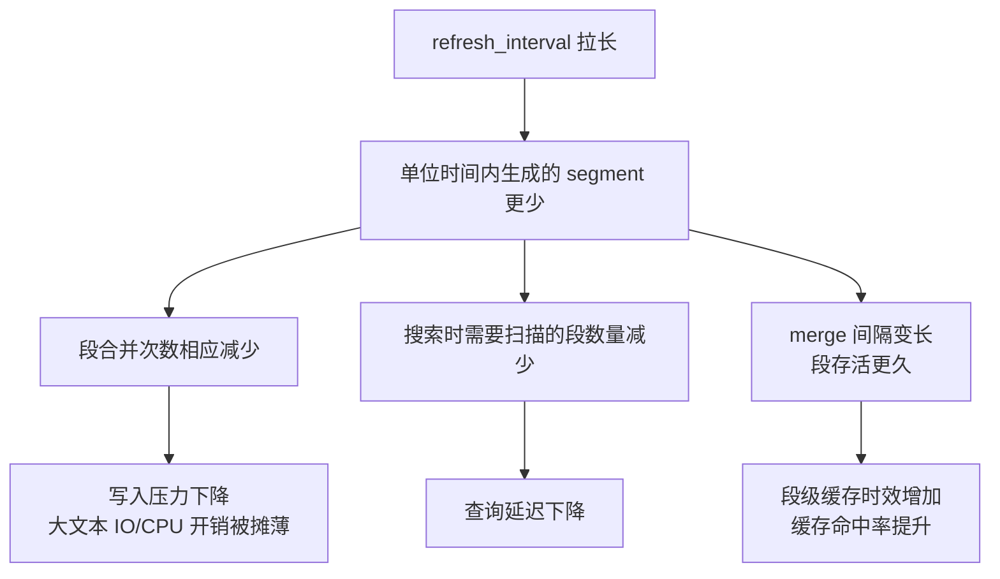
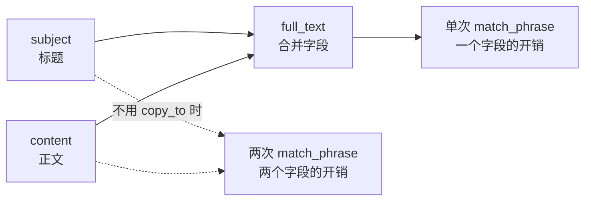
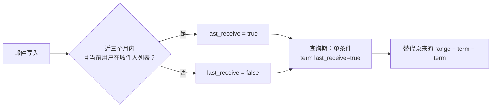
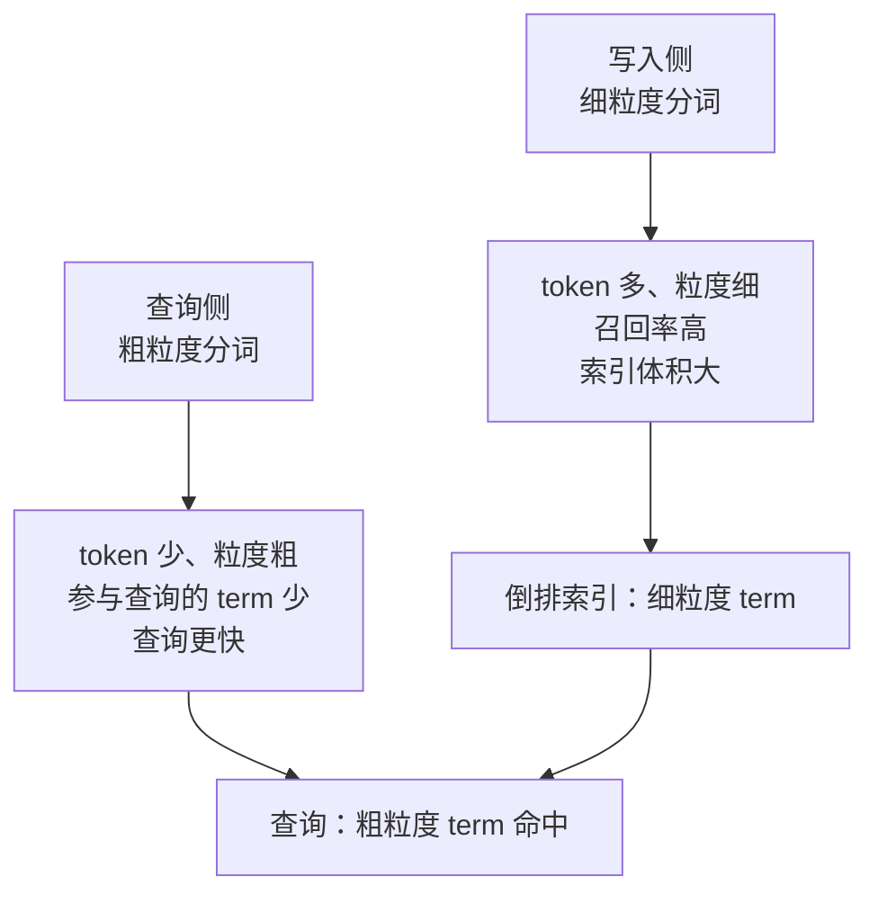

# Go 项目开发: 大文本索引数据在索引层面的优化点

集群层优化解决的是"资源怎么分"，索引层优化解决的是"资源怎么省"。大文本索引的特殊性在于：**它的写入和查询都比小文本贵一个数量级**，所以同样的配置项，在大文本场景下的收益往往是立竿见影的。

## 纲要

- 拉长 refresh 间隔：大文本场景收益最明显的一项
- 为什么 refresh_interval 对大文本特别有效
- 减少查询条件：用 copy_to 合并字段
- 按业务预计算：把高频过滤条件压缩成单字段
- 不要让 Elasticsearch 返回大文本原文
- 分词粒度：写入用细、查询用粗
- Go 侧：条件预计算建模与分词粒度对比的完整实现

## 拉长 refresh 间隔

大文本场景下，把 `index.refresh_interval` 设到 **5 秒以上**是性价比最高的一个动作。

```json
{
  "settings": {
    "index.refresh_interval": "30s"
  }
}
```

有意思的是**同一个配置在不同场景下的收益差异极大**：在小文本搜索场景下调整它，可能并没有太显著的效果；但在大文本索引下，调整它带来的效果**可能是立竿见影的**。

## 为什么它对大文本特别有效

原因要从 refresh 到底做了什么说起。refresh 就是把 index buffer 里的文档刷成新的 segment，让它可被搜索。**间隔越长，一次 refresh 攒下的文档越多。**

对大文本场景，这会引发四个连锁反应：



- **写入压力下降**：大文本字段比小文本更消耗集群资源，写入时占用更多的 IO 和 CPU。段少了，这些开销就被摊薄了。
- **扫描的段变少**：搜索时需要遍历的 segment 数量直接下降。
- **段合并次数减少**：merge 是大文本场景最重的后台任务之一。
- **缓存时效增加**：段存活时间变长，基于段的缓存（如文件系统缓存、查询缓存）就不容易失效。

**四项收益叠加，才有了"立竿见影"这个评价。**

## 减少查询条件：用 copy_to 合并字段

每增加一个查询字段，都会增加查询执行的开销。对 ES 而言，尤其是 `match_phrase` 这类短语匹配查询，属于**比较耗时的查询**。

如果多个字段都需要全文检索，并且**不关心高亮、也不关心这些字段命中后的排序权重**，就可以用 `copy_to` 把它们合并：

```json
{
  "mappings": {
    "properties": {
      "subject": { "type": "text", "copy_to": "full_text" },
      "content": { "type": "text", "copy_to": "full_text" },
      "full_text": { "type": "text" }
    }
  }
}
```

之后只需要查 `full_text` 一个字段，就等价于同时检索标题和正文：

```json
{
  "query": {
    "match_phrase": { "full_text": "季度总结" }
  }
}
```



以邮件搜索为例：**如果不需要高亮，并且不关注标题和正文的权重差异**，就可以直接把标题 copy 到正文字段里，检索时只搜一个字段。

代价要说清楚：合并之后**无法区分命中来自标题还是正文**，也就没法给标题加权；高亮也失去了字段信息。所以这条优化的前提条件很硬 —— **不关心权重、不关心高亮**。

## 按业务预计算：把高频过滤条件压缩成单字段

这是比 `copy_to` 更通用的一招，思路是**把查询期的计算搬到写入期**。

假设一个真实场景：**50% 以上的查询都是「近三个月我收到的、且是发送给我的（而非抄送给我的）邮件」**。这里需要三个过滤条件：

| 条件 | 类型 |
| --- | --- |
| 时间限定近三个月 | `range` |
| 我收到的（收件人包含我） | `term` |
| 邮件类型是发送给我的，不是抄送 | `term` |

后两个条件可以合并。做法是**新增一个字段**（比如 `last_receive`），在**写入文档时**就判断好：



查询时直接用 `term: { "last_receive": true }` 一个条件，替代原来的两个条件。

这个思路可以推广：**收集大部分场景下使用的过滤条件并进行合并**。实际业务里过滤条件可能更多，合并之后在查询性能上往往有**意想不到的提升**。

它的本质是**空间换时间 + 计算前置**：多存一个布尔字段几乎不花成本，却把每次查询都要做的范围判断和集合判断，变成了写入时做一次。

## 不要让 Elasticsearch 返回大文本原文

这一点在写入侧讲过，在查询侧同样成立：**不建议索引大文本的 `_source`，查询时也要避免取回大文本的原始值**。

```json
{
  "_source": { "excludes": ["content"] },
  "query": { "match": { "full_text": "季度总结" } }
}
```

原因很直接：正文本身很大，查询时返回它会占用大量内存和网络 IO，**查询速度甚至能慢到几十秒**。原文应该由外部存储按 `doc_id` 回源获取。

## 分词粒度：写入用细、查询用粗

这是**最容易被忽略**的一条。

规则是：**写入数据时使用更细粒度的分词器，查询时使用更粗粒度的分词器。**

原因在于：**查询关键词被分出来的 token 数量，与查询耗时直接相关**。更多的 token 参与查询，查询的耗时也就更长。



两侧的目标本来就不一样：

| 阶段 | 目标 | 分词粒度 | 后果 |
| --- | --- | --- | --- |
| 写入 | **提高召回率** | 细 | term 多、索引大 |
| 查询 | **降低耗时** | 粗 | token 少、查询快 |

实现上就是给字段分别指定 `analyzer` 和 `search_analyzer`：

```json
{
  "mappings": {
    "properties": {
      "content": {
        "type": "text",
        "analyzer": "ik_max_word",
        "search_analyzer": "ik_smart"
      }
    }
  }
}
```

`ik_max_word` 是细粒度（写出所有可能的词），`ik_smart` 是粗粒度（最合理的切分）。这是 IK 分词器的经典搭配，其他分词器同理。

## API 速览

| 能力 | API / 参数 |
| --- | --- |
| 调大 refresh 间隔 | `PUT /mail/_settings { "index.refresh_interval": "30s" }` |
| 关闭自动 refresh | `"index.refresh_interval": "-1"`（重建索引期间） |
| 字段合并 | `copy_to`（mapping 里配置） |
| 查询只查合并字段 | `match` / `match_phrase` 指定单个 `full_text` |
| 排除大字段 | `_source.excludes` / 查询体 `"_source": ["subject"]` |
| 写入与查询分词分离 | `analyzer` + `search_analyzer` |
| 查看分词结果 | `POST /_analyze { "analyzer": "ik_smart", "text": "..." }` |
| 布尔过滤条件 | `term: { "last_receive": true }`（进 `filter`，可缓存） |

## Demo 示例

一个完整的 Go 程序：**写入侧预计算 `last_receive` 字段 → 生成新旧两套查询 DSL 做对比**，外加**细粒度与粗粒度分词器的 token 数量对比**。纯标准库，可直接跑。

**运行说明**

- 需要 Go 1.20+（用到 `sort`、`encoding/json`，1.21 验证通过）。
- 无第三方依赖，保存为 `main.go` 后 `go run main.go`。
- 分词器是**教学用的简化实现**（单字切分 vs 词典最大正向匹配），用来展示 token 数量差异；生产环境请换成 IK 等真实分词器。
- 输出的 DSL 可直接粘到 ES 的 `_search` 请求体里验证。

```go
package main

import (
	"encoding/json"
	"fmt"
	"sort"
	"strings"
	"time"
	"unicode"
)

// ---------------------------------------------------------------- 建模：条件预计算

// RawMail 是邮件源数据。
type RawMail struct {
	ID       string
	To       []string // 收件人
	CC       []string // 抄送人
	SendTime time.Time
	Subject  string
}

// IndexedMail 是写入 ES 的文档：多了一个预计算出来的 last_receive 字段。
type IndexedMail struct {
	ID          string   `json:"id"`
	To          []string `json:"to"`
	CC          []string `json:"cc"`
	SendTime    string   `json:"send_time"`
	Subject     string   `json:"subject"`
	LastReceive bool     `json:"last_receive"`
}

// BuildIndexedMail 在写入侧把「近 windowDays 天 + 收件人是本人」两个条件
// 预先算成 last_receive 一个布尔字段。
// 这一步把查询期的 range + term 判断搬到了写入期，查询期只剩一个 term。
func BuildIndexedMail(m RawMail, me string, now time.Time, windowDays int) IndexedMail {
	recent := !m.SendTime.Before(now.AddDate(0, 0, -windowDays))
	toMe := false
	for _, t := range m.To {
		if t == me {
			toMe = true
			break
		}
	}
	return IndexedMail{
		ID:          m.ID,
		To:          m.To,
		CC:          m.CC,
		SendTime:    m.SendTime.Format(time.RFC3339),
		Subject:     m.Subject,
		LastReceive: recent && toMe, // 两个条件在这里被合并成一个
	}
}

// BuildQueryBefore 优化前的查询：range + term(收件人) + term(非抄送) 三个条件。
func BuildQueryBefore(now time.Time, me string, windowDays int) (string, error) {
	body := map[string]any{
		"query": map[string]any{
			"bool": map[string]any{
				"filter": []map[string]any{
					{"range": map[string]any{
						"send_time": map[string]any{"gte": now.AddDate(0, 0, -windowDays).Format(time.RFC3339)},
					}},
					{"term": map[string]any{"to": me}},
					{"term": map[string]any{"is_cc": false}},
				},
			},
		},
	}
	return marshal(body)
}

// BuildQueryAfter 优化后的查询：一个 term 条件替代上面三个。
func BuildQueryAfter() (string, error) {
	body := map[string]any{
		"query": map[string]any{
			"bool": map[string]any{
				"filter": []map[string]any{
					{"term": map[string]any{"last_receive": true}},
				},
			},
		},
	}
	return marshal(body)
}

func marshal(v any) (string, error) {
	b, err := json.MarshalIndent(v, "", "  ")
	if err != nil {
		return "", err
	}
	return string(b), nil
}

// ---------------------------------------------------------------- 分词粒度

// dict 是演示用的小词典（生产环境换成 IK 的词库）。
var dict = []string{"季度", "总结", "海外", "市场", "邮件", "搜索", "性能", "优化", "集群"}

// TokenizeFine 写入侧分词器：细粒度，逐字切分。
// 召回率高，但 term 数量多、索引体积大。
func TokenizeFine(s string) []string {
	var out []string
	for _, r := range s {
		if unicode.IsSpace(r) {
			continue
		}
		out = append(out, string(r))
	}
	return out
}

// TokenizeCoarse 查询侧分词器：粗粒度，词典最大正向匹配。
// token 更少，参与查询的 term 更少，查询更快。
func TokenizeCoarse(s string) []string {
	runes := []rune(s)
	var out []string
	for i := 0; i < len(runes); {
		best := ""
		for _, w := range dict {
			wr := []rune(w)
			if i+len(wr) <= len(runes) &&
				string(runes[i:i+len(wr)]) == w &&
				len(wr) > len([]rune(best)) {
				best = w
			}
		}
		if best == "" {
			out = append(out, string(runes[i]))
			i++
			continue
		}
		out = append(out, best)
		i += len([]rune(best))
	}
	return out
}

// ---------------------------------------------------------------- 演示

func main() {
	now := time.Date(2026, 10, 2, 0, 0, 0, 0, time.UTC)
	me := "zhangsan"
	const windowDays = 90

	mails := []RawMail{
		{ID: "m1", To: []string{me}, CC: nil, SendTime: now.AddDate(0, 0, -10), Subject: "季度总结"},
		{ID: "m2", To: []string{"lisi"}, CC: []string{me}, SendTime: now.AddDate(0, 0, -10), Subject: "季度总结（抄送）"},
		{ID: "m3", To: []string{me}, CC: nil, SendTime: now.AddDate(0, 0, -200), Subject: "去年的季度总结"},
	}

	fmt.Println("=== 写入侧预计算 last_receive ===")
	fmt.Printf("%-6s %-10s %-14s %-10s\n", "id", "收件人", "发送时间", "last_receive")
	for _, m := range mails {
		doc := BuildIndexedMail(m, me, now, windowDays)
		fmt.Printf("%-6s %-10s %-14s %-10v\n",
			doc.ID, strings.Join(doc.To, ","), doc.SendTime[:10], doc.LastReceive)
	}

	before, _ := BuildQueryBefore(now, me, windowDays)
	after, _ := BuildQueryAfter()

	fmt.Println("\n=== 优化前：三个过滤条件 ===")
	fmt.Println(before)
	fmt.Println("\n=== 优化后：一个过滤条件 ===")
	fmt.Println(after)

	query := "季度海外市场性能总结"
	fine := TokenizeFine(query)
	coarse := TokenizeCoarse(query)

	fmt.Printf("\n=== 分词粒度对比（查询：%s）===\n", query)
	fmt.Printf("  写入侧细粒度：%v（%d 个 token）\n", fine, len(fine))
	fmt.Printf("  查询侧粗粒度：%v（%d 个 token）\n", coarse, len(coarse))

	// 排序后对比，说明两侧 term 集合的覆盖关系
	sortedFine := append([]string(nil), fine...)
	sort.Strings(sortedFine)
	fmt.Printf("  参与查询的 term 数量减少：%.0f%%\n",
		float64(len(fine)-len(coarse))/float64(len(fine))*100)
}
```

**代码说明**

- `BuildIndexedMail` 是**整套优化的核心**：`recent && toMe` 这一个布尔运算，把查询期每次都要做的时间范围判断和集合包含判断，变成了写入期做一次。
- 两份 DSL 的对比不是为了好看 —— 三个 `filter` 条件意味着三次倒排/列存的查找与结果集合并，一个 `term` 条件只有一次。
- `term` 条件放进 `filter` 上下文：**不参与打分、结果可被 ES 缓存**，这是过滤类条件的标准写法。
- `TokenizeFine` 用 `for range string` 遍历，**天然按 rune 迭代**，中文不会切出半个字；`unicode.IsSpace` 跳过空白。
- `TokenizeCoarse` 的最大正向匹配里，`len(wr) > len([]rune(best))` 必须用 rune 长度比较 —— 用 `len(string)` 比的是字节数，中文词典里会选错词。
- 分词器是**教学简化实现**，用来量化「token 数与查询耗时正相关」这个结论；生产环境请用 IK 并配合 `analyzer` / `search_analyzer` 两个配置。
- `now` 用固定值而不是 `time.Now()`，是为了让输出**可复现**；真实业务里这里取当前时间。

**技术点总结**

- `refresh_interval` 拉到 5s 以上，是大文本索引**性价比最高**的一项优化，四项收益叠加。
- `copy_to` 合并字段的前提是**不关心权重、不关心高亮**，代价要先确认能接受。
- **条件预计算**是通用招：把查询期的计算搬到写入期，多一个布尔字段换掉多个过滤条件。
- 查询**绝不要取回大文本原文** —— 几十秒的延迟是设计层面的必然。
- **写入细粒度、查询粗粒度**：token 数量与查询耗时直接相关，这是最容易被忽略的一条。
- 过滤条件一律进 `filter`：**不打分、可缓存**。

## 索引层优化的结构示意

```dir
large-text-index-optimize/
├── refresh 拉长
│   └── refresh_interval 30s+
├── 减少查询条件
│   ├── copy_to 合并字段
│   └── 预计算过滤条件
├── 不返回大文本原文        ES 只出 docID
└── 分词粒度
    ├── 写入用细分词
    └── 查询用粗分词
```

## 总结

索引层面的优化，本质是三件事：**少生成段**（拉长 refresh）、**少查字段**（copy_to 合并、条件预计算）、**少出 token**（查询侧粗粒度分词）。

三者的共同点是**把成本从查询期挪走** —— 要么挪到写入期，要么干脆不发生。而大文本场景之所以对这些优化特别敏感，正是因为它的每一次 IO、每一个 term、每一个 segment，都比小文本场景贵得多。

