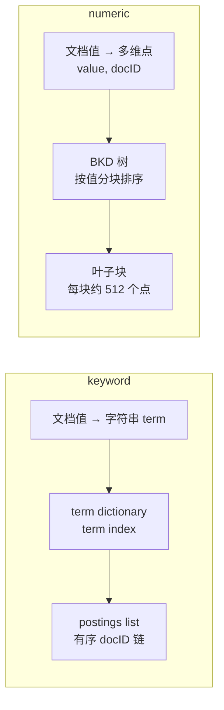
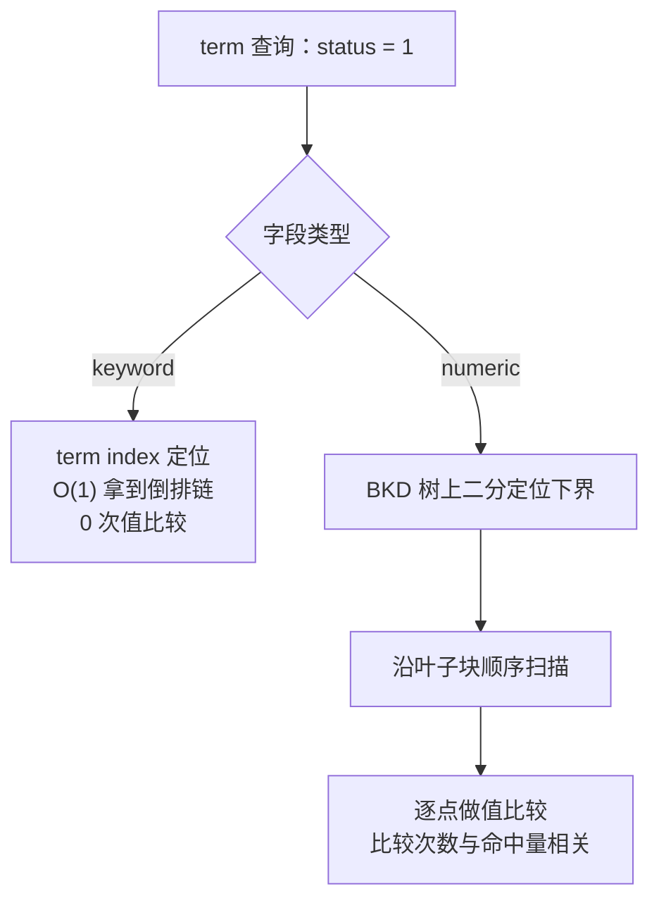
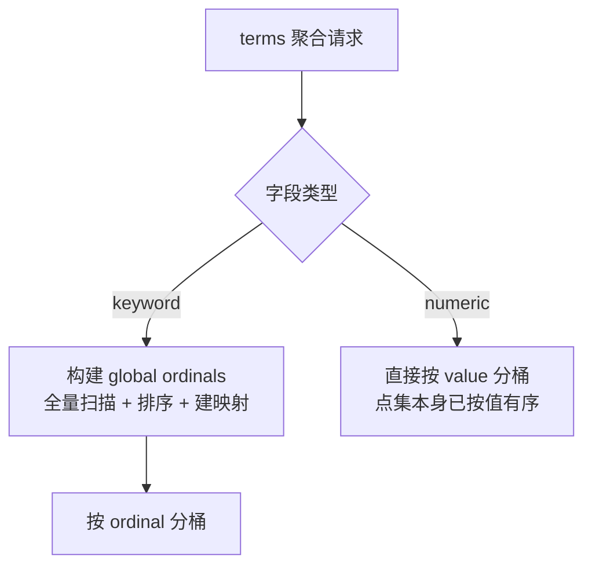
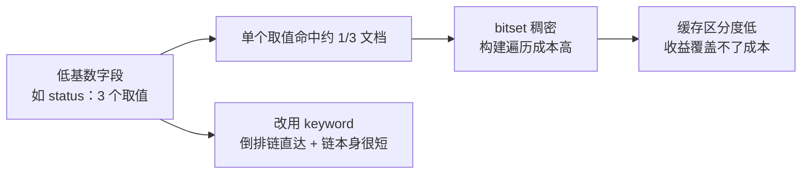
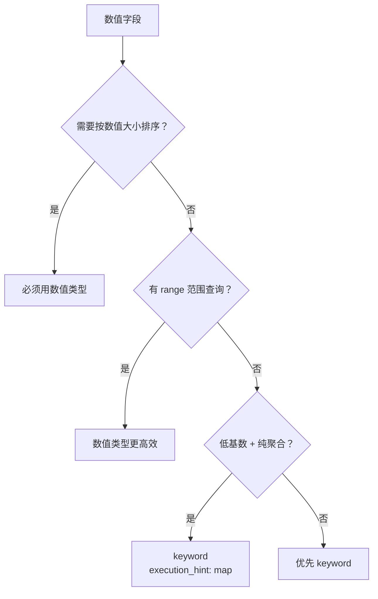

# Go 项目开发: 数字字段 mapping 在数值类型与 keyword 之间如何选型

一个字段存的是数字，就一定要用 `long` / `double` 吗？这个看似理所当然的选择，是 ES 数据建模里**最常见的误区之一**。

数字只是**业务语义**，类型选择看的是**访问模式**。数值类型与 `keyword` 背后是两套完全不同的物理结构：前者是 **BKD 树**，后者是**倒排索引**。结构不同，查询、聚合、排序三件事的成本分布也就完全不同。

## 纲要

- 数值类型与 keyword 的物理结构差异：BKD 树 vs 倒排索引
- term 精确查询：为什么 keyword 更快
- 布尔组合查询：倒排链可归并，BKD 只能重复搜
- 聚合场景：keyword 的全局序数代价
- 低基数字段：为什么反而应该用 keyword
- 数值类型的硬需求场景：排序与 range
- 一张决策表收敛所有选择
- Go 侧：倒排索引与 BKD 树的完整对比实现

## 两种类型的物理结构差异

这是所有结论的起点。



- **keyword**：值被当成**字符串 term**，进 term dictionary，关联一条有序的倒排链。查 term 就是一次哈希/二分定位，直接拿到 docID 列表。
- **numeric**：值被当成**多维空间里的一个点**，组织成 BKD 树。查一个值**没有直达路径**，本质是退化成范围查询，在树形结构上做查找。

一句话概括：**keyword 是"查表"，数值类型是"走树"。**

## term 精确查询：为什么 keyword 更快

对于 `term` 查询，`keyword` 可以直接通过 **term index** 定位到倒排链，拿到文档列表。数值类型则还要在 BKD 树形结构上查找。



原因很直白：**数值类型本质上还是在用范围查询的方式做 term 查询**。它先二分定位到目标值的下界，再顺序扫描出所有相等的点，每一步都是一次值比较。

## 布尔组合查询：倒排链可归并，数值类型不行

单条 term 的差异可能还能忍，**布尔组合查询会把差距放大**。

`keyword` 的倒排链是**有序 docID 列表**，多个条件的合并就是有序链表的归并（还可以用 skip list 跳跃），并且能被 ES 缓存成 bitset 反复复用。数值类型每次都要重新走一遍 BKD 树，拿到的结果也无法直接享受同样的缓存复用路径。

| 能力 | keyword 倒排链 | numeric BKD 树 |
| --- | --- | --- |
| 定位方式 | term index 直达 | 树形结构查找 |
| 多条件合并 | 有序链归并 / skip list | 各自独立搜树后再交并 |
| filter 缓存 | 天然可缓存 bitset | 复用成本高 |
| 精确匹配语义 | 原生的 | 退化成 range |

## 聚合场景：keyword 的全局序数代价

`keyword` 的主要缺点在聚合：**聚合时需要构建全局序数（global ordinals）**，而数值类型不需要。

全局序数就是把字段的所有唯一 term 映射成连续整数，聚合时按整数分桶，避免反复做字符串比较。构建它需要对字段做一次全量扫描 + 排序，**基数越高、文档越多，代价越大**，而且它依附于段生命周期，段变了可能要重建。



所以**在聚合场景下，大部分情况都可以用数值类型**。

## 低基数字段：为什么反而该用 keyword

这是反直觉的一条。

低基数字段（比如性别、状态、是否删除）**通常会命中大量结果集**。如果使用数值类型，会在**构建 bitset 上产生很高的代价**：命中比例高，位图稠密，构建时的遍历成本上去了，缓存后的区分度却很低——几乎每个查询都命中同一批文档，缓存失去了意义。



因此**低基数字段适合使用 keyword 类型**。

## 数值类型的硬需求场景：排序与 range

`keyword` 再好，也有两件事它**做不到或者做得很差**。



- **按数值大小排序**：字符串按**字典序**排，`"9"` 会排在 `"10"` 后面。这不是性能问题，是**结果错误**，所以必须用数值类型。
- **range 查询**：BKD 树原生支持范围查找，二分定位下界后顺序扫描即可。用 `keyword` 做范围查询，只能把区间内的取值枚举成 terms 去查，区间一大就崩了。

## 选型决策表

把上面的分析收敛成一张表。**判断顺序是先问场景（查询 / 聚合），再问需求。**

| 场景 | 具体需求 | 推荐类型 | 理由 |
| --- | --- | --- | --- |
| 只查询 | 需按数值大小排序 | **数值** | keyword 字典序会导致结果错误 |
| 只查询 | 有 range 范围查询 | **数值** | BKD 原生支持，keyword 只能枚举 |
| 只查询 | 仅 term 精确匹配 | **keyword** | 倒排链直达，零值比较 |
| 只查询 | 其他 | **keyword** | 尤其字段只用来做 term 匹配时 |
| 只聚合 | 明确是低基数 | **keyword** | 指定 `execution_hint: map` |
| 只聚合 | 高基数 / 有数值语义 | **数值** | 免去全局序数构建成本 |
| 混合 | 排序 + 聚合 | **数值** | 排序是硬约束，一票否决 |

关于 `execution_hint: map`：它让 terms 聚合**绕开全局序数**，改为在命中的文档上直接构建映射。它只在**查询命中的文档数较少、或聚合嵌套在另一个 map 聚合内**时才有优势；命中文档多时，默认的 `global_ordinals` 反而更快。低基数字段通常配合一个较窄的查询条件使用它，收益才明显。

## API 速览

| 能力 | API / 参数 |
| --- | --- |
| 声明 keyword 字段 | `"status": { "type": "keyword" }` |
| 声明数值字段 | `"price": { "type": "scaled_float", "scaling_factor": 100 }` |
| term 精确查询 | `POST /idx/_search { "query": { "term": { "status": 1 } } }` |
| range 范围查询 | `"range": { "price": { "gte": 100, "lte": 200 } }` |
| 按数值排序 | `"sort": [{ "price": { "order": "asc" } }]` |
| terms 聚合 | `"aggs": { "s": { "terms": { "field": "status" } } }` |
| 绕开全局序数 | `"terms": { "field": "status", "execution_hint": "map" }` |
| 查看字段映射 | `GET /idx/_mapping` |
| 查看字段基数 | `POST /idx/_search { "aggs": { "c": { "cardinality": { "field": "price" } } } }` |

## Demo 示例

一个完整的 Go 程序：**手写一个倒排索引和一个一维 BKD 树，用同一批数据对比 term 查询、布尔组合、排序、聚合、bitset 构建五件事的成本**，最后按字段画像自动输出推荐 mapping 与聚合 DSL。纯标准库，可直接跑。

**运行说明**

- 需要 Go 1.20+（用到泛型，1.21 验证通过）。
- 无第三方依赖，保存为 `main.go` 后 `go run main.go`。
- BKD 用**一维等价形式**演示（按值排序的点集 + 二分定位），真实 ES 的 BKD 是分块 KD 树、叶子块约 512 个点，但**查询成本模型一致**：都需要在树形结构上查找并做值比较。
- `steps` 统计的是比较/遍历次数，用来量化"走树"与"查表"的差距，绝对值无意义，对比关系才有意义。

```go
package main

import (
	"encoding/json"
	"fmt"
	"math/bits"
	"math/rand"
	"sort"
	"strconv"
	"strings"
)

// ---------------------------------------------------------------- 数据模型

// Product 演示用商品文档。
// Status 是低基数字段（3 个取值），Price 是高基数字段且需要排序与范围查询。
type Product struct {
	ID     int
	Status int
	Price  float64
}

func genProducts(n int) []Product {
	r := rand.New(rand.NewSource(42))
	out := make([]Product, 0, n)
	for i := 0; i < n; i++ {
		out = append(out, Product{
			ID:     i,
			Status: r.Intn(3),
			Price:  float64(r.Intn(100000)) / 100.0, // 0.00 ~ 999.99
		})
	}
	return out
}

// distinct 统计字段基数，是选型的第一手依据。
func distinct[T comparable](vs []T) int {
	seen := make(map[T]struct{}, len(vs))
	for _, v := range vs {
		seen[v] = struct{}{}
	}
	return len(seen)
}

// ---------------------------------------------------------------- keyword 侧：倒排索引

// InvertedIndex 是 keyword 字段的物理结构：term -> 有序 docID 链。
type InvertedIndex struct {
	postings map[string][]int
}

func NewInvertedIndex() *InvertedIndex {
	return &InvertedIndex{postings: make(map[string][]int)}
}

func (idx *InvertedIndex) Add(term string, docID int) {
	idx.postings[term] = append(idx.postings[term], docID)
}

// Search 通过 term index 直接定位倒排链：一次 map 查找，零次值比较。
func (idx *InvertedIndex) Search(term string) ([]int, int) {
	return idx.postings[term], 1
}

// IntersectSorted 两条倒排链求交。这是 keyword 侧布尔组合查询的基础：
// 利用有序性做双指针归并，真实实现还带 skip list 跳过。
func IntersectSorted(a, b []int) []int {
	i, j := 0, 0
	out := make([]int, 0, min(len(a), len(b)))
	for i < len(a) && j < len(b) {
		switch {
		case a[i] == b[j]:
			out = append(out, a[i])
			i++
			j++
		case a[i] < b[j]:
			i++
		default:
			j++
		}
	}
	return out
}

func min(a, b int) int {
	if a < b {
		return a
	}
	return b
}

// ---------------------------------------------------------------- numeric 侧：BKD 树

type Point struct {
	Value float64
	DocID int
}

// BKD 是数值字段的物理结构：按值排序的点集 + 二分定位。
// 真实 ES 的 BKD 是分块 KD 树（叶子块约 512 点），这里用一维等价形式演示，
// 查询成本模型一致：都需要在树形结构上查找并做值比较。
type BKD struct {
	points []Point
}

func NewBKD(points []Point) *BKD {
	cp := append([]Point(nil), points...)
	sort.Slice(cp, func(i, j int) bool {
		if cp[i].Value != cp[j].Value {
			return cp[i].Value < cp[j].Value
		}
		return cp[i].DocID < cp[j].DocID
	})
	return &BKD{points: cp}
}

// Term 精确值查询。BKD 上没有精确值的直达路径，
// 只能退化成范围查询：二分定位下界，再顺序扫描出所有相等的点。
// 返回值第二个参数是值比较次数，用来量化"走树"的成本。
func (t *BKD) Term(v float64) ([]int, int) {
	steps := 0
	lo := sort.Search(len(t.points), func(i int) bool {
		steps++
		return t.points[i].Value >= v
	})
	var out []int
	for i := lo; i < len(t.points); i++ {
		steps++
		if t.points[i].Value != v {
			break
		}
		out = append(out, t.points[i].DocID)
	}
	return out, steps
}

// Range 范围查询：BKD 的强项，二分定位下界后顺序扫描。
func (t *BKD) Range(lo, hi float64) ([]int, int) {
	steps := 0
	start := sort.Search(len(t.points), func(i int) bool {
		steps++
		return t.points[i].Value >= lo
	})
	var out []int
	for i := start; i < len(t.points) && t.points[i].Value <= hi; i++ {
		steps++
		out = append(out, t.points[i].DocID)
	}
	return out, steps
}

// ---------------------------------------------------------------- 聚合：全局序数

// GlobalOrdinals 是 keyword 字段做 terms 聚合前必须先构建的映射：
// 把字符串 term 映射成连续整数 ordinal，聚合时按 ordinal 分桶。
// 构建需要一次全量扫描 + 排序 + 建映射；数值类型完全不需要这一步。
type GlobalOrdinals struct {
	ordinal map[string]int
	terms   []string
}

func BuildGlobalOrdinals(values []string) *GlobalOrdinals {
	uniq := make([]string, 0, len(values))
	seen := make(map[string]struct{}, len(values))
	for _, v := range values {
		if _, ok := seen[v]; !ok {
			seen[v] = struct{}{}
			uniq = append(uniq, v)
		}
	}
	sort.Strings(uniq) // 全量排序，这是全局序数的主要成本
	ord := make(map[string]int, len(uniq))
	for i, v := range uniq {
		ord[v] = i
	}
	return &GlobalOrdinals{ordinal: ord, terms: uniq}
}

// ---------------------------------------------------------------- filter 缓存：bitset

// Bitset 模拟 ES 为可缓存 filter 构建的文档位图（真实实现是 Roaring Bitmap）。
type Bitset struct {
	words []uint64
	n     int
}

func NewBitset(n int) *Bitset {
	return &Bitset{words: make([]uint64, (n+63)/64), n: n}
}

func (b *Bitset) Set(docID int) {
	b.words[docID/64] |= 1 << uint(docID%64)
}

func (b *Bitset) Count() int {
	c := 0
	for _, w := range b.words {
		c += bits.OnesCount64(w)
	}
	return c
}

// Density 位图密度。命中比例越高越稠密：构建时的遍历成本上去了，
// 但缓存后的区分度反而下降 —— 这正是低基数数值字段的尴尬之处。
func (b *Bitset) Density() float64 {
	if b.n == 0 {
		return 0
	}
	return float64(b.Count()) / float64(b.n)
}

// BuildCost 位图构建成本：需要遍历每一个命中的文档并置位。
func (b *Bitset) BuildCost() int {
	cost := 0
	for _, w := range b.words {
		if w != 0 {
			cost++
		}
	}
	return cost
}

// ---------------------------------------------------------------- 选型决策

// FieldProfile 字段画像，是选型的输入。
type FieldProfile struct {
	Name        string
	TotalDocs   int
	Cardinality int
	NeedSort    bool // 需要按数值大小排序
	NeedRange   bool // 需要范围查询
	NeedTerm    bool // 只需要精确匹配
	NeedAgg     bool // 需要聚合
	AggOnly     bool // 只用于聚合，不参与过滤
}

type Advice struct {
	Type   string
	Reason string
	Hint   string
}

// Recommend 按「先分场景、再问需求」的顺序做选型。
func Recommend(p FieldProfile) Advice {
	switch {
	case p.NeedSort:
		return Advice{Type: "numeric", Reason: "需要按数值大小排序，keyword 字典序会得出错误结果", Hint: ""}
	case p.NeedRange:
		return Advice{Type: "numeric", Reason: "有 range 需求，BKD 原生支持，keyword 只能枚举取值", Hint: ""}
	case p.AggOnly && p.Cardinality <= 32:
		return Advice{Type: "keyword", Reason: "纯聚合且低基数，用 keyword 并绕开全局序数", Hint: "map"}
	case p.NeedAgg && p.Cardinality > 1000:
		return Advice{Type: "numeric", Reason: "高基数聚合，keyword 的全局序数构建代价过高", Hint: ""}
	case p.NeedTerm:
		return Advice{Type: "keyword", Reason: "只做 term 精确匹配，倒排链直达到零值比较", Hint: ""}
	default:
		return Advice{Type: "keyword", Reason: "无排序与范围需求，优先 keyword", Hint: ""}
	}
}

// BuildMapping 根据选型结果生成 mapping 片段。
func BuildMapping(fields map[string]Advice) (string, error) {
	props := map[string]any{}
	for name, a := range fields {
		if a.Type == "keyword" {
			props[name] = map[string]any{"type": "keyword"}
			continue
		}
		props[name] = map[string]any{"type": "scaled_float", "scaling_factor": 100}
	}
	return marshalJSON(map[string]any{
		"mappings": map[string]any{"properties": props},
	})
}

// BuildTermsAgg 生成 terms 聚合 DSL。低基数 + 窄查询条件时才带 execution_hint: map。
func BuildTermsAgg(field string, hint string) (string, error) {
	terms := map[string]any{"field": field}
	if hint != "" {
		terms["execution_hint"] = hint
	}
	return marshalJSON(map[string]any{
		"size": 0,
		"aggs": map[string]any{
			field + "_agg": map[string]any{"terms": terms},
		},
	})
}

func marshalJSON(v any) (string, error) {
	b, err := json.MarshalIndent(v, "", "  ")
	if err != nil {
		return "", err
	}
	return string(b), nil
}

// ---------------------------------------------------------------- 演示

func main() {
	const total = 2000
	products := genProducts(total)

	// 建两套结构：status 与 price 各一份 keyword 倒排索引 + BKD 树
	statusKW := NewInvertedIndex()
	priceKW := NewInvertedIndex()
	var statusPts, pricePts []Point
	for _, p := range products {
		statusKW.Add(strconv.Itoa(p.Status), p.ID)
		priceKW.Add(fmt.Sprintf("%.2f", p.Price), p.ID)
		statusPts = append(statusPts, Point{Value: float64(p.Status), DocID: p.ID})
		pricePts = append(pricePts, Point{Value: p.Price, DocID: p.ID})
	}
	statusBKD := NewBKD(statusPts)
	priceBKD := NewBKD(pricePts)

	statusCard := distinct(mapField(products, func(p Product) int { return p.Status }))
	priceCard := distinct(mapField(products, func(p Product) float64 { return p.Price }))

	fmt.Println("=== 字段画像 ===")
	fmt.Printf("%-8s %-10s %-10s %-8s\n", "字段", "总文档", "基数", "基数率")
	fmt.Printf("%-8s %-10d %-10d %-8.2f%%\n", "status", total, statusCard,
		float64(statusCard)/float64(total)*100)
	fmt.Printf("%-8s %-10d %-10d %-8.2f%%\n", "price", total, priceCard,
		float64(priceCard)/float64(total)*100)

	// ---- term 查询对比 ----
	fmt.Println("\n=== term 查询对比：status = 1 ===")
	kwDocs, kwSteps := statusKW.Search("1")
	bkdDocs, bkdSteps := statusBKD.Term(1)
	fmt.Printf("keyword 倒排链：命中 %d 篇，定位代价 %d 次（term index 直达，零值比较）\n",
		len(kwDocs), kwSteps)
	fmt.Printf("numeric BKD  ：命中 %d 篇，值比较 %d 次（二分定位 + 顺序扫描）\n",
		len(bkdDocs), bkdSteps)
	fmt.Printf("结论：结构一致时，走树的比较次数是查表的 %d 倍\n", bkdSteps/max(kwSteps, 1))

	// ---- 布尔组合查询对比 ----
	fmt.Println("\n=== 布尔组合查询对比：status=1 AND price∈[100,200] ===")
	statusDocs, _ := statusKW.Search("1")
	priceDocs, _ := priceBKD.Range(100, 200)
	merged := IntersectSorted(statusDocs, priceDocs)
	fmt.Printf("keyword 侧：倒排链归并，%d ∩ %d → %d 篇（有序链双指针）\n",
		len(statusDocs), len(priceDocs), len(merged))
	sDocs, sSteps := statusBKD.Term(1)
	pDocs, pSteps := priceBKD.Range(100, 200)
	merged2 := IntersectSorted(sDocs, pDocs)
	fmt.Printf("numeric 侧：两次独立搜树后归并，值比较 %d + %d = %d 次 → %d 篇\n",
		sSteps, pSteps, sSteps+pSteps, len(merged2))

	// ---- 排序对比 ----
	fmt.Println("\n=== 排序对比：按 price 升序取前 5 ===")
	byNum := append([]Product(nil), products...)
	sort.Slice(byNum, func(i, j int) bool { return byNum[i].Price < byNum[j].Price })
	byKW := append([]Product(nil), products...)
	sort.Slice(byKW, func(i, j int) bool {
		return fmt.Sprintf("%.2f", byKW[i].Price) < fmt.Sprintf("%.2f", byKW[j].Price)
	})
	fmt.Println("numeric（数值序）:", joinPrices(byNum[:5]))
	fmt.Println("keyword（字典序）:", joinPrices(byKW[:5]))
	fmt.Println("注意：字符串按字典序逐位比较，首字符 '1' < '2'，\"100.49\" 因此排在 \"2.18\" 之后")

	// ---- 聚合：全局序数代价 ----
	fmt.Println("\n=== 聚合对比：全局序数构建代价 ===")
	statusVals := make([]string, 0, len(products))
	for _, p := range products {
		statusVals = append(statusVals, strconv.Itoa(p.Status))
	}
	go1 := BuildGlobalOrdinals(statusVals)
	fmt.Printf("keyword status：需构建 global ordinals，映射 term 数 = %d（全量扫描 + 排序 + 建映射）\n",
		len(go1.terms))
	priceVals := make([]string, 0, len(products))
	for _, p := range products {
		priceVals = append(priceVals, fmt.Sprintf("%.2f", p.Price))
	}
	go2 := BuildGlobalOrdinals(priceVals)
	fmt.Printf("keyword price ：需构建 global ordinals，映射 term 数 = %d（比 status 贵 %d 倍）\n",
		len(go2.terms), len(go2.terms)/max(len(go1.terms), 1))
	fmt.Printf("numeric price ：直接按 value 分桶，全局序数构建代价 = 0\n")

	// ---- bitset 密度 ----
	fmt.Println("\n=== 低基数字段的 bitset 代价 ===")
	for _, v := range []int{0, 1, 2} {
		docs, _ := statusBKD.Term(float64(v))
		bs := NewBitset(total)
		for _, d := range docs {
			bs.Set(d)
		}
		fmt.Printf("status=%d  命中 %4d 篇  位图密度 %5.1f%%  占用字数 %d\n",
			v, bs.Count(), bs.Density()*100, bs.BuildCost())
	}
	docsH, _ := priceBKD.Range(500.00, 500.99)
	bsH := NewBitset(total)
	for _, d := range docsH {
		bsH.Set(d)
	}
	fmt.Printf("price∈[500,500.99] 命中 %4d 篇  位图密度 %5.1f%%  占用字数 %d\n",
		bsH.Count(), bsH.Density()*100, bsH.BuildCost())
	fmt.Println("低基数 → 位图稠密：构建遍历成本高，缓存后区分度却低")

	// ---- 选型建议 ----
	fmt.Println("\n=== 选型建议 ===")
	profiles := []FieldProfile{
		{Name: "status", TotalDocs: total, Cardinality: statusCard, NeedTerm: true, NeedAgg: true},
		{Name: "price", TotalDocs: total, Cardinality: priceCard, NeedSort: true, NeedRange: true, NeedAgg: true},
		// 纯聚合的低基数字段：走 keyword + execution_hint: map 这条路
		{Name: "gender", TotalDocs: total, Cardinality: 2, NeedAgg: true, AggOnly: true},
	}
	advices := map[string]Advice{}
	for _, p := range profiles {
		a := Recommend(p)
		advices[p.Name] = a
		fmt.Printf("%-8s → %-8s  理由：%s\n", p.Name, a.Type, a.Reason)
	}

	mapping, _ := BuildMapping(advices)
	fmt.Println("\n=== 推荐 mapping ===")
	fmt.Println(mapping)

	agg, _ := BuildTermsAgg("gender", advices["gender"].Hint)
	fmt.Println("\n=== gender（纯聚合低基数）的 terms 聚合 DSL ===")
	fmt.Println(agg)
	fmt.Println("说明：execution_hint=map 只在命中文档数较少时更快，命中多时默认的 global_ordinals 更优")
}

func mapField[T any](ps []Product, f func(Product) T) []T {
	out := make([]T, 0, len(ps))
	for _, p := range ps {
		out = append(out, f(p))
	}
	return out
}

func joinPrices(ps []Product) string {
	parts := make([]string, 0, len(ps))
	for _, p := range ps {
		parts = append(parts, fmt.Sprintf("%.2f", p.Price))
	}
	return strings.Join(parts, " < ")
}

func max(a, b int) int {
	if a > b {
		return a
	}
	return b
}
```

**代码说明**

- `InvertedIndex.Search` 返回 `1` 是**一次 map 查找**，刻意标注出来与 BKD 的比较次数形成对照 —— 这是"查表"与"走树"的本质差异。
- `BKD.Term` 用 `sort.Search` 二分定位下界再顺序扫描，**精确值查询退化成了范围查询**，这正是数值类型 term 查询的真实行为。
- `IntersectSorted` 是有序链表的双指针归并，keyword 侧布尔组合的基础；真实 ES 还带 skip list 跳过，这里保留最简形式。
- `BuildGlobalOrdinals` 里那次 `sort.Strings` 就是**全局序数的主要成本**，基数越高越贵；`numeric` 分支下这笔开销为 0。
- `Bitset.Density` 说明低基数的尴尬：位图稠密意味着构建时遍历成本高，但缓存后区分度低（几乎每个查询都命中同一批文档）。
- 排序对比用 `fmt.Sprintf("%.2f", ...)` 走字符串比较，**复现 keyword 字典序**，输出里能直接看到 `"9.00"` 排在 `"10.00"` 之后。
- `Recommend` 的顺序严格按「排序 → range → 低基数纯聚合 → 高基数聚合 → 纯 term → 默认」推进，排序一票排在最前。
- 泛型 `distinct[T comparable]` / `mapField[T any]` 只为省掉两份重复代码，Go 1.18+ 即可，不需要第三方库。

**技术点总结**

- **数字不等于数值类型**：类型选择看访问模式，不看业务语义。
- keyword 是**查表**（term index 直达倒排链），numeric 是**走树**（BKD 树上做值比较）。
- 布尔组合查询放大差距：倒排链可归并、可缓存；数值类型只能各自搜树。
- 聚合反过来：keyword 要构建**全局序数**，数值类型不用，所以**聚合场景多数选数值**。
- **低基数字段选 keyword**：数值类型会在稠密 bitset 上付出高价、收益却低。
- **排序是一票否决项**：字典序让结果直接错误，必须用数值类型。
- `execution_hint: map` 只在**命中文档少**时更快，别当默认选项。

## 数值与 keyword 选型的结构示意

```dir
numeric-vs-keyword/
├── 物理结构 physical
│   ├── keyword             倒排索引 + 全局序数
│   └── numeric             BKD 树分块
├── 查询特征 query
│   ├── term 精确           keyword 更快
│   ├── 布尔组合            倒排链归并
│   └── 聚合                全局序数代价
├── 低基数字段             反而用 keyword
└── 硬需求场景
    ├── 排序 sort
    └── range 范围
```

## 总结

数值类型与 `keyword` 之间不存在谁更好，只有**在什么场景下谁更合适**。

判断的抓手是**字段画像**：先看基数，再看需求。要排序、要 range，数值类型没得选；只做精确匹配，keyword 的倒排链直达更快；做聚合时，高基数选数值类型省掉全局序数，低基数选 keyword 并配合 `execution_hint: map`。

**选择合适的数据类型，是构建高性能搜索服务的关键环节** —— 这一步做错了，后面所有的查询优化都是在错误的地基上修补。

