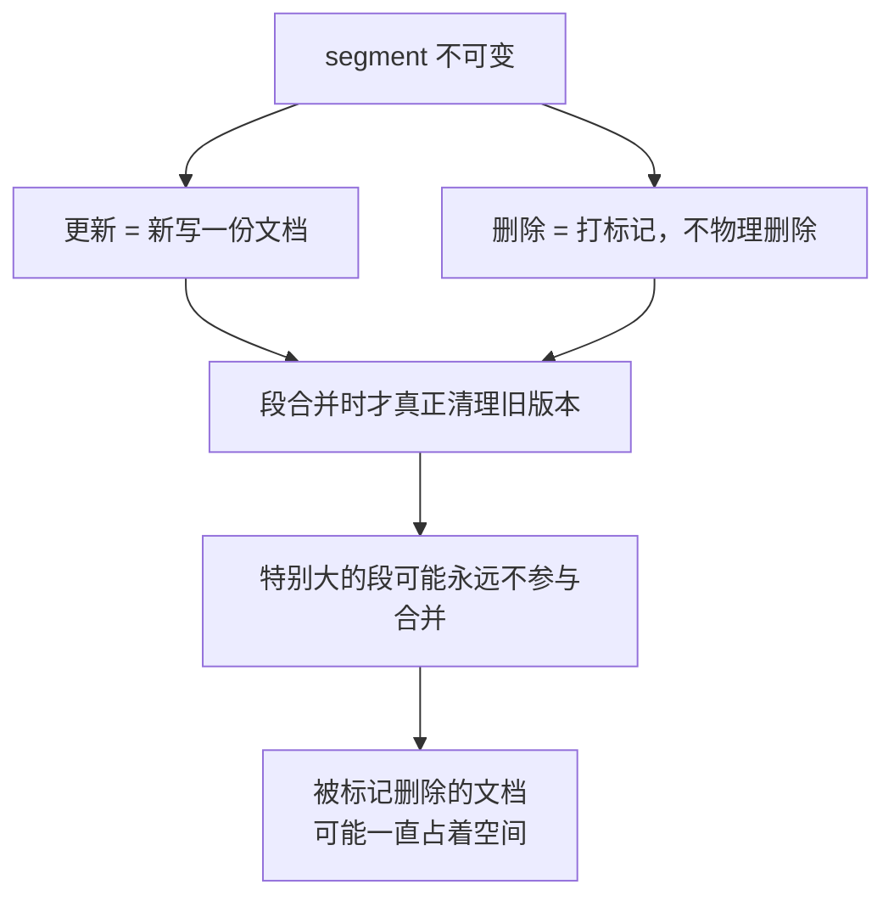
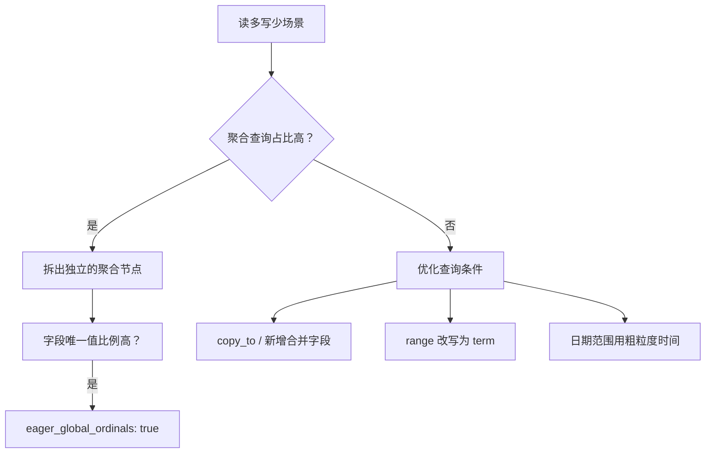
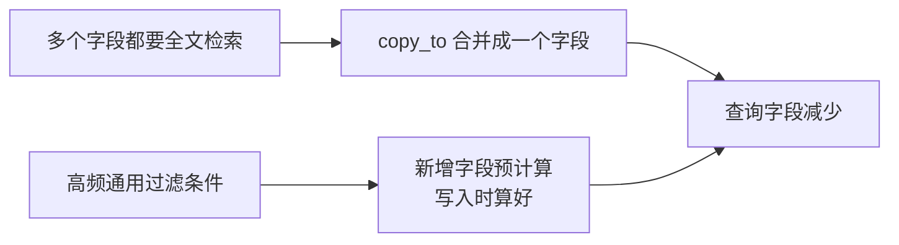
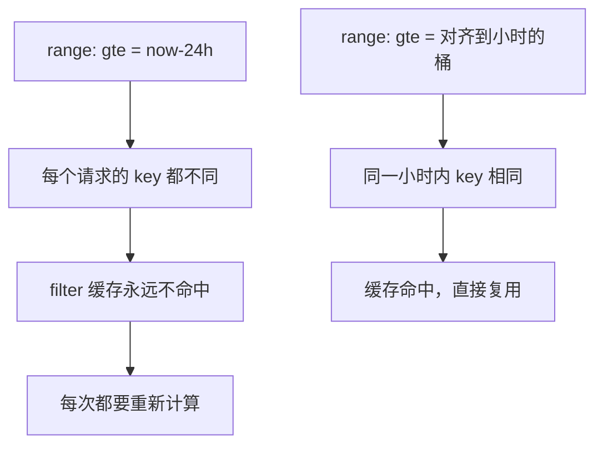
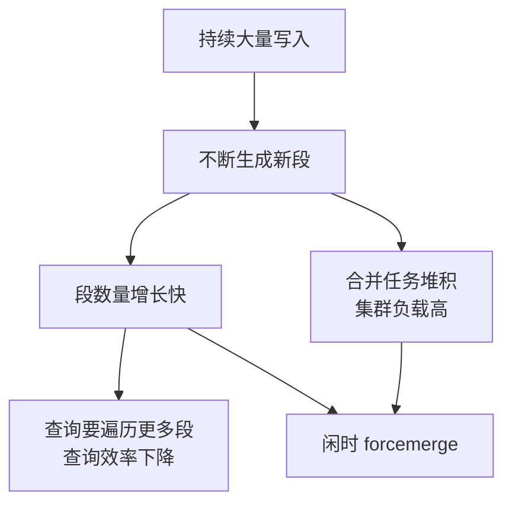
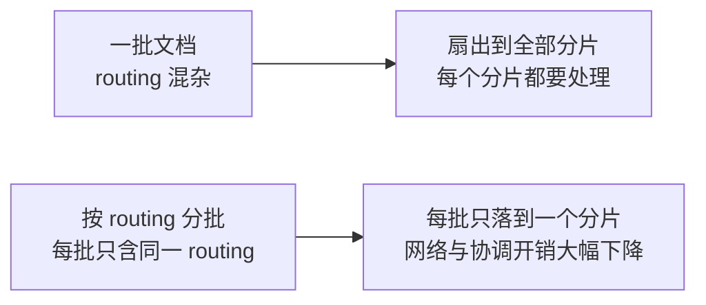
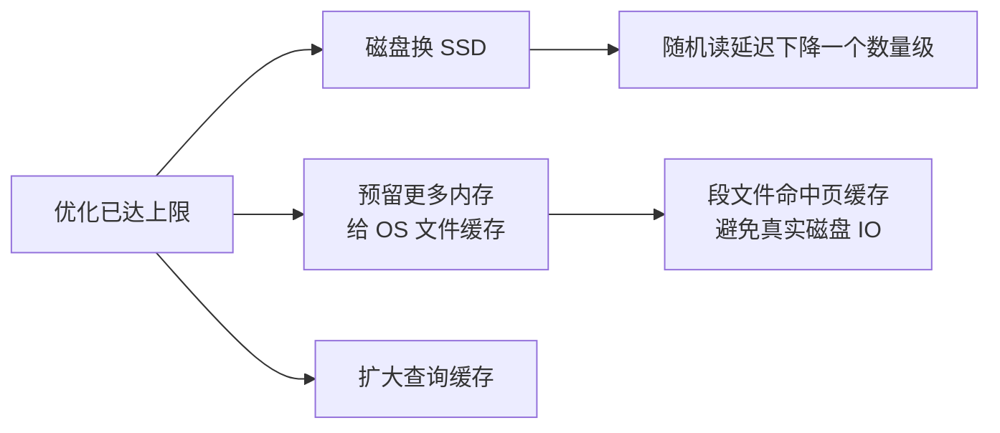

# Go 项目开发: 读写比例与实时性差异下的优化手段

同样一个 ES 集群，**读写比例不同、实时性要求不同，优化方向几乎是相反的**。

读多写少要抠的是查询侧的每一次开销；写多读少要压的是段的数量和刷盘次数；实时性要求低则可以把整批更新搬到闲时。**没有放之四海皆准的优化清单，只有先给场景画像、再选手段。**

## 纲要

- 段不可变：为什么读写比例会成为优化的分水岭
- 通用前置：内核参数、关闭 swap、锁定堆内存、routing 策略
- 读多写少：聚合专项、条件改写、预排序、避开连接查询
- 日期范围查询的缓存陷阱
- 写多读少：闲时 forcemerge、拉长 refresh、translog 异步、bulk 按 routing 分批
- 实时性：把可见延迟当成可调参数
- 兜底手段：SSD、OS 文件缓存、查询缓存
- Go 侧：段数量模拟、过滤缓存命中率、routing 分批、聚合拆分并发的完整实现

## 段不可变：为什么读写比例是分水岭

ES 适合**读多写少**的场景，根因在存储结构。



段一旦写成就不可变，所以更新不是原地改，而是**写一份新文档**；删除也不是抹掉，而是**打一个删除标记**。真正清理要等到**段合并**。而特别大的段可能不再参与合并，里面被标记删除的文档就可能**永远没有机会被物理删除**。

这个结构决定了：写越频繁，段越多、合并越密、集群负载越高；读越频繁，段的结构越要精简。两条路自然分岔。

## 通用前置：先把基础设施做对

不管哪种场景，下面几项是**必要动作**，不做完后面的优化都是空中楼阁。

| 动作 | 配置 | 作用 |
| --- | --- | --- |
| 关闭 swap | `vm.swappiness=1` | 避免堆内存被换出导致长停顿 |
| 锁定堆内存 | `bootstrap.memory_lock: true` | 堆不被 swap，GC 行为可预期 |
| 内核参数调整 | 文件句柄、mmap 计数、TCP 参数 | 支撑高并发连接与大索引 |
| 合理的 routing 策略 | 写入时指定 routing | 让相关数据落在同一分片，减少扇出 |

routing 策略尤其容易被忽略：它同时影响写入的分片分布和查询的扇出范围，是**读写两侧都受益**的少数手段之一。

## 读多写少：把查询侧的各项开销抠掉

读多写少时要做的第一件事，是**先看聚合查询的占比**。



### 聚合查询的专项优化

**字段唯一值比例很高**时，可以把该字段的 `eager_global_ordinals` 设为 `true`。这个属性用来**提前创建字段的全局序数**，而不是等到查询时才构建。

代价要说清楚：**会影响写性能，同时增加额外的内存占用**。但对聚合查询而言，效率提升是立竿见影的。

```json
{
  "mappings": {
    "properties": {
      "category": {
        "type": "keyword",
        "eager_global_ordinals": true
      }
    }
  }
}
```

另一招是**拆分聚合**。如果一个聚合查询需要对多个字段做统计，可以拆成多个聚合查询并发发出：

| 方式 | 单个查询效率 | 并发度 | 总耗时 |
| --- | --- | --- | --- |
| 一个大聚合请求 | 低（多字段同时计算） | 单线程 | 各字段耗时之和 |
| 拆成多个聚合请求 | 高（每请求只算一个字段） | 高 | 接近最慢的那个 |

**每个单独的聚合查询效率更高，同时查询的并发度也更高，最终消耗的总时间反而比一个聚合查询更少。** 这也是 `_msearch` 存在的价值之一。

### 预排序：固定排序字段可以提前排好

如果有**固定的排序字段**，可以在 mapping 里把该字段设为**预排序字段**（`index.sort.field`）。写入时 ES 就按这个顺序组织段，查询时就不必再排序。

```json
{
  "settings": {
    "index.sort.field": "create_time",
    "index.sort.order": "desc"
  }
}
```

代价是写入期多一次排序开销 —— 典型的**用写入成本换查询成本**，读多写少下这笔账算得过来。

### 减少查询条件

尽可能减少查询的字段和条件，两条路：



- 用 `copy_to` 把多个检索字段合并成一个。
- 对占比很高的通用条件，**通过增加字段的方式合并**：写入时就把条件算好，查询时一个 term 替代多个条件。

### 把 range 改写成 term

这是**最实用的一条**。指定价格区间的查询，可以增加一个**价格区间字段**，直接用该字段做 `term` 过滤，避免使用 `range` 查询。

```json
{
  "query": {
    "term": { "price_range": "100-500" }
  }
}
```

`term` 走倒排链直达，`range` 要走 BKD 树；而且区间字段基数低，filter 缓存复用率极高。

## 日期范围查询的缓存陷阱

日期范围查询有个**隐蔽的性能杀手**：**用当前时间做过滤**。



原因很直白：**`now` 每时每刻都在变，构造出来的过滤条件也就每时每刻都不同**，缓存命中率极低。

正确做法是**使用更粗粒度的时间进行过滤**：把时间对齐到小时、天，甚至按业务定义的时段分桶。粒度粗一点，key 稳定一点，缓存就能命中。

## 写多读少：把段数量和刷盘次数压下去

写多读少场景下，**写入会占用大部分集群资源**。数据持续大量写入，不断生成新的段，段合并任务堆积，集群负载居高不下。



### 闲时执行 forcemerge

段的数量一旦增多就会影响查询效率。可以选择**在夜间闲时执行 forcemerge**，把段强行合并到指定的数量。注意它是重操作，必须放在闲时。

### 拉长 refresh 间隔与 translog 同步时间

**尽可能增加 refresh 的间隔，增加 translog 同步时间**，都能显著减少磁盘 IO。

```json
{
  "settings": {
    "index.refresh_interval": "60s",
    "index.translog.durability": "async",
    "index.translog.sync_interval": "30s"
  }
}
```

但这里有个前提必须讲清楚：**需要考量业务数据丢失的容忍度**。`durability` 改成 `async` 后，宕机会丢掉最后一批未刷盘的写入。这是拿可靠性换吞吐，业务不同意就不能改。

### bulk 提交，且按 routing 分批

尽可能使用 **bulk** 的方式提交批量请求，并且**让每批 bulk 请求打包相同 routing 的数据**。



这样每批请求的目标分片数从"全部"降到"一个"，协调节点的转发开销和网络往返都会明显下降。

### 读写分离与冷热分离

写请求会占用大部分集群资源，所以要根据业务特点做**读写分离**或**冷热分离**：

- **能在闲时处理的数据，就不要放到业务高峰期写入。**
- **能将不常变更的数据隔离出来，就尽量隔离到不同的集群。**

典型例子是订单集群：把状态已完成的订单（不再变更）放到单独的集群中，主集群只承载活跃订单的写入压力。

## 实时性：把可见延迟当成可调参数

最后一个维度是**实时性**。

如果业务对实时性要求不高，可以**调整数据的更新时间**：选择在夜间闲时来处理更新的数据，并**增大 `refresh_interval` 的间隔**。

| 实时性要求 | 可接受的可见延迟 | 建议 refresh_interval | 更新策略 |
| --- | --- | --- | --- |
| 极高 | 秒级以内 | `1s`（默认） | 实时写入 |
| 中等 | 分钟级 | `30s` | 实时写入 + 拉长 refresh |
| 低 | 小时 / 天级 | `120s` 或 `-1` | 闲时批量更新 |

`refresh_interval` 设成 `-1` 可以完全关掉自动 refresh，配合重建索引、批量导入这类场景使用，导入完再改回来。

## 兜底：硬件与缓存

如果做完各项优化尝试后**还达不到业务要求**，就该考虑更高配置的硬件：



- **磁盘使用 SSD**：段的随机读是 ES 查询的主要 IO 形态。
- **预留更多的内存给操作系统文件缓存**：ES 严重依赖 OS cache 缓存段文件。
- **增加查询缓存**：提高重复查询的效率。

## 选型速查表

| 场景特征 | 优先手段 | 关键配置 |
| --- | --- | --- |
| 聚合占比高 + 高基数字段 | 独立聚合节点 + 提前建全局序数 | `eager_global_ordinals: true` |
| 多字段聚合 | 拆成多个聚合请求并发 | `_msearch` |
| 固定排序字段 | 预排序 | `index.sort.field` |
| 多字段全文检索 | 合并字段 | `copy_to` |
| 区间查询频繁 | 新增区间字段 | `term` 替代 `range` |
| 日期范围查询 | 粗粒度时间桶 | 避免用 `now` |
| 段数量增长快 | 闲时强制合并 | `forcemerge` |
| 写入吞吐瓶颈 | 拉长刷盘周期 | `refresh_interval` / `translog.durability` |
| 批量写入 | 按 routing 分批 | bulk + routing |
| 活跃数据占比低 | 读写分离 / 冷热分离 | 独立集群 |
| 实时性要求低 | 闲时批量更新 | `refresh_interval: -1` |
| 全部手段用尽 | 升级硬件 | SSD / OS cache / 查询缓存 |

## API 速览

| 能力 | API / 参数 |
| --- | --- |
| 提前构建全局序数 | `"eager_global_ordinals": true`（mapping） |
| 预排序 | `PUT /idx/_settings { "index.sort.field": "create_time" }` |
| 拉长 refresh | `"index.refresh_interval": "60s"` |
| 关闭自动 refresh | `"index.refresh_interval": "-1"` |
| translog 异步刷盘 | `"index.translog.durability": "async"` |
| translog 同步间隔 | `"index.translog.sync_interval": "30s"` |
| 强制合并 | `POST /idx/_forcemerge?max_num_segments=1` |
| 只清理删除文档 | `POST /idx/_forcemerge?only_expunge_deletes=true` |
| 批量写入 | `POST /_bulk`（同批相同 routing） |
| 指定路由 | `POST /idx/_doc/1?routing=user_100` |
| 拆分聚合请求 | `POST /_msearch` |
| 查看段情况 | `GET /_cat/segments/idx?v` |
| 清除缓存 | `POST /idx/_cache/clear` |

## Demo 示例

一个完整的 Go 程序，把上面几条**可量化的结论**跑出真实数字：段数量模拟、过滤缓存命中率对比、range 改写 term、bulk 按 routing 分批、聚合拆分并发。纯标准库，可直接跑。

**运行说明**

- 需要 Go 1.20+（用到泛型与 `hash/fnv`，1.21 验证通过）。
- 无第三方依赖，保存为 `main.go` 后 `go run main.go`。
- 并发那一节会真实 `time.Sleep` 几十毫秒，总耗时在 **200ms 以内**，输出的具体毫秒数随机器浮动，但**串并行的倍数关系稳定**。

```go
package main

import (
	"encoding/json"
	"fmt"
	"hash/fnv"
	"sort"
	"sync"
	"time"
)

// ---------------------------------------------------------------- 场景画像与优化建议

// Scenario 场景画像。优化手段的选择完全由它决定。
type Scenario struct {
	Name        string
	ReadQPS     int
	WriteQPS    int
	AggRatio    float64 // 聚合查询在全部读请求中的占比
	RealTimeSec int     // 业务能容忍的数据可见延迟（秒）
}

type Advice struct {
	Scene  string
	Item   string
	Config string
}

// Analyze 按「先画像、再选型」的顺序输出优化清单。
func Analyze(s Scenario) []Advice {
	out := []Advice{
		{"通用", "关闭 swap", "vm.swappiness=1"},
		{"通用", "锁定 JVM 堆内存", "bootstrap.memory_lock: true"},
		{"通用", "选择合理的 routing 策略", "写入时指定 routing"},
	}

	readHeavy := s.ReadQPS >= 4*s.WriteQPS
	writeHeavy := s.WriteQPS >= 4*s.ReadQPS

	// 聚合占比是独立于读写比例的判断维度：占比高就该上聚合专项
	if s.AggRatio > 0.3 {
		out = append(out,
			Advice{"聚合", "高基数字段提前建全局序数", "eager_global_ordinals: true"},
			Advice{"聚合", "多字段聚合拆成多个请求并发", "POST /_msearch"},
		)
	}

	if readHeavy {
		if s.AggRatio > 0.3 {
			out = append(out,
				Advice{"读多写少", "拆出独立的聚合节点", "node.roles 中只保留 ingest/协调角色"},
			)
		}
		out = append(out,
			Advice{"读多写少", "固定排序字段设为预排序", "index.sort.field"},
			Advice{"读多写少", "高频过滤条件新增字段预计算", "copy_to / 预计算字段"},
			Advice{"读多写少", "range 改写为 term", "新增区间字段后 term 过滤"},
			Advice{"读多写少", "日期范围用粗粒度时间桶", "避免 now，按小时对齐"},
			Advice{"读多写少", "避免 join / nested / 父子文档", "改为宽表冗余"},
		)
	}
	if writeHeavy {
		out = append(out,
			Advice{"写多读少", "闲时执行 forcemerge", "POST /idx/_forcemerge?max_num_segments=1"},
			Advice{"写多读少", "拉长 refresh 间隔", "index.refresh_interval: 60s"},
			Advice{"写多读少", "translog 异步刷盘", "index.translog.durability: async"},
			Advice{"写多读少", "bulk 提交且按 routing 分批", "每批只含相同 routing"},
			Advice{"写多读少", "读写分离 / 冷热分离", "不常变更数据隔离到独立集群"},
		)
	}
	if s.RealTimeSec >= 60 {
		out = append(out, Advice{"低实时性", "闲时批量处理更新并拉长 refresh", "index.refresh_interval: 120s 或 -1"})
	}
	out = append(out, Advice{"兜底", "升级硬件与缓存", "SSD / 预留 OS cache / 扩大查询缓存"})
	return out
}

// ---------------------------------------------------------------- 段数量模拟

// SimulateSegments 模拟一个时间窗口内单个主分片的段数量增长。
// 模型：每 refreshSec 秒产生一个新段；段数达到 mergeAtOnce 时触发一次合并（N 合 1）。
// 返回值：新生成段数、合并次数、窗口结束时的存活段数。
func SimulateSegments(windowSec, refreshSec, mergeAtOnce int) (created, merges, alive int) {
	created = windowSec / refreshSec
	segs := 0
	for i := 0; i < created; i++ {
		segs++
		if segs >= mergeAtOnce {
			segs = segs - mergeAtOnce + 1
			merges++
		}
	}
	return created, merges, segs
}

// ---------------------------------------------------------------- 过滤缓存

// FilterCache 模拟 ES 的 filter 缓存：以过滤条件的字符串表示为 key。
// key 不稳定，缓存就永远不命中。
type FilterCache struct {
	entries map[string]struct{}
	hit     int
	miss    int
}

func NewFilterCache() *FilterCache {
	return &FilterCache{entries: make(map[string]struct{})}
}

func (c *FilterCache) Get(key string) bool {
	if _, ok := c.entries[key]; ok {
		c.hit++
		return true
	}
	c.entries[key] = struct{}{}
	c.miss++
	return false
}

func (c *FilterCache) HitRate() float64 {
	total := c.hit + c.miss
	if total == 0 {
		return 0
	}
	return float64(c.hit) / float64(total)
}

// ---------------------------------------------------------------- range 改写 term

// PriceBucket 把连续价格离散成区间标签，写入时算好，查询时 term 直达。
func PriceBucket(price float64) string {
	switch {
	case price < 100:
		return "0-100"
	case price < 500:
		return "100-500"
	case price < 1000:
		return "500-1000"
	default:
		return "1000+"
	}
}

func BuildRangeQuery(field string, gte, lte float64) (string, error) {
	return marshal(map[string]any{
		"query": map[string]any{
			"bool": map[string]any{
				"filter": []map[string]any{
					{"range": map[string]any{field: map[string]any{"gte": gte, "lte": lte}}},
				},
			},
		},
	})
}

func BuildTermQuery(field, value string) (string, error) {
	return marshal(map[string]any{
		"query": map[string]any{
			"bool": map[string]any{
				"filter": []map[string]any{
					{"term": map[string]any{field: value}},
				},
			},
		},
	})
}

// ---------------------------------------------------------------- bulk 按 routing 分批

type Doc struct {
	ID      int
	Routing string // 通常取业务主键，例如 user_id
}

// ShardOf 计算 routing 落在哪个分片：hash(routing) % shardNum。
func ShardOf(routing string, shardNum int) int {
	h := fnv.New32a()
	_, _ = h.Write([]byte(routing))
	return int(h.Sum32() % uint32(shardNum))
}

// GroupByRouting 按目标分片把一批文档分组，让每个 bulk 子批只落到一个分片。
func GroupByRouting(docs []Doc, shardNum int) map[int][]Doc {
	groups := make(map[int][]Doc)
	for _, d := range docs {
		s := ShardOf(d.Routing, shardNum)
		groups[s] = append(groups[s], d)
	}
	return groups
}

// ---------------------------------------------------------------- 聚合拆分并发

// AggregateSerial 单个大聚合请求：多个字段在一个请求里串行计算，耗时相加。
func AggregateSerial(costs []time.Duration) time.Duration {
	var total time.Duration
	for _, c := range costs {
		total += c
	}
	return total
}

// AggregateParallel 拆成多个聚合请求并发发出：耗时取决于最慢的那个。
func AggregateParallel(costs []time.Duration) time.Duration {
	var wg sync.WaitGroup
	start := time.Now()
	for _, c := range costs {
		wg.Add(1)
		go func(d time.Duration) {
			defer wg.Done()
			time.Sleep(d) // 模拟单个字段聚合的计算耗时
		}(c)
	}
	wg.Wait()
	return time.Since(start)
}

// ---------------------------------------------------------------- 演示

func marshal(v any) (string, error) {
	b, err := json.MarshalIndent(v, "", "  ")
	if err != nil {
		return "", err
	}
	return string(b), nil
}

func main() {
	// ---- 场景画像 ----
	scenes := []Scenario{
		{Name: "商品搜索（读多写少）", ReadQPS: 8000, WriteQPS: 500, AggRatio: 0.45, RealTimeSec: 5},
		{Name: "日志采集（写多读少）", ReadQPS: 200, WriteQPS: 12000, AggRatio: 0.10, RealTimeSec: 30},
		{Name: "离线报表（低实时性）", ReadQPS: 60, WriteQPS: 900, AggRatio: 0.80, RealTimeSec: 3600},
	}
	fmt.Println("=== 场景画像与优化清单 ===")
	for _, s := range scenes {
		fmt.Printf("\n【%s】读 %d QPS / 写 %d QPS / 聚合占比 %.0f%% / 可见延迟容忍 %ds\n",
			s.Name, s.ReadQPS, s.WriteQPS, s.AggRatio*100, s.RealTimeSec)
		for _, a := range Analyze(s) {
			fmt.Printf("  [%s] %-28s → %s\n", a.Scene, a.Item, a.Config)
		}
	}

	// ---- 段数量模拟 ----
	fmt.Println("\n=== 段数量模拟：refresh 间隔的影响（窗口 3600s，10 段触发一次合并）===")
	fmt.Printf("%-14s %-12s %-10s %-10s\n", "refresh 间隔", "新生成段数", "合并次数", "存活段数")
	for _, r := range []int{1, 5, 30, 60} {
		created, merges, alive := SimulateSegments(3600, r, 10)
		fmt.Printf("%-14s %-12d %-10d %-10d\n", fmt.Sprintf("%ds", r), created, merges, alive)
	}
	_, _, alive := SimulateSegments(3600, 1, 10)
	fmt.Printf("闲时 forcemerge 后：%d → 1（max_num_segments=1）\n", alive)

	// ---- 过滤缓存命中率 ----
	fmt.Println("\n=== 日期范围过滤：缓存命中率对比 ===")
	const requests = 600
	const intervalSec = 6 // 每 6 秒一个请求，覆盖约 1 小时

	base := time.Date(2026, 10, 2, 0, 0, 0, 0, time.UTC)

	// 策略甲：直接用 now 过滤，key 每请求都不同
	cacheNow := NewFilterCache()
	// 策略乙：把时间对齐到小时桶，同一小时内 key 稳定
	cacheHour := NewFilterCache()
	for i := 0; i < requests; i++ {
		t := base.Add(time.Duration(i*intervalSec) * time.Second)
		cacheNow.Get(t.Format(time.RFC3339))                                  // 精确到秒
		cacheHour.Get(t.Truncate(time.Hour).Add(-24 * time.Hour).Format(time.RFC3339)) // 对齐到小时
	}
	fmt.Printf("用 now 过滤      ：命中率 %6.2f%%（%d 次请求，%d 次命中）\n",
		cacheNow.HitRate()*100, requests, cacheNow.hit)
	fmt.Printf("用小时桶过滤     ：命中率 %6.2f%%（%d 次请求，%d 次命中）\n",
		cacheHour.HitRate()*100, requests, cacheHour.hit)
	fmt.Println("now 每刻都在变 → 过滤条件每刻都不同 → 缓存形同虚设")

	// ---- range 改写 term ----
	fmt.Println("\n=== range 改写为 term ===")
	rq, _ := BuildRangeQuery("price", 100, 500)
	tq, _ := BuildTermQuery("price_range", PriceBucket(299))
	fmt.Println("优化前 range：")
	fmt.Println(rq)
	fmt.Println("优化后 term：")
	fmt.Println(tq)
	fmt.Printf("价格 299 → 区间标签 %q；term 走倒排链直达，range 要走 BKD 树\n", PriceBucket(299))

	// ---- bulk 按 routing 分批 ----
	fmt.Println("\n=== bulk 按 routing 分批 ===")
	const shardNum = 8
	var docs []Doc
	for i := 0; i < 400; i++ {
		docs = append(docs, Doc{ID: i, Routing: fmt.Sprintf("user_%d", i%50)})
	}
	shardsHit := map[int]int{}
	for _, d := range docs {
		shardsHit[ShardOf(d.Routing, shardNum)]++
	}
	ks := make([]int, 0, len(shardsHit))
	for k := range shardsHit {
		ks = append(ks, k)
	}
	sort.Ints(ks)
	fmt.Printf("不分组：一批 %d 篇文档扇出到 %d/%d 个分片\n", len(docs), len(shardsHit), shardNum)

	groups := GroupByRouting(docs, shardNum)
	batchShards := make([]int, 0, len(groups))
	for k := range groups {
		batchShards = append(batchShards, k)
	}
	sort.Ints(batchShards)
	fmt.Printf("按 routing 分组：拆成 %d 个子批，每批只落到 1 个分片\n", len(groups))
	for _, s := range batchShards {
		fmt.Printf("  分片 %d ← %d 篇文档\n", s, len(groups[s]))
	}

	// ---- 聚合拆分并发 ----
	fmt.Println("\n=== 多字段聚合：单请求 vs 拆并发 ===")
	costs := []time.Duration{30 * time.Millisecond, 55 * time.Millisecond, 40 * time.Millisecond, 70 * time.Millisecond}
	serial := AggregateSerial(costs)
	parallel := AggregateParallel(costs)
	fmt.Printf("单个大聚合请求（串行）：%v\n", serial)
	fmt.Printf("拆成 %d 个聚合请求并发：%v\n", len(costs), parallel)
	fmt.Printf("总耗时下降 %.1f 倍，且并发度提高\n", float64(serial)/float64(parallel))
}
```

**代码说明**

- `Analyze` 是整套方法论的代码化：先算 `readHeavy` / `writeHeavy`，再按聚合占比、实时性容忍度追加手段，**通用项与兜底项无条件输出**。
- `SimulateSegments` 用的是极简模型（每 `refreshSec` 生成一个段、满 `mergeAtOnce` 个触发一次 N 合 1），绝对值不精确，但能清晰反映**refresh 间隔与段数量的反比关系**。
- `FilterCache` 的 key 就是过滤条件的字符串表示。用 `now` 时 key 精确到秒，**每次请求都不同**；用 `Truncate(time.Hour)` 对齐后，同一小时内的请求共享同一个 key —— 这正是缓存能否命中的分水岭。
- `PriceBucket` 演示的是**区间离散化**：连续值变成低基数标签，写入时算好，查询时 `term` 直达。
- `ShardOf` 用 `fnv.New32a` 做哈希取模，复现 ES 的 routing 分片定位；`GroupByRouting` 保证每个子批只落到一个分片。
- `AggregateParallel` 用 `sync.WaitGroup` 真实并发，总耗时取决于最慢的那个字段，而不是所有字段之和。
- 时间统一用固定的 `base` 而不是 `time.Now()`，保证缓存命中率的统计**可复现**。

**技术点总结**

- **段不可变**是一切优化差异的根源：更新是新写、删除是打标，物理清理靠合并。
- 读多写少优先看**聚合占比**：高基数字段开 `eager_global_ordinals`，多字段聚合**拆开并发**。
- **range 改 term、日期用粗粒度桶**，两条都是拿写入期的一点成本换查询期的大幅下降。
- 写多读少压的是**段数量与刷盘次数**：闲时 forcemerge、拉长 refresh、translog 异步 —— 后两个要考虑**数据丢失容忍度**。
- **bulk 按 routing 分批**，让每批只落到一个分片，协调开销直接下降。
- 实时性低就把更新搬到闲时，`refresh_interval` 是可以关掉的（`-1`）。
- 手段用尽再谈硬件：SSD、OS 文件缓存、查询缓存。

## 读写比例调优的结构示意

```dir
rw-ratio-tuning/
├── 通用前置 common
│   ├── 内核参数 / 关 swap
│   ├── 锁定堆内存
│   └── routing 策略
├── 读多写少 read-heavy
│   ├── 聚合专项
│   ├── 条件改写
│   ├── 预排序
│   └── 避连接查询
├── 写多读少 write-heavy
│   ├── 闲时 forcemerge
│   ├── 拉长 refresh
│   ├── translog 异步
│   └── bulk 分批
└── 实时性 realtime
    └── 可见延迟当可调参数
```

## 总结

读写比例与实时性，本质上是三个可调节的旋钮：**段的数量**（refresh / forcemerge）、**条件的形态**（range 改 term、粗粒度时间、预计算）、**资源的分配**（读写分离、冷热分离、独立聚合节点）。

调旋钮之前先做一件事：**给场景画像**。读多少、写多少、聚合占比多少、能容忍多久的可见延迟 —— 这四个数字定下来，该用哪些手段几乎是唯一确定的。反过来，跳过画像直接抄优化清单，往往是把读多写少的招用在写多读少的集群上，越调越糟。

