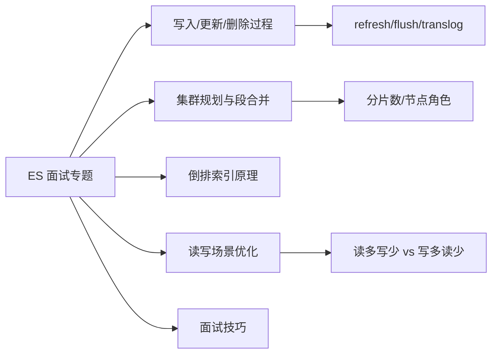

# 面试专题-章节导学

Elasticsearch 作为搜索业务的核心组件，几乎是所有后端、大数据岗位面试的高频考点。本章不以「背题」为目标，而是从真实面试中出现频率最高的 ES 问题入手，一边带大家回顾前面学过的重点知识，一边补充面试表达技巧与工程经验的储备。技术能力只是面试评估的其中一个维度，能否把知识讲清楚、讲到位，往往决定了面试的成色。

## 纲要

- 本章定位：用高频 ES 面试题串起核心知识点，并补充面试技巧
- 技术面覆盖：写入/更新/删除链路、集群与节点规划、段合并、倒排索引、读写场景优化
- 非技术面：面试表达结构与知识储备策略
- 学习目标：既能应对考点，也能把知识内化为可落地的工程经验

## 第一节 为什么单开面试专题

ES 上手容易、用好很难。工作中很多场景加了机器也解决不了，比如分片数到底怎么定、数据建模踩了坑怎么排查、定制化排序怎么做、跨集群搜索与数据迁移怎么落地。这些问题在面试里同样会被深挖，因为面试官想看的不只是「用过 ES」，而是你是否真正理解它背后的原理与代价。

本章会把前面章节分散的知识点，按照面试常问的脉络重新组织：从一条文档的写入、更新、删除全过程，到集群规划与段合并的运维经验，再到倒排索引原理与不同读写比例下的优化手段。

## 第二节 本章会讲哪些 ES 考点

下面这张图列出了本章的主线，建议大家带着「这条链路我能不能在白板上讲清楚」的问题去学。



```dir
es-interview/
├── 写入链路/
│   ├── refresh
│   ├── flush
│   └── translog
├── 集群规划/
│   ├── 分片数估算
│   └── 节点角色划分
├── 数据建模/
│   ├── mapping 设计
│   └── 字段类型选型
└── 面试技巧/
    ├── 表达结构
    └── 知识储备清单
```

| 高频考点 | 面试官想考察的能力 | 准备建议 |
| --- | --- | --- |
| ES 写入/更新/删除过程 | 对近实时写入链路的理解 | 讲清 refresh、flush、translog 的分工 |
| 集群规划与段合并 | 容量与吞吐权衡经验 | 结合节点规格算分片，说清 merge 代价 |
| 倒排索引原理 | 检索底层认知 | 对比正排与倒排、词典与倒排表 |
| 读写场景优化 | 按业务特征选型 | 区分读多写少 / 写多读少 / 实时性要求 |

## 总结

本章是「以面试题为线索的知识复盘」，重点不在押题，而在于把前面学过的 ES 核心原理串成一条能讲给别人听的线。建议学习时多听、多看、多对比，并结合自己实际工作中的场景思考：如果让我来设计这个集群、这张表，我会怎么权衡。

真正掌握一门技术靠的是反复学习、温故知新。每节作业里我会留一些思考题，请大家把知识往自己的业务里套，只有内化了，面试时才能举重若轻、少踩坑。
