# Go 项目开发: 开发岗面试的全流程准备与应答策略

技术过硬却拿不到 offer，很多时候不是技术问题。

面试官经过统一培训与考核，**面试是一套流程化的东西**：问题不同，但最终意图是一致的。理解了这套意图，准备才有方向。本文把面试拆成**面试前、面试中、面试后**三个阶段，讲清楚每个阶段该做什么、面试官在考什么、以及那些非技术问题背后的真实意图。

## 纲要

- 面试是流程化的：三个阶段与固定的考察意图
- 面试前：投递渠道的优先级与内推为什么排第一
- 面试前：简历与自我介绍该怎么准备
- 冰山模型：面试官到底在考什么
- 各轮面试的分工：能不能干、是否可培养、能干多久
- 面试官常用的提问法：GA、STAR、五 W 加一 H
- 主动破冰：把开场的主导权拿过来
- 引导面试官进入你熟悉的领域
- 结论先行的表达结构
- 回答不上来时怎么处理
- 典型问题：加班、最大的缺点
- 反向提问与项目重要性的展示
- Go 侧：冰山模型自评、STAR 经历卡片、追问预测的完整实现

## 面试本质上是流程化的

大厂面试的基本流程是固定的，面试官经过统一培训和考核。所以**面试的过程基本上是一套流程化的东西** —— 虽然问题不同，但这些问题最终的意图是一致的。

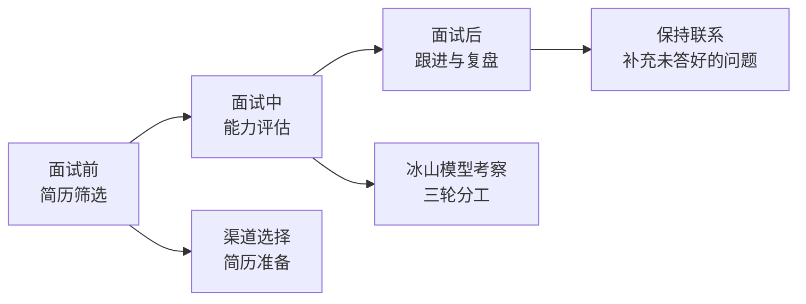

把面试当成一个**有输入、有规则、有评分标准的系统**来准备，比临场发挥靠谱得多。

## 面试前：投递渠道与优先级

简历获取的渠道大致有这些：**招聘网站、公司官方网站、线下招聘会、社交媒体（公众号 / 微博）、猎头公司、内部员工推荐（内推）**。

优先级上，**尽量优先考虑内推**。

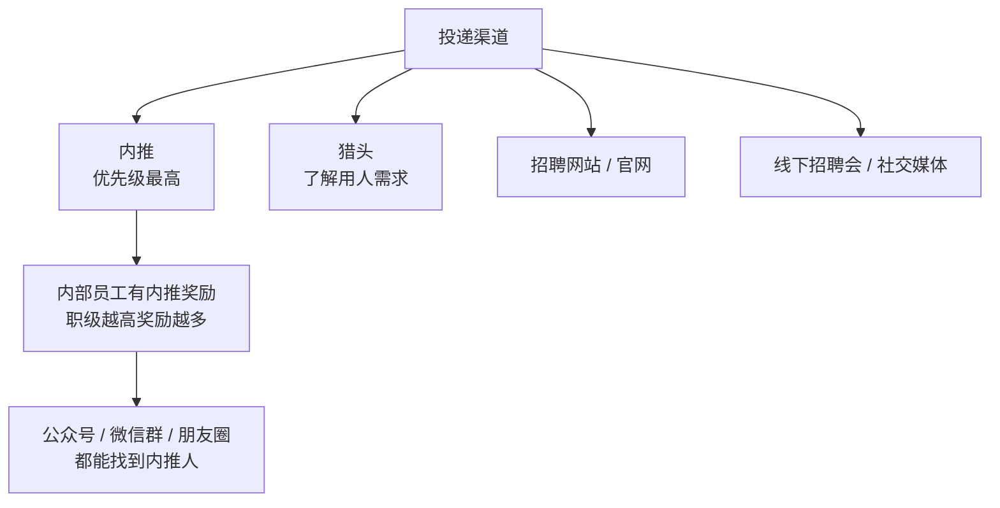

理由很实在：**对内部员工来说，内推可以获取内推奖励，而且职级越高，奖励越多**。所以内部员工会主动在个人公众号、微信群、朋友圈发布招聘信息。也可以试着搜索内推群，找到能内推的人 —— 甚至可以直接到企业园区认识内部员工来帮忙推荐。**只要真诚地说明来意，一般都不会拒绝。**

如果实在找不到内推人员，可以考虑**猎头公司**。猎头对招聘企业的用人需求比较了解，甚至能给出一些有价值的建议 —— 这是招聘网站给不了的。

## 面试前：简历与自我介绍的准备

除了技术储备、刷面试题与算法题，面试前还有两件容易被忽略的事：

- **对企业文化、价值观有清晰的了解**，尽可能多地了解团队的产品和业务。
- **结合团队岗位要求准备好自我介绍**，贴合企业文化价值观，表达自己与岗位的匹配度和自身亮点。

如果了解团队的业务，可以表达自己的兴趣；如果有类似的行业经验，或者对团队现有的技术体系有较多经验，也要在简历中凸显出来。

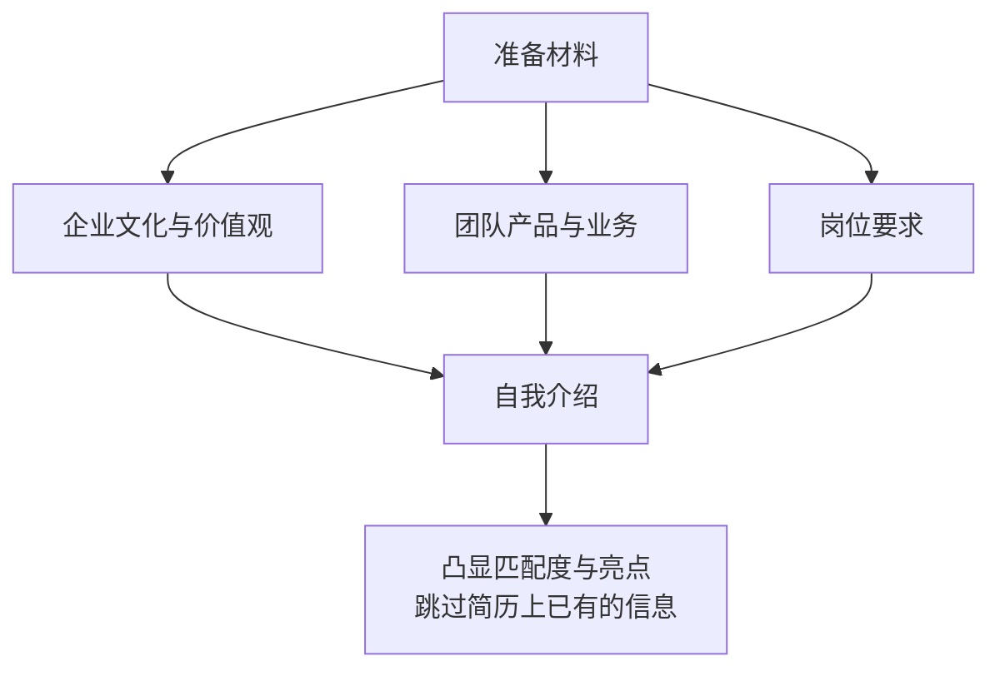

**简历上有的信息尽可能略过**，尽可能展现自己的增量价值。原因是整个面试过程时间是有限的：一上来就详细介绍自己会浪费面试官额外的时间，中途还可能被面试官叫停，导致自己紧张，没办法正常发挥真实水平。

## 冰山模型：面试官到底在考什么

面试过程中，面试官通常会使用**冰山模型**进行各个层面的考察。

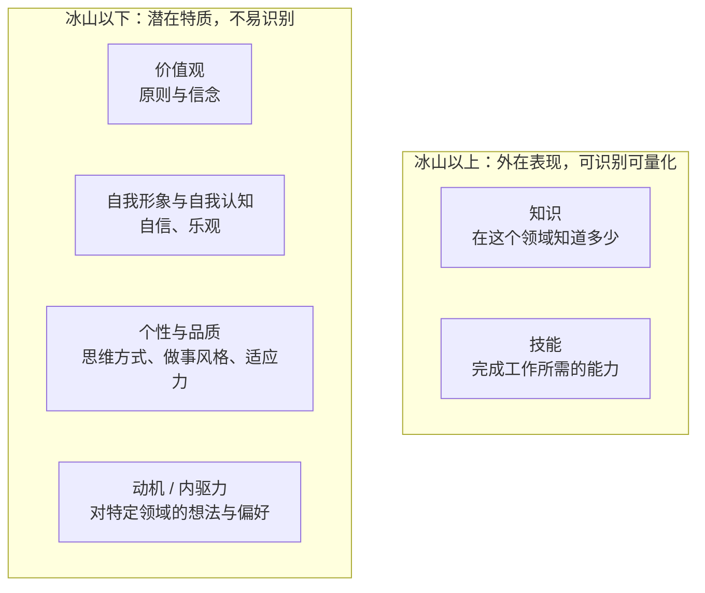

- **冰山以上**：知识 + 技能。判断标准是**有没有在实际项目中使用过**，技能更强调熟练度。
- **冰山以下**：价值观、自我认知、个性品质、动机四层。价值观通常通过**你在两难问题中的立场**来判断。

我们平时最注重的是冰山以上的部分，**通常会忽略冰山以下的部分**。应对冰山以下的问题，把握核心原则即可：

| 层次 | 应对原则 |
| --- | --- |
| 价值观 | **组织利益优于个人利益，长期利益优于短期利益** |
| 自我形象与认知 | 表现出**愿意学习、愿意探索未知领域**，把失败当成经历而非结果 |
| 个性 | 表现出**适应能力**，能调整自己的风格，更快融入团队 |
| 动机 | 表现出**对企业与业务的兴趣、对技术的追求** |

## 各轮面试的分工

面试一般经过三轮，各轮的考察重心完全不同。

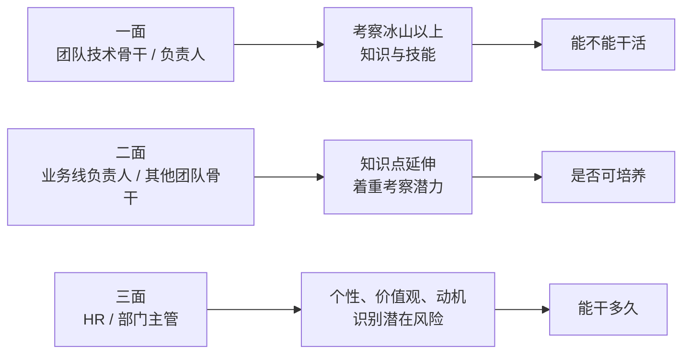

| 轮次 | 面试官 | 考察重心 | 一句话 |
| --- | --- | --- | --- |
| 一面 | 团队技术骨干 / 负责人 | 知识与技能 | **能不能干活** |
| 二面 | 业务线负责人 / 其他团队骨干 | 知识延伸 + 潜力 | **是否可培养** |
| 三面 | HR / 部门主管 | 个性、价值观、动机 | **能干多久** |

冰山以上的部分主要通过对知识点和业绩的考察、结合实际项目来评估，涵盖专业能力、通用能力等。通用能力包括**表达能力、团队沟通、协作能力** —— 从回答问题中就能顺带考察出来。所以**回答问题时有逻辑、条理清晰，本身就是加分项**。

## 面试官常用的提问法

想知道面试官会问什么，从**提问方法**入手就能推断出来。常用的提问方式有三种，会穿插在整个面试过程中。

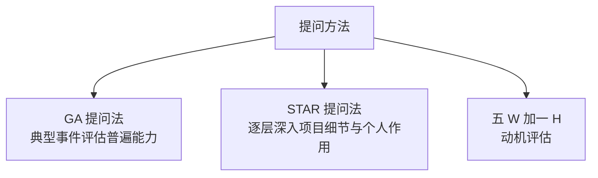

### GA 提问法

通过**典型事件**来评估候选人的普遍能力水平。典型问法：

- 分享你最有成就 / 最受挫 / 最难忘 / 最具反思的一件事或一个项目。
- 请分享一个开发周期最长或者流量最大的项目。
- 你认为自己最大的缺点或者优点是什么？

这类问题一般是**用来开启进一步深入了解**的入口。

### STAR 提问法

目的是**逐层深入了解项目细节，以及你在项目中发挥的作用**。

| 字母 | 含义 | 对事的提问 | 对人的提问 |
| --- | --- | --- | --- |
| S | Situation 场景 | 项目什么时候开始？有哪些人参与？ | 你在当中是什么角色？发挥了什么作用？ |
| T | Task 任务 | 具体任务是什么？目标是什么？重要在哪里？ | 你的任务目标是什么？哪些环节是你单独主导的？ |
| A | Action 行动 | 整个过程是怎样的？ | 你做了什么？怎么做的？为什么这么做而不那么做？ |
| R | Result 结果 | 结果和其他人相比怎么样？ | 项目结果如何？再做一次会怎么改进？学到了什么？ |

**STAR 模型能够清晰完整地对项目进行描述，我们也可以直接用它来介绍自己的项目。**

实际面试中，面试官会从"事"和"人"两个维度穿插询问：项目中遇到什么困难、做了哪些尝试、举例说明关键技术的使用、分几步完成、每步做了什么、怎么设定目标、你主要负责哪些任务。

**项目中的数据也可能被问到** —— 参与人数、开始与结束时间、UV、PV 等。这些数据可能在一段时间后被**重复确认**，通过判断两次说法是否一致来验证你的项目经历是否属实。所以写在简历上的每一个数字，都要能经得起二次追问。

### 动机评估型提问法

主要用于**对候选人动机的评估**。五个 W 是 Who（谁来做）、What（做了什么）、Where（在哪做）、When（何时做）、Why（为什么这么做 / 为什么离职），加一个 H 是 How（用什么方法做）。

典型问法：为什么离职？对下一份工作最看重什么？工作中什么时候觉得满意或不满意？理由是什么？

## 主动破冰：把开场的主导权拿过来

面试本质上是一次**陌生人的交流**，是一场关键谈话。既然是谈话，开场就需要一个破冰的过程。

专业的面试官会聊些轻松话题帮你放松。但**如果你能主动破冰，往往能给面试官留下更好的印象**。求职者普遍紧张、表现被动，所以**不要等面试官让你介绍自己时才开始**。

可以在面试开始时礼貌地问一句："可以花两分钟做一下自我介绍吗？"

自我介绍需要**凸显亮点，尽量不要和简历内容重合**。也可以从当下的热点话题切入，或者先表达一个容易被面试官认可的观点 —— 最终目的是**让面试官从认可你的观点开始认可你**，谈话一开局就达成共识，后面会顺畅很多。

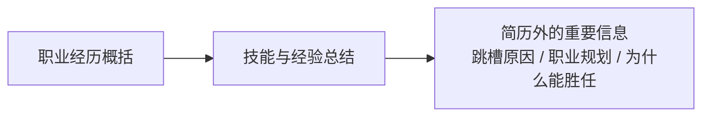

职业经历不需要过多细节，示范：

> 我先后在两家公司做过三年的 Java 开发和两年的 Go 开发，以及三年十人的团队管理，负责过某某业务核心功能的架构方案设计和落地。因为在公司感觉能力提升有限，对贵公司的某某业务很感兴趣，所以来应聘贵公司的某某职位。

工作经历较少的同学，可以把经历分成多个阶段来表述：**第一个阶段参与某某模块开发，收获某某技能；第二个阶段负责某某模块，全面了解某某，熟悉某某技能；第三个阶段主导某某功能的研发，推动某某落地，达到某某成果。**

**如果有数据做支撑会更有说服力**：系统峰值流量多少、优化后延迟从多少降到多少、读写能力提升多少、节省了多少资源。

## 引导面试官进入你熟悉的领域

面试过程中要有意识地**引导面试官问你熟悉的领域**。技术问题涉及面广，难免遇到知识盲区；而在熟悉的领域深入回答，既能展示能力水平，也能避免触碰盲区。

具体做法：

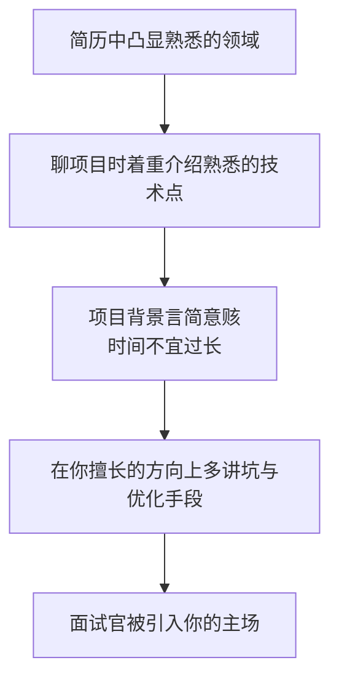

比如你对 ES 有比较深入的了解，就可以多讲 ES 方面的问题：遇到了哪些坑、使用了哪些手段去优化、最终达到了什么效果。**面试官被引入你熟悉的领域，通过的几率自然提高。**

注意一点：**介绍项目背景是有必要的**（让面试官整体了解项目），但要**言简意赅，时间不宜过长**。

## 结论先行的表达结构

表达观点时，**先表述结论，再分三点做阐述**。

这样表述让面试官感觉逻辑清晰、很有条理。否则说了半天，面试官可能不知道你表达的重点。

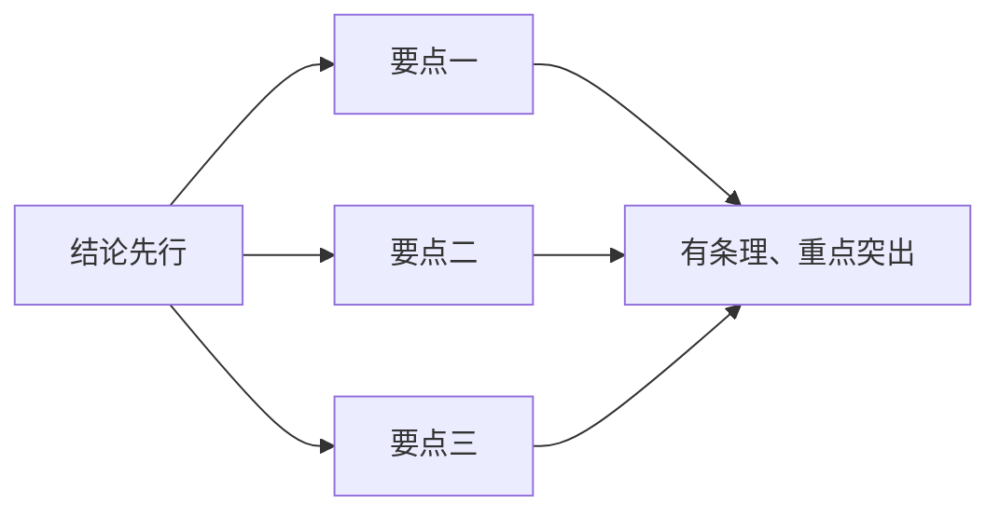

但有个前提：**有些问题如果还没想好，就不要立马给出结论，避免给自己埋坑**。先分析面试官问问题的意图，尽可能多角度思考问题。

## 回答不上来时怎么处理

任何人都有知识盲区，面试也是评估你**知识深度和边界**的过程，遇到超出知识范围的问题很正常。

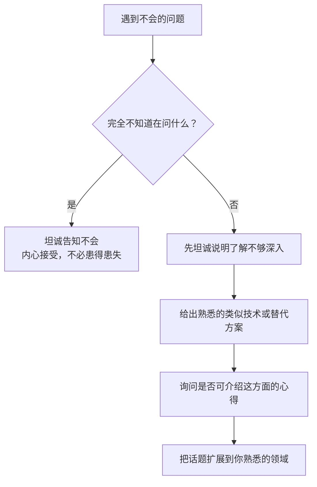

- **完全不知道面试官问的是什么**：这种情况极少出现。出现了就直接坦诚告知，同时也不要觉得若有所失 —— 提前有心理准备，遇到超出知识边界的问题是正常的。
- **大部分问题都不是一无所知**：先坦诚说明自己在这方面的确了解不够深入；如果有熟悉的类似技术或替代方案，可以进一步扩展到自己熟悉的领域，并**询问面试官是否可以让自己介绍一些这方面的心得和理解**。通常面试官也会同意。

面试总时间是一定的，说出自己熟悉的技术点，最终也会让面试官更认可你的技术实力。

## 典型问题的应答思路

### 谈谈你对加班的看法

问这个问题的公司**不一定经常需要加班**。互联网公司加班已常态化，在一些发展的关键节点加班是必然的。**这个问题的目的是考察求职者的工作态度和责任心。**

参考表述：如果工作需要会主动加班；同时也会**通过提高工作效率来减少不必要的加班**。

### 你最大的缺点是什么

很多人知道不能暴露原则性的缺点，却陷入了**过于完美的误区**："最大的缺点是过于追求完美""事业心太强，总想加班把活干完" —— 这些是典型的把优点包装成缺点，满满的套路，显得俗套，**自己都不信的答案糊弄不了面试官**。

正确做法是**用真实的经历来说明自己的缺点，融入自己的观点、情感和感悟**：

| 真实缺点 | 事例 | 感悟与改进 |
| --- | --- | --- |
| 喜欢追求细节 | 有时候任务为了按期完成而妥协 | 通过时间管理能力改变工作方式，**完成优先于完美**：先完成框架，再改善细节 |
| 不好意思拒绝同事求助 | 同事的要求尽可能都揽下，有时影响自身进度 | 用多任务处理能力设定优先级，向求助同事展示手头工作，合理安排优先级 |

### 简历中的关键节点

面试官经常针对简历的关键节点提问，需要提前准备好答案：

- **空白期**：有一段工作经历是空白的，要准备好解释。
- **跳槽经历**：正向跳槽（从小公司到大公司、从低职位到高职位）一般没什么影响。企业关注的是候选人的发展**是在增值、维持还是贬值**。负向跳槽可能被追问，也是简历筛选的关键点，**最好在简历上就说明合理原因**。
- **岗位序列变化**：比如之前一直做产品经理后转为开发，这种跨领域变更一般会成为提问的关键点。

**提前准备这些问题的答案，回答时可以表达得更清晰、更有逻辑。**

## 反向提问：了解团队的最佳窗口

面试结束时面试官通常会问"你有什么想问的"。这个环节一方面是**面试官出于尊重，表达与面试者平等对话的关系**；另一方面是想**通过你的关注点了解你的动机**，判断你是否适合这个职位或团队。

对你而言，这也是一次**绝佳的了解团队的机会**。应该尽可能问一些与你、面试官、职位需求都相关的问题：

- 团队的现状、需要解决的关键问题和挑战是什么？
- 产品的业务是什么？有什么核心竞争力？
- 用到了哪些技术栈、流程和工具？
- 自己将会负责哪些业务？

还可以**借此机会补充面试过程中没有回答好的问题**。

## 如何体现你在项目中的重要性

建议从下面几个角度对项目中自己的角色、职责和结果进行阐述：

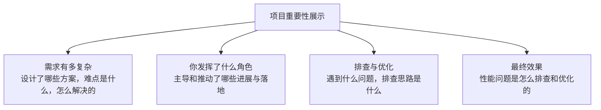

**复杂业务需求 → 方案设计 → 你主导推动的落地 → 问题排查思路 → 最终效果**，这条链路讲完整，你在项目中的权重自然就出来了。

## 面试后：保持联系

面试后一般可以**主动加面试官的微信保持联系**。对面试过程中回答得不好的问题，下来想清楚之后也可以再进行探讨。

一方面表达了对技术的喜爱和较真，另一方面也能适当刷一刷存在感，给面试官留下更深的印象，**有助于提高拿到 offer 的几率**。

最后一点实操建议：**面试中的这些技巧需要不断练习**。可以找朋友扮演面试官多次演练，也可以先投一些自己不太中意的企业进入面试状态，再到中意的企业发挥更好的状态。

## API 速览

| 环节 | 动作 | 要点 |
| --- | --- | --- |
| 投递 | 优先内推 | 内部员工有奖励，真诚说明来意即可 |
| 投递 | 次选猎头 | 对用人需求更了解，能给建议 |
| 简历 | 凸显匹配度 | 行业经验、技术体系经验是加分项 |
| 开场 | 主动破冰 | 自问"可以花两分钟自我介绍吗" |
| 自我介绍 | 三段式 | 职业经历 → 技能经验 → 简历外信息 |
| 表达 | 结论先行加三点 | 没想好别急着下结论 |
| 项目介绍 | STAR 模型 | S/T/A/R 各准备"对人"与"对事"两版 |
| 引导 | 主场作战 | 在擅长方向多讲坑与优化 |
| 盲区 | 坦诚 + 迁移 | 承认不足后引向熟悉的替代方案 |
| 反问 | 问团队与业务 | 团队现状、挑战、技术栈、负责范围 |
| 面试后 | 加微信跟进 | 补充未答好的问题 |

## Demo 示例

素材本身没有代码，这里给一个**可落地的准备工具**：用 Go 实现冰山模型六层自评、STAR 项目经历卡片生成、面试官追问预测、结论先行表达模板。纯标准库，可直接跑。

**运行说明**

- 需要 Go 1.18+（用到 `strings.Builder` 与 `sort.SliceStable`，1.21 验证通过）。
- 无第三方依赖，保存为 `main.go` 后 `go run main.go`。
- 把 `main` 里的示例数据换成你自己的经历，就能直接产出一份可背的项目介绍稿。

```go
package main

import (
	"fmt"
	"sort"
	"strings"
)

// ---------------------------------------------------------------- 冰山模型自评

// Level 冰山模型的一个层次。
// Above=true 表示冰山以上（外在表现，可识别可量化）；false 表示冰山以下（潜在特质）。
type Level struct {
	Name  string
	Above bool
	Score int    // 1~5 自评
	Round string // 主要在哪一轮被考察
}

// Assess 找出薄弱层，并按「先补冰山以上」的顺序给出准备建议。
// 冰山以上靠项目事实补，冰山以下靠行为事例补，两者准备方式完全不同。
func Assess(levels []Level) (weak []Level, tips []string) {
	cp := append([]Level(nil), levels...)
	sort.SliceStable(cp, func(i, j int) bool {
		if cp[i].Above != cp[j].Above {
			return cp[i].Above // 冰山以上优先
		}
		return cp[i].Score < cp[j].Score
	})
	for _, l := range cp {
		if l.Score > 3 {
			continue
		}
		weak = append(weak, l)
		if l.Above {
			tips = append(tips, fmt.Sprintf(
				"【%s】%d 分，%s 重点考察 → 补实际项目中的使用与落地结果",
				l.Name, l.Score, l.Round))
		} else {
			tips = append(tips, fmt.Sprintf(
				"【%s】%d 分，%s 重点考察 → 准备行为事例：两难问题中的立场、失败复盘、动机表述",
				l.Name, l.Score, l.Round))
		}
	}
	return weak, tips
}

// ---------------------------------------------------------------- STAR 项目卡片

// STAR 用 Situation / Task / Action / Result 四段描述一段项目经历。
type STAR struct {
	Project   string
	Situation string
	Task      string
	Action    string
	Result    string
}

// Render 生成一段可直接口述的项目介绍稿：先结论，再按 STAR 展开。
func (s STAR) Render() string {
	var b strings.Builder
	b.WriteString(fmt.Sprintf("一句话结论：在 %s 项目中，%s。\n\n", s.Project, s.Result))
	b.WriteString(fmt.Sprintf("S（场景）：%s\n", s.Situation))
	b.WriteString(fmt.Sprintf("T（任务）：%s\n", s.Task))
	b.WriteString(fmt.Sprintf("A（行动）：%s\n", s.Action))
	b.WriteString(fmt.Sprintf("R（结果）：%s\n", s.Result))
	return b.String()
}

// PredictFollowUps 按 STAR 四段预测面试官的追问。
// 面试官会从"对事"和"对人"两个维度穿插提问，数据类问题还会被重复确认。
func PredictFollowUps(s STAR) []string {
	return []string{
		fmt.Sprintf("S 对人：%s 项目里你在当中是什么角色？发挥了什么作用？", s.Project),
		"S 对事：这个项目是什么时候开始的？都有哪些人参与？",
		"T 对人：你的任务目标是什么？哪些环节是你单独主导的？",
		"T 对事：这个任务重要在哪里？目标是怎么设定的？",
		"A 对人：你为什么这么做而不那么做？有没有考虑过其他方案？",
		"A 对事：整个过程分几步完成？每一步做了什么？",
		"R 对人：你从中学到了什么？再做一次会有什么改进？",
		"R 对事：这个结果和其他人相比怎么样？",
		"数据复核：参与人数、起止时间、PV/UV、优化前后的延迟分别是多少？",
	}
}

// ---------------------------------------------------------------- 结论先行表达模板

// Outline 结论先行 + 分点阐述：先给结论，再用要点支撑。
func Outline(conclusion string, points []string) string {
	var b strings.Builder
	b.WriteString(fmt.Sprintf("结论：%s\n", conclusion))
	for i, p := range points {
		b.WriteString(fmt.Sprintf("  要点 %d：%s\n", i+1, p))
	}
	return b.String()
}

// ---------------------------------------------------------------- 投递渠道

// Channel 简历投递渠道，Priority 越小越优先。
type Channel struct {
	Name     string
	Priority int
	Why      string
}

// RankChannels 按优先级排序并给出理由。
func RankChannels(cs []Channel) []Channel {
	cp := append([]Channel(nil), cs...)
	sort.SliceStable(cp, func(i, j int) bool { return cp[i].Priority < cp[j].Priority })
	return cp
}

// ---------------------------------------------------------------- 演示

func main() {
	// ---- 投递渠道优先级 ----
	fmt.Println("=== 简历投递渠道优先级 ===")
	channels := RankChannels([]Channel{
		{"招聘网站", 3, "覆盖面广，但简历容易被淹没"},
		{"公司官方网站", 4, "信息权威，岗位更新可能滞后"},
		{"线下招聘会", 5, "多见于校园招聘与人才市场"},
		{"社交媒体（公众号/微博）", 6, "可被动获取岗位推送"},
		{"猎头公司", 2, "对用人需求了解深，能给有价值的建议"},
		{"内推", 1, "内部员工有奖励，职级越高奖励越多；真诚说明来意一般不会拒绝"},
	})
	for i, c := range channels {
		fmt.Printf("%d. %-8s → %s\n", i+1, c.Name, c.Why)
	}

	// ---- 冰山模型自评 ----
	fmt.Println("\n=== 冰山模型六层自评 ===")
	levels := []Level{
		{"知识", true, 4, "一面"},
		{"技能", true, 3, "一面"},
		{"价值观", false, 4, "三面"},
		{"自我形象与自我认知", false, 3, "三面"},
		{"个性与品质", false, 2, "三面"},
		{"动机 / 内驱力", false, 4, "三面"},
	}
	fmt.Printf("%-20s %-8s %-6s %-6s\n", "层次", "位置", "自评", "主考轮次")
	for _, l := range levels {
		pos := "冰山下"
		if l.Above {
			pos = "冰山上"
		}
		fmt.Printf("%-20s %-8s %-6d %-6s\n", l.Name, pos, l.Score, l.Round)
	}
	weak, tips := Assess(levels)
	fmt.Printf("\n薄弱层次 %d 项，准备建议：\n", len(weak))
	for _, t := range tips {
		fmt.Println("  " + t)
	}

	// ---- STAR 项目卡片 ----
	fmt.Println("\n=== STAR 项目经历卡片 ===")
	exp := STAR{
		Project:   "邮件搜索服务",
		Situation: "PB 级邮件数据的全文检索，原方案查询延迟高、集群写入压力大",
		Task:      "负责搜索服务的索引设计与写入链路改造，目标是把 P99 延迟压到 200ms 以内",
		Action: "把大文本原文从 _source 中剥离改由外部存储回源；" +
			"拉长 refresh_interval 减少段生成；bulk 按 routing 分批提交",
		Result: "P99 延迟从 1.8s 降到 165ms，集群写入吞吐提升 2.4 倍，存储成本下降 40%",
	}
	fmt.Print(exp.Render())

	fmt.Println("\n=== 面试官追问预测 ===")
	for i, q := range PredictFollowUps(exp) {
		fmt.Printf("%2d. %s\n", i+1, q)
	}
	fmt.Println("\n提醒：数据会被重复确认，两次说法必须一致")

	// ---- 结论先行模板 ----
	fmt.Println("\n=== 结论先行加三点：回答示范 ===")
	fmt.Print(Outline("这个场景应该用 keyword 而不是数值类型", []string{
		"字段只做 term 精确匹配，不需要排序和范围查询",
		"keyword 走倒排链直达，数值类型要走 BKD 树，比较次数差两个数量级",
		"该字段基数低，构建 bitset 的代价高而缓存区分度低，数值类型不划算",
	}))
}
```

**代码说明**

- `Assess` 的排序规则刻意把**冰山以上排在前面**：知识和技能靠项目事实补（几天能见效），价值观与动机靠行为事例补（要长期沉淀），准备顺序不同。
- `STAR.Render` 的第一行是**一句话结论**，把 `Result` 提到最前面 —— 直接复用了"结论先行"这条表达原则，让项目介绍的开场就不是流水账。
- `PredictFollowUps` 覆盖了 STAR 四段的**对人与对事**两个维度，最后一条是**数据复核**：面试里 PV / UV / 延迟这些数字会在不同时间被重复确认，用来验证经历是否属实。
- `Outline` 是最朴素的模板函数，但它是回答技术问题时**最有效的一个约束**——强制先想清楚结论，再找支撑。
- `RankChannels` 只是稳定排序，但把"内推优先"这条经验固化成了可执行的代码产物。
- 所有输出都是纯文本拼接，无随机数、无时间戳，**每次运行输出完全一致**，方便对着稿子反复练。

**技术点总结**

- 面试是**流程化的**：问题不同，意图一致，因此可以按规则准备。
- **内推优先级最高** —— 激励机制决定了内部员工有动力帮你。
- **冰山模型**分六层：上面是知识与技能（看能不能干活），下面是价值观、自我认知、个性、动机（看能干多久）。
- **STAR 既可以用来回答，也可以用来准备**：四段各准备"对人"与"对事"两版。
- **主动破冰 + 引导领域**：把面试拉进你的主场。
- **结论先行加三点**；没想清楚时不要急着下结论。
- 盲区问题**坦诚 + 迁移**到熟悉的替代方案，比硬编好得多。

## 面试全流程的结构示意

```dir
interview-flow/
├── 面试前 before
│   ├── 投递渠道           内推 > 官网 > 海投
│   └── 简历 / 自我介绍
├── 面试中 during
│   ├── 冰山模型           能力 / 潜力 / 稳定
│   ├── 三轮分工           能干 / 可培养 / 能干多久
│   └── 提问法             STAR / GA / 5W1H
└── 面试后 after
    ├── 反向提问
    └── 复盘跟进
```

## 总结

面试准备可以拆成三件事：**渠道**（优先内推、简历凸显匹配度）、**模型**（冰山六层 + STAR 四段 + GA / 五 W 一 H 三种提问法）、**表达**（主动破冰、引导领域、结论先行加三点）。

真正拉开差距的往往不是技术深度本身，而是**能不能在有限时间里，把你的技术深度清晰地传达出去**。而这些技巧是可以通过反复演练获得的 —— 找朋友扮演面试官，先拿不太中意的企业进入状态，再到目标企业里发挥出真实水平。

