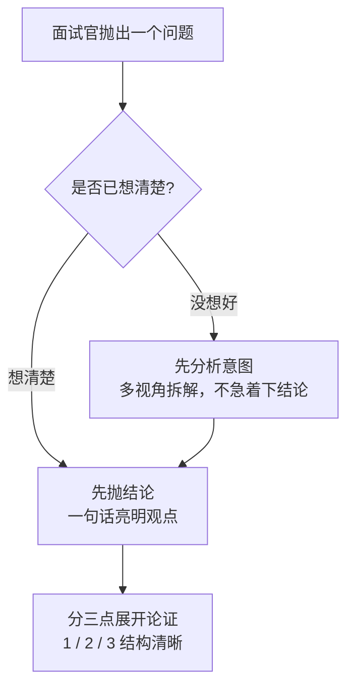
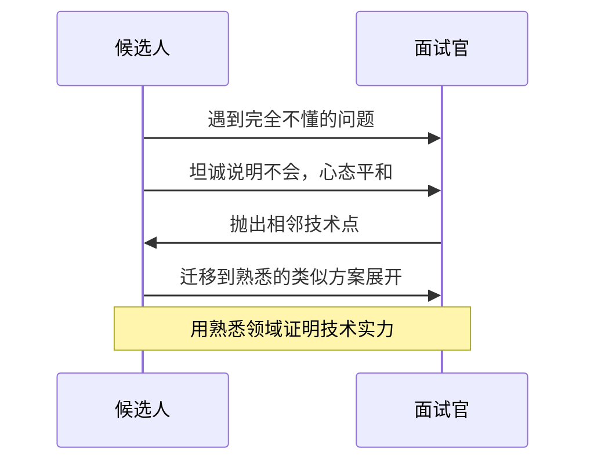

# 面试技巧（二）：结果先行 + 三点论，把回答讲到面试官心坎里

上一节我们讲了面试前的简历投递渠道、冰山模型下各阶段评估的能力与素质，以及主动破冰、引导面试官在自己熟悉领域探讨等基础动作。这一节进入「面试中怎么答、怎么问、怎么收尾」的实战层 —— 这一部分最考验功力，也最容易被候选人忽略。

技术实力是入场券，但**表达是否清晰、沟通是否高效、能不能在有限时间里让面试官看到你的价值**，往往决定 offer 的归属。下面把本节的核心技巧拆开讲。

## 纲要

- 表达结构：结论先行 + 三点论，逻辑一目了然
- 沟通效率：拒绝「挤牙膏式」被动回答与无效回答
- 遇上知识盲区：坦诚 + 迁移到熟悉领域，化被动为主动
- 典型送命题：加班看法、最大缺点该怎么答
- 反向提问：用问题展示你的动机与思考深度
- 项目展示：用「角色 / 难点 / 结果」三件套讲清重要性
- 面试后：主动保持联系，把没答好的点补回来

## 表达结构：结论先行 + 三点论

最容易被低估、却最立竿见影的技巧，就是 **先给结论，再分三点展开**。



这样做的好处非常直接：面试官听完第一句就知道你要表达什么，后面的三点是在给结论「加论据」，而不是让对方全程猜你要说什么。否则讲了半天，面试官抓不住重点，印象分直接打折。

**但有一个前提**：如果问题你还没想明白，**不要为了「结论先行」而强行给结论** —— 那叫给自己埋坑。正确做法是先厘清面试官提问的意图，从多个角度把问题想透，再组织语言。

## 沟通效率：拒绝无效与低效回答

面试里每一分钟都是预算。低效回答有两种典型形态，必须避开：

- **无效回答**：面试官问「讲讲 MySQL 的三大范式」，你上来就背「第一范式、第二范式、第三范式」—— 这是在复述名词，没有结合场景，面试官会觉得你敷衍、被动、沟通能力差。
- **挤牙膏式被动回答**：问一句答一句，不主动补充上下文，面试官看不到你的能力边界，也很容易觉得你不够积极。

正确姿势是：**先理解问题再回答**。如果拿不准面试官想考察的核心点，可以先用一句话确认：「您是想了解它在高并发下的表现，还是整体设计思路？」确认清楚再展开，回答要尽量具体。拿不准时主动对齐，远比硬答强。

## 遇上知识盲区：坦诚 + 迁移

任何人都有知识盲区，面试本来就是在评估你**知识的深度和边界**，遇到超纲问题太正常了。



分两种情况处理：

1. **完全陌生**：直接坦诚告知「这块我确实没深入接触过」，同时心里有底 —— 全程一问三不知极少见，坦然接受即可，别慌。
2. **部分了解 / 有类似经验**：先坦诚「这方面我了解不够深入」，然后如果有熟悉的技术或替代方案，**主动延伸到自己擅长的领域**，询问面试官是否愿意听你讲讲这方面的心得。面试总时长固定，把时间花在你强的地方，反而更容易获得认可。

## 典型送命题怎么答

### 对加班的看法

问这个不一定代表天天加班（互联网关键节点加班确实常态化），核心是在考察**工作态度与责任心**。可以这样说：

> 如果工作需要，我会主动加班；目前我单身、没有家庭负担，能全身心投入。同时我也会通过提升工作效率来减少不必要的加班。

既表达了态度，又没把自己架到「无条件加班」的火上烤。

### 你最大的缺点是什么

很多人知道不能暴露原则性缺点，却陷入另一个极端 —— **把优点包装成缺点**（「我最大的缺点就是太追求完美 / 事业心太强 / 总想把活干完」）。这种套路满满、连自己都不信的答案，糊弄不了面试官。

**更真诚的做法是用真实经历说话**，融入观点、情感和感悟。两个可参考的范式：

- 「我有时候太追求细节，导致为了按期交付而焦虑。后来我总结：先完成框架、再补细节，用时间管理改善工作方式。」
- 「我不擅长拒绝同事的求助，经常把别人的需求也揽下来，影响自身进度。后来我用多任务管理给手头工作排优先级，再向求助同事展示排期，合理地安排先后顺序。」

核心是：**真实 + 反思 + 改进动作**，而不是反向凡尔赛。

## 反向提问：用问题展示深度

面试中除了自我介绍由你主导，另一个「你主导」的环节，是**面试结尾面试官问「你有什么想问的吗」**。这个环节有两层用意：一是出于尊重、建立平等对话；二是通过你的关注点判断你和职位 / 团队的匹配度。

```dir
面试反向提问（你主导的窗口）
├── 团队与业务
│   ├── 团队现状与需要解决的关键挑战
│   ├── 产品业务是什么、核心竞争力在哪
│   └── 用到了哪些技术栈、流程与工具
├── 个人定位
│   ├── 我将负责哪些业务模块
│   └── 岗位的能力模型与成长路径
└── 补刀
    └── 借机补全前面没答好的问题
```

问的时候尽量选**与你自己、面试官、职位需求都相关**的问题：团队现状、要解决的关键问题、业务与技术栈、你将负责什么。也可以顺势把前面没答好的点补回来。这是你了解团队的好机会，别只问「薪资多少」。

## 项目展示：用三件套讲清重要性

面试官最想听的，是你在项目里**到底发挥了什么作用**。建议按下面三个维度组织：

| 维度 | 要讲清楚的内容 |
| --- | --- |
| 角色与职责 | 你在项目中是什么角色，主导 / 推动了什么落地 |
| 难点与解决 | 复杂业务需求设计了哪些方案，难点是什么，怎么排查、怎么解决 |
| 结果与效果 | 项目最终达到什么指标，性能问题如何排查优化 |

一句话结构就是：**复杂需求 → 设计方案 → 卡点与排查思路 → 最终效果**。把「我做了什么、带来了什么结果」讲透，比罗列技术名词有力得多。

## 面试后：把联系续上

面试结束不等于结束。一般可以**主动加面试官微信保持联系**；对答得不好的问题，下来想清楚后也可以再探讨 —— 既表达对技术的较真，也适当刷存在感，有助于提高拿 offer 的概率。

## 总结

面试不是考试，而是一场**结构化的价值展示**。把这一节的技巧串起来看，其实就三件事：

- **答要准**：结论先行 + 三点论，拒绝无效与被动回答，遇盲区坦诚并迁移到擅长领域；
- **问要深**：用反向提问展示你的动机与思考，而不是走流程；
- **收要稳**：用「角色 / 难点 / 结果」讲清项目价值，面试后主动延续联系。

这些技巧**不是看一遍就会**，建议找朋友扮演面试官多次演练，或先投几家不是最心仪的公司进入状态，再战目标企业。听进去的是知识，练出来才是技能。
