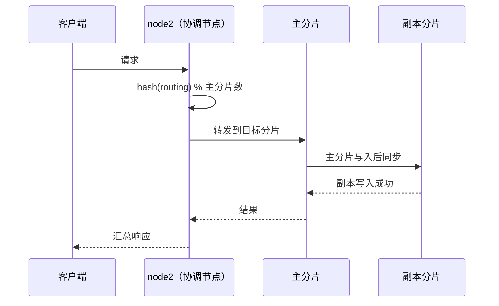
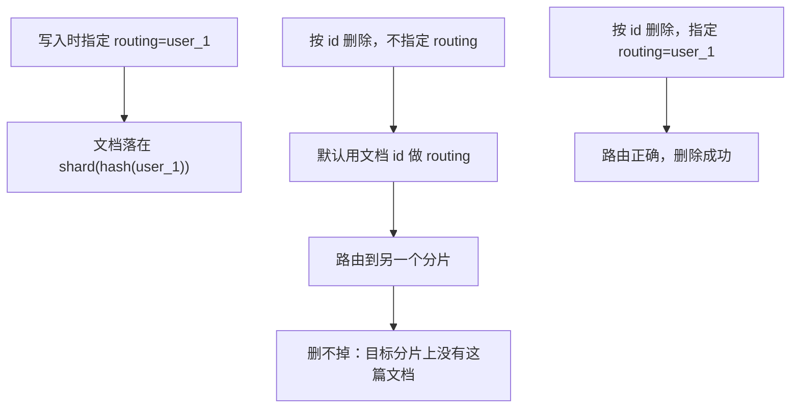
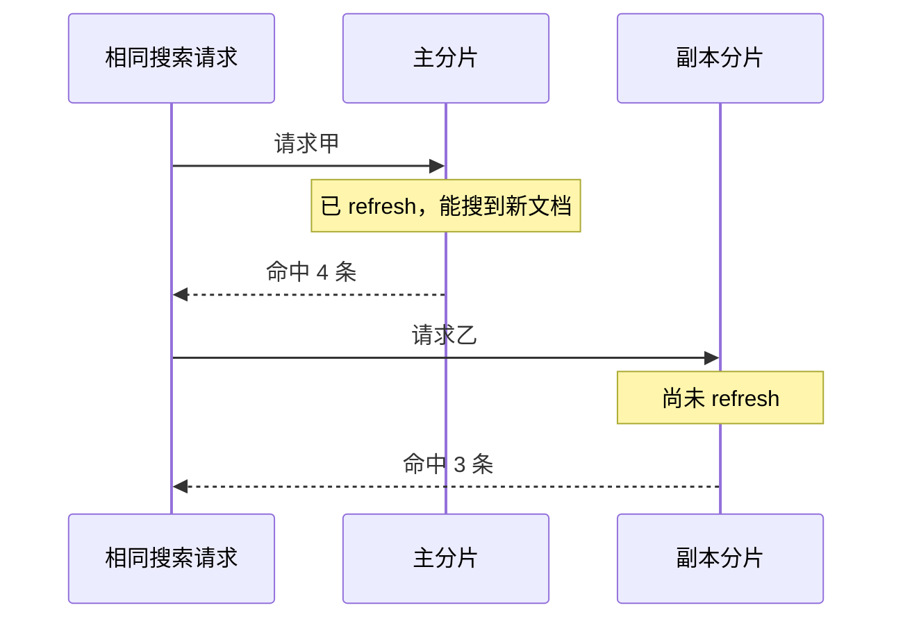
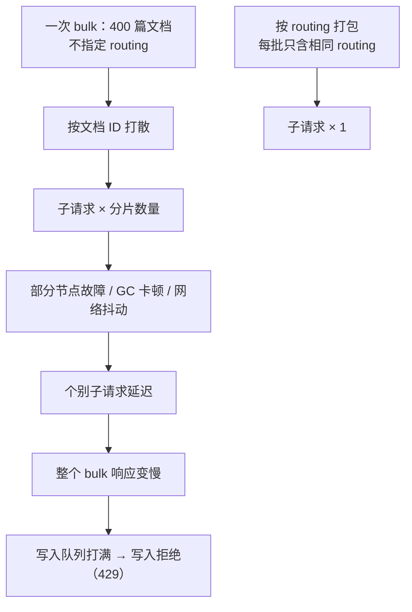
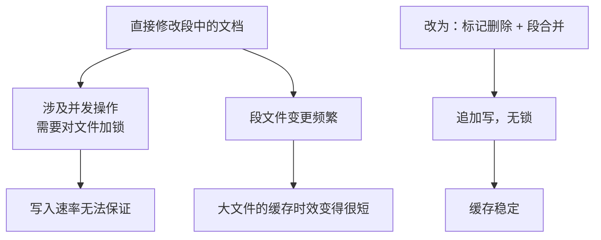
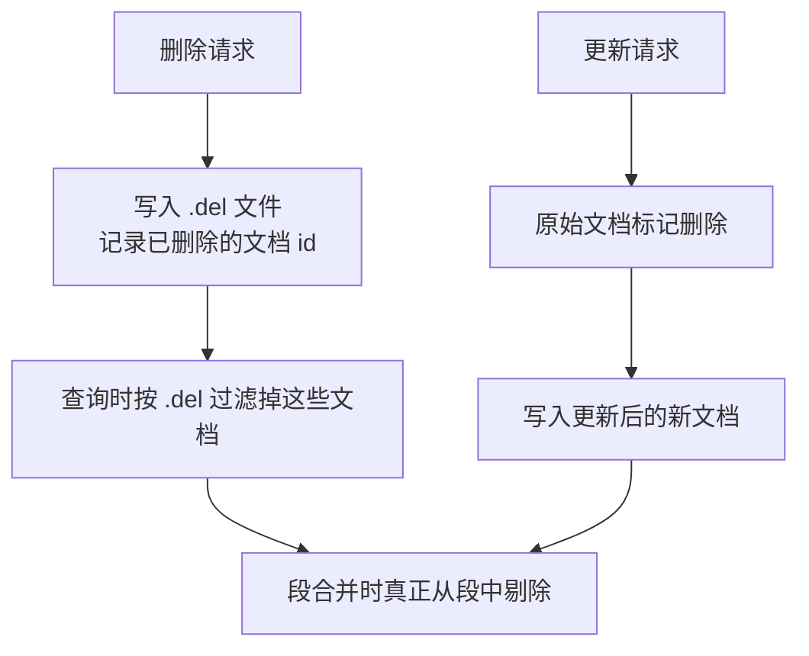
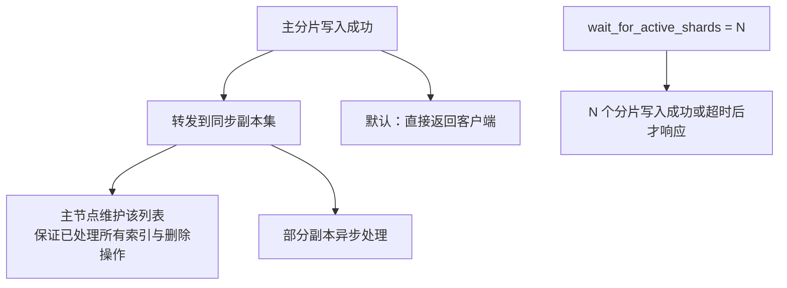
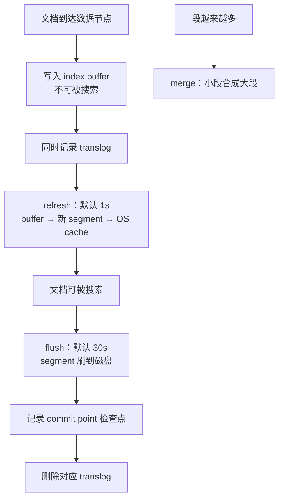
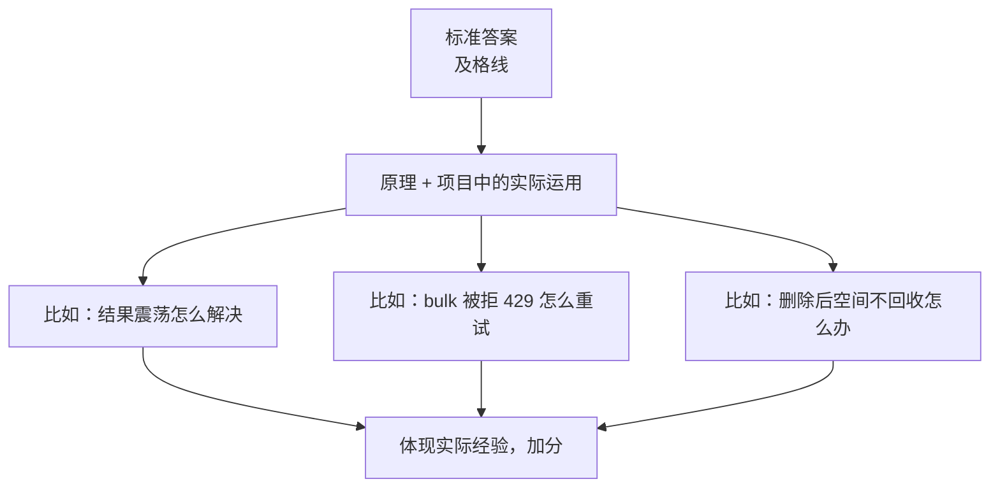

# Go 项目开发: ES 写入更新删除与查询的完整链路

"详细描述 ES 写入、更新、删除和查询的具体过程"是面试里最常见的 ES 基础题。

大部分人会直接背枯燥的原理 —— 那只能算**及格线**。真正的加分项是：把原理讲完之后，**结合原理引申到实际项目中的应用**。但凡做过搜索业务的面试官，都能从这个延伸里感受到你的实际经验。

回答这类问题需要覆盖四个关键点：**数据路由的过程、文档修改和删除是怎么处理的、副本的同步机制、数据落盘的过程**。

## 纲要

- 数据路由：协调节点如何定位分片
- 按 doc id 的 get 与 delete：routing 的坑
- 搜索请求的路由与结果震荡：`preference` 参数
- 写请求的路由与文档 ID 的选择
- bulk 的转发机制与写入拒绝
- 段不可变：修改与删除是怎么处理的
- 删除后的空间为什么不会立刻回收
- 副本同步：同步副本集与 `wait_for_active_shards`
- 数据落盘：index buffer → refresh → OS cache → flush
- 段合并：物理删除真正发生的时刻
- 面试怎么答这个问题
- Go 侧：路由、主副本震荡、段合并物理删除的完整模拟

## 数据路由：协调节点如何定位分片

不管是更新、删除还是查询，**都会有这个路由的过程**。



客户端发送请求到 `node2`，此时 `node2` 就承担了**协调节点**的角色：负责将请求转发到对应的分片上，并汇总返回的结果，最终响应给客户端。

协调节点是**通过 routing 哈希后，再对主分片数取余**来决定将请求发送到哪些分片的：

```
shard = hash(routing) % number_of_primary_shards
```

## 按 doc id 的 get 与 delete

当发送的是**指定文档 id 的 get 请求**，或者通过文档 id 删除的 delete 请求，**默认是以文档 id 作为 routing 的**。

这里有个很容易踩的坑：**如果文档有自定义 routing，请求却没有指定 routing，依然会使用文档的 id 作为 routing** —— 于是路由到了错误的分片，取不到数据。

所以结论很硬：**自定义 routing 的情况下，通过 id 获取或删除，必须指定 routing。**



另外，**文档 id 是在分片级别唯一的**：也就是说，文档 id 相同但 routing 不同的数据是可以同时写入的。这一点在做多租户索引时要特别小心。

## 搜索请求的路由与结果震荡

搜索类请求分两种情况：

- **不指定 routing**：请求会被发送到索引所在全部数据节点的主分片或副本分片上。
- **指定 routing**：用 routing 对主分片数取余获取对应的分片，协调节点只把请求转发到这些分片。

由于**主副分片都可以接受查询请求**，ES 默认会均衡负载到不同的副本分片上。问题来了：



**主副本分片的 refresh 时机是不同的**，所以有可能出现主分片的数据已经经过 refresh、副本分片却还没经过 refresh 的情况。这时就会出现**主分片能搜到数据、副本分片却不能**的情况，进而**相同的搜索请求返回了不同的结果**——这就是查询结果震荡。

解法是指定 **`preference` 参数**，通常使用用户的 uid 或者 sessionId 作为它的值：

```json
{
  "query": { "match": { "subject": "季度总结" } }
}
```

```
GET /mail/_search?preference=user_10086
```

这样可以让**相同的查询请求每次都打到相同的分片上**，既避免了结果震荡，也能**提高分片级查询缓存的命中率**。

## 写请求的路由与文档 ID 的选择

写请求不指定 routing 时，会以文档的 id 作为 routing。

关于文档 ID，有一个容易被忽略的性能细节：

| ID 策略 | ES 行为 | 适用场景 |
| --- | --- | --- |
| 指定 ID | 需要判断目标分片上有没有相同 id 的文档，**多一次磁盘 IO** | 数据存在更新的场景 |
| 自动生成 ID | 无需判断存在性，直接写入 | 日志等**不存在数据更新**的场景 |

所以：

- **日志等不存在数据更新的场景，让 ES 自动生成 ID。**
- **数据存在更新的场景，使用业务数据的唯一标识作为 ES 的文档 ID** —— 这样处理数据更新时不需要再查询 ES 的文档 id，更新效率更高。

## bulk 的转发机制与写入拒绝

写入、删除、更新都可以通过 **bulk** 批量提交。协调节点会对批量请求**进一步分批处理，将同一个分片的请求打包到一起**，转发给对应节点的对应分片。

在超大规模集群中，单索引分片数一般比较大。此时如果采用 bulk 写入且不指定 routing，ES 默认使用文档 ID 作为 routing，**一次批量写入就会被打散成分片数量的子写入请求**，发送到对应分片上执行。



**分片数过多时，可能因为部分节点出现故障、GC 卡顿或者网络抖动出现延迟，从而导致整个 bulk 请求响应缓慢，最终导致节点写入队列打满而出现写入拒绝。**

对策很直接：**写入时尽可能将相同 routing 的请求打包到同一个 bulk 请求中**；在一些日志场景中，**甚至可以手动指定 routing，让每一批提交的文档都路由到同一个分片上**。

## 段不可变：修改与删除是怎么处理的

段是**包含了多个文档的文件**，它不支持动态修改。

为什么不直接改？两个原因：



- 直接对段文件中的文档进行修改会涉及**并发操作**，需要对文件加锁，这时就**很难保证写入的速率**。
- 段文件变更过于频繁，会导致**大文件的缓存时效变得很短**。

所以 ES 的做法是：



- **删除**：通过 `.del` 文件记录已经删除的文档 id；查询时根据这个文件中记录的 id 过滤掉已删除的文档。
- **更新**：也是类似的 —— **将原始文档标记删除，然后直接写入更新后的文档**。
- 标记删除的文档会在**段合并的过程中从段中删掉**。

## 删除后的空间为什么不会立刻回收

因为删除只是打了个标记，所以**当我们删除大量文档时，并不能马上看到磁盘空间被回收**。

这时可以通过 **`forcemerge` API** 并指定 **`only_expunge_deletes=true`**，来触发针对这些已删除文档的段合并操作：

```
POST /mail/_forcemerge?only_expunge_deletes=true
```

相比全量 forcemerge，只清理删除文档的合并压力小得多。

## 副本同步：同步副本集与 wait_for_active_shards

文档在主分片上写入成功之后，会将请求转发到主分片对应的**同步副本集**上。



由于副本可以设置多个，也允许部分副本离线，**主分片写入完成后并不会转发到该分片对应的全部副本分片上**。ES 的主节点会维护一个**应该接受这个操作的副本分片列表**，这个列表被称为**同步副本集（in-sync replica set）**，用来保证同步副本集已经处理了所有的索引和删除操作。

ES 默认在**主分片写入成功后就会返回给客户端**，部分分片将会异步处理。可以通过 `wait_for_active_shards` 指定需要多少个分片写入完成后才响应。

**这个参数包含主分片数** —— 所以如果你需要至少一个副本分片写入成功，需要设置 `wait_for_active_shards=2`。

| 取值 | 含义 |
| --- | --- |
| `1`（默认） | 仅主分片写入成功即返回 |
| `2` | 主分片 + 至少一个副本 |
| `all` | 主分片 + 全部副本 |
| `index.write.wait_for_active_shards`（索引级） | 可设为索引默认配置 |

当 `wait_for_active_shards` 数量的分片写入成功，**或者超时后**，就会将结果响应给客户端 —— 注意超时也会返回，所以它不是强一致的保证。

## 数据落盘：从 index buffer 到磁盘

先看协调节点这一侧。协调节点在处理请求的过程中，有**专门负责 get 请求、search 请求和 bulk 请求的线程池**。线程池被打满，会出现写入拒绝的情况 —— **特别是写请求一旦拒绝，就会导致数据丢失**。

所以：

- **业务层需要根据写入返回的状态码判断是否需要重试**，出现 **429** 一般就需要重试。
- 使用 bulk 方式提交写请求时，还应该**调整 bulk 提交数据的大小、数量或提交时间间隔**来避免请求被拒绝。
- 同时需要对**线程池状态做好监控**，及时发现请求被 reject 的情况。

再看数据节点这一侧的完整链路。



几个关键细节：

- **index buffer** 是内存缓冲区，此时文档**不能被搜索到**。
- 同时会记录 **translog**。ES 支持 **realtime GET**：get 请求可以借助 translog 读到尚未 refresh 的文档，这就**避免了同一篇文档的创建与更新操作间隔很短时，更新操作找不到原文档而直接写入、导致产生两篇文档**的问题。
- 缓冲区中的文档**默认一秒后刷新**，这个过程称为 **refresh**；index buffer 达到一定大小也会触发 refresh。**refresh 会生成新的段**，此时文档就**可以被搜索了**。
- 注意一个反直觉的点：**refresh 每秒执行的前提，是在过去 30 秒之内至少有一个搜索请求**，否则 ES 不会主动 refresh（由 `index.search.idle.after` 控制）。
- OS cache 中的 segment 会被**定期刷新到磁盘**，这个过程叫 **flush**，**默认 30 秒执行一次**，也会根据空间阈值触发。此时会记录 **commit point（检查点）**，它记录的是所有落盘的段；flush 过程中会同时删除这些文档对应的 translog。

## 段合并：物理删除真正发生的时刻

段越来越多时，ES 会触发**段合并**：将多个小段合并成一个大段。

- 合并时机**由 ES 自行调度**：它会选择一小部分大小相似的段，在后台将它们合并到更大的段中。
- 合并过程**不会中断索引和搜索**，但**对系统资源消耗比较大**。
- ES 一般会**选择在写请求相对较低的时段**进行较大段的合并操作。


**合并时，被标记为删除的文档、以及更新文档的旧版本，不会被拷贝到新的大段中** —— 相当于在合并过程中丢弃了这部分已删除的数据，从而达到**物理删除**的目的。

## 面试怎么答这个问题

回答这类问题，需要包含**数据路由、修改和删除的处理过程、副本的同步机制、数据落盘**这些关键点。在此基础上**结合实际项目中的运用**来回答，更能体现你对原理的掌握和 ES 的基本功。



几个特别好用的延伸点：**结果震荡与 `preference`**、**bulk 打散导致的 429**、**删除后空间不回收与 `only_expunge_deletes`**、**日志场景用自动 ID**。

## API 速览

| 能力 | API / 参数 |
| --- | --- |
| 指定 routing 查询 | `GET /idx/_search?routing=user_1` |
| 指定 routing 删除 | `DELETE /idx/_doc/1?routing=user_1` |
| 固定查询分片 | `GET /idx/_search?preference=user_10086` |
| 自动生成 ID | `POST /idx/_doc { ... }` |
| 指定 ID 写入 | `PUT /idx/_doc/1 { ... }` |
| 等待副本数 | `PUT /idx/_doc/1?wait_for_active_shards=2` |
| 索引级默认等待 | `"index.write.wait_for_active_shards": "2"` |
| 只清理删除文档 | `POST /idx/_forcemerge?only_expunge_deletes=true` |
| 手动 refresh | `POST /idx/_refresh` |
| 手动 flush | `POST /idx/_flush` |
| 查看段 | `GET /_cat/segments/idx?v` |
| 查看线程池 | `GET /_cat/thread_pool/write?v&h=active,queue,rejected` |
| 清空缓存 | `POST /idx/_cache/clear` |

## Demo 示例

一个完整的 Go 程序，**模拟 ES 路由、主副本 refresh 时差导致的结果震荡、`preference` 的效果、段合并的物理删除、以及 `wait_for_active_shards` 的语义**。纯标准库，可直接跑。

**运行说明**

- 需要 Go 1.18+（用到 `hash/fnv` 与 `sort`，1.21 验证通过）。
- 无第三方依赖，保存为 `main.go` 后 `go run main.go`。
- 时间用**逻辑 tick** 而不是真实时钟，保证输出完全可复现；`replicaLag` 模拟副本同步延迟，主副本 refresh 的 tick 偏移模拟两者 refresh 时机不同。

```go
package main

import (
	"fmt"
	"hash/fnv"
	"sort"
)

// ---------------------------------------------------------------- 路由

func hash32(s string) uint32 {
	h := fnv.New32a()
	_, _ = h.Write([]byte(s))
	return h.Sum32()
}

// ShardOf 协调节点的路由算法：hash(routing) % 主分片数。
func ShardOf(routing string, primaries int) int {
	return int(hash32(routing) % uint32(primaries))
}

// ---------------------------------------------------------------- 文档与段

type Doc struct {
	ID      string
	Routing string
	Body    string
	Version int
}

type Segment struct {
	ID   int
	Docs []Doc
}

// ShardCopy 一个分片副本：拥有独立的 index buffer、段集合与 .del 文件。
type ShardCopy struct {
	ShardID int
	Primary bool
	Buffer  []Doc
	Segs    []Segment
	Del     map[string]bool // .del 文件记录的已删除文档 id
	segSeq  int
	cache   map[string]int // 分片级查询缓存
}

func NewShardCopy(id int, primary bool) *ShardCopy {
	return &ShardCopy{
		ShardID: id,
		Primary: primary,
		Del:     map[string]bool{},
		cache:   map[string]int{},
	}
}

func (s *ShardCopy) findByID(id string) (Doc, bool) {
	for _, seg := range s.Segs {
		for _, d := range seg.Docs {
			if d.ID == id && !s.Del[id] {
				return d, true
			}
		}
	}
	for _, d := range s.Buffer {
		if d.ID == id && !s.Del[id] {
			return d, true
		}
	}
	return Doc{}, false
}

// Write 写入 index buffer。更新语义：旧版本标记删除，新版本追加写入。
func (s *ShardCopy) Write(d Doc) {
	if old, ok := s.findByID(d.ID); ok {
		s.Del[d.ID] = true       // 原始文档标记删除
		d.Version = old.Version + 1
		d.Body = old.Body + "（已更新）"
	}
	s.Buffer = append(s.Buffer, d)
}

// DeleteByID 只写 .del 文件，不做任何物理删除 —— 磁盘空间不会因此释放。
func (s *ShardCopy) DeleteByID(id string) bool {
	if _, ok := s.findByID(id); !ok {
		return false
	}
	s.Del[id] = true
	return true
}

// Refresh 把 index buffer 中的文档刷成新段。这一步之后文档才可被搜索。
func (s *ShardCopy) Refresh() int {
	if len(s.Buffer) == 0 {
		return 0
	}
	s.segSeq++
	s.Segs = append(s.Segs, Segment{ID: s.segSeq, Docs: s.Buffer})
	n := len(s.Buffer)
	s.Buffer = nil
	return n
}

// Search 只扫描已 refresh 的段，并跳过 .del 中记录的文档。
// index buffer 中的内容不可被搜索 —— 这就是 refresh 存在的意义。
func (s *ShardCopy) Search(match func(Doc) bool) []Doc {
	var out []Doc
	for _, seg := range s.Segs {
		for _, d := range seg.Docs {
			if s.Del[d.ID] {
				continue
			}
			if match(d) {
				out = append(out, d)
			}
		}
	}
	return out
}

// SearchCached 带分片级缓存的查询，返回命中数与是否命中缓存。
func (s *ShardCopy) SearchCached(key string, match func(Doc) bool) (int, bool) {
	if v, ok := s.cache[key]; ok {
		return v, true
	}
	s.cache[key] = len(s.Search(match))
	return s.cache[key], false
}

// TotalDocs 段中实际占用的文档槽位（含已标记删除的），代表磁盘占用。
func (s *ShardCopy) TotalDocs() int {
	n := 0
	for _, seg := range s.Segs {
		n += len(seg.Docs)
	}
	return n + len(s.Buffer)
}

// Merge 段合并：多个小段合成一个大段，被标记删除的文档不会被拷贝到新段。
// 这是物理删除真正发生的时刻。
func (s *ShardCopy) Merge() (segBefore, segAfter, slotBefore, slotAfter int) {
	segBefore = len(s.Segs)
	slotBefore = s.TotalDocs()
	s.segSeq++
	merged := Segment{ID: s.segSeq}
	for _, seg := range s.Segs {
		for _, d := range seg.Docs {
			if s.Del[d.ID] {
				continue // 不拷贝 → 物理删除
			}
			merged.Docs = append(merged.Docs, d)
		}
	}
	s.Segs = []Segment{merged}
	s.Del = map[string]bool{} // 旧段已不存在，.del 失去意义
	return segBefore, len(s.Segs), slotBefore, s.TotalDocs()
}

// ---------------------------------------------------------------- 集群与主副本同步

type pendingOp struct {
	doc     Doc
	applyAt int // 副本应用该操作的 tick
}

type Cluster struct {
	Primaries int
	Primary   *ShardCopy
	Replica   *ShardCopy
	pending   []pendingOp
	rr        int // 轮询计数：ES 会把查询均衡负载到不同副本
}

// Write 主分片先写，副本要等 replicaLag 个 tick 后才应用。
func (c *Cluster) Write(tick int, d Doc, replicaLag int) {
	c.Primary.Write(d)
	c.pending = append(c.pending, pendingOp{doc: d, applyAt: tick + replicaLag})
}

// Advance 推进副本的异步同步。
func (c *Cluster) Advance(tick int) {
	rest := c.pending[:0:0]
	for _, op := range c.pending {
		if op.applyAt <= tick {
			c.Replica.Write(op.doc)
			continue
		}
		rest = append(rest, op)
	}
	c.pending = rest
}

// QueryRoundRobin 不指定 preference：主副分片都可能被命中。
func (c *Cluster) QueryRoundRobin(match func(Doc) bool) (*ShardCopy, []Doc) {
	c.rr++
	if c.rr%2 == 1 {
		return c.Primary, c.Primary.Search(match)
	}
	return c.Replica, c.Replica.Search(match)
}

// ---------------------------------------------------------------- wait_for_active_shards

// WaitForActiveShards 判断是否可以响应客户端。
// 注意：该参数包含主分片 —— 想要至少一个副本写入成功，必须设为 2。
func WaitForActiveShards(want, primaryOK, replicaOK int) (bool, string) {
	got := 0
	if primaryOK > 0 {
		got++
	}
	got += replicaOK
	if got >= want {
		return true, fmt.Sprintf("%d/%d 个分片已写入（含主分片），可以响应", got, want)
	}
	return false, fmt.Sprintf("仅 %d/%d 个分片写入，继续等待或超时后返回", got, want)
}

// ---------------------------------------------------------------- 演示

func main() {
	const primaries = 8
	const replicaLag = 2

	// ---- 路由 ----
	fmt.Println("=== 路由：hash(routing) % 主分片数 ===")
	for _, r := range []string{"user_1", "user_2", "user_3", "order_9527"} {
		fmt.Printf("routing=%-12s → shard %d\n", r, ShardOf(r, primaries))
	}
	fmt.Println("\n文档 id 相同但 routing 不同 → 可以共存：")
	for _, r := range []string{"user_1", "user_2"} {
		fmt.Printf("  id=doc_1 routing=%-8s → shard %d\n", r, ShardOf(r, primaries))
	}
	fmt.Println("坑：按 id 删除时默认用 id 做 routing，自定义 routing 的文档必须显式带 routing")

	// ---- 主副本结果震荡 ----
	cluster := &Cluster{
		Primaries: primaries,
		Primary:   NewShardCopy(0, true),
		Replica:   NewShardCopy(0, false),
	}
	matchAll := func(Doc) bool { return true }

	fmt.Println("\n=== 写入与主副本同步（replicaLag = 2 tick）===")
	for tick := 1; tick <= 12; tick++ {
		cluster.Write(tick, Doc{
			ID: fmt.Sprintf("mail_%02d", tick),
		}, replicaLag)
		cluster.Advance(tick)
		// 主分片每 3 tick refresh，副本偏移 1 tick —— 两者 refresh 时机不同
		if tick%3 == 0 {
			cluster.Primary.Refresh()
		}
		if tick%3 == 1 {
			cluster.Replica.Refresh()
		}
	}
	fmt.Printf("主分片：段 %d 个，可搜文档 %d 篇（buffer 中 %d 篇不可搜）\n",
		len(cluster.Primary.Segs), len(cluster.Primary.Search(matchAll)), len(cluster.Primary.Buffer))
	fmt.Printf("副本分片：段 %d 个，可搜文档 %d 篇（buffer 中 %d 篇不可搜）\n",
		len(cluster.Replica.Segs), len(cluster.Replica.Search(matchAll)), len(cluster.Replica.Buffer))

	fmt.Println("\n=== 不指定 preference：相同查询返回结果震荡 ===")
	for i := 0; i < 4; i++ {
		sc, hits := cluster.QueryRoundRobin(matchAll)
		tag := "副本"
		if sc.Primary {
			tag = "主分片"
		}
		fmt.Printf("  第 %d 次 → 打到%s，命中 %d 条\n", i+1, tag, len(hits))
	}

	fmt.Println("\n=== 指定 preference=user_1：固定分片，结果一致 + 缓存命中 ===")
	for i := 0; i < 4; i++ {
		n, cached := cluster.Primary.SearchCached("user_1", matchAll)
		state := "未命中，实时计算"
		if cached {
			state = "命中分片级缓存"
		}
		fmt.Printf("  第 %d 次 → 命中 %d 条（%s）\n", i+1, n, state)
	}

	// ---- 删除与段合并 ----
	fmt.Println("\n=== 删除与段合并：空间何时真正回收 ===")
	sh := NewShardCopy(0, true)
	for i := 0; i < 20; i++ {
		sh.Write(Doc{ID: fmt.Sprintf("doc_%02d", i)})
		sh.Refresh()
	}
	fmt.Printf("写入 20 篇：段 %d 个，占用槽位 %d\n", len(sh.Segs), sh.TotalDocs())

	deleted := 0
	for i := 0; i < 12; i++ {
		if sh.DeleteByID(fmt.Sprintf("doc_%02d", i)) {
			deleted++
		}
	}
	fmt.Printf("删除 %d 篇后：可搜文档 %d 篇，占用槽位 %d（磁盘空间未回收）\n",
		deleted, len(sh.Search(matchAll)), sh.TotalDocs())

	segB, segA, slotB, slotA := sh.Merge()
	fmt.Printf("段合并后：段 %d → %d 个，占用槽位 %d → %d（已标记删除的文档未被拷贝）\n",
		segB, segA, slotB, slotA)
	fmt.Println("对照：forcemerge?only_expunge_deletes=true 就是只做这种清理型合并")

	// ---- wait_for_active_shards ----
	fmt.Println("\n=== wait_for_active_shards 语义（含主分片）===")
	fmt.Printf("%-6s %-20s %s\n", "取值", "场景", "结果")
	for _, w := range []int{1, 2, 3} {
		ok, desc := WaitForActiveShards(w, 1, 1)
		state := "继续等待"
		if ok {
			state = "响应客户端"
		}
		fmt.Printf("%-6d %-20s %s → %s\n", w, "主 1 + 副本 1 已写入", desc, state)
	}
	fmt.Println("注意：主分片写入成功即返回是默认行为；超时也会返回，它不是强一致保证")

	// ---- bulk 打散 vs 打包 ----
	fmt.Println("\n=== bulk：不指定 routing 会被打散 ===")
	ids := make([]string, 0, 40)
	for i := 0; i < 40; i++ {
		ids = append(ids, fmt.Sprintf("mail_%03d", i))
	}
	shards := map[int]int{}
	for _, id := range ids {
		shards[ShardOf(id, primaries)]++
	}
	ks := make([]int, 0, len(shards))
	for k := range shards {
		ks = append(ks, k)
	}
	sort.Ints(ks)
	fmt.Printf("一批 %d 篇（用文档 ID 做 routing）→ 打散到 %d 个分片：\n", len(ids), len(shards))
	for _, k := range ks {
		fmt.Printf("  shard %d ← %d 篇\n", k, shards[k])
	}
	fmt.Println("分片数越多，个别节点抖动越容易拖慢整个 bulk，最终写入队列打满 → 429")
}
```

**代码说明**

- `ShardCopy` 把分片的三个关键结构都建了出来：**index buffer**（`Buffer`）、**段集合**（`Segs`）、**`.del` 文件**（`Del`）。`Search` 只扫段、跳过 `.del`，**buffer 里的文档不参与搜索** —— 这就是 refresh 存在的意义。
- `Write` 的更新语义严格按 ES 实现：**先把旧版本标记删除，再追加写新版本**，而不是原地修改。
- `Refresh` 把 buffer 整体变成一个段；主副本用不同的 tick 偏移调用它，**复现两者 refresh 时机不同**这一结果震荡的根源。
- `SearchCached` 演示 `preference` 的第二重收益：**固定分片后，同样的查询能命中分片级缓存**，不再每次实时计算。
- `Merge` 里那句 `continue` 就是**物理删除**：被标记删除的文档不拷贝到新段，旧段被整体丢弃，槽位才真正下降。
- `WaitForActiveShards` 刻意把 `got` 从 `1` 开始计数（主分片），**把"这个参数包含主分片数"这条最容易记错的语义固化进代码**。
- `Cluster.Advance` 用 `op.applyAt` 模拟副本同步延迟；`rest := c.pending[:0:0]` 是原地过滤，避免堆积已应用的 op。

**技术点总结**

- 协调节点用 **`hash(routing) % 主分片数`** 定位分片，三类请求的 routing 取值规则各不相同。
- **自定义 routing 的文档按 id 操作时必须带上 routing**，否则会路由到错误分片。
- 主副分片 refresh 时机不同 → **结果震荡**，用 **`preference`**（uid / sessionId）固定分片，顺带提升分片级缓存命中率。
- **日志用自动 ID**（省一次存在性判断的磁盘 IO），**有更新的业务用业务唯一标识做 ID**。
- bulk 不指定 routing 会被**打散成分片数量**个子请求，容易触发 **429 写入拒绝**；按 routing 打包可解。
- 段不可变 → 删除是写 `.del`、更新是"标记删除 + 追加新版本"，**物理删除只在段合并时发生**。
- 删除大量文档空间不回收 → `forcemerge?only_expunge_deletes=true`。
- **`wait_for_active_shards` 包含主分片**，想要至少一个副本写入成功就设 `2`；超时也会返回，不是强一致。
- 落盘链路：**index buffer → refresh（段，可搜）→ OS cache → flush（commit point + 清 translog）**。

## ES 数据生命周期的结构示意

```dir
es-lifecycle/
├── 路由 routing
│   ├── 协调节点定位分片
│   └── doc id / preference
├── 写链路 write
│   ├── bulk 转发
│   └── 写入拒绝
├── 改删 update/delete
│   ├── 段不可变           新写 / 打标
│   └── 空间延迟回收
├── 副本同步 replica
│   └── wait_for_active_shards
└── 落盘与合并 flush/merge
    ├── buffer→refresh→OS cache→flush
    └── 段合并物理删除
```

## 总结

这条链路可以压缩成一句话：**请求先经协调节点按 routing 定位分片，写操作先进 index buffer 并记 translog，refresh 成段后才可被搜索，flush 后才真正落盘并清 translog，而删除与更新只是打标记，真正的物理清理要等段合并。**

面试时把这条主干讲清楚，是及格线；把它和**结果震荡怎么解、429 怎么重试、删除后空间为什么不回收**这些项目里的真实问题连起来讲，才是拉开差距的地方。

