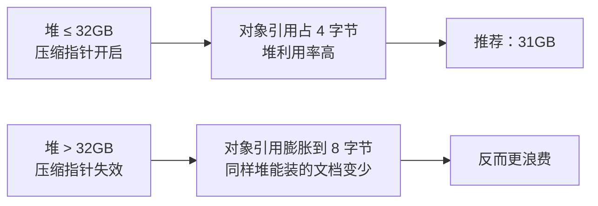
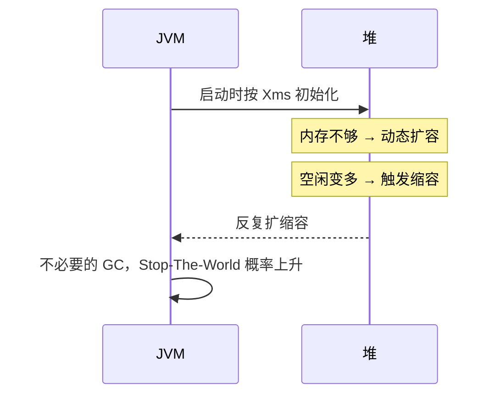
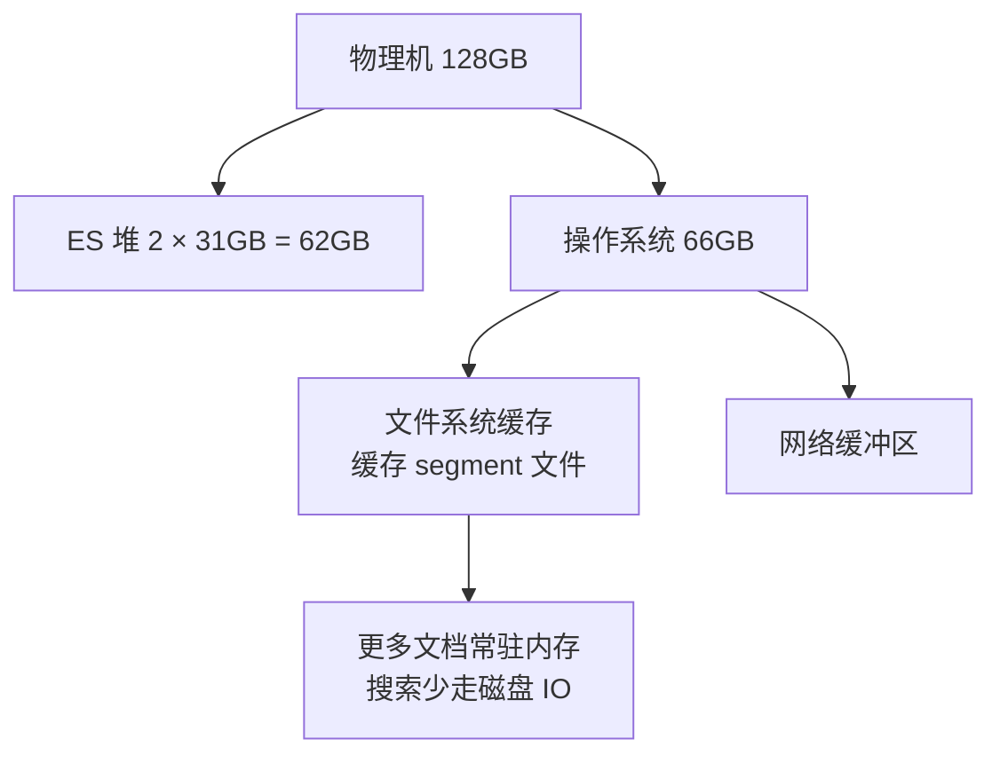
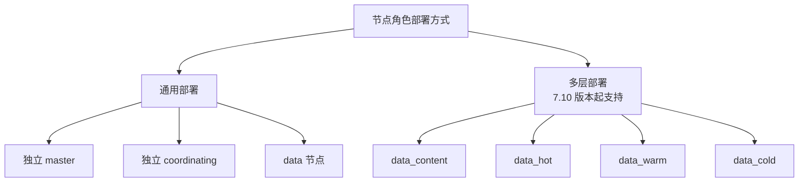
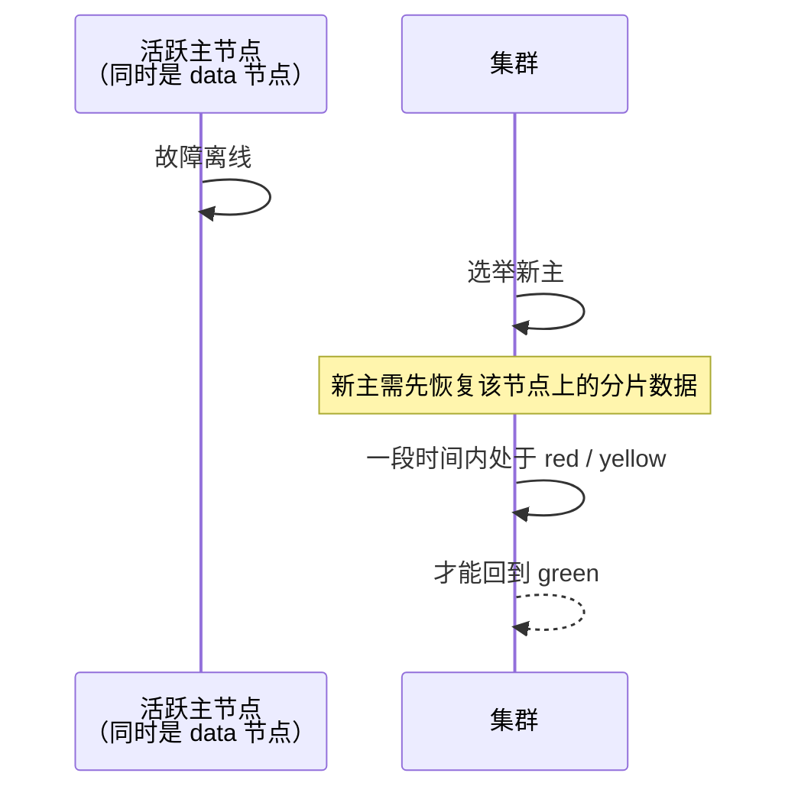
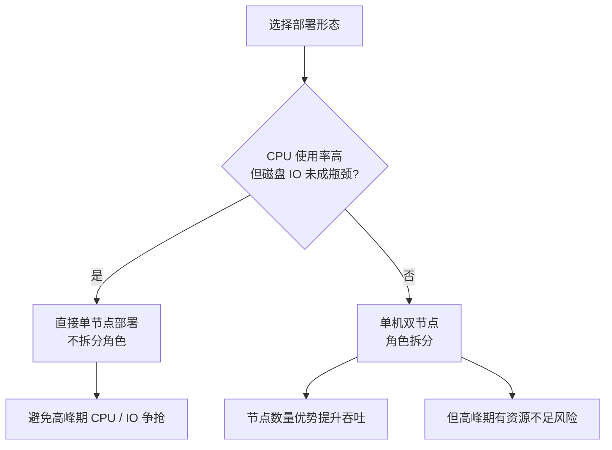
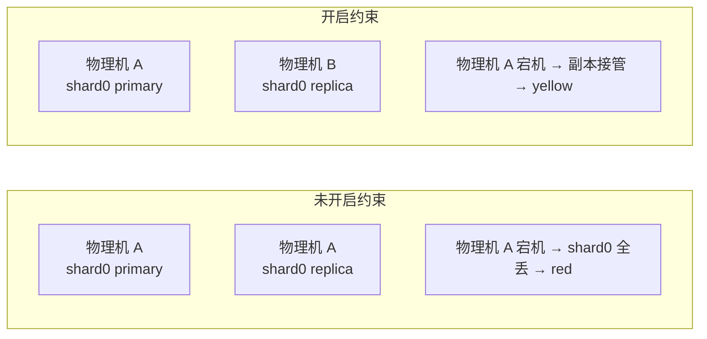
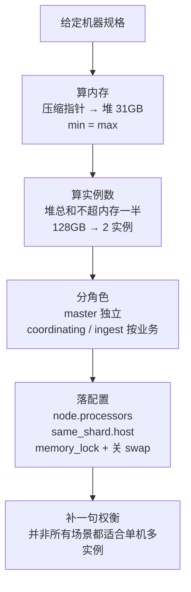

# Go 项目开发: 十台机器的 ES 集群节点规划与吞吐最大化

"给你十台三十二核一百二十八 G 内存的机器，如何规划集群节点，能让集群吞吐能力最大化？"

这是 ES 面试里**考察部署细节**的经典题。很多人上来就说"分片多设几个"，方向就偏了 —— 这道题的得分点其实集中在三处：**JVM 压缩指针与堆内存配置、节点角色的分配、集群层面的配置优化**。

先把结论摆出来，后面逐条展开：

- **堆不要超过 32GB**，压着 31GB 设，否则压缩指针失效，同样的机器能装的数据反而变少。
- **128GB 的机器跑两个实例**，每个实例 31GB 堆，剩下 66GB 全留给操作系统缓存段文件。
- **主节点一定要独立**，十个节点以上的集群尤其如此。
- **单机多实例必须显式设 `node.processors`**，否则两个实例会互相抢 CPU。

## 纲要

- 先算内存：JVM 压缩指针决定了堆的上限
- 堆内存为什么必须配成 min = max
- 操作系统内存留给谁：文件系统缓存
- 一台机器到底跑几个 ES 实例
- 节点角色：通用部署与多层部署怎么选
- 主节点为什么必须独立出来
- 协调节点与预处理节点要不要拆
- 十台机器的落地方案
- 单机多实例要补的集群配置
- 主副分片不能落在同一台物理机
- 关闭 swap 并锁定堆内存
- 面试怎么答这道题
- Go 侧：把整套规划写成可执行的容量计算器

## 先算内存：JVM 压缩指针决定了堆的上限

ES 是 Java 写的，而且是个**相当吃内存**的应用，所以堆内存的配置是第一步，也是最容易配错的一步。

关键常识：**JVM 的压缩指针（compressed oops）只在 32GB 以下才会开启。**



压缩指针开启时，对象引用只用 4 字节就够，堆内存的**利用率更高**。一旦越过 32GB 这条线，引用要占 8 字节，堆看着大了，实际能承载的文档数反而下降。

所以绝大多数场景下，**堆都不会设到 32GB 以上**。而为了防止部分环境下 JVM 对边界的识别不准确，业界惯例是**设成 31GB**，留出 1GB 的余量。

## 堆内存为什么必须配成 min = max

这一点在面试里经常漏掉。

**堆内存的最小值和最大值必须保持一致。** 如果不一致，JVM 初始化时只会先申请最小大小的空间：



内存不够用的时候动态申请，剩余空间多了又触发缩容 —— **如此反复会带来大量不必要的 GC，增加 GC 停顿的概率，直接影响集群性能**。

```bash
# jvm.options
-Xms31g
-Xmx31g
```

## 操作系统内存留给谁：文件系统缓存

还有一个反直觉的点：**给 ES 的堆留得越多，搜索不一定越快。**

因为 ES 大量依赖**文件系统缓存**来缓存**段文件（segment）**以及存储网络通信数据。这部分缓存**由操作系统内核管理，ES 自己控制不了**。



**更多的操作系统内存，意味着可以缓存更多的文档数据，搜索性能也就越好。**

一个标准的 ES 节点配置是：**总内存 64GB，其中堆设 32GB** —— 一半一半，不是巧合。

## 一台机器到底跑几个 ES 实例

回到题目：128GB 的机器。按上面的原则，可以**部署两个 ES 实例**，每个实例的堆设为 **31GB**。

判定的依据就两条：

| 约束 | 取值 | 原因 |
| --- | --- | --- |
| 压缩指针 | 单实例堆 ≤ 32GB（取 31GB） | 超过则引用膨胀，利用率下降 |
| 堆预算 | 全部实例堆总和 ≤ 物理内存的一半 | 剩下一半留给 OS cache 与 Lucene 堆外 |

按这两条算，128GB 机器上：两个实例共 62GB 堆，剩 66GB 给操作系统，刚好满足。三个实例就要 93GB 堆，直接把 OS cache 挤没了 —— 不行。

## 节点角色：通用部署与多层部署怎么选

角色分配有两种部署方式：**通用部署**和**多层部署**。



**多层部署**从 7.10 版本开始支持，主要是**把 data 节点按数据的读写频率做了细分**，拆成 `data_content`、`data_hot`、`data_warm`、`data_cold` 四种角色。

这种部署模式**比较适合日志监控等时序数据场景**：把读写频率最高的新日志放到热节点上，再配合**索引生命周期管理（ILM）**把数据按年龄迁移到对应角色的节点上。

而在**垂直搜索业务**（电商、招聘这类）中，一般使用**通用部署模式**：配置独立的 master 节点、协调节点和数据节点。

## 主节点为什么必须独立出来

通用部署模式下通常分配**独立的主节点、协调节点和数据节点**。主节点负责集群管理。

为什么不能让主节点同时兼数据节点？



**如果主节点同时作为数据节点角色，当活跃的主节点发生故障离线后，会导致集群在一段时间内处于 red 或者 yellow 状态** —— 因为它身上还压着分片，恢复要等数据重建。

而**独立部署的主节点不需要这个过程**，新主当选后集群可以**迅速回到 green**。

所以结论是：**十个节点以上的集群，有必要设置单独的主节点。**

## 协调节点与预处理节点要不要拆

协调节点要不要单独设，**根据具体业务场景来定**：

- 存在**大量的聚合查询**，或者**读写请求很高**的情况下，可以设置单独的协调节点。
- **特别是大的聚合查询和深分页，对协调节点的内存消耗极大** —— 协调节点要在内存里做结果归并和排序，分页越深、桶越多，堆压力越大。

一个容易忽略的事实：**ES 默认每个节点同时具有主节点、协调节点和预处理节点的角色**。

协调节点的设置方式比较特殊 —— **直接关闭所有的节点角色**即可：

```yaml
# elasticsearch.yml —— 纯协调节点
node.roles: [ ]
# 7.x 之前的老写法
node.master: false
node.data: false
node.ingest: false
```

然后把读写请求连到这些节点上，它们就成了单独的协调节点。

至于 ingest（预处理）节点，课程里的态度很明确：**如果有 ingest 的任务，尽可能放到 ES 机器外去实现，让 ES 轻装上阵，始终为它擅长的搜索能力服务。**

## 十台机器的落地方案

回到题目本身。

**理想情况**：有条件的话，**增加三台低配机器作为独立的 master 节点**。这样十台高配机器可以全部跑数据节点 + 协调节点，**尽可能避免单机多节点的部署**。

但题目只给了十台相同配置的机器，那就只能在这十台上做文章。

如果**需要单独的协调节点和预处理节点**，可以把全部机器都部署成**单机双节点**的模式，即 **4 + 3 + 3 + 10** 的节点规划：

```dir
10 台物理机（32 核 / 128GB）
├── 每台机器 Slot A：data 节点 ×1        → 共 10 个数据节点
└── 每台机器 Slot B：按需要铺开          → 共 10 个
    ├── coordinating ×4                 大聚合 / 深分页场景
    ├── master       ×3                 奇数个，法定人数 = 2
    └── ingest       ×3                 预处理任务重时可加到 4
```

几个要点：

- **十是数据节点的个数** —— 显然**每台机器都需要有一个数据节点**，这样才能充分使用磁盘和系统资源。
- **四加三加三**是指协调节点、主节点和预处理节点的个数。根据业务场景调整：**存在大的聚合查询就设四个协调节点；预处理任务比较重就设四个预处理节点**。
- **数据节点是最消耗机器资源的**，所以大部分资源需要分配给数据节点。
- **资源占用最小的是 master 节点**；协调节点和预处理节点根据业务会有所不同。master 的堆可以给小一些（8GB 量级就够），毕竟它只维护集群状态。
- 这些不同角色的节点，**也需要根据实际角色来设置堆大小和 CPU 核数**。

但要注意：**并不是所有场景下都需要用单机多节点的部署方式。**



**节点数量的优势确实能提升集群的吞吐性能，但也有可能在高峰期带来 CPU 和 IO 资源不足的风险。** 而且单节点部署时**剩下的内存可以用来缓存段文件来提升搜索速度**，在具有一定规模的集群中也不至于浪费。

## 单机多实例要补的集群配置

用了单机多节点的部署方式，就必须在 ES 配置文件里**显式指定 `node.processors`**，防止 CPU 资源互相抢占，让每个节点**均分物理机的三十二个核**：

```yaml
# elasticsearch.yml
node.processors: 16
```

这里要设成**机器核数的一半，也就是十六**。

另外两种情况也必须显式设置：**物理机的核数超过三十二核**，或者**无法正常识别物理机核数**的时候（容器 / 虚拟化环境很常见）。

## 主副分片不能落在同一台物理机

单机多实例最大的风险是：**分片的多个副本被分到同一台物理机的不同实例上**。这样物理机一挂，主副分片同时不可用，集群直接 **red**。

ES 提供了对应的开关：

```yaml
# elasticsearch.yml
cluster.routing.allocation.same_shard.host: true
```

这个配置**避免同一个分片的多个副本（主分片与其副本）被分配到同一台物理机上**。



在规模更大的集群里，还可以进一步用 **allocation awareness** 做机架 / 可用区级别的打散：

```yaml
node.attr.rack_id: rack_1
cluster.routing.allocation.awareness.attributes: rack_id
```

## 关闭 swap 并锁定堆内存

最后一个集群层面的优化：**关闭操作系统的 swap，并把 ES 配置文件中的 `bootstrap.memory_lock` 设为 `true` 来锁住堆内存。**

```bash
# 关闭 swap
sudo swapoff -a
# 永久生效：注释掉 /etc/fstab 里的 swap 行
sudo sysctl -w vm.swappiness=1
```

```yaml
# elasticsearch.yml
bootstrap.memory_lock: true
```

原因是：一旦堆内存被换出到磁盘，**GC 的时候要把页重新换回来，停顿时间会成倍拉长**，集群性能会断崖式下跌。锁定堆内存可以从根上避免这件事。

## 面试怎么答这道题

这道题有清晰的层次，按这个顺序答不会乱：



**加分项**是把"为什么"讲出来：压缩指针为什么是 32GB、主节点不独立为什么会让集群长时间 red、协调节点为什么怕大聚合和深分页。这三条讲透，就能体现出你真做过部署，而不是背答案。

## API 速览

| 能力 | API / 配置 |
| --- | --- |
| 设置节点核数 | `node.processors: 16` |
| 锁定堆内存 | `bootstrap.memory_lock: true` |
| 关闭 swap | `swapoff -a` + `vm.swappiness=1` |
| 主副分片跨物理机 | `cluster.routing.allocation.same_shard.host: true` |
| 机架级打散 | `cluster.routing.allocation.awareness.attributes: rack_id` |
| 纯协调节点 | `node.roles: [ ]` |
| 独立主节点 | `node.roles: [ master ]` |
| 热节点 | `node.roles: [ data_hot, data_content ]` |
| 温节点 | `node.roles: [ data_warm, data_content ]` |
| 冷节点 | `node.roles: [ data_cold, data_content ]` |
| 查看节点角色 | `GET /_cat/nodes?v&h=name,node.role,heap.max,ram.percent,cpu` |
| 查看分片分布 | `GET /_cat/shards/idx?v&h=index,shard,prirep,node&s=shard` |
| 查看分配解释 | `GET /_cluster/allocation/explain` |
| 查看堆使用 | `GET /_cat/nodes?v&h=name,heap.percent,heap.current,heap.max` |
| 线程池水位 | `GET /_cat/thread_pool/write,search?v&h=node,name,active,queue,rejected` |

## Demo 示例

一个完整的 Go 程序，把上面的规划逻辑写成**可执行的容量计算器**：根据机器规格算出实例数与堆大小、按角色铺开节点、估算集群分片承载上限，并**模拟主副分片分配，对比开启 `same_shard.host` 前后单机宕机的影响**。纯标准库，可直接跑。

**运行说明**

- 需要 Go 1.18+（用到 `math/rand`，1.21 验证通过）。
- 无第三方依赖，保存为 `main.go` 后执行 `go run main.go`。
- 随机分配使用**固定种子**，输出完全可复现。

```go
package main

import (
	"fmt"
	"math/rand"
)

const (
	compressedOopsLimitGB = 32   // 压缩指针生效的堆上限
	suggestedHeapGB       = 31   // 留 1GB 余量，防止边界识别不准
	osReserveMinGB        = 8    // 网络缓冲等最小预留
	shardsPerHeapGB       = 20   // 官方经验值：每 GB 堆承载分片数不宜超过
	heapBudgetRatio       = 0.50 // 全部实例堆总和不超物理内存的一半
)

// MachineSpec 一台物理机的规格。
type MachineSpec struct {
	Cores    int
	MemoryGB int
}

// HeapPlan 单机的实例与堆规划。
type HeapPlan struct {
	Instances      int
	HeapGB         int
	CompressedOops bool
	OSCacheGB      int
	Processors     int
}

// PlanMachine 决定一台机器跑几个实例、每个实例多少堆、每实例多少核。
func PlanMachine(m MachineSpec) HeapPlan {
	instances := 1
	for {
		next := instances + 1
		heapTotal := next * suggestedHeapGB
		// 约束一：堆总和不能吃掉一半以上的物理内存
		if float64(heapTotal) > float64(m.MemoryGB)*heapBudgetRatio {
			break
		}
		// 约束二：操作系统至少要留下 osReserveMinGB
		if m.MemoryGB-heapTotal < osReserveMinGB {
			break
		}
		instances = next
	}
	return HeapPlan{
		Instances:      instances,
		HeapGB:         suggestedHeapGB,
		CompressedOops: suggestedHeapGB < compressedOopsLimitGB,
		OSCacheGB:      m.MemoryGB - instances*suggestedHeapGB,
		Processors:     m.Cores / instances,
	}
}

// ---------------------------------------------------------------- 节点角色

type Role string

const (
	RoleMaster Role = "master"
	RoleData   Role = "data"
	RoleCoord  Role = "coordinating"
	RoleIngest Role = "ingest"
)

// heapForRole 不同角色对堆的需求差异很大：
// data 吃满；master 只维护集群状态；coordinating / ingest 视聚合与管道复杂度而定。
func heapForRole(r Role, defaultHeap int) int {
	switch r {
	case RoleMaster:
		if defaultHeap > 8 {
			return 8
		}
		return defaultHeap
	case RoleIngest, RoleCoord:
		if defaultHeap > 16 {
			return 16
		}
		return defaultHeap
	default:
		return defaultHeap
	}
}

type Node struct {
	Name       string
	Role       Role
	HeapGB     int
	Processors int
	Host       int
}

// PlaceNodes 把角色铺到机器上：每台机器固定一个数据节点（充分使用磁盘与系统资源），
// 剩下的 slot 按 coordinating / master / ingest 的顺序铺开，天然做到同角色分散。
func PlaceNodes(machines int, plan HeapPlan, masters, ingests, coords int) [][]Node {
	hosts := make([][]Node, machines)
	for i := range hosts {
		hosts[i] = append(hosts[i], Node{
			Name:       fmt.Sprintf("data-%02d", i+1),
			Role:       RoleData,
			HeapGB:     heapForRole(RoleData, plan.HeapGB),
			Processors: plan.Processors,
			Host:       i,
		})
	}
	rest := make([]Role, 0, masters+ingests+coords)
	for i := 0; i < coords; i++ {
		rest = append(rest, RoleCoord)
	}
	for i := 0; i < masters; i++ {
		rest = append(rest, RoleMaster)
	}
	for i := 0; i < ingests; i++ {
		rest = append(rest, RoleIngest)
	}
	for i, r := range rest {
		h := i % machines
		hosts[h] = append(hosts[h], Node{
			Name:       fmt.Sprintf("%s-%02d", r, i+1),
			Role:       r,
			HeapGB:     heapForRole(r, plan.HeapGB),
			Processors: plan.Processors,
			Host:       h,
		})
	}
	return hosts
}

// ---------------------------------------------------------------- 分片分配模拟

// simulateFailure 先做一次分片分配，再逐一拔掉每台物理机，统计集群受影响的情况。
// enforce=true 对应 cluster.routing.allocation.same_shard.host: true。
// 返回：主副同机的风险分片数、累计 red 事件数、累计 yellow 事件数。
func simulateFailure(primaries, replicas, machines int, enforce bool, seed int64) (risky, redEvents, yellowEvents int) {
	r := rand.New(rand.NewSource(seed))
	alloc := make([][]int, primaries)
	for p := 0; p < primaries; p++ {
		copies := make([]int, 0, replicas+1)
		for c := 0; c <= replicas; c++ {
			for {
				m := r.Intn(machines)
				dup := false
				for _, got := range copies {
					if got == m {
						dup = true
						break
					}
				}
				// 未开启约束时，主副落在同一台物理机是允许的 —— 这正是风险来源
				if dup && (c == 0 || enforce) {
					continue
				}
				copies = append(copies, m)
				break
			}
		}
		alloc[p] = copies
	}
	// 风险分片：该分片的全部副本都堆在同一台物理机上
	for p := 0; p < primaries; p++ {
		same := true
		for _, m := range alloc[p] {
			if m != alloc[p][0] {
				same = false
				break
			}
		}
		if same {
			risky++
		}
	}
	for dead := 0; dead < machines; dead++ {
		for p := 0; p < primaries; p++ {
			lost := 0
			for _, m := range alloc[p] {
				if m == dead {
					lost++
				}
			}
			switch {
			case lost == len(alloc[p]):
				redEvents++ // 全部副本都在宕机机器上：数据不可用，集群 red
			case lost > 0:
				yellowEvents++ // 丢了一个副本：yellow，仍可继续服务
			}
		}
	}
	return risky, redEvents, yellowEvents
}

// ---------------------------------------------------------------- 演示

func main() {
	m := MachineSpec{Cores: 32, MemoryGB: 128}
	plan := PlanMachine(m)

	fmt.Println("=== 单机实例与堆规划 ===")
	fmt.Printf("物理机规格：%d 核 / %d GB\n", m.Cores, m.MemoryGB)
	fmt.Printf("每机实例数：%d（堆总和不超过内存的 %.0f%%）\n", plan.Instances, heapBudgetRatio*100)
	fmt.Printf("单实例堆：%d GB，压缩指针开启：%v\n", plan.HeapGB, plan.CompressedOops)
	fmt.Printf("留给 OS cache：%d GB，node.processors：%d\n", plan.OSCacheGB, plan.Processors)
	fmt.Println("堆的 min 与 max 必须一致，否则反复扩缩容会推高 GC 停顿概率")

	fmt.Println("\n=== 对比：堆配大的反效果 ===")
	for _, h := range []int{31, 32, 48, 64} {
		state := "压缩指针开启，利用率高"
		if h >= compressedOopsLimitGB {
			state = "压缩指针失效，引用膨胀到 8 字节"
		}
		fmt.Printf("  heap=%2dGB → %s\n", h, state)
	}

	fmt.Println("\n=== 节点角色铺开（数据节点每机一个）===")
	hosts := PlaceNodes(10, plan, 3, 3, 4)
	dataNodes := 0
	totalHeap := 0
	for i, nodes := range hosts {
		heapOnHost := 0
		names := ""
		for _, n := range nodes {
			heapOnHost += n.HeapGB
			if n.Role == RoleData {
				dataNodes++
			}
			names += fmt.Sprintf("[%s %dG] ", n.Name, n.HeapGB)
		}
		totalHeap += heapOnHost
		fmt.Printf("  物理机 %02d（堆 %2dG / %dG）：%s\n", i+1, heapOnHost, m.MemoryGB, names)
	}
	fmt.Printf("数据节点 %d 个，协调 4 + 主节点 3 + 预处理 3 = 10，共 %d 个节点\n", dataNodes, dataNodes+10)
	fmt.Printf("主节点 3 个（奇数），法定人数 = 2，可容忍 1 台 master 离线\n")

	fmt.Println("\n=== 分片承载上限估算 ===")
	capacity := dataNodes * plan.HeapGB * shardsPerHeapGB
	fmt.Printf("每 GB 堆建议承载 ≤ %d 个分片 → 集群上限约 %d 个分片\n", shardsPerHeapGB, capacity)
	fmt.Printf("示例：主分片 10 + 副本 1 的索引，可放约 %d 个\n", capacity/20)

	fmt.Println("\n=== 主副分片跨物理机：宕机影响对比 ===")
	const primaries = 60
	const replicas = 1
	fmt.Printf("%-24s %-16s %-12s %s\n", "配置", "主副同机分片", "red 事件", "yellow 事件")
	for _, enforce := range []bool{false, true} {
		risky, red, yellow := simulateFailure(primaries, replicas, 10, enforce, 42)
		tag := "same_shard.host=false"
		if enforce {
			tag = "same_shard.host=true"
		}
		fmt.Printf("%-24s %-16d %-12d %d\n", tag, risky, red, yellow)
	}
	fmt.Printf("%d 个主分片 ×（1 主 + %d 副本），逐一拔掉 10 台物理机各一次\n", primaries, replicas)
	fmt.Println("开启约束后主副同机分片归零 → 任何单机宕机都不会让集群转 red")

	fmt.Println("\n=== 部署形态的权衡 ===")
	fmt.Println("CPU 使用率高但磁盘 IO 未成瓶颈 → 直接单节点部署，剩余内存全给 OS cache 缓存段文件")
	fmt.Println("CPU 与 IO 都富余 → 单机双节点，用节点数量换吞吐，但高峰期要盯紧资源争抢")
}
```

**代码说明**

- `PlanMachine` 把规划规则固化成两个硬约束：**堆总和不超物理内存的一半**、**操作系统至少留 8GB**。这就是为什么 128GB 机器算出来是 2 个实例而不是 3 个 —— 3 个实例要 93GB 堆，OS cache 直接被挤没。
- `heapForRole` 体现"**不同角色按实际需要设堆**"：data 吃满 31GB，master 只给 8GB，coordinating / ingest 给 16GB。这是课程里"资源占用最小的是 master 节点"的代码化表达。
- `PlaceNodes` 先给每台机器塞一个 data 节点（对应"**每台机器都需要有一个数据节点，充分使用磁盘和系统资源**"），剩下的 slot 用 `i % machines` 铺开，天然让 3 个 master 落在不同机器上。
- `simulateFailure` 里那句 `if dup && (c == 0 || enforce)` 是关键：**未开启约束时允许主副本同机**（这正是风险来源），开启后必须换机器。用固定种子保证两种配置跑在完全相同的随机序列上，对比才公平。
- `red` 统计的是**该分片的全部副本都在宕机机器上**的情况 —— 这才会让集群转 red；只丢一个副本是 yellow，还能继续服务。

**技术点总结**

- **压缩指针只在 32GB 以下开启**，惯例设 **31GB** 留余量；堆配得更大反而降低利用率。
- **堆的 min 必须等于 max**，否则动态扩缩容推高 GC 停顿概率。
- **堆总和不要超过物理内存的一半**，剩下的给 OS cache 缓存段文件 —— 这对搜索性能的贡献常常比堆本身更大。
- **128GB / 32 核的机器跑两个实例**，每实例 31GB 堆，`node.processors: 16`。
- **多层部署（data_hot / warm / cold / content）适合日志监控等时序场景**；**垂直搜索用通用部署**。
- **主节点必须独立**，否则主节点离线会让集群长时间处于 red / yellow；十个节点以上的集群尤其必要。
- **协调节点怕大聚合和深分页**，内存消耗极大；**ingest 尽量挪到 ES 外**，让 ES 专注搜索。
- 十台同配机器的落地方案是 **4 协调 + 3 master + 3 ingest + 10 data = 20 节点**的单机双实例规划。
- **单机多实例必须设 `node.processors`**、**开 `same_shard.host`**、**关 swap + `bootstrap.memory_lock: true`**。
- 部署形态没有银弹：**CPU 高但 IO 不紧张时，单节点部署反而更划算**。

## 总结

这道题的本质不是"分多少个片"，而是**在固定的硬件预算下，把内存、CPU、角色三者分配对**。

一句话串起来：**堆压在 31GB 保住压缩指针并把 min 设成 max，剩下的一半内存留给操作系统缓存段文件；master 独立出来保证集群能迅速回到 green，coordinating 和 ingest 按业务压力决定拆不拆；最后补上 `node.processors`、`same_shard.host` 和关 swap 三件套。**

答到这一层，再补一句"CPU 高而 IO 不紧张时其实更适合单节点部署"的权衡，基本就是满分答案了。

