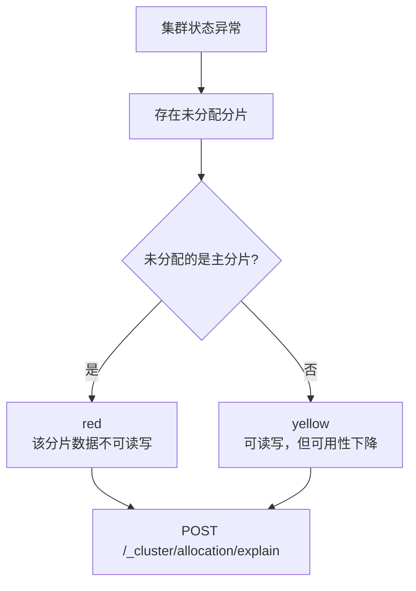
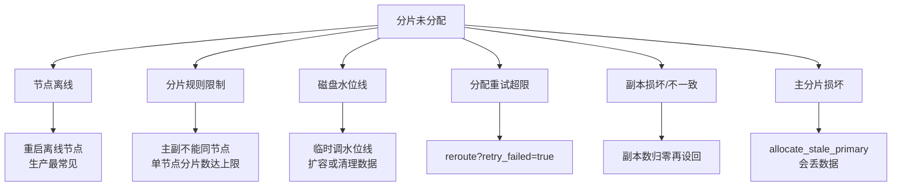
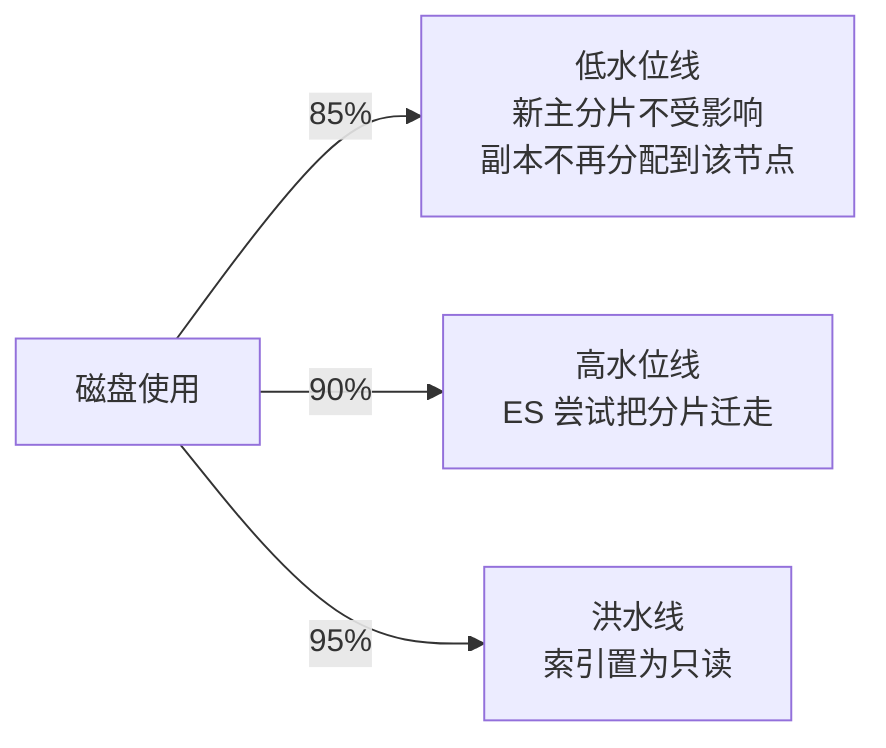
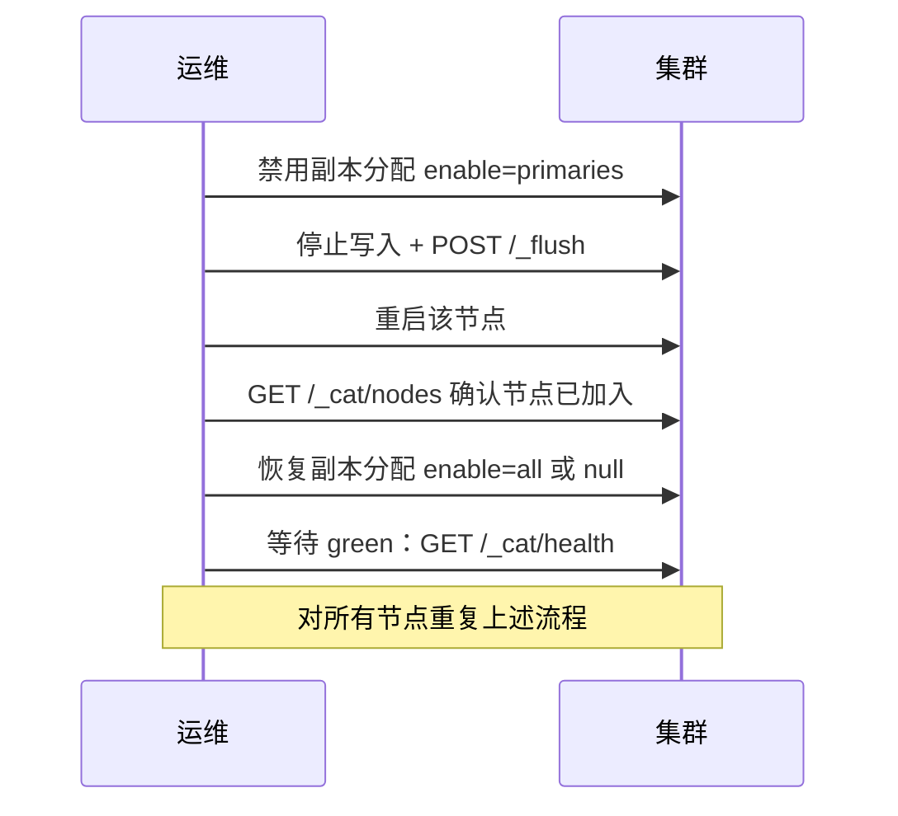
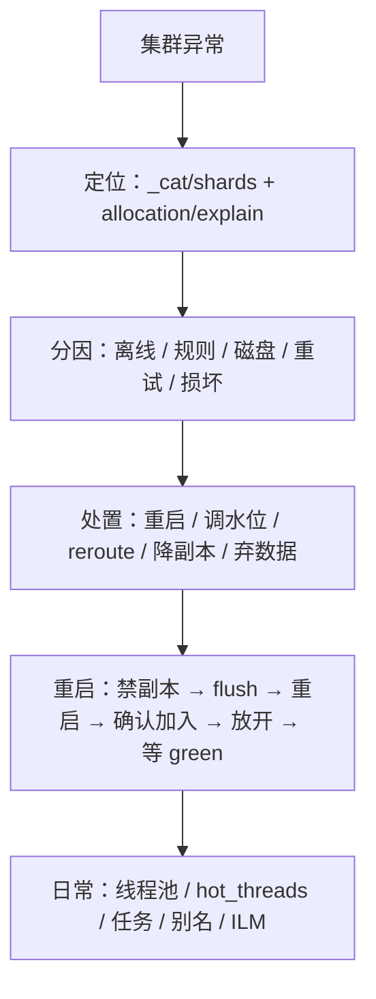

# Go 项目开发: ES 集群运维常用 API 与故障处置手册

"平时常用的集群运维相关的 API 有哪些？具体是如何使用的？"

ES 运维在面试里出现频率很高，而且它有明确的筛选意图：**集群出故障时，能不能第一时间定位并解决问题，是每个 ES 开发工程师应该具备的基本技能。**

这一篇把日常运维里真正用得上的 API 按**故障场景**串起来 —— 不是罗列命令，而是"**看到什么现象 → 敲哪条命令 → 为什么 → 下一步做什么**"。

## 纲要

- 集群状态异常，根因只有一个
- 定位未分配分片：`allocation explain`
- 分片分不下去的常见原因
- 磁盘的三条水位线
- 索引被置为只读之后怎么救
- 主分片损坏与副本损坏的取舍
- 手动迁移分片
- 集群滚动重启的标准流程
- 排查 CPU：线程池、热点线程、pending 任务
- 节点下线
- 段合并清理已删除文档与任务管理
- 关闭 ES 自带监控
- 可用性配置：分片打散与延迟恢复
- 别名、滚动查询上下界、reindex
- 只读开关的攻与守
- 冷热分层与每节点分片数限制
- 绑定 ILM 策略与调整压缩算法
- 恢复并发与恢复进度
- 集群安全：禁止通配符删除
- 面试怎么答
- Go 侧：把运维判断写成可执行的诊断器

## 集群状态异常，根因只有一个

先建立一个最关键的认知：

**不管集群状态是 red 还是 yellow，根本原因只有一个 —— 集群存在未分配的分片。**

区别只在于未分配的是谁：

| 集群状态 | 未分配的分片 |
| --- | --- |
| **red** | 一定出现了**主分片未分配**（也可能同时主副本都没分配） |
| **yellow** | 只有**副本未分配**，主分片都在 |



## 定位未分配分片：allocation explain

第一步永远是把未分配的分片捞出来：

```http
GET /_cat/shards?h=index,shard,prirep,state,unassigned.reason,node&s=state
```

这个接口会返回**集群中全部未分配的分片**。可以通过参数指定具体索引或分片来收窄范围。比如已经知道是 `order` 索引的零号分片、并且不是副本：

```http
GET /_cluster/allocation/explain
{
  "index": "order",
  "shard": 0,
  "primary": true
}
```

这样查出来的结果就**只有 order 索引的零号分片**，可以更准确地看到它为什么没有分配。

`allocation/explain` 的返回里有两个字段值得盯住：

| 字段 | 含义 |
| --- | --- |
| `assigned` | 是否为 `false`（未分配） |
| `decide.explanation` | **分片没有分配的具体原因** |
| `node` / `index` / `shard` | 哪台节点、哪个索引、哪个分片 |

**结合索引、分片以及节点名称这些字段，就能知道哪些分片在哪些节点上没有分配，以及它没有分配的具体原因。**

想要更直接的过滤，用 `_cat` 家族：

```http
# 过滤出状态为 red 的索引
GET /_cat/indices?health=red

# 分片级别过滤未分配的分片，并只显示原因字段
GET /_cat/shards?h=index,shard,prirep,state,unassigned.reason,unassigned.details&s=state
```

## 分片分不下去的常见原因

拿到原因之后，对照这张表处置：



### 节点离线

**这是生产环境中出现最多的一种场景** —— 处理方式是**重启离线的节点**。

### 分片规则限制与单节点分片上限

分片规则本身就会阻止某些分配：**主分片和它的副本不能分配到同一个节点**，**同一个主分片的多个副本也不能分配到同一个节点上**。

另外，**7.x 版本以后，单节点的总分片数限制是 1000**。可以通过下面的 API 修改：

```http
PUT /_cluster/settings
{
  "persistent": {
    "cluster.max_shards_per_node": 2000
  }
}
```

把单节点的分片数上限临时提到两千，可以解决"因为分片数达限而分配不上"的问题 —— 但这只是**临时止血**，真正的解法是控制分片规模。

### 磁盘水位线：低、高、洪水

磁盘剩余空间触及水位线，分片同样分配不下去。ES 有三条：



| 水位线 | 默认值 | 行为 |
| --- | --- | --- |
| 低水位线 `low` | 85% | 对**新创建的主分片没有影响**，但**旧分片或副本不会被分配到该节点** |
| 高水位线 `high` | 90% | ES **尝试将分片重新分配到低于该水位线的节点** |
| 洪水线 `flood_stage` | 95% | **索引被置为只读**，无法写入数据 |

超过洪水线**风险很高，会导致数据丢失**。

配置时有两条硬规则：

- **水位线支持使用具体空间（`100gb`）或磁盘百分比（`90%`），但不能混用。**
- 把 `cluster.routing.allocation.disk.threshold_enabled` 设为 `false` 可以**让这几条水位线整体失效**。

```http
# 百分比写法（三档统一）
PUT /_cluster/settings
{
  "persistent": {
    "cluster.routing.allocation.disk.watermark.low": "85%",
    "cluster.routing.allocation.disk.watermark.high": "90%",
    "cluster.routing.allocation.disk.watermark.flood_stage": "95%"
  }
}

# 具体空间写法（三档统一，不能和百分比混着写）
PUT /_cluster/settings
{
  "persistent": {
    "cluster.routing.allocation.disk.watermark.low": "100gb",
    "cluster.routing.allocation.disk.watermark.high": "50gb",
    "cluster.routing.allocation.disk.watermark.flood_stage": "20gb"
  }
}
```

## 索引被置为只读之后怎么救

磁盘超过洪水线后，**索引会被设置成只读状态**。风险在于：**即使磁盘腾出来了，索引也不会自动解除只读**，必须手动解。

先查哪些索引中招：

```http
GET /_cluster/state?filter_path=metadata.indices.*.settings.index.blocks.read_only_allow_delete
```

再解除，两种方式：

```http
# 方式一：索引级
PUT /order/_settings
{
  "index.blocks.read_only_allow_delete": null
}

# 方式二：集群级
PUT /_cluster/settings
{
  "persistent": {
    "cluster.blocks.read_only": false
  }
}
```

## 副本数据不一致或损坏

排除分片规则的限制（包括机架感知特性）之后，副本还是分配不上，**可能是早期版本的一些 bug 导致副本同步后文档数依然跟主分片不一致，或者是副本分片意外损坏**。

这时可以**把索引的副本分片数设为零，再重新设回**：

```http
# 先摘掉副本
PUT /order/_settings
{
  "index.number_of_replicas": 0
}

# 确认正常后设回
PUT /order/_settings
{
  "index.number_of_replicas": 1
}
```

**在没有副本的情况下，如果磁盘出现故障，会导致索引损坏而无法修复。** 这时只能先放弃损坏的那部分数据，让集群先恢复 —— **大部分分片的数据还是可用的，先让集群正常提供服务，再从上游业务数据库重建索引数据**。

```http
POST /_cluster/reroute
{
  "commands": [
    {
      "allocate_empty_primary": {
        "index": "order",
        "shard": 0,
        "node": "node-1",
        "accept_data_loss": true
      }
    }
  ]
}
```

这里必须把 **`accept_data_loss` 设为 `true`**，即**允许在 reroute 时丢失数据**。

这种做法**相当于从集群的元数据中将原分片的信息剔除**，是真正的下下策：

> **必须确定是磁盘损坏，而且无法在短时间内恢复，才出此下策。如果节点只是短时间离线，这样操作会直接导致离线节点的数据丢失，就算节点启动也不会再进行分片恢复。**

## 主分片损坏

主分片损坏、并且**没有可选为主分片的副本集**时，可以**手动把旧的副本分片提升为主分片**。同样会丢失部分数据，需要谨慎：

```http
POST /_cluster/reroute
{
  "commands": [
    {
      "allocate_stale_primary": {
        "index": "order",
        "shard": 0,
        "node": "node-1",
        "accept_data_loss": true
      }
    }
  ]
}
```

## 手动迁移分片

`reroute` 还有一个日常用途 —— **手动迁移分片**。把 `test_index` 的零号分片从 `node-1` 迁到 `node-2`：

```http
POST /_cluster/reroute
{
  "commands": [
    {
      "move": {
        "index": "test_index",
        "shard": 0,
        "from_node": "node-1",
        "to_node": "node-2"
      }
    }
  ]
}
```

## 集群滚动重启的标准流程

集群重启是另一个 API 密集的场景，流程必须严格按顺序走。



**禁用副本分片的分配。** 当**数据节点离线超过一分钟，ES 默认会从其他节点上恢复丢失的副本，这会带来大量的 IO 和网络消耗**。所以重启前先设：

```http
PUT /_cluster/settings
{
  "persistent": {
    "cluster.routing.allocation.enable": "primaries"
  }
}
```

设为 `primaries` 表示**只允许主分片进行迁移操作**，这样 ES 就不会主动去恢复丢失的副本。

**停止写入并执行 flush。** 如果允许，先停止索引写入操作，然后执行 flush —— **flush 操作可以极大地增加分片恢复的速度**（因为 translog 被清空，恢复时不用重放）。

```http
POST /_flush
```

**重启后确认节点已加入集群。** 执行下面的 API 确认当前节点个数，**直到确认重启的节点已经加入集群之后，才执行第四步**：

```http
GET /_cat/nodes
```

**恢复副本分片的分配。**

```http
PUT /_cluster/settings
{
  "persistent": {
    "cluster.routing.allocation.enable": null
  }
}
```

> 这里**可以设置为 `all` 或 `null`，但绝对不能设置为 `none`** —— `none` 表示**不允许任何分片进行分配**。这两个值一定要区分清楚，配错了集群就再也分不下去分片了。

**等待分片恢复完成，直到集群回到 green：**

```http
GET /_cat/health
```

然后**对所有节点重复这一到五步**，直到全部重启完成。

## 排查 CPU：线程池、热点线程、pending 任务

排查性能问题，线程池是第一个要看的：

```http
# 看线程池大小、活跃数、队列长度、被拒绝的数量
GET /_cat/thread_pool?v&h=node,name,active,queue,rejected,size

# 只看写线程池
GET /_cat/thread_pool/write?v&h=node,name,active,queue,rejected

# 热点线程：哪个线程在烧 CPU
GET /_nodes/hot_threads

# 集群级待处理任务
GET /_cluster/pending_tasks
```

**很多情况下 CPU 出现问题，都可以通过 `hot_threads` 和 `pending_tasks` 这两个接口看出具体是什么任务、什么线程占用 CPU 较大。**

## 节点下线

下线节点用分配排除规则，可以按 IP 或节点名过滤：

```http
PUT /_cluster/settings
{
  "transient": {
    "cluster.routing.allocation.exclude._ip": "192.168.1.*"
  }
}
```

支持通配符，一次性把这一批节点全部下线 —— **这些节点上的数据会被重平衡到集群的其他节点上**。

## 段合并清理已删除文档与任务管理

删除文档后磁盘不会立刻回收，这时用只清理删除文档的合并：

```http
POST /order/_forcemerge?only_expunge_deletes=true
```

相比把索引合并到指定段数，**这种操作比较安全，压力也小得多** —— 不需要把段合并到指定大小，只需要回收已删除的那部分数据，**占用的磁盘空间会比较小**。

长任务要能看进度、能取消：

```http
# 查看 forcemerge 进度
GET /_tasks?actions=*forcemerge&detailed

# 同理可查 reindex / update_by_query / merge
GET /_tasks?actions=*reindex&detailed

# 取消任务：ID 形如 nodeId:taskId
POST /_tasks/nodeId:taskId/_cancel
```

任务 ID 的构成：**前面一部分是节点 ID，后面一部分是 task ID**，通过上面查询这一步拿到。

## 关闭 ES 自带监控

通常 ES 监控使用外部监控系统，**ES 自带的监控功能可以通过 API 动态关闭**：

```http
PUT /_cluster/settings
{
  "persistent": {
    "xpack.monitoring.collection.enabled": false
  }
}
```

## 可用性配置：分片打散与延迟恢复

单机多节点的部署方式下，**`cluster.routing.allocation.same_shard.host` 要设为 `true`** —— 注意**这个配置是通过配置文件设置的，不是通过 API**。

另一种方式是设置 **`rack_id`**：

```yaml
# elasticsearch.yml —— 同一台物理机上的两个实例配成同一个值
node.attr.rack_id: rack_1
```

```http
PUT /_cluster/settings
{
  "persistent": {
    "cluster.routing.allocation.awareness.attributes": "rack_id"
  }
}
```

这样**ES 就知道这两个节点在同一台物理机上，不会把同一个分片的多个副本同时分配到这一台物理机上**，从而**避免物理机出问题时主副本同时不可用、集群变成 red**。

还有一条跟重启强相关的：**节点离线一分钟之后 ES 就会主动恢复副本，这个默认时间太短了。** 因为**复制副本时会消耗大量磁盘 IO 和网络 IO**，一般**把这个时间设置到五分钟以上**，留出足够的时间让集群自愈或人工干预：

```http
PUT /_all/_settings
{
  "index.unassigned.node_left.delayed_timeout": "5m"
}
```

## 别名、滚动查询上下界、reindex

```http
# 添加别名
POST /_aliases
{
  "actions": [ { "add": { "index": "order_2026", "alias": "order" } } ]
}

# 移除别名
POST /_aliases
{
  "actions": [ { "remove": { "index": "order_2025", "alias": "order" } } ]
}

# 查看别名
GET /_alias/order
```

别名在日志集群中用得最多（按天滚动索引 + 固定别名对外提供服务）。

集群里滚动查询（scroll）很多时，需要把 scroll 上下文的上限调大：

```http
PUT /_cluster/settings
{
  "persistent": {
    "search.max_open_scroll_context": 10000
  }
}
```

reindex 有两个关键参数：

```http
POST /_reindex
{
  "conflicts": "proceed",
  "source": { "index": "order_old" },
  "dest": { "index": "order_new", "op_type": "create" }
}
```

- **`conflicts: proceed`** —— **数据冲突时让它继续执行**，而不是中断。
- **`op_type: create`** —— **目标索引中已存在的相同数据不进行拷贝，只拷贝目标索引中不存在的数据**（幂等重跑）。

## 只读开关的攻与守

除了洪水线导致的被动只读，有时还需要**主动把索引设为禁读**。

一个真实场景：节点规模比较大的日志集群，**写入量在每秒六百万条以上**，有位运营同学持续查询数据，**直接把集群 CPU 负载打得极高，导致大量写请求被拒绝**。此时集群已经到崩溃边缘，又不知道是谁在查，无法直接通知停止。

**最快的止损方式就是立即对当前正在读的索引设为禁读**，等确认安全后再把 `read_only` 设为 `false` 解除。

```http
# 设为禁读
PUT /log-2026.10.02/_settings
{
  "index.blocks.read": true
}

# 解除
PUT /log-2026.10.02/_settings
{
  "index.blocks.read": false
}
```

## 冷热分层与每节点分片数限制

7.x 以后有冷热分层特性。先在节点上打属性标记：

```yaml
# elasticsearch.yml
node.attr.data_role: data_hot
# 温节点：node.attr.data_role: data_warm
# 冷节点：node.attr.data_role: data_cold
```

再在索引设置里指定允许落在哪些角色上：

```http
PUT /order/_settings
{
  "index.routing.allocation.include.data_role": "data_hot,data_warm"
}
```

**如果 `include` 设置了多个值，会优先分配到 `data_hot` 节点；当集群中没有 `data_hot` 节点或它不可用时，才会尝试分配到 `data_warm` 节点** —— 存在先后顺序。（严格来说 `include` 的语义是"满足其一即可"，生产上更推荐用 **ILM** 显式驱动分层迁移。）

另一个常用操作是**限制索引分片在单个节点上分配的个数**：

```http
PUT /order/_settings
{
  "index.routing.allocation.total_shards_per_node": 2
}
```

**通过索引的分片总数和数据节点个数，可以计算出索引平均在每个节点上的分片数**，再据此设限，就能避免热点问题。

为什么需要它？因为 **ES 分配分片时，会优先把分片分配到磁盘空间大、总分片个数少的节点上**。这种策略**在索引规划不合理、集群规模扩大后，很容易出现同一个索引的多个分片堆在同一个节点上，甚至部分节点一个分片都没分到** —— 限制每节点分片数能很好地规避这个问题，防止节点负载不均。

## 绑定 ILM 策略与调整压缩算法

把 ILM 策略绑到索引上：

```http
PUT /order/_settings
{
  "index.lifecycle.name": "order_policy"
}
```

调整压缩算法（比如大文本索引想用更高的压缩比）：

```http
# 必须先关闭索引
POST /order/_close

PUT /order/_settings
{
  "index.codec": "best_compression"
}

# 改完再打开
POST /order/_open
```

目前 ES 支持的最大压缩比就是 **`best_compression`**。注意：**索引体积比较大时这个操作可能比较漫长，要避开业务高峰期。**

## 恢复并发与恢复进度

大量节点离线后重新上线，会有大量分片待分配，**容易达到分片恢复的并发阈值，其他分片排队等待并抛出异常**。这时调大并发恢复数：

```http
PUT /_cluster/settings
{
  "persistent": {
    "cluster.routing.allocation.node_concurrent_recoveries": 4,
    "indices.recovery.max_bytes_per_sec": "100mb"
  }
}
```

**如果是固态硬盘，可以把恢复速度设得更大一些** —— 一个是并发数，一个是每秒恢复的数据量。注意：**这两个设置是节点级别的，在单机多节点的部署模式下需要减半。**

7.15 版本以后还可以直接看索引的磁盘占用：

```http
POST /order/_disk_usage?run_expensive_tasks=true
```

查看分片恢复进度：

```http
GET /_cat/recovery/order?v&h=index,shard,time,type,stage,files_percent,bytes_percent
```

## 集群安全：禁止通配符删除

**线上集群一般禁止使用通配符删除**（比如 `DELETE /*` 一把梭）。**默认 ES 是允许这种操作的**，必须显式关掉：

```http
PUT /_cluster/settings
{
  "persistent": {
    "action.destructive_requires_name": true
  }
}
```

## 面试怎么答

这题内容多，但**答的时候要按场景组织，不要按 API 名字罗列**。推荐这条主线：



**加分项**是把"坑"讲出来：`enable` 不能设 `none`、水位线不能百分比和具体值混用、洪水线解除只读要手动、`accept_data_loss` 只在磁盘真损坏时用、单机多节点下恢复并发要减半。这几条一出口，面试官就知道你真干过运维。

## API 速览

| 场景 | API |
| --- | --- |
| 未分配分片 | `GET /_cat/shards?h=index,shard,prirep,state,unassigned.reason` |
| 未分配原因 | `GET /_cluster/allocation/explain` |
| 单节点分片上限 | `cluster.max_shards_per_node: 2000` |
| 磁盘水位线 | `cluster.routing.allocation.disk.watermark.low/high/flood_stage` |
| 关闭水位线 | `cluster.routing.allocation.disk.threshold_enabled: false` |
| 解除只读 | `PUT /idx/_settings { "index.blocks.read_only_allow_delete": null }` |
| 重试分配 | `POST /_cluster/reroute?retry_failed=true` |
| 放弃损坏分片 | `reroute` + `allocate_empty_primary` + `accept_data_loss: true` |
| 提升旧副本为主 | `reroute` + `allocate_stale_primary` |
| 迁移分片 | `reroute` + `move` |
| 禁副本分配 | `cluster.routing.allocation.enable: primaries` |
| 恢复分配 | `cluster.routing.allocation.enable: all` 或 `null` |
| 刷盘加速恢复 | `POST /_flush` |
| 线程池 | `GET /_cat/thread_pool/write?v&h=active,queue,rejected` |
| 热点线程 | `GET /_nodes/hot_threads` |
| 待处理任务 | `GET /_cluster/pending_tasks` |
| 下线节点 | `cluster.routing.allocation.exclude._ip: 192.168.1.*` |
| 清理删除文档 | `POST /idx/_forcemerge?only_expunge_deletes=true` |
| 查看任务 | `GET /_tasks?actions=*forcemerge&detailed` |
| 取消任务 | `POST /_tasks/{nodeId}:{taskId}/_cancel` |
| 延迟恢复 | `index.unassigned.node_left.delayed_timeout: 5m` |
| 别名 | `POST /_aliases` |
| reindex | `POST /_reindex { "conflicts": "proceed", "dest": { "op_type": "create" } }` |
| 冷热分层 | `index.routing.allocation.include.data_role` |
| 每节点分片数 | `index.routing.allocation.total_shards_per_node` |
| 绑定 ILM | `index.lifecycle.name` |
| 压缩算法 | `index.codec: best_compression`（需先 close） |
| 恢复并发 | `cluster.routing.allocation.node_concurrent_recoveries` |
| 恢复限速 | `indices.recovery.max_bytes_per_sec` |
| 恢复进度 | `GET /_cat/recovery/idx?v` |
| 磁盘占用（7.15+） | `POST /idx/_disk_usage?run_expensive_tasks=true` |
| 禁止通配删 | `action.destructive_requires_name: true` |

## Demo 示例

一个完整的 Go 程序，把上面的运维判断固化成**可执行的诊断工具**：磁盘水位线判定（含混用校验）、未分配分片的处置推荐、滚动重启状态机（含 `enable` 取值校验）、线程池健康度评估。纯标准库，可直接跑。

**运行说明**

- 需要 Go 1.18+（用到 `sort`、`strings`，1.21 验证通过）。
- 无第三方依赖，保存为 `main.go` 后执行 `go run main.go`。
- 全部输入是内置样例，不需要连真实集群。

```go
package main

import (
	"fmt"
	"sort"
	"strings"
)

// ---------------------------------------------------------------- 磁盘水位线

// Watermark 一条磁盘水位线。ES 允许用百分比或具体空间，但同一组不能混用。
type Watermark struct {
	Name      string
	IsPercent bool
	Percent   float64
	FreeGB    float64 // 具体空间写法指的是"剩余空间"
}

// WatermarkSet 低 / 高 / 洪水三档。
type WatermarkSet struct {
	Low, High, Flood Watermark
}

// Defaults ES 出厂默认：85% / 90% / 95%。
func Defaults() WatermarkSet {
	return WatermarkSet{
		Low:   Watermark{Name: "low", IsPercent: true, Percent: 85},
		High:  Watermark{Name: "high", IsPercent: true, Percent: 90},
		Flood: Watermark{Name: "flood_stage", IsPercent: true, Percent: 95},
	}
}

// Validate 校验三档水位线是否混用了百分比与具体空间 —— ES 明确禁止混用。
func (w WatermarkSet) Validate() error {
	all := []Watermark{w.Low, w.High, w.Flood}
	pct, abs := 0, 0
	for _, x := range all {
		if x.IsPercent {
			pct++
		} else {
			abs++
		}
	}
	if pct > 0 && abs > 0 {
		return fmt.Errorf("水位线混用了百分比(%d 档)与具体空间(%d 档)，ES 不允许", pct, abs)
	}
	if w.Low.Percent > w.High.Percent && pct == 3 {
		return fmt.Errorf("低水位线高于高水位线，配置非法")
	}
	return nil
}

// hit 判断某档水位线是否被触及。
func (w Watermark) hit(usedPercent, freeGB float64) bool {
	if w.IsPercent {
		return usedPercent >= w.Percent
	}
	return freeGB <= w.FreeGB
}

// Stage 磁盘所处的阶段。
type Stage struct {
	Name   string
	Effect string
}

// Evaluate 根据磁盘使用情况判定处于哪个阶段。
func (w WatermarkSet) Evaluate(totalGB, usedGB float64) Stage {
	usedPercent := usedGB / totalGB * 100
	freeGB := totalGB - usedGB
	switch {
	case w.Flood.hit(usedPercent, freeGB):
		return Stage{"洪水线", "索引被置为只读，无法写入；腾出空间后需手动解除只读"}
	case w.High.hit(usedPercent, freeGB):
		return Stage{"高水位线", "ES 尝试把分片重新分配到低于该水位线的节点"}
	case w.Low.hit(usedPercent, freeGB):
		return Stage{"低水位线", "新主分片不受影响，但副本不再分配到该节点"}
	default:
		return Stage{"正常", "分片可正常分配"}
	}
}

// ---------------------------------------------------------------- 未分配分片诊断

// Op 一条推荐处置动作，带可直接执行的命令。
type Op struct {
	Action  string
	Command string
}

// Explain 对应 _cluster/allocation/explain 的关键字段。
type Explain struct {
	Index   string
	Shard   int
	Primary bool
	Reason  string // decide.explanation 里的关键原因
}

// playbook 原因关键字 → 处置动作。顺序即优先级。
var playbook = []struct {
	keys    []string
	actions []Op
}{
	{
		[]string{"node_left", "node left", "offline"},
		[]Op{
			{"重启离线节点（生产最常见）", "ssh <node> && sudo systemctl restart elasticsearch"},
			{"确认节点已重新加入集群", "GET /_cat/nodes"},
		},
	},
	{
		[]string{"same_shard", "shard rule", "cannot allocate"},
		[]Op{
			{"主副不能同节点：扩容节点或调整分片数", "GET /_cat/nodes?v"},
			{"若因单节点分片数达上限，临时提额", "PUT /_cluster/settings {\"persistent\":{\"cluster.max_shards_per_node\":2000}}"},
		},
	},
	{
		[]string{"disk", "watermark", "flood"},
		[]Op{
			{"临时抬高磁盘水位线", "PUT /_cluster/settings {\"persistent\":{\"cluster.routing.allocation.disk.watermark.high\":\"95%\"}}"},
			{"扩容磁盘或清理历史索引", "DELETE /log-2026.01*"},
			{"若已触发洪水线，手动解除只读", "PUT /idx/_settings {\"index.blocks.read_only_allow_delete\":null}"},
		},
	},
	{
		[]string{"retry", "failed allocation", "too many attempts"},
		[]Op{
			{"手动重试分配", "POST /_cluster/reroute?retry_failed=true"},
		},
	},
	{
		[]string{"corrupt", "broken", "inconsistent", "stale"},
		[]Op{
			{"副本数归零再设回（重建副本）", "PUT /idx/_settings {\"index.number_of_replicas\":0}"},
			{"副本恢复后设回原值", "PUT /idx/_settings {\"index.number_of_replicas\":1}"},
		},
	},
}

// Diagnose 根据 explain 结果给出处置建议。
func Diagnose(e Explain) []Op {
	lower := strings.ToLower(e.Reason)
	for _, p := range playbook {
		for _, k := range p.keys {
			if strings.Contains(lower, k) {
				return p.actions
			}
		}
	}
	return []Op{{"原因未命中已知剧本，人工介入", "GET /_cluster/allocation/explain"}}
}

// LossyOps 会产生数据丢失的兜底操作 —— 只在磁盘确认损坏且短期无法恢复时使用。
func LossyOps(e Explain) []Op {
	kind := "allocate_empty_primary"
	if e.Primary {
		kind = "allocate_stale_primary"
	}
	return []Op{
		{"兜底：剔除原分片元数据（会丢数据）",
			fmt.Sprintf("POST /_cluster/reroute {\"commands\":[{\"%s\":{\"index\":\"%s\",\"shard\":%d,\"node\":\"node-1\",\"accept_data_loss\":true}}]}",
				kind, e.Index, e.Shard)},
		{"集群恢复后从上游数据库重建索引", "POST /_reindex {\"conflicts\":\"proceed\",\"dest\":{\"op_type\":\"create\"}}"},
	}
}

// ---------------------------------------------------------------- 滚动重启

// enable 取值语义。注意 none 与 null 完全不同。
func validateEnable(v string) (string, error) {
	switch v {
	case "all", "null":
		return "恢复全部分片分配（null = 清除设置回到默认）", nil
	case "primaries":
		return "只允许主分片迁移，不主动恢复丢失的副本 —— 重启前设这个", nil
	case "new_primaries":
		return "只允许新索引的主分片分配", nil
	case "none":
		return "", fmt.Errorf("none 表示不允许任何分片分配，滚动重启流程中禁止使用该值")
	default:
		return "", fmt.Errorf("未知取值 %q", v)
	}
}

// RestartStep 滚动重启的一步。
type RestartStep struct {
	Name, Command, Note string
}

// RestartPlan 单节点的滚动重启标准流程。
func RestartPlan(node string) []RestartStep {
	return []RestartStep{
		{"禁用副本分配", "PUT /_cluster/settings {\"persistent\":{\"cluster.routing.allocation.enable\":\"primaries\"}}",
			"否则节点离线 1 分钟后 ES 会自动恢复副本，带来大量 IO 与网络消耗"},
		{"停止写入并 flush", "POST /_flush", "清空 translog，可极大加快分片恢复速度"},
		{"重启节点", fmt.Sprintf("ssh %s && sudo systemctl restart elasticsearch", node), "一次只重启一个节点"},
		{"确认节点已加入", "GET /_cat/nodes", "节点数没回来到齐之前，不要进行下一步"},
		{"恢复副本分配", "PUT /_cluster/settings {\"persistent\":{\"cluster.routing.allocation.enable\":null}}",
			"用 all 或 null，绝不能是 none"},
		{"等待回到 green", "GET /_cat/health", "green 之后再重启下一个节点"},
	}
}

// ---------------------------------------------------------------- 线程池健康度

// ThreadPool 对应 _cat/thread_pool 的一行。
type ThreadPool struct {
	Node, Name          string
	Size, Active, Queue int
	Rejected            int64
}

// Health 线程池风险评估。
type Health struct {
	Level string
	Hint  string
}

func (t ThreadPool) Health() Health {
	switch {
	case t.Rejected > 0:
		return Health{"危险", fmt.Sprintf("已有 %d 次请求被拒绝；写请求被拒会直接丢数据，业务层必须识别 429 并重试", t.Rejected)}
	case t.Size > 0 && t.Queue > t.Size*2:
		return Health{"告警", fmt.Sprintf("队列 %d 已远超线程池大小 %d，节点即将拒绝请求", t.Queue, t.Size)}
	case t.Size > 0 && t.Active*10 >= t.Size*9:
		return Health{"注意", fmt.Sprintf("活跃线程 %d/%d，接近打满，建议扩容或限流", t.Active, t.Size)}
	default:
		return Health{"正常", "水位健康"}
	}
}

// ---------------------------------------------------------------- 演示

func main() {
	fmt.Println("=== 磁盘水位线判定 ===")
	wm := Defaults()
	if err := wm.Validate(); err != nil {
		fmt.Println("配置非法：", err)
	} else {
		fmt.Println("默认配置 85% / 90% / 95% 校验通过")
	}
	for _, c := range []struct{ total, used float64 }{{1000, 500}, {1000, 870}, {1000, 920}, {1000, 970}} {
		st := wm.Evaluate(c.total, c.used)
		fmt.Printf("  磁盘 %4.0f/%4.0f GB（%3.0f%%）→ %s：%s\n",
			c.used, c.total, c.used/c.total*100, st.Name, st.Effect)
	}

	fmt.Println("\n=== 水位线混用校验（ES 明确禁止）===")
	mixed := WatermarkSet{
		Low:   Watermark{IsPercent: true, Percent: 85},
		High:  Watermark{IsPercent: false, FreeGB: 100},
		Flood: Watermark{IsPercent: true, Percent: 95},
	}
	if err := mixed.Validate(); err != nil {
		fmt.Println("  low=85% + high=100gb →", err)
	}

	fmt.Println("\n=== 未分配分片诊断 ===")
	cases := []Explain{
		{"order", 0, true, "the node containing this shard copy recently left the cluster (node_left)"},
		{"order", 3, false, "cannot allocate because allocation is not permitted to any node (same_shard)"},
		{"log-2026.10", 1, false, "the node is above the high watermark cluster setting [disk]"},
		{"log-2026.10", 2, false, "failed allocation after 5 attempts, retry_failed"},
		{"order", 5, false, "shard has corrupt data, replica inconsistent"},
		{"order", 7, true, "some unknown condition"},
	}
	for _, c := range cases {
		kind := "副本"
		if c.Primary {
			kind = "主分片"
		}
		fmt.Printf("\n  %s[%s #%d]：%s\n", kind, c.Index, c.Shard, c.Reason)
		for _, op := range Diagnose(c) {
			fmt.Printf("    → %s\n      %s\n", op.Action, op.Command)
		}
	}

	fmt.Println("\n=== 兜底：确认磁盘损坏且短期无法恢复时 ===")
	broken := Explain{"order", 0, true, "corrupt, unrecoverable"}
	for _, op := range LossyOps(broken) {
		fmt.Printf("  → %s\n    %s\n", op.Action, op.Command)
	}
	fmt.Println("  警告：节点只是短时间离线时这样操作会直接丢数据，启动后也不会再恢复分片")

	fmt.Println("\n=== 滚动重启流程 ===")
	for i, s := range RestartPlan("es-data-01") {
		fmt.Printf("  %d. %s\n     %s\n     %s\n", i+1, s.Name, s.Command, s.Note)
	}

	fmt.Println("\n=== allocation.enable 取值校验 ===")
	for _, v := range []string{"primaries", "all", "null", "none"} {
		desc, err := validateEnable(v)
		if err != nil {
			fmt.Printf("  %-12s ✗ %v\n", v, err)
			continue
		}
		fmt.Printf("  %-12s ✓ %s\n", v, desc)
	}

	fmt.Println("\n=== 线程池健康度 ===")
	pools := []ThreadPool{
		{"es-data-01", "write", 16, 4, 3, 0},
		{"es-data-02", "write", 16, 15, 12, 0},
		{"es-data-03", "search", 32, 28, 70, 0},
		{"es-data-04", "write", 16, 16, 30, 128},
	}
	order := map[string]int{"注意": 0, "告警": 1, "危险": 2}
	sort.SliceStable(pools, func(i, j int) bool {
		hi, hj := pools[i].Health(), pools[j].Health()
		if hi.Level != hj.Level {
			return order[hi.Level] > order[hj.Level]
		}
		return pools[i].Rejected > pools[j].Rejected
	})
	for _, p := range pools {
		h := p.Health()
		fmt.Printf("  [%-4s] %-12s %-8s active=%2d/%2d queue=%3d rejected=%d\n      %s\n",
			h.Level, p.Node, p.Name, p.Active, p.Size, p.Queue, p.Rejected, h.Hint)
	}
}
```

**代码说明**

- `WatermarkSet.Validate` 把**"百分比和具体空间不能混用"**这条最容易踩的规则固化成校验；`hit` 里按 `IsPercent` 分支比较，两种写法都能正确判定。
- `Evaluate` 的 `switch` **从洪水线往低水位线判**，保证命中最高风险档 —— 这是运维判断的优先级。
- `Diagnose` 用**关键字 → 处置剧本**的映射，直接输出**可执行的命令**，而不仅仅是"原因描述"。真实场景把 `_cluster/allocation/explain` 的 `decide.explanation` 喂进来即可。
- `LossyOps` 刻意单独拆出来：**会丢数据的操作必须显式调用**，避免在日常诊断流程里被误触发。主分片用 `allocate_stale_primary`，副本用 `allocate_empty_primary`。
- `validateEnable` 把 **`none` 与 `null` 的区别**做成硬校验 —— 这是课程里反复强调、也是真实事故高发点。
- `ThreadPool.Health` 按 **rejected > 队列水位 > 活跃度** 三级判风险，并按危险度排序输出，**最该处理的排在最前面**。

**技术点总结**

- **集群 red / yellow 的根因只有一个：存在未分配的分片**；red 一定意味着主分片未分配。
- 定位用 **`_cat/shards` 捞 + `_cluster/allocation/explain` 问原因**，看 `assigned` 与 `decide.explanation`。
- 未分配的五大原因：**节点离线、分片规则限制、磁盘水位线、重试超限、副本/主分片损坏**。
- **磁盘三档水位线 85% / 90% / 95%**，**百分比与具体空间不能混用**，洪水线会让索引只读且**必须手动解除**。
- **`accept_data_loss` 只在磁盘确认损坏、短期无法修复时才能用**，节点只是离线时用它等于直接删数据。
- 滚动重启六步：**禁副本 → 停写 + flush → 重启 → 确认加入 → 放开分配 → 等 green**；**`enable` 只能是 `all` 或 `null`，绝不能是 `none`**。
- 排查 CPU 三件套：**`_cat/thread_pool`（rejected）、`_nodes/hot_threads`、`_cluster/pending_tasks`**。
- **`index.unassigned.node_left.delayed_timeout` 默认 1 分钟太短，生产设 5 分钟以上**，避免副本恢复把 IO 打满。
- 日常高频：**别名滚动、reindex 幂等（`conflicts: proceed` + `op_type: create`）、`forcemerge?only_expunge_deletes=true`、`total_shards_per_node` 防热点、`action.destructive_requires_name` 防爆删**。

## 集群运维的结构示意

```dir
es-ops-handbook/
├── 分片诊断 shard
│   ├── allocation explain
│   ├── 三条水位线
│   └── 只读解救
├── 故障处置 recover
│   ├── 主/副本损坏取舍
│   ├── 手动迁移分片
│   └── 滚动重启
├── 性能排查 perf
│   ├── 线程池 / 热点线程
│   └── pending 任务
└── 容量与策略 capacity
    ├── 冷热分层
    ├── ILM 策略
    └── 分片数限制
```

## 总结

运维 API 用一句话串起来：**先 `_cat/shards` 找未分配的分片，再用 `allocation/explain` 问原因，按"离线 / 规则 / 磁盘 / 重试 / 损坏"五类分因处置；重启走"禁副本 → flush → 重启 → 确认 → 放开 → 等 green"的六步流程；日常靠线程池、热点线程和任务管理盯住水位。**

真正能拉开差距的不是记住多少条命令，而是**知道哪几条命令会丢数据、哪几个值长得像却语义相反**。这两类坑讲清楚，这题就稳了。

