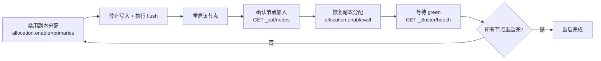

# 平时常用的集群运维相关的api有哪些？具体是如何使用的？(二)

上一篇我们梳理了集群运维里最基础的一批 API，本篇继续把「滚动重启、节点下线、段合并、任务管理、冷热分层、分片控制、索引只读解除、压缩与并发恢复」这些高频操作串起来。它们大多出现在**故障止损、版本升级、磁盘水位异常、写入把集群打挂**等真实场景里，命令与参数必须真实可用，建议结合自己集群版本实测。

## 纲要

- 滚动重启的 6 步标准流程（禁用副本分配 → flush → 重启 → 恢复分配 → 等待 green → 循环）
- 线程池、热点线程、pending tasks 三大排障接口
- 节点下线、forcemerge 回收删除文档、任务查询与取消
- 关闭内置监控采集、单机多节点同机架感知（rack_id / same_shard.host）
- 冷热分层、每节点分片数限制、ILM 绑定、别名增删查
- 磁盘只读解除、best_compression 压缩、并发恢复调优、禁止通配符删全索引

## 滚动重启的标准流程

集群滚动重启（一次只重启一个节点）是升级或换盘最常用操作，核心目标是**避免节点离线后 ES 自动从其他节点恢复丢失副本，引发大量 IO / 网络风暴**。



对应命令：

```bash
# 1. 重启前禁用副本分片迁移（仅允许主分片迁移）
PUT _cluster/settings
{ "transient": { "cluster.routing.allocation.enable": "primaries" } }

# 2. 条件允许时停止写入，并 flush 加速分片恢复
POST _flush

# 4. 节点重新加入后，恢复副本分配
PUT _cluster/settings
{ "transient": { "cluster.routing.allocation.enable": "all" } }
```

> 注意：`allocation.enable` 恢复时填 `"all"`，**不要填 `null`**。`null` 表示「不允许任何分片分配」，会把集群彻底锁死，要和默认值区分开。

## 排障与节点管理常用接口

```dir
集群运维 API/
├── 重启与分配/
│   ├── _cluster/settings        # 分片分配开关
│   └── _cluster/health          # 集群状态
├── 排障观测/
│   ├── _nodes/stats/thread_pool # 线程池拒绝数
│   ├── _nodes/hot_threads       # 热点线程
│   └── _cluster/pending_tasks  # 待执行任务
├── 节点与段/
│   ├── _cluster/settings        # exclude._ip 下线节点
│   └── index/_forcemerge        # 段合并
└── 任务与监控/
    ├── _tasks                   # 任务进度/取消
    └── monitoring.collection    # 内置监控开关
```

排查 CPU 飙高时，先看线程池拒绝数，再用热点线程和 pending tasks 定位「哪个线程、哪个任务」在吃资源：

```bash
# 线程池（含 rejected 计数）；也可 ?type=search 过滤类型
GET _nodes/stats/thread_pool

# 热点线程
GET _nodes/hot_threads

# 当前堆积的待执行任务
GET _cluster/pending_tasks
```

下线节点用通配符批量摘掉某网段机器，数据会自动 rebalance 到其余节点：

```bash
PUT _cluster/settings
{ "transient": { "cluster.routing.allocation.exclude._ip": "192.168.1.*" } }
```

## 段合并、任务管理与内置监控

删除文档后磁盘不会立即回收，低峰期可用 forcemerge 只清理已删文档（不强制合并到指定大小，更安全）：

```bash
# 仅回收删除文档
POST index_name/_forcemerge?only_expunge_deletes=true

# 查看 forcemerge 进度
GET _tasks?actions=*forcemerge*&detailed

# 取消任务（nodeId 为冒号前半段，taskId 为后半段）
POST _tasks/<nodeId>:<taskId>/_cancel
```

ES 自带监控也可通过 API 动态关闭：

```bash
PUT _cluster/settings
{ "transient": { "cluster.monitoring.collection.enabled": "false" } }
```

| 操作场景 | API / 参数 | 关键说明 |
| --- | --- | --- |
| 禁用副本分配 | `cluster.routing.allocation.enable=primaries` | 重启前防止副本恢复风暴 |
| 下线节点 | `cluster.routing.allocation.exclude._ip` | 支持通配符批量摘节点 |
| 回收删除文档 | `POST index/_forcemerge?only_expunge_deletes=true` | 比全量 merge 更安全 |
| 取消长任务 | `POST _tasks/<nodeId>:<taskId>/_cancel` | 任务 ID 含节点 ID |
| 关闭内置监控 | `cluster.monitoring.collection.enabled=false` | 替代外部监控时的兜底 |

## 单机多节点与可用性

单机部署多节点时，要让 ES 知道「这几个节点在同一台物理机」，避免主副本同时落在一台机器上。两种方式：

- **配置层**：`cluster.routing.allocation.same_shard.host: true`（写进 elasticsearch.yml，非 API）
- **机架感知**：给同物理机的节点设置相同的 `rack_id`，ES 便不会把同一分片的主副本分配到同一机架

节点离线后 ES 默认 1 分钟就开始恢复副本，时间偏短，建议调到 5 分钟以上留出自愈/人工干预窗口：

```bash
PUT _cluster/settings
{ "transient": { "cluster.routing.allocation.node_left.delayed_timeout": "5m" } }
```

## 冷热分层、分片控制与索引治理

7.x 之后支持冷热分层：用节点属性 `node.attr` 标记 `data_hot` / `data_warm`，索引 setting 里指定角色控制分配；`index.routing.allocation.require` 多值时有先后顺序，优先 `data_hot`，不可用才回退 `data_warm`。

限制每节点分片数，规避「同一索引多分片堆到同一节点」的不均匀问题：

```bash
PUT index_name/_settings
{ "index.routing.allocation.total_shards_per_node": 3 }
```

将索引绑定 ILM 策略、别名增删查、压缩算法切换：

```bash
# 绑定 ILM
PUT index_name/_settings
{ "index.lifecycle.name": "my_policy" }

# 别名：增加 / 移除 / 查看
POST _aliases
{ "actions": [ { "add": { "index": "log-1", "alias": "log-write" } } ] }

# 切换 best_compression（需先 close 索引，改完再 open，大索引耗时较长）
POST index_name/_close
PUT index_name/_settings
{ "index.codec": "best_compression" }
POST index_name/_open
```

磁盘到达红水位时索引会变为只读，先查再解：

```bash
# 查看被置为只读的索引
GET _cluster/settings?filter_path=**.blocks.read_only*

# 解除只读
PUT index_name/_settings
{ "index.blocks.read_only_allow_delete": "false" }
```

大量节点离线后分片恢复易触达并发阈值而排队，可调大并发与速率（**单机多节点部署下这两项要减半，因为是节点级配置**）：

```bash
PUT _cluster/settings
{
  "transient": {
    "cluster.routing.allocation.node_concurrent_recoveries": 4,
    "indices.recovery.max_bytes_per_sec": "200mb"
  }
}
```

查看分片恢复进度、禁止通配符删全索引：

```bash
GET index_name/_recovery

# 生产环境强制要求显式写索引名，杜绝 * 删全库
PUT _cluster/settings
{ "persistent": { "action.destructive_requires_name": "true" } }
```

## 总结

本篇把滚动重启、节点下线、段合并、任务取消、冷热分层、分片数限制、ILM、只读解除、压缩切换、并发恢复调优、通配符删除防护这些高频运维 API 串成了一张可操作的清单。**最关键的几个坑**：重启前务必把 `allocation.enable` 设为 `primaries` 而非 `null`；`node_left.delayed_timeout` 默认 1 分钟太短要拉长；单机多节点下调并发恢复与速率必须减半；`best_compression` 切换需要先 close 再 open 且大索引很慢。这些操作建议全部在测试集群验证后再上生产，尤其是 `action.destructive_requires_name` 这类安全开关应作为生产基线常驻。
