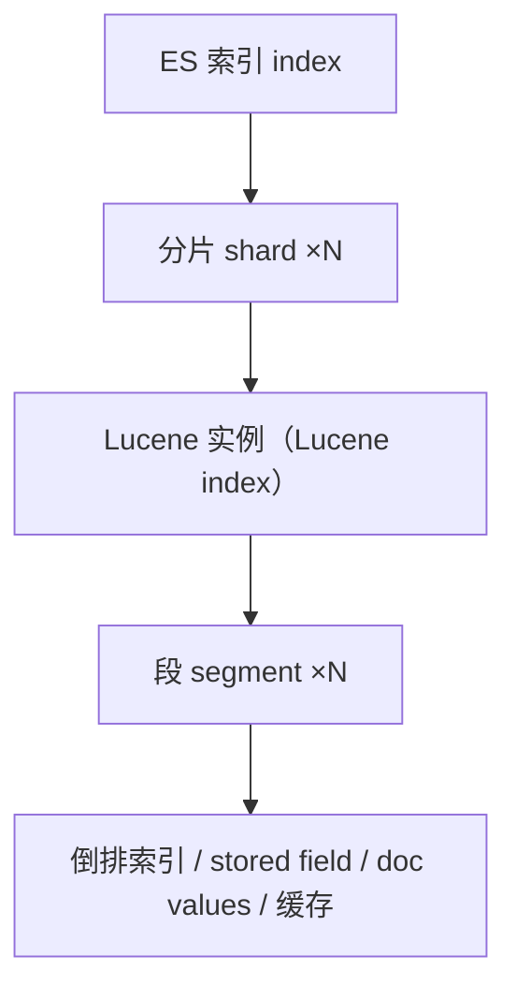
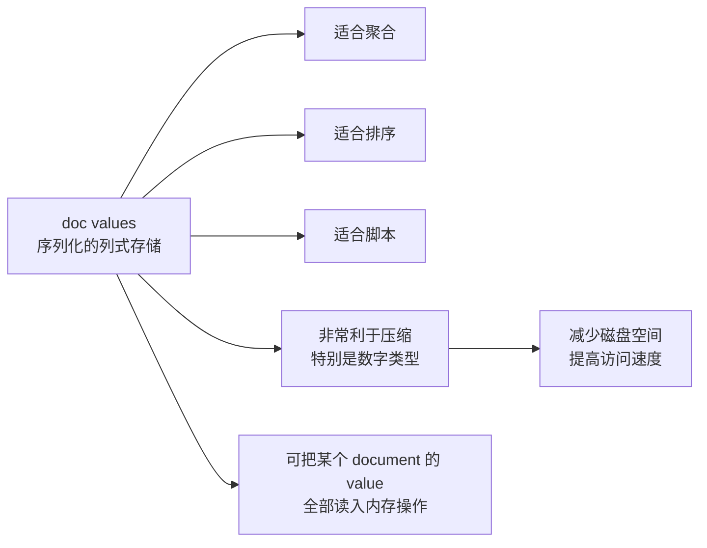
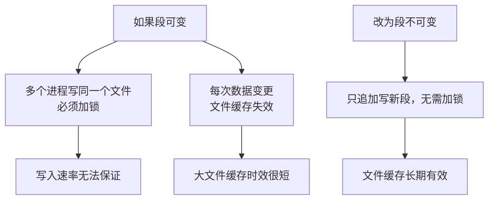
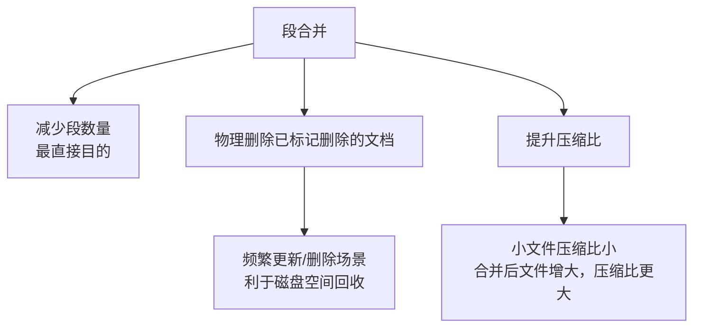
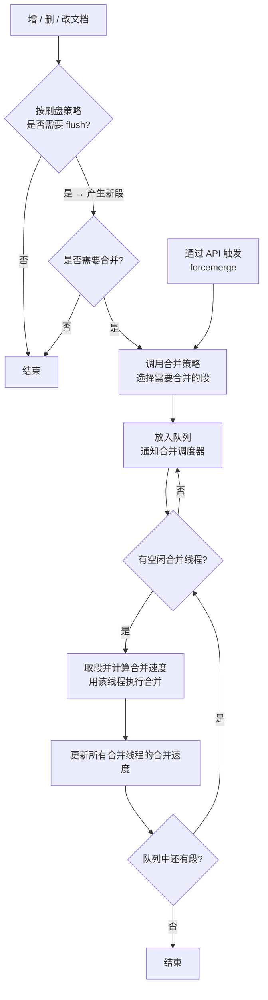
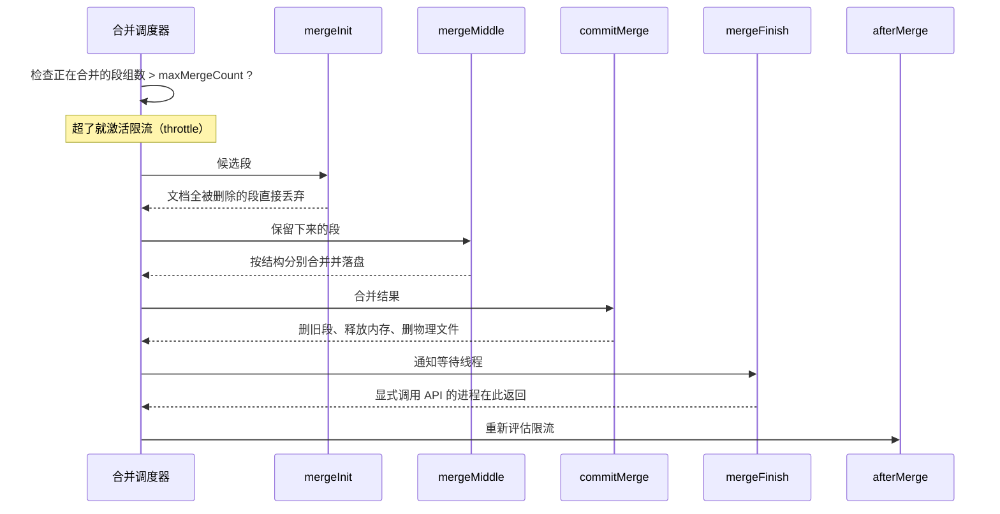
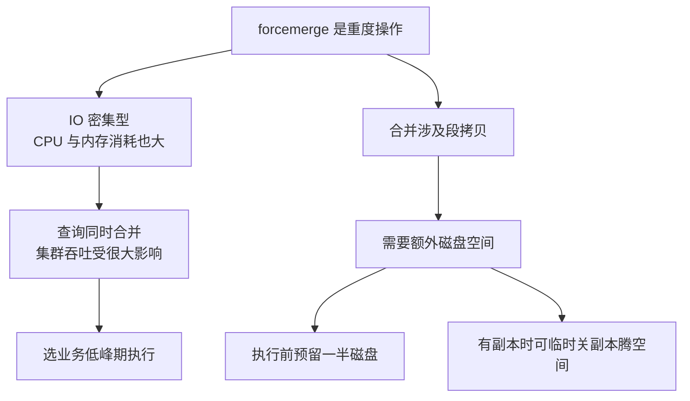
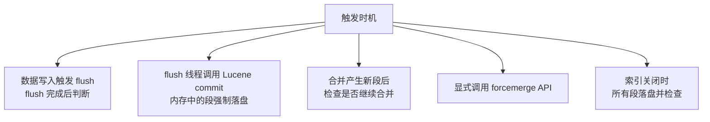
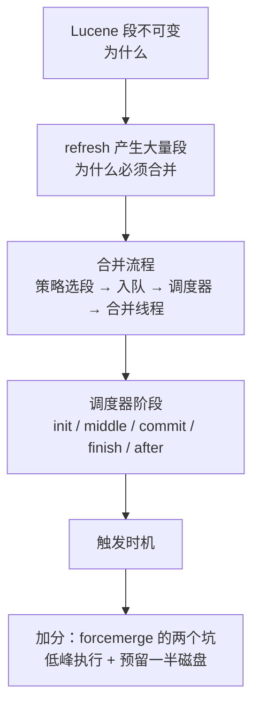

# Go 项目开发: Lucene 段合并的完整过程与触发时机

"段合并的具体过程是怎样的？哪些情况下会触发段合并？"

这是 ES 面试中**对底层原理考察最深**的高频题之一。它难在**跨层** —— 段合并这件事发生在 **Lucene 层**，不在 ES 层。很多人只会答"把小段合成大段"，答不到点子上。

这一篇按"**段里有什么 → 为什么要合并 → 怎么合并 → 什么时候触发**"的顺序把它讲透。

## 纲要

- 先搞清 Lucene 与 ES 的分工
- 一个段里到底存了什么
- 前置问题：段为什么不可变
- 前置问题：为什么需要段合并
- 前置问题：段合并的目的是什么
- 段合并的整体流程
- 合并调度器的内部阶段
- 合并失败怎么处理
- 手动执行 forcemerge 的两个注意点
- 哪些情况会触发段合并
- 面试怎么答
- Go 侧：把合并调度器写成可运行的模拟

## 先搞清 Lucene 与 ES 的分工

**ES 的底层是基于 Lucene 的。** 分工非常清晰：

- **Lucene** 负责**数据的写入、查询和存储**。
- **ES** 在 Lucene 的基础上**增加了分布式相关的实现**。



对应关系要记牢：**ES 中每个索引有多个分片，而每个分片对应的是一个 Lucene 实例，也被称为 Lucene 索引。Lucene 中的数据是分段存储的，每个 Lucene 实例（也就是 ES 的分片）可以有多个段。**

## 一个段里到底存了什么

段中存储着各种不同结构的数据，主要包含四类：

| 结构 | 说明 |
| --- | --- |
| **倒排索引** | **单词词典 + 倒排列表**。这是段里的**大头** |
| **stored field** | 将字段的 `store` 属性设为 `true` 时存储字段的值，**本质上是一个键值对** |
| **doc values** | **本质上是一个序列化的列式存储结构** |
| **缓存数据** | 反映最近变更的一些缓存数据 |

重点说说 **doc values**：



**这种存储方式非常利于压缩，特别是数字类型**，这样可以**减少磁盘空间，并且提高访问速度**。而且 **ES 可以将索引下某个 document 的 value 全部读取到内存中进行操作** —— 这正是聚合和排序能跑得快的原因。

## 前置问题：段为什么不可变

回答段合并之前，必须先答清楚三个问题。

**段是不可变的**，原因有两个：



- **避免多个进程操作同一个文件时需要加锁**。
- **防止每次的数据变更导致文件缓存失效**。

因为段不可变，**文档只会在从 index buffer 经过 refresh 到 OS cache 的过程中，被写进新的段文件中**。

那删除怎么办？—— **删除操作是将文档记录到 `.del` 文件中，在段合并的时候不拷贝这些被删除的文档到新段中，以此实现文档的物理删除。**

## 前置问题：为什么需要段合并

**由于每次 refresh 操作都会生成一个新的段**，随着时间积累会导致索引中出现**大量的段**。

段多了有两个直接后果：

- **每个段都会占用系统的文件描述符**，段太多会耗尽句柄。
- **搜索过程中需要扫描的段数量增加，从而影响检索速度**。

所以必须进行段合并。

## 前置问题：段合并的目的是什么

段合并最直接的目的就是**减少段的数量**，但它还有三个额外收益：



**对于频繁更新和删除的场景，段合并也有利于磁盘空间的回收**；**除此之外还能提升压缩比 —— 小文件的压缩比比较小，段合并之后文件增大，压缩比也会更大。**

## 段合并的整体流程



逐步拆解：

- 每当有**增加、删除、修改文档**的时候，都会**根据刷盘策略来决定是否需要刷盘**。有刷盘操作就意味着有新的段产生，有新段产生之后就会判断是否需要合并。
- 如果需要合并，就**调用相应的合并策略，选择需要合并的段**。
- **如果是通过 API 触发的段合并，就没有以上流程，直接调用对应的合并策略来选择段** —— 这是 `forcemerge` 和自然合并的关键区别。
- 把选好的段**放入队列，并通知合并调度器**来处理。
- **合并调度器先判断是否有空闲的合并线程**。如果有，就从队列中获取待合并的段，**计算这些段的合并速度**，并使用该线程来执行段合并。
- **更新所有合并线程的合并速度。如果合并线程过多，会让小段先合并、大段暂停。**
- 如果队列中还含有待合并的段，就继续按上面的流程处理，**直到队列中的段全部合并为止**。

## 合并调度器的内部阶段

这一段是**拉开差距的地方** —— 大部分人答不到这个颗粒度。



**限流检查。** 在合并之前，ES 会**检查正在合并的段的个数**。如果超过 `maxMergeCount` 这个值，**就会激活限流** —— 也就是合并操作（如增加、删除、修改）**同时只能有一个再进行**。

**`mergeInit` 阶段。** 这个阶段会**检查这些段中的文档是否都被删除**。如果都被删除了，就**直接去掉对应的段，不用合并**。

**`mergeMiddle` 阶段。** 这是合并的主体 —— **针对各个段中不同类型的数据，采用不同的合并方式将它们合并在一起**。

每个段主要包含这几类数据：

```dir
segment（段）
├── 段总体信息            SegmentInfo
├── 各字段的数据          FieldInfo / FieldData
├── 按行存储的数据        stored field（键值对）
├── 按列存储的数据        doc values（序列化列存）
└── 倒排表                term dictionary + posting list
```

**将各种类型的数据合并落盘后，需要将字段信息落盘；新段的总体信息也需要落盘。**

**`commitMerge` 阶段。** 合并完成之后，**需要将已经合并的段删除掉，内存中相关的信息也会被释放掉，并且删除这些段的物理文件**。

**合并失败处理。** 如果合并失败，**会关闭 Lucene 对象、释放所有占用的资源，并且上报给 ES 的节点，以便将这些分片分配到别的 ES 实例上**。

**`mergeFinish` 阶段。** **通知等待的线程合并完成。** 针对**显式调用合并 API 的进程**，需要进行等待，**直到收到完成或者失败的通知之后才会返回**。

还有个细节：**如果我们显式指定了需要合并成的段的数量，会调用相应的合并策略继续寻找需要合并的段，直到总的段数量小于 `max_num_segments` 为止。**

**`afterMerge` 阶段。** 合并完成之后**检查是否还需要继续限流**。**如果当前需要合并的段组数小于 `maxMergeCount`，就不需要限流，否则需要继续限流。**

## 手动执行 forcemerge 的两个注意点



**第一个：它是重操作，会拖慢查询。**

由于**段合并是 IO 密集型操作，而且 CPU 和内存的消耗也比较大，对读取性能肯定会有影响**。而**查询本身也是比较消耗内存和 CPU 的操作**，如果**查询的同时还进行段合并，集群的吞吐就会受到很大的影响**。

所以**一般会选择在业务的低峰期进行 `forcemerge` 这种重度操作**。如果是**几百 TB 的大集群，段合并的时间会比较长**，这时候**需要尽可能地避免频繁执行 `forcemerge` 操作**。

**第二个：它需要额外的磁盘空间。**

**`forcemerge` 过程中会涉及段的拷贝，特别是体积比较大的段进行合并时，需要占用额外的磁盘空间。所以执行 `forcemerge` 前需要预留一半的磁盘空间。如果有副本的情况下，可以暂时关闭副本来腾出足够的磁盘空间给段合并。**

## 哪些情况会触发段合并



- **数据写入时触发。** 当有数据写入时会**判断当前写入的段是否需要 flush**，也就是会落盘生成一个新的段。**如果需要 flush，在 flush 完成之后就会判断是否需要进行合并。**
- **flush 线程调用 Lucene 的 commit。** 由于 **ES 中的 flush 线程会调用 Lucene 中的 commit**，该操作**会将还在内存中的段强制落盘并触发这种情况下的段合并**。
- **合并后产生新段。** 由于**段合并后会产生一个新的段**，所以这个时候**也需要检查一下是否需要继续合并段** —— **特别是在指定了要合并成多少个段的情形**，这种情形由合并线程来操作。
- **调用段合并的 API。** 也就是 `forcemerge`，可以**设置需要合并成几个段，合并完成后该 API 才会返回**。
- **索引关闭时。** **索引关闭的时候会将所有的段落盘，并且检查是否需要段合并。**

## 面试怎么答

段合并从源码看是一个相当复杂的过程，有很多边界需要考虑。**面试中基于时间考虑，按"结构 → 动因 → 流程 → 阶段 → 触发"这条线回答最合适**：



**加分项**是能说出 `mergeInit` 会跳过全删段、`mergeMiddle` 按结构分别合并、`commitMerge` 才真正删物理文件、`afterMerge` 重新评估限流 —— 这几个阶段名一出口，说明你真读过这块。

## API 速览

| 能力 | API / 参数 |
| --- | --- |
| 手动合并到指定段数 | `POST /idx/_forcemerge?max_num_segments=1` |
| 只清理已删除文档 | `POST /idx/_forcemerge?only_expunge_deletes=true` |
| 等待合并完成 | `POST /idx/_forcemerge?wait_for_completion=true` |
| 一次合并的段数上限 | `index.merge.policy.max_merge_at_once`（默认 10） |
| 参与合并的单段上限 | `index.merge.policy.max_merged_segment`（默认 5GB） |
| 段下限（floor segment） | `index.merge.policy.floor_segment`（默认 2MB） |
| 合并调度器类型 | `index.merge.scheduler.max_thread_count` |
| 合并限流（ES 8+） | `index.merge.scheduler.auto_throttle` |
| 查看段 | `GET /_cat/segments/idx?v&h=index,shard,segment,size,docs.count,docs.deleted` |
| 查看分片段详情 | `GET /idx/_segments` |
| 查看合并任务 | `GET /_tasks?actions=*merge&detailed` |
| 查看索引 codec | `GET /idx/_settings?include_defaults=true&filter_path=*.codec` |
| 关闭索引（触发落盘） | `POST /idx/_close` |

## Demo 示例

一个完整的 Go 程序，**模拟 Lucene 段的构成、合并策略选段、以及合并调度器的 `mergeInit` / `mergeMiddle` / `commitMerge` / `mergeFinish` / `afterMerge` 五个阶段**，并演示限流判定、物理删除、压缩比提升与 `forcemerge` 的磁盘预留检查。纯标准库，可直接跑。

**运行说明**

- 需要 Go 1.18+（用到 `math`、`sort`，1.21 验证通过）。
- 无第三方依赖，保存为 `main.go` 后执行 `go run main.go`。
- 全部为内存模拟，不连接真实集群，输出完全可复现。

```go
package main

import (
	"fmt"
	"math"
	"sort"
)

const (
	maxMergeSegmentKB = 5 * 1024 * 1024 // 5GB：超过这个体积的段不参与合并
	similarFactor     = 4               // 段体积相差不超过该倍数，视为"大小相似"
)

// Segment 一个 Lucene 段。真实段里包含倒排表、行存（stored field）、
// 列存（doc values）等多种结构，这里用 Sections 记录各结构的体积。
type Segment struct {
	ID       int
	Docs     []string
	Del      map[string]bool
	Sections map[string]int // 结构名 -> 体积（KB）
}

func makeSeg(prefix string, n int) Segment {
	seg := Segment{Sections: map[string]int{}, Del: map[string]bool{}}
	for i := 0; i < n; i++ {
		seg.Docs = append(seg.Docs, fmt.Sprintf("%s_%02d", prefix, i))
	}
	seg.Sections["倒排表"] = n * 8
	seg.Sections["行存"] = n * 4
	seg.Sections["列存"] = n * 2
	return seg
}

// Size 段的总占用（含已标记删除文档仍占的空间）。
func (s Segment) Size() int {
	n := 0
	for _, v := range s.Sections {
		n += v
	}
	return n
}

// LiveDocs 段中未被标记删除的文档。
func (s Segment) LiveDocs() []string {
	out := make([]string, 0, len(s.Docs))
	for _, d := range s.Docs {
		if !s.Del[d] {
			out = append(out, d)
		}
	}
	return out
}

// AllDeleted 对应 mergeInit 阶段的判断：段内文档是否已被全部标记删除。
func (s Segment) AllDeleted() bool {
	return len(s.Docs) > 0 && len(s.LiveDocs()) == 0
}

// ---------------------------------------------------------------- Store

// Store 模拟一个分片（Lucene 实例）里的段集合与合并调度器。
type Store struct {
	Segs          []Segment
	MaxMergeCount int // 同时合并的段组上限，超过则激活限流
	MaxMergeAtOnce int
	Merging       int
	Throttled     bool
	seq           int
}

func NewStore(maxMergeCount, maxAtOnce int) *Store {
	return &Store{MaxMergeCount: maxMergeCount, MaxMergeAtOnce: maxAtOnce}
}

func (st *Store) Append(s Segment) {
	st.seq++
	s.ID = st.seq
	st.Segs = append(st.Segs, s)
}

func (st *Store) TotalSize() int {
	n := 0
	for _, s := range st.Segs {
		n += s.Size()
	}
	return n
}

// removeByID 按段 ID 批量剔除（合并提交 / 丢弃全删段时调用）。
func (st *Store) removeByID(ids map[int]bool) {
	rest := make([]Segment, 0, len(st.Segs))
	for _, s := range st.Segs {
		if !ids[s.ID] {
			rest = append(rest, s)
		}
	}
	st.Segs = rest
}

// Select 合并策略：选体积相近的段，最多 maxAtOnce 个；单段超过 5GB 不参与。
func (st *Store) Select() []int {
	type cand struct {
		idx, size int
	}
	var list []cand
	for i := range st.Segs {
		sz := st.Segs[i].Size()
		if sz > maxMergeSegmentKB {
			continue
		}
		list = append(list, cand{i, sz})
	}
	if len(list) < 2 {
		return nil
	}
	sort.Slice(list, func(a, b int) bool { return list[a].size < list[b].size })
	base := list[0].size
	picked := make([]int, 0, st.MaxMergeAtOnce)
	for _, c := range list {
		if c.size > base*similarFactor {
			break // 体积不在一个量级，留到下一轮
		}
		picked = append(picked, c.idx)
		if len(picked) == st.MaxMergeAtOnce {
			break
		}
	}
	if len(picked) < 2 {
		return nil
	}
	return picked
}

// Merge 走一遍完整的合并调度流程，返回各阶段的日志。
func (st *Store) Merge(idxs []int) []string {
	log := []string{}

	// ---- 合并前：限流检查 ----
	st.Merging++
	if st.Merging > st.MaxMergeCount {
		st.Throttled = true
		log = append(log, fmt.Sprintf("[限流检查] 正在合并 %d 组 > maxMergeCount %d → 激活限流，合并与增删改串行",
			st.Merging, st.MaxMergeCount))
	} else {
		log = append(log, fmt.Sprintf("[限流检查] 正在合并 %d 组，未超过 %d，不限流", st.Merging, st.MaxMergeCount))
	}

	group := make([]Segment, 0, len(idxs))
	for _, i := range idxs {
		group = append(group, st.Segs[i])
	}

	// ---- mergeInit：全删段直接丢弃 ----
	kept := make([]Segment, 0, len(group))
	droppedIDs := map[int]bool{}
	for _, s := range group {
		if s.AllDeleted() {
			droppedIDs[s.ID] = true
			continue
		}
		kept = append(kept, s)
	}
	log = append(log, fmt.Sprintf("[mergeInit] 候选 %d 段，其中 %d 段文档已被全部删除 → 直接丢弃，不参与合并",
		len(group), len(droppedIDs)))
	// 全删段连合并都不用做：直接不拷贝到新段，物理文件一并删除
	if len(droppedIDs) > 0 {
		beforeSize := st.TotalSize()
		st.removeByID(droppedIDs)
		log = append(log, fmt.Sprintf("[mergeInit] 剔除全删段，占用 %d KB → %d KB（回收 %d KB）",
			beforeSize, st.TotalSize(), beforeSize-st.TotalSize()))
	}
	if len(kept) < 2 {
		log = append(log, "[mergeInit] 保留段不足两个，取消本次合并")
		st.Merging--
		return log
	}

	// ---- mergeMiddle：按结构分别合并，跳过已标记删除的文档 ----
	merged := Segment{Sections: map[string]int{}, Del: map[string]bool{}}
	liveTotal, deadTotal := 0, 0
	for _, s := range kept {
		live := s.LiveDocs()
		deadTotal += len(s.Docs) - len(live)
		liveTotal += len(live)
		merged.Docs = append(merged.Docs, live...)
		ratio := float64(len(live)) / float64(len(s.Docs))
		for name, v := range s.Sections {
			merged.Sections[name] += int(float64(v) * ratio) // 不拷贝已删除文档
		}
	}
	log = append(log, fmt.Sprintf("[mergeMiddle] 倒排表归并 / 行存拼接 / 列存拼接；跳过 %d 篇已标记删除文档，保留 %d 篇",
		deadTotal, liveTotal))

	// ---- commitMerge：落盘、删旧段、释放物理文件 ----
	before, beforeSize := len(st.Segs), st.TotalSize()
	drop := map[int]bool{}
	for _, i := range idxs {
		drop[st.Segs[i].ID] = true
	}
	rest := make([]Segment, 0, len(st.Segs))
	for _, s := range st.Segs {
		if !drop[s.ID] {
			rest = append(rest, s)
		}
	}
	st.seq++
	merged.ID = st.seq
	rest = append(rest, merged)
	st.Segs = rest
	log = append(log, fmt.Sprintf("[commitMerge] 段数 %d → %d，占用 %d KB → %d KB（回收 %d KB）",
		before, len(st.Segs), beforeSize, st.TotalSize(), beforeSize-st.TotalSize()))
	log = append(log, "               旧段被删除，内存信息与物理文件一并释放")

	// ---- mergeFinish：通知等待线程（显式调用 API 的进程在此返回）----
	log = append(log, "[mergeFinish] 通知等待线程；显式调用 forcemerge 的进程收到结果后才返回")

	// ---- afterMerge：重新评估限流 ----
	st.Merging--
	if st.Merging < st.MaxMergeCount {
		if st.Throttled {
			st.Throttled = false
			log = append(log, "[afterMerge] 待合并段组数已回落到阈值以下 → 解除限流")
		}
	} else {
		log = append(log, "[afterMerge] 仍处于限流状态")
	}
	return log
}

// ---------------------------------------------------------------- 压缩与磁盘

// compressionRatio 小文件压缩比低，合并成大文件后压缩比更高。
func compressionRatio(sizeKB int) float64 {
	r := 0.20 + 0.05*math.Log2(float64(sizeKB)/256.0+1)
	if r > 0.60 {
		r = 0.60
	}
	if r < 0.10 {
		r = 0.10
	}
	return r
}

// ForceMergeDiskCheck forcemerge 涉及段拷贝，需要额外的磁盘空间，建议预留一半。
func ForceMergeDiskCheck(totalKB, usedKB int) (need, headroom int, ok bool) {
	need = usedKB     // 峰值约等于现有体积的一倍
	headroom = totalKB - usedKB
	return need, headroom, headroom >= need
}

// ---------------------------------------------------------------- 演示

func main() {
	fmt.Println("=== 一个 Lucene 段里存了什么 ===")
	for _, s := range []struct{ name, desc string }{
		{"倒排索引", "单词词典 + 倒排列表，段里体积占比最大"},
		{"stored field", "字段 store=true 的原始值，本质是键值对"},
		{"doc values", "序列化的列式结构，适合聚合 / 排序 / 脚本，利于压缩"},
		{"缓存数据", "反映最近变更的缓存数据"},
	} {
		fmt.Printf("  %-14s %s\n", s.name, s.desc)
	}

	st := NewStore(1, 10)
	// 造 10 个中等大小的段（模拟 refresh 反复生成），并穿插删除操作
	for i := 0; i < 10; i++ {
		s := makeSeg(fmt.Sprintf("seg%02d", i), 20)
		for j, d := range s.Docs {
			if j%3 == 0 { // 三分之一的文档被删除或更新过
				s.Del[d] = true
			}
		}
		st.Append(s)
	}
	// 一批全删段：mergeInit 会直接丢弃它们
	for i := 0; i < 3; i++ {
		s := makeSeg(fmt.Sprintf("dead%02d", i), 20)
		for _, d := range s.Docs {
			s.Del[d] = true
		}
		st.Append(s)
	}
	// 一个超大段：超过 5GB 不参与合并
	big := makeSeg("huge", 20)
	big.Sections["倒排表"] = 6 * 1024 * 1024
	st.Append(big)

	fmt.Printf("\n初始：段 %d 个，占用 %d KB\n", len(st.Segs), st.TotalSize())

	fmt.Println("\n=== 自然合并：调度器跑起来 ===")
	for round := 1; round <= 12; round++ {
		idxs := st.Select()
		if idxs == nil {
			fmt.Println("\n  没有可合并的段了，合并线程进入空闲")
			break
		}
		fmt.Printf("\n  --- 第 %d 轮，选中 %d 个段 ---\n", round, len(idxs))
		for _, line := range st.Merge(idxs) {
			fmt.Println("   ", line)
		}
	}
	fmt.Printf("\n合并结束：段 %d 个，占用 %d KB（超大段 %d KB 未参与合并）\n",
		len(st.Segs), st.TotalSize(), big.Size())

	fmt.Println("\n=== 物理删除：删除文档后空间何时回收 ===")
	demo := NewStore(1, 10)
	for i := 0; i < 8; i++ {
		demo.Append(makeSeg(fmt.Sprintf("d%02d", i), 20))
	}
	base := demo.TotalSize()
	for i := range demo.Segs {
		for _, d := range demo.Segs[i].Docs {
			demo.Segs[i].Del[d] = true
		}
	}
	fmt.Printf("  全部标记删除后：占用仍为 %d KB（只写了 .del 文件，磁盘没回收）\n", demo.TotalSize())
	idxs := make([]int, len(demo.Segs))
	for i := range demo.Segs {
		idxs[i] = i
	}
	for _, line := range demo.Merge(idxs) {
		fmt.Println("   ", line)
	}
	fmt.Printf("  合并后占用 %d KB，相对 %d KB 已回收空间\n", demo.TotalSize(), base)

	fmt.Println("\n=== 压缩比：段越大，压缩比越高 ===")
	for _, kb := range []int{128, 512, 2048, 8192, 32768} {
		r := compressionRatio(kb)
		fmt.Printf("  段体积 %6d KB → 压缩比约 %.2f，落盘约 %6d KB\n", kb, r, int(float64(kb)*(1-r)))
	}

	fmt.Println("\n=== forcemerge 磁盘预留检查 ===")
	for _, c := range []struct{ total, used int }{{1024 * 1024, 300 * 1024}, {1024 * 1024, 600 * 1024}} {
		need, headroom, ok := ForceMergeDiskCheck(c.total, c.used)
		state := "空间不足，需要先扩容或临时关闭副本"
		if ok {
			state = "空间充足，可以执行"
		}
		fmt.Printf("  磁盘 %d GB / 已用 %d GB → 需要额外 %d GB，剩余 %d GB：%s\n",
			c.total/1024, c.used/1024, need/1024, headroom/1024, state)
	}

	fmt.Println("\n=== 触发段合并的时机 ===")
	for i, t := range []string{
		"数据写入触发 flush，flush 完成后判断是否需要合并",
		"flush 线程调用 Lucene commit，内存中的段强制落盘并触发合并",
		"合并产生新段后，检查是否需要继续合并（指定段数时由合并线程驱动）",
		"显式调用 forcemerge API，可指定合并成几个段，完成后 API 才返回",
		"索引关闭时，所有段落盘并检查是否需要合并",
	} {
		fmt.Printf("  %d. %s\n", i+1, t)
	}

	fmt.Println("\n=== 合并失败的处理 ===")
	fmt.Println("  关闭 Lucene 对象 → 释放所有占用资源 → 上报 ES 节点")
	fmt.Println("  ES 据此把该分片分配到别的实例上，避免单点故障导致数据不可用")
	fmt.Println("\nforcemerge 是 IO 密集型操作，务必放在业务低峰期；大集群更要避免频繁执行")
}
```

**代码说明**

- `Segment.Sections` 把段的**内部结构**（倒排表 / 行存 / 列存）显式建出来，`mergeMiddle` 里对**每种结构分别累加** —— 对应课程里"针对各个段中不同类型的数据采用不同的合并方式"。
- `mergeMiddle` 中 `ratio := 存活数 / 总数`，只按存活比例搬运体积，**这就是"不拷贝已标记删除的文档"的物理删除本质**。删除后 `TotalSize()` 下降，直观复现"删除后空间不回收、合并后才回收"。
- `AllDeleted` 对应 **`mergeInit`**：整段文档全被标记删除时**连合并都不用做，直接丢弃**。
- `Select` 实现了合并策略的三个核心约束：**单段超 5GB 不参与**、**只挑体积相近的段**（`similarFactor`）、**一次最多 `maxMergeAtOnce` 个**。所以那个 6GB 的大段会一直留到最后不被合并。
- `Store.Merging` 与 `MaxMergeCount` 驱动**限流判定**：进入时超阈值就 `Throttled = true`，`afterMerge` 里回落才解除 —— 完整复刻 `afterMerge` 阶段的语义。
- `ForceMergeDiskCheck` 把"**执行 forcemerge 前预留一半磁盘**"变成可判断的布尔，顺带解释了为什么有副本时可以临时关副本。

**技术点总结**

- **ES 负责分布式，Lucene 负责写入/查询/存储**；**一个分片 = 一个 Lucene 实例 = 多个段**。
- 段内存**倒排索引（大头）、stored field（键值对）、doc values（序列化列存）、缓存数据**。
- **段不可变**：避免加锁、避免缓存失效；代价是删除只能写 `.del`，靠合并实现物理删除。
- 合并的动因：**refresh 不断产生新段 → 占文件描述符 + 搜索要扫更多段**。
- 合并的收益：**减少段数、物理删除、回收磁盘、提升压缩比**。
- 流程：**策略选段 → 入队 → 调度器判空闲线程 → 计算合并速度 → 执行 → 更新速度（小段优先、大段暂停）**。
- 调度器五阶段：**`mergeInit`（丢全删段）→ `mergeMiddle`（按结构合并）→ `commitMerge`（删旧段与物理文件）→ `mergeFinish`（通知等待线程）→ `afterMerge`（重新评估限流）**。
- **合并失败会关闭 Lucene 对象并上报 ES，让分片重新分配到别的实例**。
- 五个触发时机：**写入 flush 后、flush 线程调 Lucene commit、合并产生新段后、显式 `forcemerge`、索引关闭时**。
- **`forcemerge` 的两个坑：IO/CPU/内存重、必须放低峰期；涉及段拷贝，执行前预留一半磁盘**。

## 总结

段合并这件事，可以压缩成一条主线：**refresh 每产生一个新段，就可能触发一次合并；合并调度器按 `mergeInit` → `mergeMiddle` → `commitMerge` → `mergeFinish` → `afterMerge` 五个阶段推进，在 `mergeMiddle` 里跳过已标记删除的文档，在 `commitMerge` 里真正删掉旧段和物理文件，从而实现物理删除与空间回收。**

面试时把**五个阶段名**和**五个触发时机**说全，再补上 `forcemerge` 的**低峰执行**与**预留一半磁盘**两个实操要点，这道题基本就没有失分空间了。

