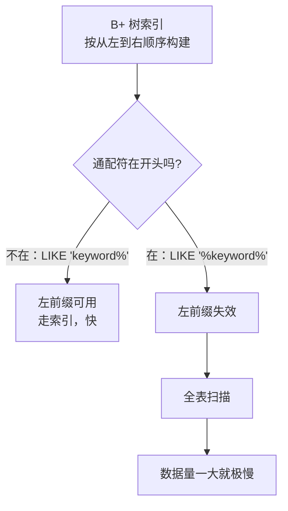
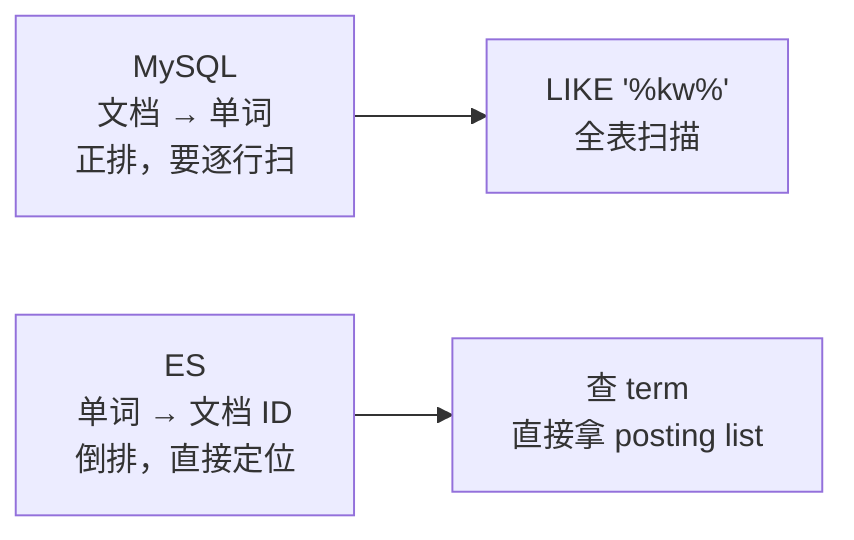
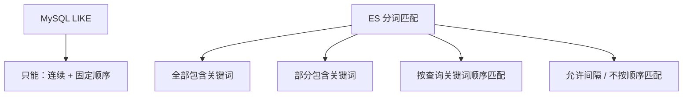
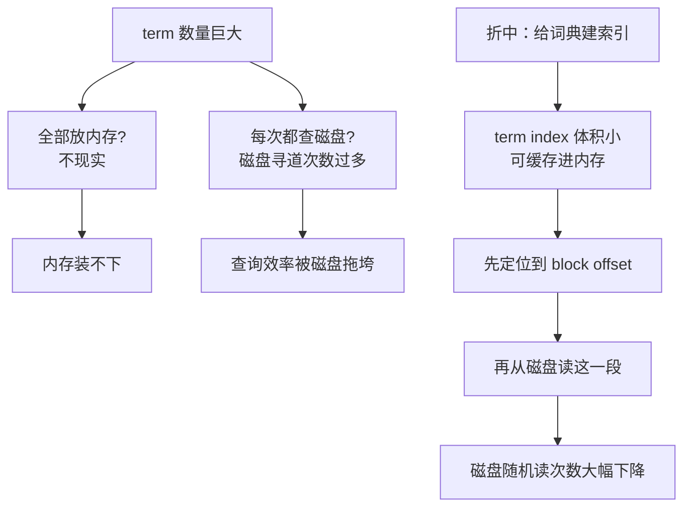
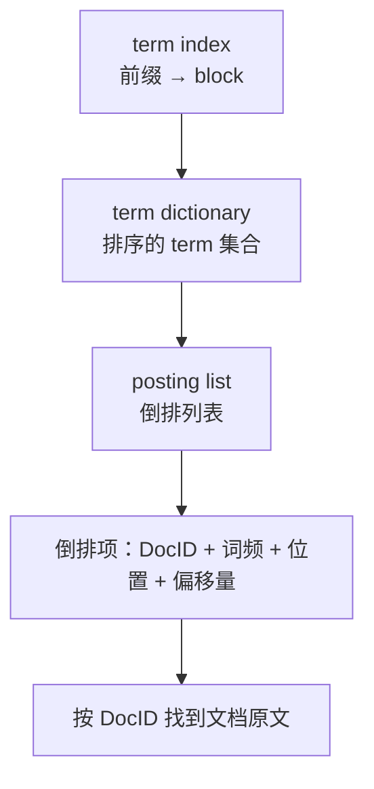
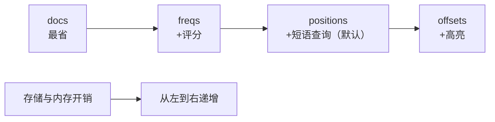
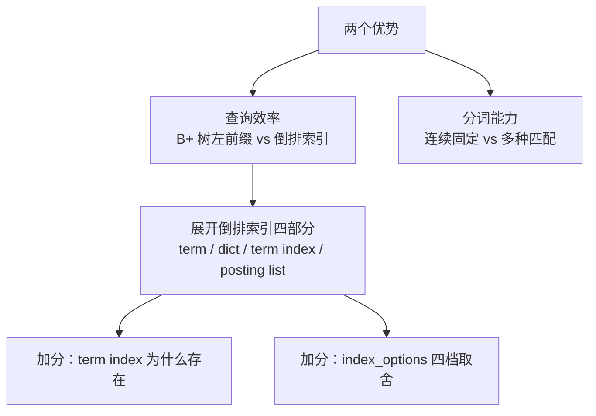

# Go 项目开发: 倒排索引如何让全文检索碾压 MySQL 的 LIKE 查询

"与 MySQL 的 `LIKE` 查询相比，ES 有哪些优势？为什么会有这些优势？"

这是一道**看似简单、实则分层**的题。很多人只答一句"ES 有倒排索引"，那就太薄了 —— 面试官真正想听的是**倒排索引内部到底由什么组成、每一部分解决什么问题**。

ES 全文检索的优势体现在两个方面：**查询效率**和**分词能力**。下面从这两条线展开，最后把倒排索引拆开来看。

## 纲要

- 查询效率：B+ 树的左前缀困境
- 查询效率：倒排索引的词典类比
- 分词能力：连续匹配 vs 多种匹配方式
- 倒排索引由四部分组成
- term：分词后的最小单位
- term dictionary：排序后的词典
- term index：词典的目录索引
- posting list：倒排列表与倒排项
- `index_options` 四个取值怎么选
- 面试怎么答
- Go 侧：手写一个迷你倒排索引

## 查询效率：B+ 树的左前缀困境

**MySQL 的索引是 B+ 树的结构。对字段值建索引的时候，是按照从左到右的顺序建索引的。**

这就决定了 `LIKE` 的一个硬约束：



- **只有在包含左前缀的时候才能用到索引**，也就是说**通配符 `%` 不出现在开头才能使用到索引**。
- **如果关键词被 `%` 包裹起来，就不会使用索引了，走的是全表扫描，这种查询会变得很慢。**

而业务里的模糊搜索（搜标题、搜内容、搜商品名）几乎清一色都是 `%keyword%` —— 这正好是 MySQL 最不擅长的形态。

## 查询效率：倒排索引的词典类比

ES 的全文检索使用的是**倒排索引**的结构，它建立的是**单词到文档 id 的对应关系**。



**根据单词可以快速定位到文档** —— 就像**汉语词典里面的索引**一样：**可以根据要查的字或者词，快速定位到关键词出现的页码**。在 ES 里，"页码"指的是**关键词出现的文档**。

所以在查询效率上，**相同量级的数据下，ES 会有更出色的全文检索性能**。

## 分词能力：连续匹配 vs 多种匹配方式

第二个优势在分词上，而且这个优势比性能优势更容易被忽略。

**MySQL 的模糊匹配只能用来匹配连续且固定的文本** —— 类似 ES 当中将 `slop` 设置为 0 的 `match_phrase` 查询。



ES 支持多种分词方式，**可以根据具体的业务场景选择不同的匹配方式**：

- **既可以全部包含关键词，也可以部分包含关键词。**
- **既可以按照查询关键词的顺序匹配，也可以间隔，或者不按照查询关键词的顺序来匹配。**

这就是"搜 `小米手机` 能搜到 `手机 小米`"这类体验的来源 —— MySQL 的 `LIKE` 做不到。

## 倒排索引由四部分组成

现在把它拆开。**倒排索引由四部分组成：**

```dir
倒排索引
├── term                分词后的一个个单词
├── term dictionary     单词词典（.tim 文件）
├── term index          单词索引（词典的索引）
└── posting list        倒排列表（文档 ID 集合 + 元信息）
```

用**现代汉语词典**来类比，非常贴切：

| 倒排索引 | 词典类比 |
| --- | --- |
| **term** | 词语本身 |
| **term dictionary** | 词典正文 |
| **term index** | 词典的目录索引（拼音检字表 / 部首检字表） |
| **posting list** | 词语出现的页码列表 |

## term：分词后的最小单位

**所谓 term，就是字段原文经过分词处理后的一个个单词。**

分词器的选择直接影响 term 的粒度。以 `standard` 分析器为例，中文会被拆成单字；如果使用 IK 这类中文分词器，`测试文本` 这段文本就会被拆出 `测试` 和 `文本` 两个 term。

## term dictionary：排序后的词典

**单词词典是经过排序后的全部 term 的集合，方便对 term 进行二分查找。它在 ES 中存储的文件后缀是 `.tim`。**

排序这个动作很关键 —— 有了顺序才能二分查找，而不是线性扫描。

## term index：词典的目录索引

这是倒排索引里**最巧妙的一层**，也是面试的加分点。

先看它要解决的问题：



**term index 是 term dictionary（单词词典）的索引，它的目的是用来加速 term 查询的。**

- **当 term 数量很大时，把全部 term 放到内存中显然是不现实的。**
- **但是如果每次都去磁盘上查找，磁盘寻道的次数过多，也会严重影响查询效率。**

ES 的做法是：**给 term dictionary 建立一个索引，就和字典中的索引页一样，它是一种树形结构，存储的是 term 的前缀与单词词典的 block 之间的映射关系。**

**再结合相关的压缩技术，就可以使 term index 缓存到内存当中。通过 term index 可以快速定位到单词词典的某个 offset，然后从这个位置再去磁盘上查找 term，就可以大大减少磁盘随机读的次数。**

## posting list：倒排列表与倒排项

**倒排列表记录了出现某个 term 的所有文档 id 的集合。根据倒排列表，就可以知道哪些文档包含了哪些单词。**

倒排列表中**除了存储文档 ID 之外，还包括**：

- **文档的词频** —— 也就是 term 出现的次数。
- **偏移量 offsets**。
- **单词在原文中的位置信息**。

**这样每一条记录，就称为一个倒排项。**



**在倒排索引中，通过 term index 就可以找到 term 在 term dictionary 中的位置，进而找到 posting list。有了倒排列表，还可以根据 ID 找到文档存储的原文**（前提是我们存储了文档的原文，即 `_source` 开启）。

## `index_options` 四个取值怎么选

存多少信息是可以调的 —— **通过 mapping 中的 `index_options` 属性来设置 posting list 中要存储哪些信息。它有四个值：**

| 取值 | 存储内容 | 能做什么 |
| --- | --- | --- |
| **`docs`** | **只有文档 ID** | 查询时可以知道关键词 term 在哪些文档中出现过 |
| **`freqs`** | 文档 ID + **term 词频** | **词频用于给搜索评分，重复出现的 term 评分会高于单个出现的 term** |
| **`positions`**（**默认值**） | 文档 ID + 词频 + **term 位置** | **可以用于临近查询和 `match_phrase` 查询** |
| **`offsets`** | 文档 ID + 词频 + 位置 + **起始和结尾字符偏移量** | **可以进行 posting 相关的高亮（highlight）功能** |



**在不同的搜索场景下，我们可以选择合适的设置来节省集群的存储和内存。**

几条实操建议：

- **只做存在性判断（有没有出现过）** → `docs`，最省。
- **需要相关性评分** → `freqs` 起步。
- **要做短语 / 临近查询** → `positions`，这也是默认值的原因。
- **要高亮显示命中片段** → `offsets`，但存储开销最大，**只在确实需要高亮的字段上开**。

## 面试怎么答

这道题的答题结构建议这样组织：



**只答"ES 有倒排索引"是及格线**；把**四部分组成 + term index 的作用 + `index_options` 四档**讲清楚，才是这道题的完整答案 —— 而且它还是**面试过程中出现频率最高的问题之一**，值得花时间吃透。

## API 速览

| 能力 | API / 配置 |
| --- | --- |
| 设置存储粒度 | `"index_options": "offsets"`（mapping 字段级） |
| 短语查询 | `POST /idx/_search { "query": { "match_phrase": { "title": "倒排索引" } } }` |
| 允许间隔 | `"match_phrase": { "title": { "query": "倒排索引", "slop": 2 } }` |
| 全部包含 | `"match": { "title": { "query": "...", "operator": "and" } }` |
| 部分包含 | `"match": { "title": { "query": "...", "operator": "or" } }` |
| 高亮 | `"highlight": { "fields": { "title": {} } }`（需 `offsets`） |
| 查看分词结果 | `POST /_analyze { "analyzer": "standard", "text": "测试文本" }` |
| 查看 term 分布 | `GET /idx/_termvectors/1?fields=title` |
| 查看词典统计 | `GET /idx/_stats` |
| 关闭 `_source` | `"_source": { "enabled": false }` |
| 只存不索引 | `"index": false` |
| 查看字段 mapping | `GET /idx/_mapping/field/title` |

## Demo 示例

一个完整的 Go 程序，**手写一个迷你倒排索引**：分词、term dictionary（排序 + 分块）、term index（前缀 → block 映射）、posting list（DocID + 词频 + 位置 + 偏移量），并**对比 `LIKE '%kw%'` 的全表扫描代价**，演示 **`index_options` 四档的存储开销**与**连续 / 间隔 / 全部 / 部分四种匹配方式**。纯标准库，可直接跑。

**运行说明**

- 需要 Go 1.18+（用到 `sort`、`strings`、`unicode`，1.21 验证通过）。
- 无第三方依赖，保存为 `main.go` 后执行 `go run main.go`。
- 分词按 **CJK 逐字、ASCII 按词** 简化处理（`standard` 分析器的中文行为），便于观察位置与短语匹配。

```go
package main

import (
	"fmt"
	"sort"
	"strings"
	"unicode"
)

// ---------------------------------------------------------------- 分词

// Token 一个分词结果：term 本身、在文档中的序号、起止字符偏移量。
type Token struct {
	Term       string
	Pos        int
	Start, End int
}

// Analyze 模拟分词：CJK 逐字成 term（standard 分析器的中文行为），
// ASCII 字母数字按词成 term 并小写化。
func Analyze(text string) []Token {
	var out []Token
	var buf []rune
	bufStart := 0
	runes := []rune(text)
	flush := func(endIdx int) {
		if len(buf) > 0 {
			out = append(out, Token{Term: strings.ToLower(string(buf)), Pos: len(out), Start: bufStart, End: endIdx})
			buf = nil
		}
	}
	for i, r := range runes {
		if r > 0x7F {
			flush(i)
			out = append(out, Token{Term: string(r), Pos: len(out), Start: i, End: i + 1})
			continue
		}
		if unicode.IsLetter(r) || unicode.IsDigit(r) {
			if len(buf) == 0 {
				bufStart = i
			}
			buf = append(buf, r)
			continue
		}
		flush(i)
	}
	flush(len(runes))
	return out
}

// ---------------------------------------------------------------- index_options

type Options int

const (
	Docs Options = iota
	Freqs
	Positions
	Offsets
)

func (o Options) String() string {
	return [...]string{"docs", "freqs", "positions", "offsets"}[o]
}

func (o Options) Desc() string {
	switch o {
	case Docs:
		return "只存文档 ID：能知道关键词在哪些文档出现过"
	case Freqs:
		return "文档 ID + 词频：词频用于评分，重复出现的 term 评分更高"
	case Positions:
		return "文档 ID + 词频 + 位置：支持临近查询与 match_phrase（默认值）"
	default:
		return "再叠加起止字符偏移量：支持 posting 高亮"
	}
}

// ---------------------------------------------------------------- 倒排索引

// Posting 一个倒排项：某个 term 在某篇文档中的完整信息。
type Posting struct {
	DocID int
	Freq  int
	Pos   []int
	Start []int
	End   []int
}

const blockSize = 4 // 单词词典的分块大小；term index 记录前缀 → block

// Index 倒排索引的四个组成部分。
type Index struct {
	Opt       Options
	Docs      []string
	Terms     []string        // term dictionary：排序后的全部 term
	Blocks    [][]string      // 词典分块（对应磁盘上的 block）
	TermIndex map[string][]int // term index：term 前缀 → 可能命中的 block 列表
	Postings  map[string][]Posting
}

func prefixOf(s string) string {
	r := []rune(s)
	if len(r) == 0 {
		return ""
	}
	return string(r[0])
}

func Build(docs []string, opt Options) *Index {
	idx := &Index{Opt: opt, Docs: docs, TermIndex: map[string][]int{}, Postings: map[string][]Posting{}}
	seen := map[string]bool{}
	for docID, text := range docs {
		for _, tk := range Analyze(text) {
			seen[tk.Term] = true
			ps := idx.Postings[tk.Term]
			if len(ps) == 0 || ps[len(ps)-1].DocID != docID {
				ps = append(ps, Posting{DocID: docID})
			}
			last := &ps[len(ps)-1]
			last.Freq++
			last.Pos = append(last.Pos, tk.Pos)
			last.Start = append(last.Start, tk.Start)
			last.End = append(last.End, tk.End)
			idx.Postings[tk.Term] = ps
		}
	}
	idx.Terms = make([]string, 0, len(seen))
	for t := range seen {
		idx.Terms = append(idx.Terms, t)
	}
	sort.Strings(idx.Terms) // 排序后才能二分查找
	for i := 0; i < len(idx.Terms); i += blockSize {
		end := i + blockSize
		if end > len(idx.Terms) {
			end = len(idx.Terms)
		}
		b := len(idx.Blocks)
		blk := idx.Terms[i:end]
		idx.Blocks = append(idx.Blocks, blk)
		// term index：前缀 → 包含该前缀的 block（同一前缀可能跨块）
		for _, t := range blk {
			p := prefixOf(t)
			if n := len(idx.TermIndex[p]); n == 0 || idx.TermIndex[p][n-1] != b {
				idx.TermIndex[p] = append(idx.TermIndex[p], b)
			}
		}
	}
	return idx
}

// Search 走完整链路：term index → block → 块内二分。
// 返回命中文档、磁盘 block 读取次数、比较次数。
func (idx *Index) Search(term string) (docIDs []int, blockReads, cmps int, found bool) {
	blocks, ok := idx.TermIndex[prefixOf(term)]
	if !ok {
		// term index 就能断定 term 不存在，连磁盘都不用读
		return nil, 0, 0, false
	}
	// 只需读 term index 命中的这几个 block，而不是整部词典
	for _, b := range blocks {
		blockReads++
		block := idx.Blocks[b]
		i := sort.Search(len(block), func(k int) bool {
			cmps++
			return block[k] >= term
		})
		if i < len(block) && block[i] == term {
			found = true
			for _, p := range idx.Postings[term] {
				docIDs = append(docIDs, p.DocID)
			}
			break
		}
	}
	return
}

func (idx *Index) docSet(term string) []int {
	out := []int{}
	for _, p := range idx.Postings[term] {
		out = append(out, p.DocID)
	}
	return out
}

func (idx *Index) postingIn(doc int, term string) *Posting {
	ps := idx.Postings[term]
	for i := range ps {
		if ps[i].DocID == doc {
			return &ps[i]
		}
	}
	return nil
}

// Storage 按 index_options 估算 posting list 的存储开销（字节）。
func (idx *Index) Storage() int {
	n := 0
	for _, ps := range idx.Postings {
		for _, p := range ps {
			n += 8 // DocID
			if idx.Opt >= Freqs {
				n += 4
			}
			if idx.Opt >= Positions {
				n += 4 * p.Freq
			}
			if idx.Opt >= Offsets {
				n += 8 * p.Freq
			}
		}
	}
	return n
}

// Score 词频评分：重复出现的 term 评分更高。
func (idx *Index) Score(doc int, term string) int {
	if p := idx.postingIn(doc, term); p != nil {
		return p.Freq
	}
	return 0
}

// ---------------------------------------------------------------- 匹配方式

func Intersect(a, b []int) []int {
	m := map[int]bool{}
	for _, x := range b {
		m[x] = true
	}
	out := []int{}
	for _, x := range a {
		if m[x] {
			out = append(out, x)
		}
	}
	return out
}

func Union(a, b []int) []int {
	m := map[int]bool{}
	out := []int{}
	for _, x := range a {
		if !m[x] {
			m[x] = true
			out = append(out, x)
		}
	}
	for _, x := range b {
		if !m[x] {
			m[x] = true
			out = append(out, x)
		}
	}
	sort.Ints(out)
	return out
}

// MatchAll 全部关键词都包含（operator: and）。
func (idx *Index) MatchAll(terms []string) []int {
	if len(terms) == 0 {
		return nil
	}
	out := idx.docSet(terms[0])
	for _, t := range terms[1:] {
		out = Intersect(out, idx.docSet(t))
	}
	return out
}

// MatchAny 部分关键词包含即可（operator: or）。
func (idx *Index) MatchAny(terms []string) []int {
	if len(terms) == 0 {
		return nil
	}
	out := idx.docSet(terms[0])
	for _, t := range terms[1:] {
		out = Union(out, idx.docSet(t))
	}
	return out
}

// phraseHit 判断某篇文档里 terms 是否按顺序出现，相邻间隔不超过 slop。
func (idx *Index) phraseHit(doc int, terms []string, slop int) bool {
	first := idx.postingIn(doc, terms[0])
	if first == nil {
		return false
	}
	for _, start := range first.Pos {
		prev := start
		ok := true
		for i := 1; i < len(terms); i++ {
			p := idx.postingIn(doc, terms[i])
			if p == nil {
				ok = false
				break
			}
			matched := false
			for _, pos := range p.Pos {
				if pos > prev && pos-prev-1 <= slop {
					prev = pos
					matched = true
					break
				}
			}
			if !matched {
				ok = false
				break
			}
		}
		if ok {
			return true
		}
	}
	return false
}

// MatchPhrase 顺序匹配。slop=0 时等价于 MySQL 的连续子串匹配。
func (idx *Index) MatchPhrase(terms []string, slop int) []int {
	if len(terms) == 0 {
		return nil
	}
	out := []int{}
	for _, d := range idx.docSet(terms[0]) {
		if idx.phraseHit(d, terms, slop) {
			out = append(out, d)
		}
	}
	return out
}

// ---------------------------------------------------------------- MySQL LIKE

// LikeScan MySQL 的 LIKE '%kw%'：通配符在开头，B+ 树左前缀失效，只能全表扫描。
// 返回命中数与扫描的字符数（衡量代价）。
func LikeScan(docs []string, kw string) (hits, runesScanned int) {
	for _, d := range docs {
		runesScanned += len([]rune(d))
		if strings.Contains(d, kw) {
			hits++
		}
	}
	return
}

// ---------------------------------------------------------------- 演示

func main() {
	docs := []string{
		"ES 使用倒排索引加速全文检索，测试文本在这里",
		"倒排索引由 term 单词词典 term index 和倒排列表组成",
		"MySQL like 查询通配符在开头时无法使用索引只能全表扫描",
		"分词后的 term 经过排序构成单词词典方便二分查找",
		"倒排列表记录文档 ID 词频位置和偏移量",
	}

	idx := Build(docs, Offsets)

	fmt.Println("=== 查询效率：LIKE '%kw%' vs 倒排索引 ===")
	for _, kw := range []string{"倒排", "分词", "不存在的词"} {
		hits, scanned := LikeScan(docs, kw)
		toks := Analyze(kw)
		if len(toks) == 0 {
			continue
		}
		ids, blocks, cmps, found := idx.Search(toks[0].Term)
		if !found {
			fmt.Printf("  %-10s LIKE：命中 %d，扫描 %d 字符 | 倒排：term index 判定该前缀不存在，读 %d 个 block\n",
				kw, hits, scanned, blocks)
			continue
		}
		fmt.Printf("  %-10s LIKE：命中 %d，扫描 %3d 字符 | 倒排：term「%s」命中 %v，读 %d 个 block，块内比较 %d 次\n",
			kw, hits, scanned, toks[0].Term, ids, blocks, cmps)
	}
	fmt.Println("  LIKE 的代价随数据量线性增长；倒排索引只读取 term index 命中的那一个 block")

	fmt.Println("\n=== 倒排索引的四个组成部分 ===")
	fmt.Printf("  term dictionary（排序，共 %d 个 term，分 %d 个 block）：\n    %v\n",
		len(idx.Terms), len(idx.Blocks), idx.Terms)
	fmt.Printf("  term index（前缀 → block，可缓存进内存）：\n    %v\n", idx.TermIndex)
	for _, t := range []string{"倒", "排", "词"} {
		ps := idx.Postings[t]
		fmt.Printf("  posting list[%s]：", t)
		for _, p := range ps {
			fmt.Printf("{doc:%d freq:%d pos:%v off:[%d,%d)} ", p.DocID, p.Freq, p.Pos, p.Start[0], p.End[0])
		}
		fmt.Println()
	}

	fmt.Println("\n=== index_options 四档：存储开销对比 ===")
	base := 0
	for _, o := range []Options{Docs, Freqs, Positions, Offsets} {
		st := StorageOf(docs, o)
		if o == Docs {
			base = st
		}
		mark := ""
		if o == Positions {
			mark = " ← 默认值"
		}
		fmt.Printf("  %-10s %6d 字节（%.2fx）%s\n    %s\n", o, st, float64(st)/float64(base), mark, o.Desc())
	}

	fmt.Println("\n=== 分词带来的匹配方式差异（以「倒排」为例）===")
	ts := Analyze("倒排")
	names := make([]string, len(ts))
	for i, t := range ts {
		names[i] = t.Term
	}
	fmt.Printf("  分词结果：%v\n", names)
	fmt.Printf("  全部包含（and）      → %v\n", idx.MatchAll(names))
	fmt.Printf("  部分包含（or）       → %v\n", idx.MatchAny(names))
	fmt.Printf("  顺序连续（slop=0）   → %v  等价于 MySQL 的连续子串匹配\n", idx.MatchPhrase(names, 0))
	fmt.Printf("  允许间隔（slop=1）   → %v  MySQL 的 LIKE 做不到\n", idx.MatchPhrase(names, 1))
	gap := []string{"倒", "索"}
	fmt.Printf("  间隔匹配 %v slop=0   → %v\n", gap, idx.MatchPhrase(gap, 0))
	fmt.Printf("  间隔匹配 %v slop=1   → %v  ES 可跨词命中\n", gap, idx.MatchPhrase(gap, 1))

	fmt.Println("\n=== 词频评分：重复出现的 term 评分更高 ===")
	for _, d := range []int{0, 1, 2} {
		fmt.Printf("  doc %d 中 term「倒」的词频 = %d\n", d, idx.Score(d, "倒"))
	}
}

// StorageOf 用指定 index_options 建索引并估算存储开销。
func StorageOf(docs []string, o Options) int {
	return Build(docs, o).Storage()
}
```

**代码说明**

- `Analyze` 返回 `Token`，同时带**位置 `Pos`** 和**起止字符偏移量 `Start/End`** —— 这两个正是 `index_options` 里 `positions` 和 `offsets` 两档要存的东西，不然后面的短语匹配和高亮无从谈起。
- `Build` 里 `sort.Strings(idx.Terms)` 这一行就是**单词词典的"排序"**，二分查找的前提；随后按 `blockSize` 切块，**把每一块内 term 的前缀映射到该块**，得到 **term index 的"term 前缀 → 词典 block"映射**（同一前缀跨块时会记录多个 block）。
- `Search` 的三段式是核心：**先查 term index**（命中前缀才知道该读哪块，查不到**连磁盘都不用读**）→ **读一个 block** → **块内二分**。对比 `LikeScan` 的 `runesScanned`，两者的代价模型差异一目了然。
- `Storage()` 用 `idx.Opt >= Freqs` 这样的**档位比较**累加字节数，把 `index_options` 四档的开销差异量化出来 —— 这解释了为什么"选择合适的设置可以节省集群的存储和内存"。
- `phraseHit` 里的 `pos-prev-1 <= slop` 就是 **`slop` 的语义**：`slop=0` 要求紧邻（等价于 MySQL 的连续子串），`slop=1` 允许中间隔一个词。这是 ES 分词能力碾压 `LIKE` 的直接体现。
- `MatchAll` / `MatchAny` 用集合交并演示 **`operator: and` 与 `operator: or`**，即"全部包含"与"部分包含"。

**技术点总结**

- **MySQL 索引是 B+ 树，按从左到右建索引**；`LIKE '%kw%'` 通配符在开头 → **左前缀失效 → 全表扫描**。
- **ES 用倒排索引建立"单词 → 文档 ID"的映射**，像词典检字表一样直接定位，相同数据量下全文检索性能远胜。
- **MySQL 的模糊匹配只能匹配连续且固定的文本**（等价于 `slop=0` 的 `match_phrase`）；ES 支持**全部包含 / 部分包含 / 按顺序 / 允许间隔或不按顺序**。
- **倒排索引四部分：`term`、`term dictionary`（`.tim`）、`term index`、`posting list`。**
- **term dictionary 是排序后的 term 集合**，排序是为了二分查找。
- **term index 是词典的索引（树形结构，存前缀 → block 映射）**，靠压缩技术常驻内存，**把磁盘随机读次数降到最低** —— 它解决的是"全放内存不现实、每次查磁盘又太慢"的两难。
- **posting list 记录文档 ID + 词频 + 位置 + 偏移量**，一条记录即一个**倒排项**。
- **`index_options` 四档：`docs`（仅 DocID）→ `freqs`（+词频，用于评分）→ `positions`（+位置，默认，支持 `match_phrase`）→ `offsets`（+起止偏移，支持高亮）**，按需选择以节省存储与内存。

## 总结

这道题的答案可以压成一句话：**MySQL 的 B+ 树决定了 `LIKE '%kw%'` 必然全表扫描，而 ES 的倒排索引建立了"单词 → 文档 ID"的映射，配合 term index 把磁盘随机读降到最低，同时在分词层面支持多种匹配方式 —— 这才是它在全文检索上碾压 `LIKE` 的根本原因。**

而把倒排索引拆成 **term / term dictionary / term index / posting list** 四层讲清楚，再补上 **`index_options` 四档的取舍**，这道题就从"及格"变成了"加分"。

