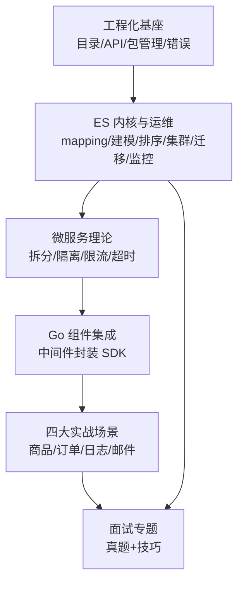

# 搜索服务实战-课程总结

本课程以「面向海量数据，构建高性能的搜索微服务」为主线，把 Elasticsearch 实战、Go 工程化、微服务理论与真实业务场景串成一条完整链路。整门课约 30 小时，浓缩了讲师多年的开发与项目经验，以经验分享为主，因此开发经验较少的同学建议多看几遍，在不同阶段回看往往会有不同的收获。

本节作为收官，我们沿课程脉络做一次知识体系复盘，帮助你在遇到具体场景时能快速定位到对应的章节与手段。

## 纲要

- 课程主线：海量数据下的高性能搜索微服务
- 工程化基座：目录设计、API 设计、包管理、错误处理
- 搜索实战与运维：mapping、数据建模、排序、集群规划、数据迁移、监控
- 微服务理论：服务拆分、隔离、限流、超时控制
- Go 组件集成：沉淀可复用的第三方库封装
- 四大实战场景：非用户短文本、用户短文本、时序、用户大文本
- 面试专题：典型真题回顾 + 答题技巧

## 课程知识地图

整门课可以分成「基座 → 内核 → 理论 → 集成 → 实战 → 面试」六层，逐层递进：



```dir
es-go-course/
├── 工程化（第2章）
│   ├── 目录结构设计
│   ├── API 接口设计
│   ├── 包管理最佳实践
│   └── 错误处理规范
├── ES 内核与运维（第3-4章）
│   ├── 写入/查询原理
│   ├── mapping 与数据建模
│   ├── 排序与索引排序
│   ├── 集群与节点角色规划
│   └── 数据迁移与监控
├── 微服务理论
│   ├── 服务拆分原则
│   ├── 隔离 / 限流 / 熔断 / 降级
│   └── 超时控制
├── Go 组件集成（第6章）
│   ├── ES SDK 封装
│   ├── Kafka 生产者/消费者
│   └── Prometheus 上报
├── 四大实战（第7-10章）
│   ├── 非用户短文本：商品搜索
│   ├── 用户短文本：订单搜索
│   ├── 时序数据：日志搜索
│   └── 用户大文本：邮件搜索
└── 面试专题（第11章）
    ├── 原理类真题
    ├── 集群规划真题
    └── 答题思路与技巧
```

## 各模块的核心关注点

| 模块 | 解决的核心问题 | 落地要点 |
| --- | --- | --- |
| 工程化基座 | 代码可维护、可协作 | 面向包的目录、统一的 API/错误约定、依赖收敛 |
| ES 内核与运维 | 写得进、查得快、稳得住 | 写入原理优化、数据建模、集群角色规划、分片 sizing |
| 微服务理论 | 系统不被单点拖垮 | 拆分边界、隔离、限流、超时三板斧 |
| 组件集成 | 避免重复造轮子 | 把 ES/Kafka/Prometheus 封装成可复用 SDK |
| 四大实战 | 不同数据特征不同打法 | 短文本/用户维度/时序/大文本的差异化优化 |
| 面试专题 | 把知识讲出来 | 用「原理 + 对比 + 踩坑」结构作答 |

## 学习重心建议

课程核心是**面向海量数据构建高性能搜索微服务**，重点应放在：

1. **第 3、4 章**：ES 核心知识与运维技能，是后面一切优化的地基；
2. **第 6 章**：高并发中间件集成，代码建议全部自己动手实现一遍，实战项目正是基于这些封装库；
3. **第 7 章**：商品搜索作为第一个、也是最详细的实战项目，绝大多数垂直搜索场景都能套用其思路。

由于是经验型课程，初看可能「无感」，建议在遇到具体场景（写入慢、集群扛不住、建模踩坑）时再回看对应章节，往往会有新的启发。

## 总结

整门课的主线只有一句话：**在海量数据下，用合理的工程结构、扎实的 ES 内核认知、稳健的微服务设计和可复用的组件封装，撑起一个高性能的搜索微服务**。

复盘时抓住两个落点：一是**知识要成体系**——从工程化基座到 ES 内核、从理论到实战，每一层都为下一层服务；二是**实战要自己动手**——尤其是第 6 章的组件封装和第 7 章的商品搜索，只有把代码跑通、把坑踩过，知识才会内化为技能。

最后，课程通过四大场景和面试专题把分散的知识点重新串起来，希望这份总结能帮你在具体工作中「按图索骥」，也祝正在求职的同学顺利拿到 offer。
