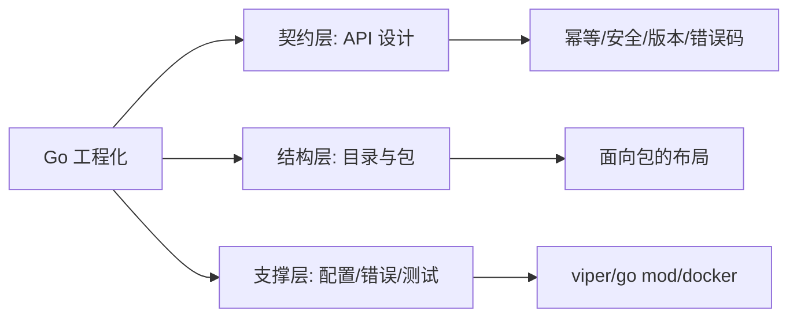

# Go项目工程化实战-章节导学

一个能跑起来的 Demo 和一套可维护、可扩展的工程之间，差的是「工程化」的功夫。本章围绕 Go 项目从 0 到可投产要解决的规范问题展开：如何设计面向包的目录结构、如何设计稳定且安全的 RESTful API、如何做配置管理与包管理、如何结合 Go 语言特性优雅处理错误，以及如何解决单元测试里的中间件依赖。

## 纲要

- 工程化要解决什么：目录、接口、配置、依赖、错误、测试
- API 设计：RESTful 风格、接口幂等、安全性、版本管理、错误码
- 工程支撑：viper 配置管理、Go error 处理范式、go mod 包管理
- 工具链：docker、GIN 框架的取舍
- 学习建议：本章偏理论，务必动手把知识炼成技能

## 第一节 工程化到底在管什么

很多同学写业务时习惯「一个 main 写到尾」，一旦项目变大就难以维护。工程化把关注点拆开：目录结构决定代码往哪放，API 设计决定对外契约稳不稳，配置管理决定多环境怎么切换，错误与包管理决定协作与可重现性。把这些点提前定好规范，后期加人、加功能才不会乱。

本章涉及的知识点包括但不限于：Go 面向包的目录结构设计、RESTful API 的接口幂等性与安全性、接口版本管理、错误码设计、配置管理、viper 使用、Go 的 error 处理、go mod 与 docker、GIN 等。

## 第二节 本章的知识地图

下面这张图把分散的主题收敛成「契约层 / 结构层 / 支撑层」三块，便于大家在学的时候对号入座。



```dir
go-project/
├── cmd/                 # 各可执行程序入口
│   └── server/
├── internal/            # 私有业务代码
│   ├── handler/         # API 层
│   ├── service/         # 业务逻辑
│   └── repository/      # 数据访问
├── pkg/                 # 可复用公共库
├── configs/             # 配置文件
└── tests/               # 单元测试与集成测试
```

| 主题 | 要解决的核心问题 | 典型手段 |
| --- | --- | --- |
| 目录结构 | 代码往哪放、依赖方向 | 面向包分层、internal 隔离 |
| API 设计 | 契约稳定与安全 | RESTful、版本号、错误码 |
| 配置管理 | 多环境切换 | viper + 环境变量 |
| 错误处理 | 错误可追踪、可恢复 | error wrap、哨兵错误 |
| 包管理 | 依赖可重现 | go mod、最小版本选择 |

## 总结

本章理论偏多，尤其是 API 设计一节会讲大量「为什么这样设计」而不是只给结论——因为日后你自己设计时，真正能帮你做决策的，是这些背后理由。我会结合真实项目经验给出可落地的方案，并带大家动手实现错误码设计、用 docker 管理容器。

编程学习本质是动手实操，强烈建议学完每一节都自己敲一遍：只有把知识炼成技能，才能达到最好的学习效果。目录怎么切、错误怎么 wrap、配置怎么注入，这些都不是看懂就行，而是要写到肌肉记忆里。
