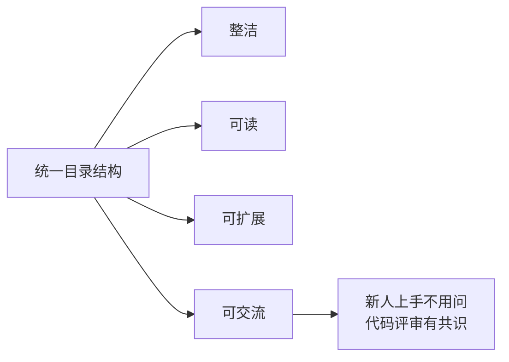
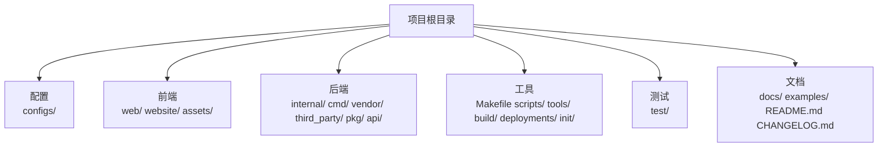
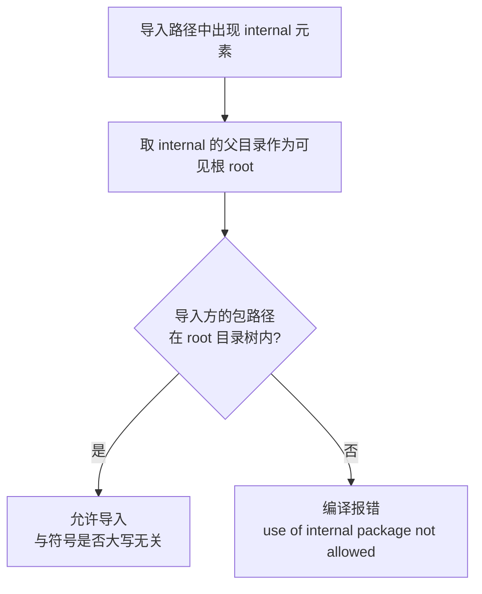
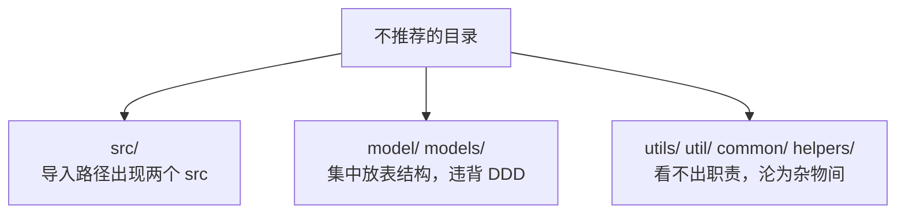

# Go 项目开发: 为工程设计合理的目录结构

多人协作的大型工程里，**如果没有统一的目录结构约定**，项目会随规模膨胀迅速失控：代码凌乱、难以扩展、不可维护。

设计目录结构的最终目的，是提升项目的**整洁性、可读性、可扩展性、可交流性** —— 一个大家都理解的架构，本身就是一种**通用的沟通语言**。

需要说明的是：**`cmd` / `internal` / `pkg` 这套布局并不是 Go 官方核心团队定义的标准**，而是目前 Go 生态中**最常见的社区约定**（`golang-standards/project-layout`）。学它有两个用处：给自己工程设计目录时有个靠谱参考；读 Go 源码时能一眼看出某个目录放的是哪一块内容。

## 纲要

- 目录结构本身就是沟通语言
- 标准布局的来源与分类
- 骨架目录：`cmd` / `internal` / `pkg`
- `internal` 的编译期强制隔离
- `cmd` 子目录名就是二进制名
- `vendor` 与 go module 的关系
- 前端 / API / 配置相关目录
- 构建、部署与工具目录
- 测试与文档目录
- 不推荐的目录：`src` / `model` / `utils` / `common`
- 实际搜索工程的目录布局
- Go 侧：手写一个目录结构体检器

## 目录结构本身就是沟通语言



反过来看，一个没有约定的工程，每个人各建各的目录，**merge 的时候就是灾难**。

## 标准布局的来源与分类

目前被普遍使用的是 **`golang-standards/project-layout`**。它目录很多，但归拢一下，**一个 Go 项目本质上就包含前后端代码、构建与部署工具、测试、文档这几大部分**。



```dir
project-root/
├── cmd/                    可执行程序入口，子目录名 = 二进制名
│   ├── search-api/
│   │   └── main.go
│   └── indexer/
│       └── main.go
├── internal/               私有代码，编译期禁止外部导入
│   ├── app/                业务编排
│   ├── domain/             领域模型（按业务域划分，谁用谁定义）
│   ├── service/            领域服务
│   └── repo/               存储适配：ES / MySQL / Kafka
├── pkg/                    允许外部项目导入的公共库
├── api/                    接口定义：OpenAPI / protobuf
├── configs/                配置文件与默认配置模板
├── web/                    前端代码、服务端模板、单页应用
├── website/                项目站点 / GitHub Pages 数据
├── assets/                 图片、CSS、JavaScript 等资源
├── scripts/                构建、安装、分析、检查脚本
├── build/                  Dockerfile 与持续集成配置
├── deployments/            docker-compose / k8s 编排模板
├── init/                   systemd / supervisord 等进程管理配置
├── test/                   第三方包的测试代码与测试数据
├── docs/                   开发文档、设计文档、用户手册
├── examples/               可运行示例
├── vendor/                 go mod vendor 生成的依赖副本
├── third_party/            fork 并魔改过的第三方包
├── Makefile
├── README.md
└── CHANGELOG.md
```

## 骨架目录：`cmd` / `internal` / `pkg`

一个基本的 Go 工程一般都有这三个目录，**用它们来做分层**：

| 目录 | 定位 | 能否被外部项目导入 |
| --- | --- | --- |
| **`cmd`** | **可执行程序的入口**，只负责启动、关闭、配置初始化 | 不应该被任何包导入 |
| **`internal`** | **私有代码**，分离共享与非共享 | **不能**（编译期强制） |
| **`pkg`** | **可以被外部导入的公共代码** | 可以 |

`internal` 与 `pkg` 是**相对的一组概念**：

- `internal` 里的东西**只有本项目能用**。
- `pkg` 里的东西**明确对外承诺可用**。
- 也可以在 `internal` 下面再建 `pkg`，表示**只能在本项目内共享**的公共包。

实际生产中，为了避免重复造轮子，通常会**沉淀整个企业通用的公共包**，作为**独立仓库**提供给各个业务组使用 —— 这时它就是别的项目 `pkg` 里的东西。

## `internal` 的编译期强制隔离

这是 Go **语言层面**提供的能力，不是靠自觉。

**从 Go 1.4 版本开始，编译器会强制校验：`internal` 代码中声明的公开程序实体（大写开头的常量、变量、函数、类型），只能被它父目录下面的包或者子包引用。**



举几个例子（模块名 `github.com/x/order`）：

| 导入方 | 被导入包 | 结果 |
| --- | --- | --- |
| `github.com/x/order/backend/app` | `github.com/x/order/backend/internal/service` | 允许 |
| `github.com/x/order/frontend` | `github.com/x/order/backend/internal/service` | **禁止** |
| `github.com/y/other` | `github.com/x/order/internal/biz` | **禁止** |
| 任意包 | `github.com/x/order/pkg/eskit` | 允许（路径无 `internal`） |

**那 Go 为什么要有这种隔离？** 从业务角度看，价值在这里：

- **杜绝误调高危接口。** 把**运营管理服务**的代码和**用户层**的代码隔开，可以有效防止在用户层代码里不小心调用到权限过高的运营管理函数或接口，从而避免安全事故。
- **辨识度极高。** 使用者一看到 `internal`，就知道这个项目里的代码**不能被别的项目随便 import**。
- **保护内部结构体。** 如果外部项目导入了你业务中定义的结构体，**一旦你改了结构体里的字段，别人的项目编译时就会挂**。用 `internal` 从源头掐断这种耦合。

注意一点：**编辑器在写下这行 import 的时候就会画红色波浪线**，不用等到编译 —— 提示就是 `use of internal package ... not allowed`。

## `cmd` 子目录名决定产物名

**`cmd` 是项目中所有将要编译成可执行程序的入口，所有入口代码都在这里。** 两条关键原则：

- **该目录不含业务代码**，也**不会被其他包导入**。
- **它的职责只是：程序启动、关闭、配置初始化。**

命名上有一条硬规矩：**`cmd` 下面的子目录名，应该和你期望编译后生成的可执行程序名保持一致。**

```bash
# 在 cmd/search-api 目录下编译
$ cd cmd/search-api && go build
$ ls
search-api          # 产物名 == 目录名

# 把目录改名成 cmd/search-api-v2 再编译
$ cd ../search-api-v2 && go build
$ ls
search-api-v2       # 产物名跟着目录名走
```

有个新手常踩的坑：**在 `cmd` 这一层直接 `go build` 会提示没有可执行的 Go 文件** —— 必须**进到具体的子目录里**再编译，因为入口 `main.go` 在子目录里。

## `vendor` 与 go module 的关系

**`vendor` 包含了工程所依赖的第三方源代码，它是 Go 项目中最早的依赖包管理方式。**

现在绝大多数项目都用 **go module**（`go.mod`）管理依赖。`vendor` 的用法是：

```bash
go mod vendor        # 把 go.mod 里的依赖副本拉到 vendor/ 目录
```

关于 `-mod=vendor` 参数：

- **Go 1.14 之前**，如果项目里同时用了 `vendor` 和 go module，需要显式加 **`-mod=vendor`** 参数来编译。
- **Go 1.14 之后不需要了** —— 只要目录下存在 `vendor/` 且 `go.mod` 里 Go 版本 ≥ 1.14，**直接 `go build` 就会自动走 vendor 模式**。

`third_party` 要跟 `vendor` 区分开：**`third_party` 放的是你 fork 过来并做过魔改的第三方包**。分开放的好处是**一眼就知道这些是改过的 Go 包，便于后续更新和同步上游**。

## 前端 / API / 配置相关目录

| 目录 | 放什么 |
| --- | --- |
| **`configs`** | 配置文件（大家最熟悉的那个目录） |
| **`web`** | 前端代码，还包括服务端模板和单页应用 |
| **`website`** | GitHub Pages 之类的项目站点数据 |
| **`assets`** | 项目中用到的其他资源：图片、CSS、JavaScript 脚本 |
| **`api`** | **接口定义文件**：OpenAPI / Swagger 的 yaml、protobuf 的 `.proto`，以及由它们生成的客户端代码 |

`api` 这一层值得单独强调：**把接口定义文件集中管理**，配合代码生成，前后端和服务间调用才能共用同一份契约。

## 构建、部署与工具目录

| 目录 / 文件 | 放什么 |
| --- | --- |
| **`Makefile`** | 提供便捷指令编译工程代码，**通常放在工程根目录** |
| **`scripts`** | 完成构建、安装、分析、检查的脚本；`Makefile` 里指令的具体实现可以放在这里，封装的 shell 脚本也放这里 |
| **`tools`** | 项目脚本工具，比如**根据数据模型生成代码**的生成器 |
| **`build`** | 安装包和持续集成相关文件，比如 **Dockerfile** |
| **`deployments`** | `deploy` 的简写目录，放系统与容器编排部署配置及模板，比如 **docker-compose 文件** |
| **`init`** | 应用初始化脚本：**systemd**、**supervisord** 等进程管理配置 |

现在软件部署大多走容器化，所以 `build` + `deployments` 基本是标配。

## 测试与文档目录

**`test` 目录存放的是外部包的测试代码和测试数据** —— 比如你引入的第三方包、或者经过魔改的第三方包的测试。

这里要分清楚：

- **应用自身的单元测试**，还是放在**各自业务文件相邻的 `_test.go`** 里，就近维护。
- **`test/` 只放外部包 / 第三方包的测试代码与数据。**

文档侧三个位置：

| 目录 / 文件 | 内容 |
| --- | --- |
| **`docs`** | 开发文档、用户手册、安装指南、设计文档 |
| **`examples`** | 工程内部以及**可被外部导入的包**的示例代码，方便使用者快速入门 |
| **`README.md`** | 项目介绍、功能、安装指南、文档地址 |
| **`CHANGELOG.md`** | 每一次发版的内容 |

企业内部公共包尤其要提供 `examples` —— 甚至可以给出**使用这些包构建的标杆项目地址**，比文档更能让人快速看懂怎么用。

## 不推荐的目录：`src` / `model` / `utils` / `common`



**`src` 为什么不推荐？** `src` 在 Java 开发里很常见，但在 Go 里不合适 —— **GOPATH 模式下代码本来就放在 `$GOPATH/src` 下面**，如果项目里再来一个 `src` 目录，**导入路径中就会包含两个 `src`**，很不规范。

**`model` 为什么不推荐？** 不建议把实体类型都堆在 `model` 里，特别是 MVC 模式下那一层「表结构定义」。**在 DDD 的设计思想下，强调按业务领域划分，谁用谁定义** —— 订单领域的模型就放订单领域目录，商品领域的就放商品领域目录。

**`utils` / `common` 为什么不推荐？** 根本原因是**看不出这个包具体是什么功能**。久而久之，代码越来越多，它就会**变成一个大杂烩，什么东西都往里扔**，最后没人敢删、没人敢改。

## 实际搜索工程的目录布局

课程里实际使用的搜索工程，目录大致是这样（第三方包单独放在一个 git 仓库里管理）：

```dir
search-engine/
├── configs/                配置：ES 地址、Kafka、MySQL、日志级别
├── constants/              全局常量
├── scripts/                构建与发布相关脚本
├── docs/                   项目文档
├── cmd/                    启动入口（搜索服务 / 索引服务）
└── internal/               具体业务逻辑
    ├── app/                服务装配与生命周期
    ├── domain/             领域模型（按业务域划分）
    ├── service/            业务服务
    ├── repo/               ES / MySQL / Kafka 适配
    └── pkg/                仅本项目内共享的包
```

要点就三条：**配置集中、脚本集中、业务逻辑收在 `internal` 里**。具体每个文件怎么实现，是后面几节的内容。

## API 速览

| 能力 | 命令 / 约定 |
| --- | --- |
| 初始化模块 | `go mod init github.com/x/order` |
| 生成 vendor | `go mod vendor` |
| 走 vendor 编译 | `go build`（Go 1.14+ 自动生效；老版本需 `-mod=vendor`） |
| 编译某个入口 | `cd cmd/search-api && go build`，产物名 = 目录名 |
| 查看包导入关系 | `go list -deps ./...` |
| 检查 internal 越界 | 编译期直接报错，编辑器也会标红 |
| 只跑某个包的测试 | `go test ./internal/service/...` |
| 生成接口代码 | `protoc --go_out=. api/*.proto` |
| 看目录树的包结构 | `go list ./...` |

## Demo 示例

一个完整的 Go 程序，**手写目录结构体检器**：实现 Go 1.4 起的 **`internal` 编译期可见性规则**（给定导入方与被导入包，判定是否允许），并对**三种工程布局**（标准布局 / 反模式布局 / 课程搜索工程）做**规则体检**，输出 MUST / SHOULD / ANTI 三档问题清单。纯标准库，可直接跑。

**运行说明**

- 需要 Go 1.18+（用到 `sort`、`strings`、`path`，1.21 验证通过）。
- 无第三方依赖，保存为 `main.go` 后执行 `go run main.go`。
- 工程用「相对路径列表」表示（**目录以 `/` 结尾，文件不带**），因此不依赖真实磁盘文件，输出可复现。

```go
package main

import (
	"fmt"
	"path"
	"sort"
	"strings"
)

// ================================================================ internal 可见性

// CanImport 判断 importer 能否导入 imported。
// Go 自 1.4 起在编译期强制：导入路径中出现 internal 元素时，
// 只有位于该 internal 父目录树之内的包才能导入它，与符号是否大写开头无关。
func CanImport(importer, imported string) (bool, string) {
	elems := strings.Split(path.Clean(imported), "/")
	pos := -1
	for i, e := range elems {
		if e == "internal" {
			pos = i
			break
		}
	}
	if pos < 0 {
		return true, "导入路径不含 internal，任何包都可以导入"
	}
	root := strings.Join(elems[:pos], "/")
	if root == "" {
		return true, "internal 位于模块根，整个模块内可见"
	}
	if importer == root || strings.HasPrefix(importer, root+"/") {
		return true, fmt.Sprintf("%s 位于 %s 目录树内，允许导入", importer, root)
	}
	return false, fmt.Sprintf("%s 不在 %s 目录树内，编译期报错：use of internal package not allowed", importer, root)
}

// BinaryName cmd 子目录编译产物的名字：go build 用目录的 base name 作为二进制名。
func BinaryName(cmdDir string) string {
	return path.Base(path.Clean(cmdDir))
}

// ================================================================ 工程布局模型

// Project 用相对路径列表描述一个工程：目录以 / 结尾，文件不带。
type Project struct {
	Name  string
	Paths []string
}

func hasDir(p Project, d string) bool {
	for _, x := range p.Paths {
		if x == d+"/" || strings.HasPrefix(x, d+"/") {
			return true
		}
	}
	return false
}

func hasFile(p Project, f string) bool {
	for _, x := range p.Paths {
		if x == f {
			return true
		}
	}
	return false
}

// subDirs 返回 parent 下的一级子目录名（去重、排序）。
func subDirs(p Project, parent string) []string {
	seen := map[string]bool{}
	out := []string{}
	prefix := parent + "/"
	for _, x := range p.Paths {
		rest := strings.TrimPrefix(x, prefix)
		if rest == x {
			continue
		}
		i := strings.Index(rest, "/")
		if i < 0 {
			continue // parent 下的散文件，不是目录
		}
		name := rest[:i]
		if !seen[name] {
			seen[name] = true
			out = append(out, name)
		}
	}
	sort.Strings(out)
	return out
}

// ================================================================ 体检规则

type Issue struct {
	Level  string // MUST：必须修 / SHOULD：建议补 / ANTI：反模式
	Item   string
	Detail string
}

func antiReason(d string) string {
	switch d {
	case "src":
		return "GOPATH 模式下代码本就在 $GOPATH/src 下，项目里再来一个 src 会让导入路径出现两个 src"
	case "model", "models":
		return "DDD 强调按业务领域划分、谁用谁定义，不应集中堆表结构"
	default:
		return "看不出包的具体职责，代码一多就变成什么都往里扔的杂物间"
	}
}

// Check 对工程做目录结构体检。
func Check(p Project) []Issue {
	is := []Issue{}

	// 基础三目录
	for _, d := range []string{"cmd", "internal", "pkg"} {
		if !hasDir(p, d) {
			is = append(is, Issue{"SHOULD", d + "/", "标准布局的基础目录缺失"})
		}
	}

	// cmd 的子目录必须有 main.go，否则编译不出可执行程序
	for _, c := range subDirs(p, "cmd") {
		if !hasFile(p, "cmd/"+c+"/main.go") {
			is = append(is, Issue{"MUST", "cmd/" + c + "/", "入口目录缺少 main.go，go build 会提示没有可执行的 Go 文件"})
		}
	}

	// vendor 与 go.mod 必须成对出现
	if hasDir(p, "vendor") && !hasFile(p, "go.mod") {
		is = append(is, Issue{"MUST", "vendor/", "有 vendor 却没有 go.mod，依赖来源无法追溯"})
	}

	// 反模式目录
	for _, d := range []string{"src", "model", "models", "utils", "util", "common", "helpers"} {
		if hasDir(p, d) {
			is = append(is, Issue{"ANTI", d + "/", antiReason(d)})
		}
	}

	// 文档
	if !hasFile(p, "README.md") {
		is = append(is, Issue{"SHOULD", "README.md", "缺少项目介绍、功能与安装指南"})
	}
	if !hasFile(p, "CHANGELOG.md") {
		is = append(is, Issue{"SHOULD", "CHANGELOG.md", "缺少发版记录"})
	}
	if !hasDir(p, "docs") {
		is = append(is, Issue{"SHOULD", "docs/", "缺少开发文档、设计文档、用户手册"})
	}

	// 构建与部署
	if !hasFile(p, "Makefile") {
		is = append(is, Issue{"SHOULD", "Makefile", "根目录缺少便捷编译指令"})
	}
	for _, d := range []string{"scripts", "build", "deployments"} {
		if !hasDir(p, d) {
			is = append(is, Issue{"SHOULD", d + "/", "构建 / 部署相关目录缺失"})
		}
	}
	return is
}

func Report(p Project) {
	issues := Check(p)
	fmt.Printf("\n--- 工程：%s ---\n", p.Name)
	if len(issues) == 0 {
		fmt.Println("  体检通过，未发现问题")
		return
	}
	order := []string{"MUST", "ANTI", "SHOULD"}
	title := map[string]string{"MUST": "必须修", "ANTI": "反模式", "SHOULD": "建议补"}
	for _, lv := range order {
		n := 0
		for _, it := range issues {
			if it.Level != lv {
				continue
			}
			n++
			fmt.Printf("  [%s] %-18s %s\n", lv, it.Item, it.Detail)
		}
		if n > 0 {
			fmt.Printf("  → 共 %d 条%s问题\n", n, title[lv])
		}
	}
}

// ================================================================ 演示

func main() {
	fmt.Println("=== internal 的编译期隔离规则 ===")
	cases := []struct{ importer, imported string }{
		{"github.com/x/order/backend/app", "github.com/x/order/backend/internal/service"},
		{"github.com/x/order/frontend", "github.com/x/order/backend/internal/service"},
		{"github.com/y/other/app", "github.com/x/order/internal/biz"},
		{"github.com/x/order/backend/app", "github.com/x/order/pkg/eskit"},
		{"github.com/x/order/frontend", "github.com/x/order/internal/biz"},
	}
	for _, c := range cases {
		ok, why := CanImport(c.importer, c.imported)
		verdict := "允许"
		if !ok {
			verdict = "禁止"
		}
		fmt.Printf("  [%s] %s\n        导入 %s\n        理由：%s\n", verdict, c.importer, c.imported, why)
	}

	fmt.Println("\n=== cmd 子目录名 = 编译产物名 ===")
	for _, d := range []string{"cmd/search-api", "cmd/indexer", "cmd/search-api-v2"} {
		fmt.Printf("  cd %-20s && go build  →  ./%s\n", d, BinaryName(d))
	}

	std := Project{"标准布局（golang-standards）", []string{
		"cmd/", "cmd/search-api/", "cmd/search-api/main.go", "cmd/indexer/", "cmd/indexer/main.go",
		"internal/", "internal/app/", "internal/domain/", "internal/service/", "internal/repo/",
		"pkg/", "pkg/eskit/", "api/", "configs/", "web/", "website/", "assets/",
		"scripts/", "build/", "deployments/", "init/", "test/", "docs/", "examples/",
		"vendor/", "third_party/", "go.mod", "Makefile", "README.md", "CHANGELOG.md",
	}}
	anti := Project{"反模式布局（新手工程）", []string{
		"src/", "src/main.go", "model/", "model/order.go", "model/user.go",
		"utils/", "utils/string.go", "common/", "common/db.go",
		"service/", "cmd/", "cmd/app/", "go.mod",
	}}
	real := Project{"课程搜索工程", []string{
		"cmd/", "cmd/search/", "cmd/search/main.go", "cmd/indexer/", "cmd/indexer/main.go",
		"internal/", "internal/app/", "internal/domain/", "internal/service/", "internal/repo/", "internal/pkg/",
		"configs/", "constants/", "scripts/", "docs/", "go.mod", "Makefile",
	}}
	Report(std)
	Report(anti)
	Report(real)
}
```

**代码说明**

- `CanImport` 把 Go 1.4 的规则写成算法：**切分导入路径 → 找到第一个 `internal` 元素 → 取它前面的部分作为"可见根" → 判断导入方是否在这棵树内**。`path.Clean` 负责吃掉 `./` `..` 这类噪音，保证判定稳定。
- 注意分支 `root == ""`：当 `internal` 位于模块根时（如 `github.com/x/order/internal/biz`），可见根是整个模块，**同模块内的包都能导入，跨模块一律禁止** —— 这正是"外部项目导入了你业务里的结构体，你改字段它就编译不过"这个痛点的解法。
- `BinaryName` 用 `path.Base` 取目录名，对应 `go build` 的实际行为：**在哪个子目录里编译，产物就叫那个子目录的名字**。所以 `cmd` 下的目录名要按"期望的可执行程序名"来起。
- `subDirs` 只收一级子目录名（`rest[:i]` 截断到第一个 `/`），并跳过 `parent` 下的散文件 —— 这样才能逐个校验 `cmd/xxx/main.go` 是否存在，复现"在 `cmd` 这一层直接 `go build` 会报没有可执行 Go 文件"的场景。
- `Check` 把规则分成 **MUST / ANTI / SHOULD** 三档：`vendor` 与 `go.mod` 不配对、入口缺 `main.go` 是硬伤；`src` / `model` / `utils` / `common` 是反模式；基础三目录、文档、构建部署目录属于建议补齐项。
- 工程用**相对路径列表**描述（目录以 `/` 结尾），不碰真实磁盘，所以**任何环境下跑出来的结论都一致**。

**技术点总结**

- **统一目录结构 = 通用沟通语言**，目标是**整洁、可读、可扩展、可交流**。
- **`cmd` / `internal` / `pkg` 是社区约定而非官方标准**，参考 `golang-standards/project-layout`。
- **`internal` 由编译器强制**：从 **Go 1.4** 起，`internal` 下的公开实体只能被其**父目录树内的包**引用；价值在于**隔离高危运营接口、提升辨识度、避免外部依赖内部结构体**。
- **`cmd` 只放启动 / 关闭 / 配置初始化**，不含业务代码、不被导入；**子目录名 = 二进制名**，且必须**进到子目录里**再 `go build`。
- **`vendor` 是最早的依赖管理方式**，现在用 `go mod vendor` 生成；**Go 1.14 之后不再需要 `-mod=vendor`**，直接 `go build` 即可。`third_party` 放 **fork 后魔改**的包，与 `vendor` 区分。
- **`api` 放 OpenAPI / protobuf 定义**，`test` 只放**第三方包**的测试，应用自身单测就近放 `_test.go`。
- **不推荐 `src`**（导入路径出现两个 `src`）、**`model`**（违背 DDD「按领域划分、谁用谁定义」）、**`utils` / `common`**（职责不明，沦为杂物间）。

## 总结

把目录结构设计好，本质是在回答三个问题：**代码放哪儿、谁能用、怎么长**。

**`cmd` 管入口、`internal` 管私有、`pkg` 管对外**，这三板斧撑起分层；**`internal` 靠编译器而不是靠自觉**来保证隔离；**构建、部署、文档各有归属目录**，工程才谈得上可维护。

最后留一道自检题：**你现在手上的项目，目录结构合理吗？** 有没有 `utils` 这种杂物间，有没有把所有表结构堆在一个 `model` 里，业务代码是不是散落在 `cmd` 外面的各个角落 —— 用这套布局重新设计一遍，答案自然就出来了。

