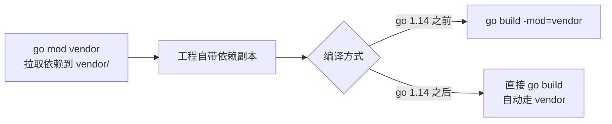
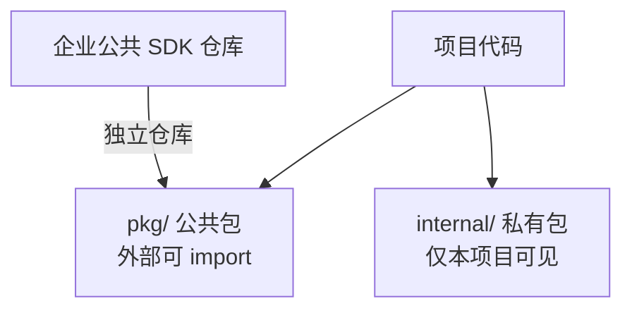

# 为工程设计合理的目录结构（二）：标准布局与避坑指南

上一节我们建立了「目录结构要可扩展、可维护」的共识。这一节直接落地：先看 Go 工程里**依赖管理方式的演进**如何影响目录，再给出一套**标准目录布局**，最后聊聊实际项目里那些**不推荐的目录**以及原因。

好的目录结构，是团队协作的「地图」；差的目录结构，是技术债的「温床」。

## 纲要

- 依赖管理演进：vendor → go module，以及 `go mod vendor` 的来龙去脉
- `pkg` 与 `internal`：对外暴露 vs 仅内部共享
- 标准布局总览：api / script / tools / build / deployment / init
- 测试与文档目录怎么放：test / DOCS / examples / README / CHANGELOG
- 四个不推荐的目录：`src` / `model` / `common` / `utils`
- 实战里的目录规划：配置、常量、构建脚本与业务逻辑分层

## 依赖管理与 vendor 目录

`vendor` 目录存放工程所依赖的第三方**源代码**，是最早的依赖管理方式。今天绝大多数项目都用 `go module` 了，但 `vendor` 仍有一席之地。



- 用 `go mod vendor` 会在项目根目录生成 `vendor/` 目录，里面记录各依赖包的**具体版本**。
- 如果工程同时用到 `vendor` 和 `go module`，早期需要加 `-mod=vendor` 参数编译；**Go 1.14 之后不需要了，直接 `go build` 即可**（Go 1.14+ 自动生效）。

## pkg 与 internal：可见性的边界

`pkg` 与 `internal` 是相对的：**`pkg` 下的包可以被项目外部直接导入，`internal` 下的包只能在本项目内部共享**。



实际生产中，为避免重复造轮子，通常会把整个企业共用的公共包**沉淀为独立仓库**，提供给各个业务组使用。`internal` 则是业务私有逻辑的安全屋，外部无法越界引用。

## 标准目录布局

一个可维护的 Go 工程，通常包含以下目录，职责清晰、互不越界：

| 目录 | 职责 | 关键内容 |
| --- | --- | --- |
| `api/` | 接口定义 | swagger 的 yaml、protobuf 的 proto、由它们生成的客户端代码 |
| `script/` | 脚本 | 构建、安装、分析、检查等功能的脚本（也可承载 Makefile 指令的具体实现） |
| `tools/` | 项目工具 | 如根据数据模型生成代码的脚本，可调用 `pkg` / `internal` 下的代码 |
| `build/` | 打包与 CI | 安装包、`Dockerfile` 等持续集成文件 |
| `deployment/` | 部署配置 | docker-compose、k8s 编排模板等容器化部署配置 |
| `init/` | 初始化脚本 | systemd、supervisord 等进程管理配置 |

- **`Makefile`**：根目录常驻，提供编译指令，方便统一构建。
- **`thirdparty/`**：放「魔改过的第三方包」，和 `vendor/` 区分开 —— 一眼就能看出哪些是被改过的，便于后续同步更新。
- **`test/`**：存放**外部包**的测试代码与测试数据（引入的第三方包、魔改包的测试）；而你应用里的**单元测试仍放在对应源码目录旁边**，不要混进 `test/`。

## 文档目录

文档也是工程的一部分，建议独立成区：

```dir
project/
├── api/                  接口定义与生成代码
├── cmd/                  各可执行程序入口
├── internal/             业务私有逻辑
│   └── service/          具体业务逻辑
├── pkg/                  可对外暴露的公共包
├── script/               构建/安装/检查脚本
├── tools/                代码生成等工具脚本
├── build/                Dockerfile 与 CI 配置
├── deployment/           docker-compose / k8s 编排
├── init/                 systemd / supervisord 初始化
├── test/                 第三方与外部包的测试
└── docs/
    ├── DOCS/             开发文档/用户手册/设计文档
    ├── examples/        包的使用示例（含标杆项目地址）
    ├── README.md         项目介绍/功能/安装/文档入口
    └── CHANGELOG.md      每次发版的内容记录
```

- **`DOCS/`**：开发文档、用户手册、安装指南、设计文档。
- **`examples/`**：工程内部、以及被外部导入的包的使用示例，帮使用者快速入门；企业公共包还可附上「标杆项目」地址。
- **`README.md`**：项目介绍、功能、安装指南、文档链接。
- **`CHANGELOG.md`**（常被误写成「千金 log」）：记录每次发版的内容。

## 四个不推荐的目录

| 不推荐目录 | 为什么不推荐 | 正确做法 |
| --- | --- | --- |
| `src/` | GOPATH 模式下代码本就在 `$GOPATH/src` 下，项目里再套 `src` 会让导入路径出现**两个 src**，不规范 | 直接以模块根为起点组织包 |
| `model/` | 把实体类型都塞进 `model`（尤其 MVC 的 model 层表结构），违反**谁用谁定义** | 按业务领域划分（DDD 思想） |
| `common/` | 看不出功能，久而久之变成「杂物间」，什么都往里扔 | 按职责拆成具体语义的包 |
| `utils/` | 同上，易沦为 dumping ground | 收敛到具体功能包，如 `strutil` / `httputil` |

特别说一下 `model`：在 DDD 设计思想下，我们强调**按业务领域划分、谁用谁定义**，而不是把所有实体塞进一个全局 `model`。可以参考一些主流框架依据 DDD 思想简化后设计的目录布局。

## 实战里的目录规划

真实工程里，我们会把**配置、常量、构建发布脚本、项目文档**放在顶层，文档相关的启动文件放进 `docs/`；业务逻辑代码下沉到 `internal/` 下，按领域继续细分。外部可复用的能力放到 `pkg/`。层次清楚了，新人接手、跨组协作、长期演进都不会乱。

## 总结

目录结构没有唯一正确答案，但有清晰的原则：**依赖边界用 `vendor` / `pkg` / `internal` 划清，构建部署用 `script` / `tools` / `build` / `deployment` / `init` 分层，文档用 `docs` / `examples` / `README` / `CHANGELOG` 沉淀**。

最该警惕的是 `src` / `model` / `common` / `utils` 这类「看起来省事、实际养债」的目录 —— 它们短期方便，长期必乱。动手前先想清楚每个目录**为谁服务、对谁可见**，工程的扩展性就有了地基。建议回头审视自己手上的项目：目录设计是否合理，有哪些值得借鉴、又有哪些该重构。
