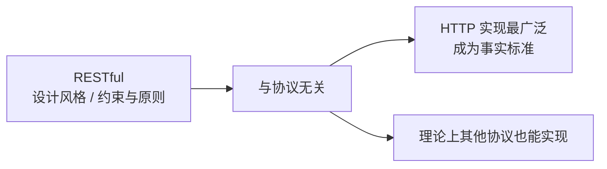
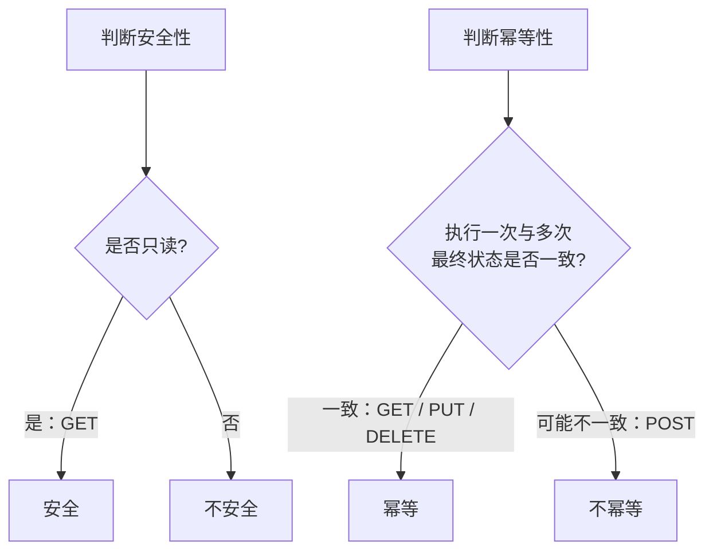
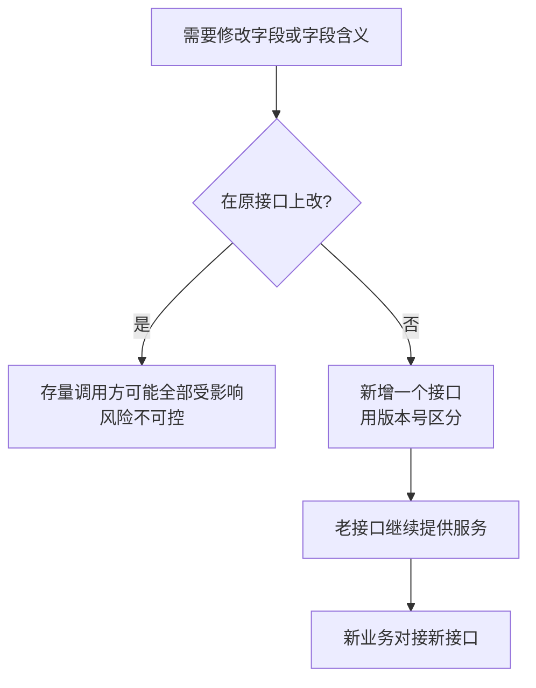
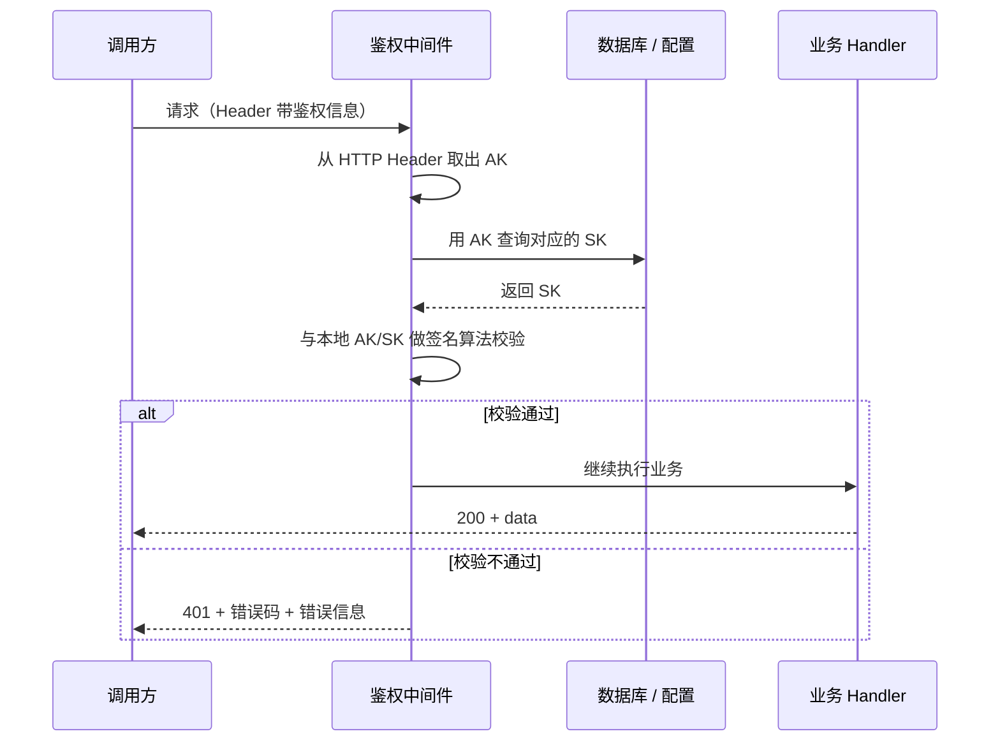

# Go 项目开发: API 接口的设计规范与错误码体系

硬件之间有物理接口，也有逻辑上的数据传输协议；前后端研发日常打交道最多的，就是 **API 接口**。

接到新项目时，往往需要你**设计规范的一整套 API 服务**。**规范化、标准化的 API 接口，有利于项目后期的扩展和维护** —— 这不是八股，是踩过坑之后的共识。

本节从三件事展开：**RESTful API 的设计技巧**、**如何设计一套实用的错误码**、**Go 工程里怎么落地 RESTful API**。

## 纲要

- RESTful 不是框架，而是一种设计风格
- 资源名用名词复数，别用动词
- 操作不好映射成资源时怎么办
- URI 用小写字母加中横线
- 避免层级过深的 URI
- 复杂查询标签化
- 批量请求怎么设计
- 安全性与幂等性
- 业务错误码：拒绝全局错误码
- HTTP 状态码：够用就行
- 接口兼容性：能加就别改
- 响应结构必须保持一致
- Go 工程落地：响应结构 / 错误码 / 鉴权中间件

## RESTful 不是框架，而是一种设计风格

很多人认为 **RESTful API 只是一种框架** —— 这里要重新认识它。

- **RESTful 并不是一种框架，它是一种软件设计风格，本质上是一些约束条件和原则。**
- **RESTful 的实现与网络协议无关。** 之所以大家用 HTTP 来实现，是因为**HTTP 协议的 RESTful 接口实现起来更容易、应用更广泛**，于是 HTTP 就成了实现 RESTful API 的事实标准。



## 资源名用名词复数，别用动词

**请求的资源名，推荐使用名词表示，并且使用复数形式。**

这里说的"资源"**不仅仅表示下载的一个文件** —— 它的本质是**请求最终在服务端执行的操作**，比如"获取商品信息""禁用掉一个用户"。**我们要尽可能把这些操作转化成一个资源。**

```txt
不推荐：GET /getProduct?id=123        ← 用动词描述动作
推  荐：GET /products/123             ← 用名词复数描述资源
```

## 操作不好映射成资源时怎么办

有些请求天然不像资源（比如"禁用用户"）。两条路：

**转成资源的一个属性**，或者**用请求方法来区分**。

```txt
POST   /users/123        body: { "status": "disable" }   转成属性
PUT    /users/123/disable                                用方法区分
DELETE /users/123/disable                                解除禁用
```

## URI 用小写字母加中横线

**URI 一般推荐使用小写字母和中横线（hyphen `-`）**，不推荐使用下划线或者数字。

**除了版本号中可以包含数字之外，一般不推荐使用数字或大写字母。**

```txt
不推荐：/productCategorys/123      ← 大写（上面例子中标记出来的部分）
推  荐：/product-categorys/123     ← 全小写 + 中横线连接
```

**为什么不推荐下划线？** 原因很实在：**中横线输入更方便，不需要切换输入法，也不需要使用组合键。** 这样一来**降低了操作的复杂性，能有效避免用户因为粗心大意输错字符**。

## 避免层级过深的 URI

**层级过深的导航很容易导致 URL 膨胀，并且不容易维护。一般超过两层，就尽量使用查询参数，而不是在路径里继续导航。**

```txt
不推荐：/users/123/orders/456/items/789/refunds/1      路径膨胀
推  荐：/refunds?user_id=123&order_id=456&item_id=789  问号传参
```

例外：**除非是网站做了静态化，出于 SEO 考虑**可以用深路径；但**对外提供的开发者接口，推荐用查询参数的方式**。

## 复杂查询标签化

**对于经常使用的、比较复杂的查询，可以把它标签化，来降低使用和维护的成本。**

```txt
原始：/users?status=disabled&last_login_before=7d&sort=-disabled_at
标签化：/users/recently-disabled
```

这样看上去**更简洁、更容易维护，而且符合接口的功能单一性原则**。

## 批量请求怎么设计

```txt
POST   /products/batch-delete      body: { "ids": [1, 2, 3] }   在 body 里传多个资源 ID
DELETE /products/1                                                发多个 DELETE 请求
DELETE /products?ids=1,2,3                                        参数里传 ID 列表，逗号分隔
```

三种都能用，**推荐第三种**：语义上就是"删掉这些资源"，请求数量还只有一个。

## 安全性与幂等性

两个容易混的概念：

- **安全性**：可以理解为**资源是只读的**。
- **幂等性**：**执行一次和执行多次，对资源的操作结果都是一样的。**



| 方法 | 安全性 | 幂等性 | 说明 |
| --- | --- | --- | --- |
| **GET** | **是**（只读） | **是** | 只有 GET 是只读的，所以**只有 GET 具有安全性** |
| **POST** | 否 | **否** | 一般指对资源的修改，**多次修改可能导致资源最终状态不一样** |
| **PUT** | 否 | **是** | 一般指对资源的整体替换（新增或更新），**增加一次之后再增加可以报资源已存在，多次操作结果一致** |
| **DELETE** | 否 | **是** | **删除一次之后再执行删除，可以报资源不存在，最终结果一样** |

## 业务错误码：拒绝全局错误码

**不推荐使用全局错误码。特别是跨多个服务项目、甚至多团队的情况下，全局错误码很容易被破坏，而且不容易维护和同步。**

实际业务中的做法是：**在每个服务中设置独立的错误码**，用**项目组代号 + 服务代号 + 模块代号 + 错误枚举**的方式来定义，这样**每个服务的错误码都是唯一的**；**服务之间传递时，各自解析各自的错误码**。

同时有一条约束：**模块的错误码建议不要超过 99 个。如果太多，说明这个模块过于臃肿，需要进一步做微服务拆分。**

```dir
错误码 06100325
├── 06      项目组代号（06 号项目组）
├── 10      服务代号（10 号服务）
├── 03      模块代号（03 号模块）
└── 25      错误枚举（第 25 号错误）
```

这套设计的好处是**方便定位问题**：

- 通过查询错误码，**不仅能知道具体的错误信息**；
- 还能**通过错误码的关键词在日志中定位到具体的代码**；
- 多个服务之间调用时，**可以通过具体的错误码判断错误类型**，从而做相应的逻辑处理。

## HTTP 状态码：够用就行

HTTP 状态码有很多，**对于 API 而言，只使用下面这些就够了**：

| 状态码 | 含义 | 备注 |
| --- | --- | --- |
| **200** | 请求成功执行 | |
| **401** | **认证失败** | 身份没认出来 |
| **403** | **授权失败** | 认出来了但没权限 |
| **404** | 资源找不到 | |
| **500** | 服务端出现问题 | |
| **503** | 服务不可用 | **一般由网关或者容器抛出，业务一般不主动抛 503** |

## 接口兼容性：能加就别改

接口一旦上线，由于业务的复杂性，**很多时候我们并不能确认接口被哪些调用方调用，也不可能要求调用方去改他们的逻辑**。

所以当我们**要修改接口中的字段，或者字段的含义**时，建议是：



**直接新增一个接口，不要在原接口上修改。** 新增之后通过**版本号**来区分（`/api/v1/...` → `/api/v2/...`），需要改的字段在新接口里改掉，**这样之前的接口仍然可以提供服务**，后面对接的业务用新接口即可。

## 响应结构必须保持一致

**除了需要设计一套合理的错误码，对外响应数据的结构也应该保持一致。**

主要包含两种响应结构：**正确的响应**和**错误的响应**。

- **正确响应和错误响应的结构允许不一样**；
- 但是**所有正确响应的结构应该一致，所有错误响应的结构也应该一致**。

```txt
正确响应：
{
  "success": true,
  "data": { "id": 123, "title": "小米手机" }
}

错误响应：
{
  "success": false,
  "code": "10010001",
  "message": "商品搜索服务暂不可用，请稍后重试"
}
```

两条容易忽略的细节：

- **正确响应里如果包含列表，不建议做过多的包装。** 包装太多容易导致**嵌套很深，对接的时候不方便使用**。
- **对外暴露的错误信息不应该包含敏感信息**，比如**数据库库名、表名、字段名，以及授权相关的敏感信息**。
  - **用户级接口**：**应该告诉用户怎么做**（请稍后重试 / 请检查输入），**而不是告诉用户错在哪里**。
  - **开发者接口**：可以直接给出具体的错误信息。

## Go 工程落地：响应结构 / 错误码 / 鉴权中间件

课程里的搜索服务是这么组织的：

```dir
search-service/
├── internal/
│   └── api/
│       ├── response/
│       │   └── response.go      统一响应结构
│       ├── router.go            路由定义
│       └── middleware/
│           └── auth/oss.go      AK/SK 鉴权中间件
└── pkg/
    └── errorcode/
        └── errorcode.go         错误码定义
```

**统一响应结构** —— `response.go` 里定义一个结构体，四个字段：

| 字段 | 含义 |
| --- | --- |
| `success` | 对资源的请求是成功还是失败 |
| `code` | 我们定义的错误码 |
| `message` | 错误码对应的错误信息 |
| `data` | 请求成功后返回的数据 |

它有两个方法：**成功响应用 `OK`（`success=true`），失败响应用 `Fail`（`success=false`）**。

**错误码定义** —— `pkg/errorcode` 包里：

- 定义 `ErrorCode` 结构体，三个字段：**具体错误码、HTTP 状态码、错误描述**。
- 再定义一个**全集变量**，里面填充应用中用到的全部错误状态，**每一个的结构都和 `ErrorCode` 保持一致**。

这个"结构保持一致"就是**强约束**：**新增一个错误（比如 `ErrNotFound`）时，必须按 `ErrorCode` 的结构写全三个字段**，不至于只写了 `code` 或只写了 `HTTP code`，而漏掉描述这些字段。

**鉴权中间件** —— 用 gin 的中间件实现接口校验：



校验不通过时，**直接通过 `response.Fail` 把具体的错误类型传进去**，就能返回指定的错误状态。

跑起来的效果：服务监听 `9090`，访问 `http://127.0.0.1:9090/api/v1/product/search`，**不传授权认证信息时返回 `success: false` + 401 对应的错误码**。

## API 速览

| 能力 | 写法 |
| --- | --- |
| 获取单个资源 | `GET /products/{id}` |
| 获取列表 | `GET /products?page=1&size=20` |
| 新增 / 修改 | `POST /products`（**不幂等**，需做重复提交防护） |
| 整体替换 | `PUT /products/{id}`（幂等） |
| 删除 | `DELETE /products/{id}`（幂等） |
| 批量删除 | `DELETE /products?ids=1,2,3` |
| 标签化查询 | `GET /users/recently-disabled` |
| 版本区分 | `/api/v1/...` 与 `/api/v2/...` **并存** |
| 认证失败 | `401` |
| 授权失败 | `403` |
| 资源不存在 | `404` |
| 服务端异常 | `500` |
| 服务不可用 | `503`（**由网关 / 容器抛出**） |
| 鉴权入参 | HTTP Header 携带 AK + 签名 |
| 响应统一出口 | `response.OK(data)` / `response.Fail(errcode)` |

## Demo 示例

一个完整的 Go 程序，**把上面这套规范写成可运行的代码**：错误码编解码（项目组 + 服务 + 模块 + 枚举）、**错误码全集的强约束校验**、统一响应结构、安全幂等矩阵、**AK/SK 鉴权中间件**，以及 **v1 / v2 双版本路由并存**。全部走标准库，可直接跑。

**运行说明**

- 需要 Go 1.18+（用到 `any`、`sort`、`strings`，1.21 验证通过）。
- 无第三方依赖，保存为 `main.go` 后执行 `go run main.go`。
- 请求用 `net/http/httptest` 本地回放，**不占用端口**，跑完即退出。

```go
package main

import (
	"crypto/md5"
	"encoding/json"
	"fmt"
	"net/http"
	"net/http/httptest"
	"sort"
	"strings"
)

// ================================================================ 错误码

// 错误码规则：项目组代号(2) + 服务代号(2) + 模块代号(2) + 错误枚举(2)
// 课程里商品搜索服务：项目组 10，服务 01，模块与错误枚举各 0~99。
const (
	groupID   = "10"
	serviceID = "01"
)

// MakeCode 组装错误码。模块代号与错误枚举都限制在 0~99。
func MakeCode(module, no int) string {
	return fmt.Sprintf("%s%s%02d%02d", groupID, serviceID, module, no)
}

// ParseCode 拆分错误码，用于定位问题：项目组 / 服务 / 模块 / 错误枚举。
func ParseCode(code string) (group, service, module, no string) {
	return code[0:2], code[2:4], code[4:6], code[6:8]
}

// ErrorCode 错误码三要素：具体错误码 + HTTP 状态码 + 错误描述。
// 把它作为结构模板，就是为了在新增错误时形成强约束。
type ErrorCode struct {
	Code    string
	HTTP    int
	Message string
}

// 商品搜索服务的错误码全集。每一项都必须写全三个字段。
var catalog = map[string]ErrorCode{
	"AuthFailed":    {MakeCode(1, 1), http.StatusUnauthorized, "认证失败，请检查 AK/SK 签名"},
	"Forbidden":     {MakeCode(1, 2), http.StatusForbidden, "授权失败，当前 AK 无该接口权限"},
	"ProductNoFound": {MakeCode(2, 1), http.StatusNotFound, "商品不存在，请检查商品 ID"},
	"InvalidParam":  {MakeCode(2, 2), http.StatusBadRequest, "参数不合法，请检查查询条件"},
	"ServerError":   {MakeCode(9, 9), http.StatusInternalServerError, "商品搜索服务暂不可用，请稍后重试"},
}

// Validate 强约束校验：新增错误码时，三个字段一个都不能漏。
func Validate(c map[string]ErrorCode) []string {
	bad := []string{}
	keys := make([]string, 0, len(c))
	for k := range c {
		keys = append(keys, k)
	}
	sort.Strings(keys)
	for _, k := range keys {
		e := c[k]
		if len(e.Code) != 8 {
			bad = append(bad, fmt.Sprintf("%s：错误码必须是 8 位，当前 %q", k, e.Code))
		}
		if e.HTTP == 0 {
			bad = append(bad, fmt.Sprintf("%s：缺少 HTTP 状态码", k))
		}
		if strings.TrimSpace(e.Message) == "" {
			bad = append(bad, fmt.Sprintf("%s：缺少错误描述", k))
		}
	}
	return bad
}

// ================================================================ 统一响应

// Response 统一响应结构。成功时只带 data，失败时只带 code + message。
type Response struct {
	Success bool        `json:"success"`
	Code    string      `json:"code,omitempty"`
	Message string      `json:"message,omitempty"`
	Data    interface{} `json:"data,omitempty"`
}

func OK(data interface{}) Response { return Response{Success: true, Data: data} }
func Fail(e ErrorCode) Response {
	return Response{Success: false, Code: e.Code, Message: e.Message}
}

func writeJSON(w http.ResponseWriter, status int, v interface{}) {
	w.Header().Set("Content-Type", "application/json; charset=utf-8")
	w.WriteHeader(status)
	_ = json.NewEncoder(w).Encode(v)
}

// ================================================================ AK/SK 鉴权中间件

// akStore 模拟数据库：AK -> SK。
var akStore = map[string]string{
	"ak_search_web": "sk-8f2a1c",
}

// Sign 签名算法：md5(ak + sk + ts)。
func Sign(ak, sk, ts string) string {
	return fmt.Sprintf("%x", md5.Sum([]byte(ak+sk+ts)))
}

// AuthMiddleware 从 Header 取 AK 与签名，查库拿 SK 后做签名校验。
func AuthMiddleware(next http.HandlerFunc) http.HandlerFunc {
	return func(w http.ResponseWriter, r *http.Request) {
		ak := r.Header.Get("X-Ak")
		ts := r.Header.Get("X-Ts")
		sign := r.Header.Get("X-Sign")
		sk, ok := akStore[ak]
		if !ok || Sign(ak, sk, ts) != sign {
			writeJSON(w, catalog["AuthFailed"].HTTP, Fail(catalog["AuthFailed"]))
			return
		}
		next(w, r)
	}
}

// ================================================================ 业务 Handler

type Product struct {
	ID    int    `json:"id"`
	Title string `json:"title"`
}

var products = []Product{
	{ID: 1, Title: "小米手机"},
	{ID: 2, Title: "华为手机"},
	{ID: 3, Title: "苹果手机"},
}

// SearchV1 v1：只返回 id 与 title。
func SearchV1(w http.ResponseWriter, r *http.Request) {
	kw := r.URL.Query().Get("keyword")
	out := []Product{}
	for _, p := range products {
		if kw == "" || strings.Contains(p.Title, kw) {
			out = append(out, p)
		}
	}
	// 列表不做过多包装，直接塞进 data，避免嵌套过深
	writeJSON(w, http.StatusOK, OK(out))
}

// SearchV2 v2：字段含义有变化（title 拆成 brand + model），
// 按兼容性原则新增接口，v1 继续保留不动。
func SearchV2(w http.ResponseWriter, r *http.Request) {
	type item struct {
		ID    int    `json:"id"`
		Brand string `json:"brand"`
		Model string `json:"model"`
	}
	kw := r.URL.Query().Get("keyword")
	out := []item{}
	for _, p := range products {
		if kw == "" || strings.Contains(p.Title, kw) {
			out = append(out, item{ID: p.ID, Brand: strings.Replace(p.Title, "手机", "", 1), Model: "手机"})
		}
	}
	writeJSON(w, http.StatusOK, OK(out))
}

// DeleteBatch 批量删除：DELETE /products?ids=1,2,3
func DeleteBatch(w http.ResponseWriter, r *http.Request) {
	ids := strings.Split(r.URL.Query().Get("ids"), ",")
	writeJSON(w, http.StatusOK, OK(map[string]interface{}{"deleted": ids}))
}

// ================================================================ 安全与幂等

type verb struct {
	Method  string
	Safe    bool
	Idem    bool
	Comment string
}

var verbs = []verb{
	{"GET", true, true, "只读，唯一具有安全性的方法"},
	{"POST", false, false, "对资源的修改，多次修改最终状态可能不同"},
	{"PUT", false, true, "整体替换，第二次可报资源已存在，结果一致"},
	{"DELETE", false, true, "第二次可报资源不存在，结果一致"},
}

// ================================================================ 演示

func mustJSON(v interface{}) string {
	b, _ := json.Marshal(v)
	return string(b)
}

func call(h http.HandlerFunc, method, target string, headers map[string]string) {
	r := httptest.NewRequest(method, target, nil)
	for k, v := range headers {
		r.Header.Set(k, v)
	}
	w := httptest.NewRecorder()
	h(w, r)
	fmt.Printf("  %-6s %-34s → %d  %s\n", method, target, w.Code, strings.TrimSpace(w.Body.String()))
}

func main() {
	fmt.Println("=== 错误码：组装与定位 ===")
	code := MakeCode(2, 1)
	g, s, m, n := ParseCode(code)
	fmt.Printf("  MakeCode(模块 2, 错误 1) = %s\n", code)
	fmt.Printf("  ParseCode → 项目组 %s / 服务 %s / 模块 %s / 错误枚举 %s\n", g, s, m, n)
	fmt.Printf("  日志检索关键词：%s  → 可直接定位到 %s 号模块的第 %s 号错误\n", code, m, n)

	fmt.Println("\n=== 错误码全集的强约束校验 ===")
	if bad := Validate(catalog); len(bad) == 0 {
		for _, k := range []string{"AuthFailed", "Forbidden", "ProductNoFound", "ServerError"} {
			e := catalog[k]
			fmt.Printf("  %-15s code=%s http=%d msg=%s\n", k, e.Code, e.HTTP, e.Message)
		}
	} else {
		for _, b := range bad {
			fmt.Println("  " + b)
		}
	}

	fmt.Println("\n=== 安全性与幂等性 ===")
	fmt.Printf("  %-8s %-8s %-8s %s\n", "方法", "安全性", "幂等性", "说明")
	for _, v := range verbs {
		fmt.Printf("  %-8s %-8t %-8t %s\n", v.Method, v.Safe, v.Idem, v.Comment)
	}

	fmt.Println("\n=== AK/SK 鉴权中间件 ===")
	ts := "1700000000"
	search := AuthMiddleware(SearchV1)
	call(search, "GET", "/api/v1/product/search", nil)
	call(search, "GET", "/api/v1/product/search", map[string]string{
		"X-Ak": "ak_search_web", "X-Ts": ts, "X-Sign": "wrong-sign",
	})
	call(search, "GET", "/api/v1/product/search", map[string]string{
		"X-Ak": "ak_search_web", "X-Ts": ts, "X-Sign": Sign("ak_search_web", akStore["ak_search_web"], ts),
	})

	fmt.Println("\n=== 兼容性：v1 与 v2 并存 ===")
	searchV2 := AuthMiddleware(SearchV2)
	call(searchV2, "GET", "/api/v2/product/search", map[string]string{
		"X-Ak": "ak_search_web", "X-Ts": ts, "X-Sign": Sign("ak_search_web", akStore["ak_search_web"], ts),
	})
	fmt.Printf("  v1 响应示例：%s\n", mustJSON(OK([]Product{{ID: 1, Title: "小米手机"}})))
	fmt.Printf("  v2 响应示例：%s\n", mustJSON(OK(map[string]interface{}{"id": 1, "brand": "小米", "model": "手机"})))
	fmt.Printf("  错误响应示例：%s\n", mustJSON(Fail(catalog["ProductNoFound"])))

	fmt.Println("\n=== 批量请求：逗号分隔 ID ===")
	call(AuthMiddleware(DeleteBatch), "DELETE", "/api/v1/product?ids=1,2,3", map[string]string{
		"X-Ak": "ak_search_web", "X-Ts": ts, "X-Sign": Sign("ak_search_web", akStore["ak_search_web"], ts),
	})
}
```

**代码说明**

- `MakeCode` / `ParseCode` 是一对：**组装**时段位固定（项目组 2 位 + 服务 2 位 + 模块 2 位 + 枚举 2 位），**拆分**时按下标切 —— 这样"看到错误码就能定位到具体模块的具体错误"才成立，日志检索也才有关键词可用。
- `Validate` 是**强约束的落地**：遍历错误码全集，校验错误码长度、HTTP 状态码、错误描述三者齐全。**新增错误时漏写任何一个字段都会被拦下**，而不是等到联调时才发现返回了个空 message。
- `Response` 用 `omitempty` 把成功与失败两条路径分开：**成功只出 `success` + `data`，失败只出 `success` + `code` + `message`**。列表直接塞进 `data`，**不做多余包装**，避免嵌套过深。
- `AuthMiddleware` 完整复刻了课程里的链路：**取 Header 里的 AK → 用 AK 查库拿 SK → 与本地签名算法校验 → 通过则继续，不通过直接 `Fail` 返回错误码**。注意 `writeJSON` 用的是 `catalog["AuthFailed"].HTTP`，**HTTP 状态码由错误码自己带出来**，Handler 里不用再硬编码。
- 请求用 **`httptest.NewRequest` + `httptest.NewRecorder`** 本地回放，**不监听端口**，跑完即退出，所以在任何环境里输出都一致。
- `SearchV1` 与 `SearchV2` 演示**兼容性做法**：字段含义变了就**新增 v2 接口**，v1 原样保留 —— 存量调用方完全不受影响。

**技术点总结**

- **RESTful 是一种设计风格（约束与原则），不是框架**；实现**与网络协议无关**，HTTP 只是最广泛的实现方式。
- **资源名用名词复数**（`/products/123`），不用动词；操作不好映射时**转成资源属性**或**用请求方法区分**。
- **URI 用小写字母 + 中横线**，不用下划线/数字/大写（**版本号除外**）—— 中横线**输入方便、不用切换输入法、不用组合键**，能减少手误。
- **URI 层级超过两层就用查询参数**；**复杂查询做标签化**，符合功能单一性。
- **批量请求推荐 `DELETE /products?ids=1,2,3`** —— 语义清晰且只有一个请求。
- **安全性看是否只读，只有 GET 安全**；**幂等性看一次与多次结果是否一致，GET / PUT / DELETE 幂等，POST 不幂等**。
- **不用全局错误码**，用**项目组 + 服务 + 模块 + 枚举**；**模块错误码不超过 99 个**，超了就该拆服务。
- **HTTP 状态码够用就行**：`200 / 401 / 403 / 404 / 500 / 503`，**503 一般由网关或容器抛出，业务不主动抛**。
- **改字段含义就新增接口 + 版本号区分**，不要在原接口上改。
- **响应结构要一致**：正确响应之间一致、错误响应之间一致；**列表不做过度包装**；**错误信息不暴露库名/表名/字段名与授权信息**，用户级接口**告诉用户怎么做而不是错在哪**。

## 总结

API 设计这件事，说到底是三句话：**资源说得清**（名词复数、层级别太深、复杂查询标签化）、**错误定位得快**（服务内独立错误码 + 段位可解析 + HTTP 状态码够用就行）、**改动留得住后路**（能新增就别改，版本并存）。

再配上**统一的响应结构**和**中间件式的鉴权**，Go 工程里落地的代码量其实很小 —— 难的是**从头到尾不破例**。

