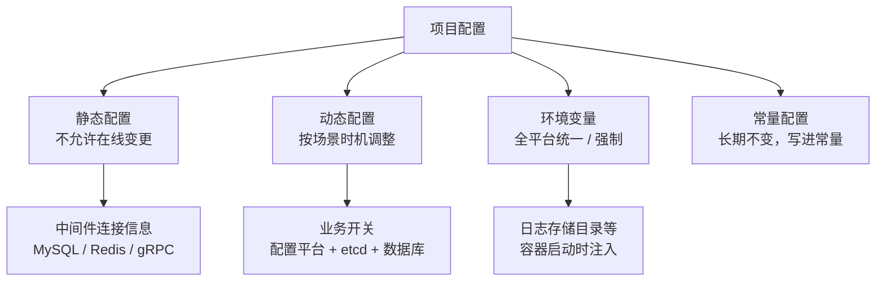
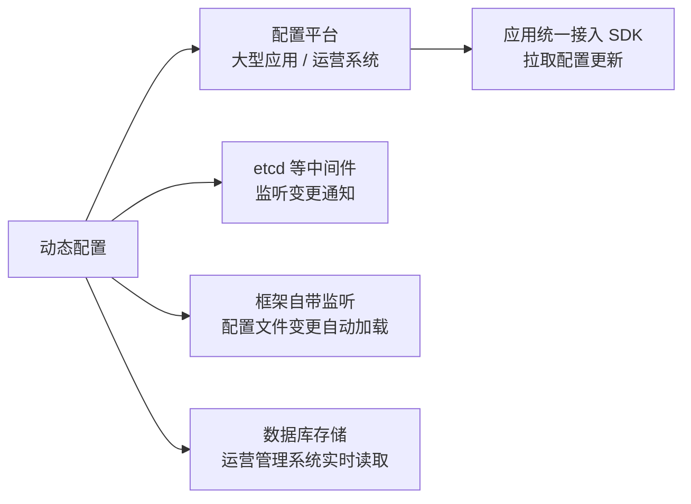
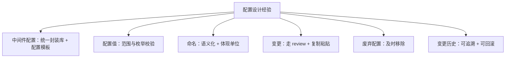
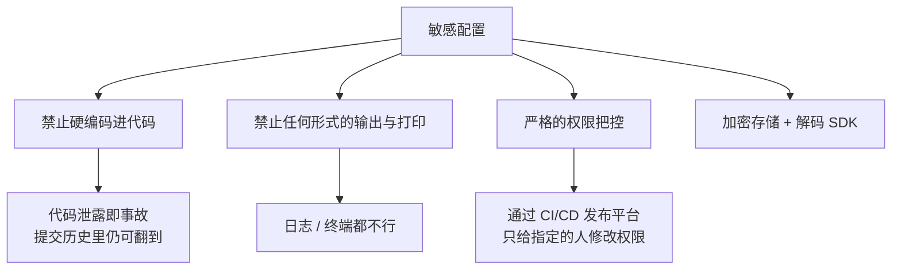
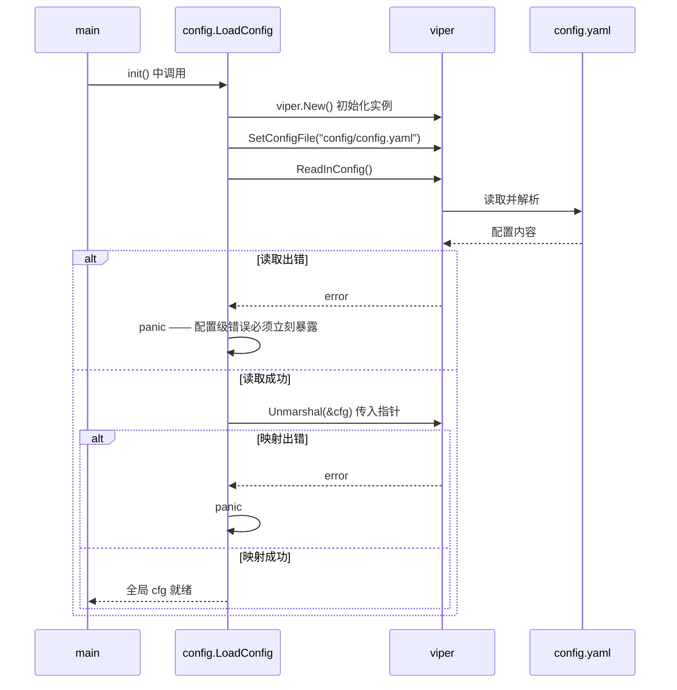

# Go 项目开发: 项目配置的分类设计与安全管理

配置看起来不起眼，**但在项目中发挥着至关重要的角色**。实际开发里亲眼见证过不少大型事故现场，**最终追查下来都是配置的问题**。

**配置文件设计不合理，一个小小的错误被发布到线上，就可能导致一次事故的发生。**

所以这一节把配置管理讲透：**配置分哪几类、设计上有哪些经验、敏感配置怎么保安全、Go 工程里怎么用 viper 读取**。

## 纲要

- 配置虽小，事故源头
- 静态配置：不允许在线变更
- 动态配置：按场景和时机调整
- 环境变量：全平台统一或强约束
- 常量配置：长期不变就写死
- 设计配置的经验与技巧
- 敏感配置的安全性设计
- viper 读取配置的完整流程
- 监听配置变更与重新加载
- Go 侧：手写一个配置中心内核

## 配置虽小，事故源头

先看一张分类图，后面逐个展开：



## 静态配置：不允许在线变更

**静态配置就是不允许在线变更的配置**，主要是**中间件连接的信息**，比如 **MySQL、Redis、gRPC** 这些配置。

**这类配置在线实时变更的风险非常大。** 设想一下：**服务正在执行一个事务，由于配置变更，前后操作了两个不同的数据库集群** —— 会发生什么样的不可预见异常，谁也说不清。

所以针对这类配置，**通常要走一次完整的发版流程**。**这类配置也是我们项目中的主要配置。**

## 动态配置：按场景和时机调整

**动态配置是应用中需要根据特定的场景和时机来调整的配置**，比如**业务流程中的一些开关，需要动态频繁地切换**。

几条常见实现路径：



- **大型应用或者运营系统会有单独的配置平台**来管理配置，并通过配置平台完成修改，**各应用统一接入配置平台的 SDK 来获取配置更新**。
- **结合 etcd 等中间件可以很方便地实现配置的动态变更** —— 配置变更时能监听到，从而实现配置的动态切换。
- 课程中使用的微服务框架本身**也能监听到配置文件的变更，实时读取最新的配置项**。
- 对于一些**内部的运营和管理系统，甚至可以直接用数据库来存储配置**，获取配置时做**实时读取**，同样能实现动态更新。

## 环境变量：全平台统一或强约束

有些配置**全平台统一，或者具有强制性**，这类配置适合放环境变量。

典型例子是**日志存储目录**：**如果由开发人员指定，很容易配置到非数据盘**。想想后果 —— **大量日志写入系统盘，系统盘被写爆，运行在这台机器上的应用也会跟着异常**。

所以这类配置**一般在容器启动的时候，就直接写到容器的环境变量当中**，不给业务侧自由发挥的空间。

## 常量配置：长期不变就写死

还有一类是**常量配置**：**长时间都可能不会变更**。

**这类配置直接定义到常量当中即可** —— 好处是**避免维护过多的配置项**。配置项越多，出错面越大，能被常量覆盖掉的就别放进配置文件。

## 设计配置的经验与技巧



**中间件配置要统一封装。** 提供**统一的封装库和配置模板**来统一约束和管理配置，**避免工程之间互相拷贝配置而导致线上事故** —— 拷配置是事故高发动作。

**配置值要做合理性校验。** 特别是针对**可枚举的配置值，需要确保在枚举范围内**。这种校验逻辑**可以直接在程序代码中实现**，一旦发现不合理的配置范围，**及时抛出异常**。

**配置项命名要语义化，并尽可能体现配置使用的单位。** 以 HTTP 请求超时时间为例：

```txt
timeout                        ← 看不出是什么的超时
http_request_timeout           ← 知道是 HTTP 超时，但不知道单位
http_request_timeout_seconds   ← 名字里就带着含义与单位，一眼看懂
```

**配置项的变更也要做 review。** 更新线上配置时，**手误导致的拼写错误非常常见**。对于**影响程序运行的重要配置的变更，最好经过团队成员复核后，通过复制粘贴的方式更新到线上环境** —— 不要用手工敲。

**不使用的配置要及时从代码中移除掉。** 留着只会误导后来人。

**不经常变更的配置可以直接定义成常量**（**敏感配置除外**，比如接口的私钥）。

**必须有记录配置操作和变更历史的能力，并提供回滚能力。** 新配置上线出了问题，**要能及时回滚到旧配置**。如果旧配置管理不当，**很可能会造成更新配置后旧配置丢失，无法第一时间回滚** —— 这是最要命的。

## 敏感配置的安全性设计

比如 **MySQL 密码、私钥**这类信息，安全性怎么保证？



- **敏感信息不允许直接编码到代码中。** 一旦代码泄露，业务系统很容易出现安全事故；而且**硬编码的配置即使在代码中被移除了，在提交的历史版本里依然看得到**。这种行为在大厂**一般会直接写进安全事故责任相关的制度**。
- **敏感配置禁止一切形式的输出和打印** —— 包括**记录到日志当中，或者打印到终端**。
- **核心的数据库密码都会进行严格的权限把控**，一般开发人员并没有权限知道。
- 这类配置**一般通过 CI/CD 工具在发布平台上只给指定的人修改权限**；**配置值一般也是加密后的值，代码读取时经过解码 SDK 转换成原始配置**。
- 对于**私有化部署的业务**，这些设计在安全保障中尤为重要。

## viper 读取配置的完整流程

**viper 是 Go 工程中普遍使用的配置读取工具**，使用相对简单但功能强大，基本能满足我们定义配置文件的读取需求。

用法分两步走：**先定义配置文件和对应的结构体**，**再用 viper 解析**。

```dir
search-service/
├── config/
│   ├── config.go        定义 Config 结构体 + LoadConfig
│   └── config.yaml      应用配置 + 中间件配置
└── main.go              init 里加载，main 里使用
```

**定义结构体时要注意**：结构体里**配置项键的名字，必须和 tag 后面的名字保持一致**，也就是和配置文件里的键名保持一致，否则解析不到。

```go
package main

import "fmt"

// Config 顶层配置：每个配置段一个结构体，对应 viper.Unmarshal 的目标。
type Config struct {
	App   AppConfig   `mapstructure:"app"`
	MySQL MySQLConfig `mapstructure:"mysql"`
}

type AppConfig struct {
	RunMode  string `mapstructure:"runmode"`
	HTTPPort int    `mapstructure:"httpport"`
}

type MySQLConfig struct {
	Host string `mapstructure:"host"`
	Port int    `mapstructure:"port"`
}

func main() {
	cfg := Config{App: AppConfig{RunMode: "dev", HTTPPort: 9090}}
	fmt.Printf("%+v\n", cfg)
}
```

**加载流程**是这样的：



几个关键点：

- **`ReadInConfig()` 会返回 error，必须处理。** 出错就 **panic** —— **这种严重级别的错误一定要及时抛出来**，不能让服务带着一份残缺配置启动。
- **映射用 `Unmarshal`，传的参数必须是指针类型。** 如果定义的全局 `Config` 变量已经是指针，就不用再取地址。
- **`Unmarshal` 同样返回 error，也要判断并 panic。** **配置级别的错误很严重，我们需要立刻知道配置有问题。**

## 监听配置变更与重新加载

配置解析完成后，还可以**监听配置文件的变更** —— **不过在静态配置当中不建议做这一步**。

```txt
viper.WatchConfig()
viper.OnConfigChange(func(e fsnotify.Event) {
	fmt.Println("配置发生变更：", e.Name)
	// 变更之后必须重新 Unmarshal，把新配置刷进全局变量
	if err := viper.Unmarshal(cfg); err != nil {
		panic(err)
	}
})
```

注意回调里那一步：**配置变更后要重新执行一次 `Unmarshal`**，把新配置赋值给全局的 `cfg` 变量，否则读到的还是旧值。

回调参数的类型是 **`fsnotify.Event`**，需要导入 `github.com/fsnotify/fsnotify` 包。

## API 速览

| 能力 | 用法 |
| --- | --- |
| 初始化实例 | `v := viper.New()` |
| 指定配置文件 | `v.SetConfigFile("config/config.yaml")` |
| 读取配置 | `v.ReadInConfig()`（**返回 error，出错即 panic**） |
| 映射到结构体 | `v.Unmarshal(&cfg)`（**必须传指针**） |
| 监听变更 | `v.WatchConfig()` |
| 变更回调 | `v.OnConfigChange(func(e fsnotify.Event) {...})` |
| 结构体 tag | `` `mapstructure:"app"` ``（**键名要与配置文件一致**） |
| 事件类型 | `fsnotify.Event`（需导入 `fsnotify` 包） |
| 环境变量注入 | 容器启动时写入 `env`，程序用 `os.Getenv` 读取 |
| 敏感配置 | 加密存储 + 解码 SDK，**禁止打印** |

## Demo 示例

一个完整的 Go 程序，**手写配置中心内核**：配置文件解析 → 反射映射到结构体（对应 `viper.Unmarshal`）、**加载失败立即 panic**、**四类配置的变更策略**（静态拒绝热更 / 动态可热更并触发回调）、**命名规范与单位校验**、**枚举值合理性校验**、**环境变量覆盖**、**敏感配置脱敏**、**变更历史与回滚**。纯标准库，可直接跑。

**运行说明**

- 需要 Go 1.18+（用到 `reflect`、`strconv`、`sort`、`os`，1.21 验证通过）。
- 无第三方依赖，保存为 `main.go` 后执行 `go run main.go`。
- 配置文件用**极简 `key: value` + `[section]`** 文本表示（`viper` 支持 yaml/json/toml，这里为自包含做简化），演示的是**解析与映射的机制**，不是格式本身。

```go
package main

import (
	"fmt"
	"os"
	"reflect"
	"sort"
	"strconv"
	"strings"
)

// ================================================================ 配置分类

type Kind string

const (
	KindStatic   Kind = "静态配置" // 不允许在线变更，走发版流程
	KindDynamic  Kind = "动态配置" // 按场景时机调整，支持热更
	KindEnv      Kind = "环境变量" // 容器启动时注入
	KindConst    Kind = "常量配置" // 长期不变，直接写进常量
)

var kinds = map[string]Kind{
	"mysql.host":        KindStatic,
	"mysql.dsn":         KindStatic,
	"redis.addr":        KindStatic,
	"grpc.endpoint":     KindStatic,
	"biz.risk_switch":   KindDynamic,
	"biz.search_ratio":  KindDynamic,
	"log.dir":           KindEnv,
	"app.max_page_size": KindConst,
}

// CanHotUpdate 判断某个配置项是否允许在线变更。
func CanHotUpdate(key string) bool {
	return kinds[key] == KindDynamic
}

// ================================================================ 配置解析与映射

// Parse 解析极简配置文本：支持 [section] 与 key: value，# 开头为注释。
func Parse(text string) map[string]string {
	out := map[string]string{}
	section := ""
	for _, line := range strings.Split(text, "\n") {
		line = strings.TrimSpace(line)
		if line == "" || strings.HasPrefix(line, "#") {
			continue
		}
		if strings.HasPrefix(line, "[") && strings.HasSuffix(line, "]") {
			section = line[1 : len(line)-1]
			continue
		}
		i := strings.Index(line, ":")
		if i < 0 {
			continue
		}
		k := strings.TrimSpace(line[:i])
		v := strings.TrimSpace(line[i+1:])
		if section != "" {
			k = section + "." + k
		}
		out[k] = v
	}
	return out
}

// Unmarshal 把配置映射进结构体，对应 viper.Unmarshal。dst 必须是指针。
func Unmarshal(dst interface{}, kv map[string]string) error {
	v := reflect.ValueOf(dst)
	if v.Kind() != reflect.Ptr || v.Elem().Kind() != reflect.Struct {
		return fmt.Errorf("dst 必须是指向结构体的指针")
	}
	return fillStruct(v.Elem(), "", kv)
}

func fillStruct(v reflect.Value, prefix string, kv map[string]string) error {
	t := v.Type()
	for i := 0; i < t.NumField(); i++ {
		f := t.Field(i)
		tag := f.Tag.Get("cfg")
		if tag == "" {
			tag = strings.ToLower(f.Name)
		}
		key := tag
		if prefix != "" {
			key = prefix + "." + tag
		}
		fv := v.Field(i)
		if fv.Kind() == reflect.Struct {
			if err := fillStruct(fv, key, kv); err != nil {
				return err
			}
			continue
		}
		raw, ok := kv[key]
		if !ok {
			continue
		}
		if err := setScalar(fv, raw); err != nil {
			return fmt.Errorf("配置项 %s：%w", key, err)
		}
	}
	return nil
}

func setScalar(fv reflect.Value, raw string) error {
	switch fv.Kind() {
	case reflect.String:
		fv.SetString(raw)
	case reflect.Int, reflect.Int64:
		n, err := strconv.Atoi(raw)
		if err != nil {
			return fmt.Errorf("期望整数，实际 %q", raw)
		}
		fv.SetInt(int64(n))
	case reflect.Bool:
		b, err := strconv.ParseBool(raw)
		if err != nil {
			return fmt.Errorf("期望布尔值，实际 %q", raw)
		}
		fv.SetBool(b)
	default:
		return fmt.Errorf("不支持的字段类型 %s", fv.Kind())
	}
	return nil
}

// ================================================================ 业务配置结构体

type App struct {
	RunMode  string `cfg:"runmode"`
	HTTPPort int    `cfg:"httpport"`
}

type MySQL struct {
	Host     string `cfg:"host"`
	Port     int    `cfg:"port"`
	Password string `cfg:"password"`
}

type Biz struct {
	RiskSwitch  bool   `cfg:"risk_switch"`
	SearchRatio string `cfg:"search_ratio"`
}

type Config struct {
	App   `cfg:"app"`
	MySQL `cfg:"mysql"`
	Biz   `cfg:"biz"`
}

// LoadConfig 配置级错误必须立刻暴露，所以直接 panic。
func LoadConfig(text string) *Config {
	cfg := &Config{}
	if err := Unmarshal(cfg, Parse(text)); err != nil {
		panic(err)
	}
	return cfg
}

// ================================================================ 命名规范与枚举校验

var unitSuffix = []string{"_seconds", "_ms", "_millis", "_minutes", "_bytes", "_mb", "_qps", "_percent"}
var durationWords = []string{"timeout", "interval", "ttl", "expire", "delay"}

// LintName 语义化与单位校验：含时长语义却没带单位后缀，就提示补全。
func LintName(key string) (bool, string) {
	lower := strings.ToLower(key)
	needUnit := false
	for _, w := range durationWords {
		if strings.Contains(lower, w) {
			needUnit = true
			break
		}
	}
	if !needUnit {
		return true, "命名无歧义"
	}
	for _, s := range unitSuffix {
		if strings.HasSuffix(lower, s) {
			return true, "单位已在名字里：" + s
		}
	}
	return false, "含时长语义却没有单位后缀，建议改成 " + lower + "_seconds"
}

type EnumSpec struct {
	Key     string
	Allowed []string
}

// CheckEnums 可枚举配置值必须落在配置范围内，否则直接抛错。
func CheckEnums(kv map[string]string, specs []EnumSpec) []string {
	bad := []string{}
	for _, s := range specs {
		v, ok := kv[s.Key]
		if !ok {
			continue
		}
		hit := false
		for _, a := range s.Allowed {
			if v == a {
				hit = true
				break
			}
		}
		if !hit {
			bad = append(bad, fmt.Sprintf("%s=%q 不在允许范围 %v 内", s.Key, v, s.Allowed))
		}
	}
	return bad
}

// ================================================================ 敏感配置脱敏

var sensitiveWords = []string{"password", "passwd", "secret", "private_key", "token", "access_key"}
var sensitiveTokens = map[string]bool{"ak": true, "sk": true, "key": true}

// Mask 敏感配置禁止任何形式的输出，对外一律打码。
// 注意按 token 而不是子串匹配，否则 risk_switch 会被 "sk" 误伤。
func Mask(key, val string) string {
	lower := strings.ToLower(key)
	for _, w := range sensitiveWords {
		if strings.Contains(lower, w) {
			return strings.Repeat("*", 8)
		}
	}
	for _, t := range strings.FieldsFunc(lower, func(r rune) bool {
		return r == '.' || r == '_' || r == '-'
	}) {
		if sensitiveTokens[t] {
			return strings.Repeat("*", 8)
		}
	}
	return val
}

// ================================================================ 配置存储：历史与回滚

type Change struct {
	Key    string
	Old    string
	New    string
	Who    string
	Seq    int
}

type Store struct {
	data    map[string]string
	history []Change
	seq     int
	onChg   []func(key, oldVal, newVal string)
}

func NewStore(kv map[string]string) *Store {
	cp := map[string]string{}
	for k, v := range kv {
		cp[k] = v
	}
	return &Store{data: cp}
}

// OnChange 注册变更回调，对应 viper.OnConfigChange。
func (s *Store) OnChange(fn func(key, oldVal, newVal string)) {
	s.onChg = append(s.onChg, fn)
}

// Set 写入配置：静态配置拒绝热更，动态配置记录历史并触发回调。
func (s *Store) Set(key, val, who string) error {
	if k, ok := kinds[key]; ok && k == KindStatic {
		return fmt.Errorf("%s 属于%s，不允许在线变更，请走完整发版流程", key, KindStatic)
	}
	old := s.data[key]
	s.seq++
	s.data[key] = val
	s.history = append(s.history, Change{Key: key, Old: old, New: val, Who: who, Seq: s.seq})
	for _, fn := range s.onChg {
		fn(key, old, val)
	}
	return nil
}

// Rollback 回滚到上一个版本。旧配置管理不当导致无法回滚，是最要命的。
func (s *Store) Rollback(key string) (string, bool) {
	for i := len(s.history) - 1; i >= 0; i-- {
		if s.history[i].Key != key {
			continue
		}
		c := s.history[i]
		s.data[key] = c.Old
		s.history = s.history[:i]
		return c.Old, true
	}
	return "", false
}

func (s *Store) History(key string) []Change {
	out := []Change{}
	for _, c := range s.history {
		if c.Key == key {
			out = append(out, c)
		}
	}
	return out
}

// ApplyEnv 环境变量覆盖：容器启动时注入的配置优先级最高。
func (s *Store) ApplyEnv(prefix string) []string {
	hit := []string{}
	for _, e := range os.Environ() {
		i := strings.Index(e, "=")
		if i < 0 {
			continue
		}
		name, val := e[:i], e[i+1:]
		if !strings.HasPrefix(name, prefix) {
			continue
		}
		key := strings.ToLower(strings.ReplaceAll(strings.TrimPrefix(name, prefix), "__", "."))
		if _, ok := s.data[key]; !ok {
			continue
		}
		s.data[key] = val
		hit = append(hit, fmt.Sprintf("%s -> %s = %s", name, key, val))
	}
	sort.Strings(hit)
	return hit
}

// ================================================================ 演示

const confText = `
# 全局配置（不属于任何 section），会被环境变量覆盖
log.dir: /home/app/logs

# 应用配置
[app]
runmode: dev
httpport: 9090

# 中间件配置（静态配置）
[mysql]
host: 127.0.0.1
port: 3306
password: p@ssw0rd

# 业务配置（动态配置）
[biz]
risk_switch: true
search_ratio: half
`

func main() {
	fmt.Println("=== 配置的分类 ===")
	keys := make([]string, 0, len(kinds))
	for k := range kinds {
		keys = append(keys, k)
	}
	sort.Strings(keys)
	fmt.Printf("  %-20s %-10s %s\n", "配置项", "分类", "允许在线变更")
	for _, k := range keys {
		fmt.Printf("  %-20s %-10s %t\n", k, kinds[k], CanHotUpdate(k))
	}

	fmt.Println("\n=== 解析配置并映射到结构体 ===")
	cfg := LoadConfig(confText)
	fmt.Printf("  app.runmode       = %s\n", cfg.RunMode)
	fmt.Printf("  app.httpport      = %d\n", cfg.HTTPPort)
	fmt.Printf("  mysql.host:port   = %s:%d\n", cfg.Host, cfg.Port)
	fmt.Printf("  biz.risk_switch   = %t\n", cfg.RiskSwitch)
	fmt.Printf("  biz.search_ratio  = %s\n", cfg.SearchRatio)

	fmt.Println("\n=== 配置级错误必须立刻暴露（panic）===")
	func() {
		defer func() {
			if r := recover(); r != nil {
				fmt.Println("  捕获 panic：", r)
			}
		}()
		bad := "[app]\nhttpport: not-a-number\n"
		_ = LoadConfig(bad)
	}()

	fmt.Println("\n=== 命名规范：语义化 + 体现单位 ===")
	for _, k := range []string{"timeout", "http_request_timeout", "http_request_timeout_seconds", "biz.risk_switch", "mysql.ttl_ms"} {
		ok, why := LintName(k)
		mark := "OK  "
		if !ok {
			mark = "WARN"
		}
		fmt.Printf("  [%s] %-32s %s\n", mark, k, why)
	}

	fmt.Println("\n=== 枚举值合理性校验 ===")
	kv := Parse(confText)
	kv["app.runmode"] = "deu" // 模拟手误拼写
	if bad := CheckEnums(kv, []EnumSpec{{"app.runmode", []string{"dev", "test", "prod"}}}); len(bad) > 0 {
		for _, b := range bad {
			fmt.Println("  " + b)
		}
	}

	fmt.Println("\n=== 静态配置拒绝热更 / 动态配置可热更 ===")
	store := NewStore(kv)
	store.OnChange(func(key, oldVal, newVal string) {
		fmt.Printf("  回调：%s 由 %q 变为 %q，已重新加载\n", key, oldVal, newVal)
	})
	if err := store.Set("mysql.host", "10.0.0.9", "zhangsan"); err != nil {
		fmt.Println("  拒绝：", err)
	}
	_ = store.Set("biz.search_ratio", "full", "zhangsan")

	fmt.Println("\n=== 环境变量覆盖（容器启动时注入）===")
	_ = os.Setenv("APP__LOG__DIR", "/data/logs")
	_ = os.Setenv("APP__APP__HTTPPORT", "9091")
	for _, h := range store.ApplyEnv("APP__") {
		fmt.Println("  " + h)
	}
	fmt.Printf("  log.dir 已被强制改为 %s（避免写爆系统盘）\n", store.data["log.dir"])

	fmt.Println("\n=== 敏感配置脱敏：禁止任何形式的输出 ===")
	for _, k := range []string{"mysql.password", "mysql.host", "biz.risk_switch"} {
		fmt.Printf("  %-20s = %s\n", k, Mask(k, store.data[k]))
	}

	fmt.Println("\n=== 变更历史与回滚 ===")
	for _, c := range store.History("biz.search_ratio") {
		fmt.Printf("  #%d %s: %q -> %q (by %s)\n", c.Seq, c.Key, c.Old, c.New, c.Who)
	}
	if old, ok := store.Rollback("biz.search_ratio"); ok {
		fmt.Printf("  回滚成功，biz.search_ratio 恢复为 %q\n", old)
	}
}
```

**代码说明**

- `Unmarshal` + `fillStruct` 用**反射**复刻 `viper.Unmarshal` 的核心机制：**按 `cfg` tag 拼出配置键 → 在 map 里查找 → 按字段类型做字符串到标量（`string` / `int` / `bool`）的转换**。tag 与配置文件键名对不上就解析不到，这正是课程里反复强调"两边命名必须保持一致"的原因。
- `LoadConfig` 里 **`err != nil` 就直接 panic**：配置级错误不能吞，**服务带着残缺配置启动比启动失败危险得多**。
- `CanHotUpdate` 把**配置分类落到代码里**：静态配置（MySQL / Redis / gRPC 连接信息）在 `Set` 时**直接拒绝**，强制走发版流程；动态配置允许热更并**触发已注册的回调**（对应 `viper.OnConfigChange`）。
- `ApplyEnv` 演示**环境变量覆盖**：`APP__LOG__DIR` → `log.dir`，**双下划线映射成点号**。这对应"容器启动时把日志目录直接写进环境变量"，不给业务侧配到系统盘的机会。
- `Mask` 实现**敏感配置禁止输出**：键名里命中 `password` / `secret` / `token` / `ak` / `sk` 等词一律打码，**无论是打日志还是打终端**。
- `Store` 维护**变更历史链表**，`Rollback` 从后往前找该 key 的最后一次变更并回退 —— 这解决的就是"旧配置丢失、出了问题没法第一时间回滚"的痛点。
- `LintName` 与 `CheckEnums` 把两条经验固化成检查：**时长类配置名必须带单位后缀**、**可枚举值必须落在允许范围内**。

**技术点总结**

- **配置虽小，却是事故源头**：设计不合理，一个小错误发到线上就是一次事故。
- **静态配置不允许在线变更**（中间件连接信息为主），在线变更可能让一个事务前后打到两个数据库集群，**必须走完整发版流程**。
- **动态配置按场景和时机调整**：配置平台 + SDK、etcd 监听、框架自带监听、数据库实时读取，都是可行路径。
- **环境变量承载全平台统一或强制的配置**（如日志目录），**在容器启动时注入**，避免业务侧配到系统盘把盘写爆。
- **长期不变的配置直接定义成常量**，减少配置项维护面。
- **经验清单**：中间件配置**统一封装库 + 配置模板**（杜绝跨工程拷配置）；配置值做**范围与枚举校验**，不合理就抛异常；命名**语义化且带单位**（`http_request_timeout_seconds`）；变更**走 review 并复制粘贴**；废弃配置**及时移除**；**保留变更历史 + 可回滚**。
- **敏感配置**：**禁止硬编码**（提交历史仍可翻到）、**禁止任何形式的输出与打印**、**严格权限把控**、**加密存储 + 解码 SDK**，只给指定的人在 CI/CD 发布平台上修改。
- **viper 流程**：`New()` → `SetConfigFile()` → `ReadInConfig()`（出错 panic）→ `Unmarshal(&cfg)`（**必须传指针**，出错 panic）→ 可选 `WatchConfig()` + `OnConfigChange`（**回调里要重新 Unmarshal**）。

## 总结

配置管理的本质，是**把"改错的代价"降到最低**：分类是为了**搞清哪些能热更、哪些必须走发版**；规范命名与枚举校验是为了**让错误在启动时就暴露**；脱敏与权限是为了**防止泄露**；变更历史与回滚是为了**出事时能第一时间退回去**。

**配置出事往往不是因为复杂，而是因为没人把它当回事。** 把这一节那几条经验落到代码里，比事后复盘有用得多。

