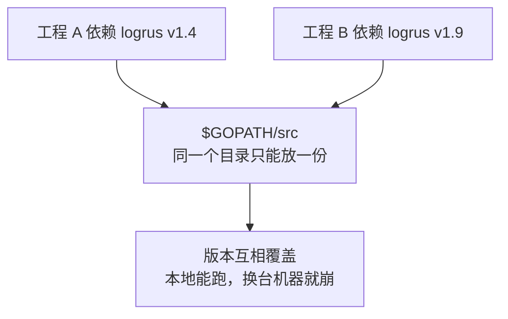
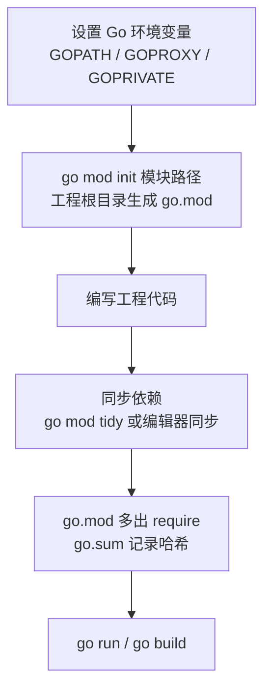
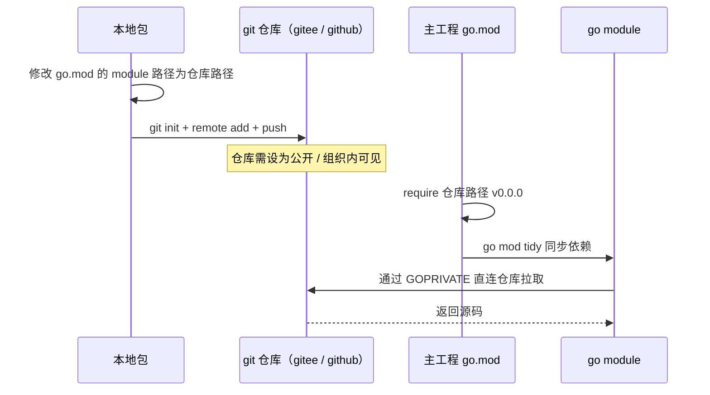
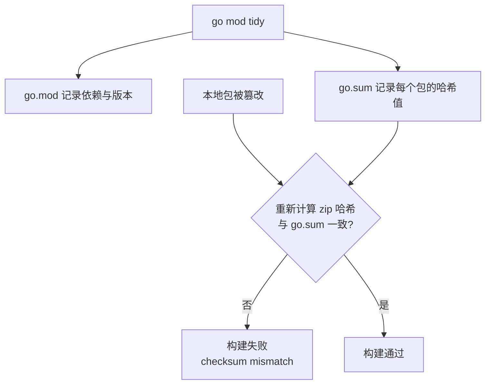

# Go 项目开发: Go 项目中的包管理最佳实践

用过 Go 的小伙伴都知道，**Go 的一大特点就是面向包的编程设计**。前面详细学过面向包的目录结构，这一节继续往下走 —— **Go 项目中包管理的最佳实践**。

三件事：**Go 开发中包的几种管理方式**、**go module 的详细使用**、**如何管理内部的私有包**。

## 纲要

- 面向包的编程设计
- 包管理的演进：GOPATH / vendor / go module
- 为什么 GOPATH 模式撑不住多版本
- go module 的使用步骤
- `go.mod` 里的关键词：`module` / `go` / `require` / `replace` / `exclude`
- 用 `replace` 导入本地包
- 把包传到 git 仓库当私有包用
- `GOPRIVATE`：让自有仓库不走代理
- `go.sum` 哈希校验与豁免场景
- `go mod vendor` 与离线编译
- Go 侧：手写一个 go.mod 解析与依赖治理工具

## 面向包的编程设计

Go 的工程组织是以**包**为中心的：目录结构按包划分，可见性由**首字母大小写**和 **`internal`** 共同约束。包管理则是这套设计的地基 —— 地基不稳，上层全抖。

## 包管理的演进：GOPATH / vendor / go module


| 方式 | 时代 | 关键特征 |
| --- | --- | --- |
| **GOPATH** | 早期 | 代码必须放在 `$GOPATH/src` 下，`go get` 拉的包也下载到 `$GOPATH/src` |
| **vendor** | Go 1.5 起（**1.6 默认开启**） | **依然依赖 GOPATH 配置**，从项目中分析出依赖包，并从 GOPATH 复制到工程自己的 `vendor/` 目录 |
| **go module** | Go 1.11 起（**1.13 默认开启，1.14 正式发布**） | **不用关心 GOPATH**，也无需把代码放到 `$GOPATH/src`；像 Java 的 maven 那样管理第三方依赖 |

**GOPATH 目录下除了 `src`，还有 `bin` 和 `pkg` 两个目录**：

- **`bin`** 存放编译后的二进制文件。
- **`pkg`** 存放编译文件，**主要用来加快程序后续的编译速度**。

### 为什么 GOPATH 模式撑不住

**由于所有的工程都使用 GOPATH 来存放依赖包，如果有工程依赖了不同的版本，就不适用了。**



这就是 vendor 出现的直接原因 —— **把依赖复制一份到工程自己的 `vendor/` 下**，每个工程各用各的。但 vendor **依然依赖 GOPATH 的配置**，只是把"分析依赖 + 复制"这件事自动化了。

**go module 模式已经成为行规。** 它**使得包管理的方式更便捷统一**，**支持使用代理和配置私有仓库**，而且 **`go.mod` 和 `go.sum` 两个文件清晰地记录了工程依赖了哪些包，以及每个包具体的版本**。

如果你手上的 Go 工程还不是通过 go module 管理，或者即将开启新的 Go 工程项目 —— **强烈建议统一使用 go module**。

## go module 的使用步骤



一个最小可复现的例子：工程里 `main.go` 调用了 `logrus` 包的 `Warn` 方法，直接 `go run main.go` 会**提示找不到模块** —— 因为这个包**需要先下载缓存到本地**，而默认情况下它会从 GOPATH 里去找，本地没有就会失败。

```bash
go mod init github.com/xxx/gomodedemo     # 初始化，生成 go.mod
go mod tidy                               # 自动解决依赖，go.mod 里多出 require
go run main.go                            # 这次就能正常执行了
```

## `go.mod` 里的关键词

```txt
module  github.com/xxx/gomodedemo     定义当前项目的模块路径（根路径，就是 go mod init 时指定的那个）

go      1.21                           标识当前模块使用的 Go 语言版本（仅作标识，没有强制性作用）

require github.com/sirupsen/logrus v1.9.3     声明本模块需要哪个版本的哪个依赖
require github.com/xxx/gomodedemo1 v0.0.0     本地包 / 私有包同样走 require 引入

replace github.com/xxx/demo1 => ../demo1      替换源码：import 时把左边的包换成右边的部分

exclude github.com/sirupsen/logrus v1.8.0     排除指定的依赖包版本
```

逐个说清楚：

| 关键词 | 含义 |
| --- | --- |
| **`module`** | **定义当前项目的模块路径**，是项目的一个根路径，就是 `go mod init` 时指定的那个名字 |
| **`go`** | **标识当前模块 Go 语言的版本**，**只是一个标识，并没有强制性的作用** |
| **`require`** | **说明这个模块需要什么版本的什么依赖** |
| **`replace`** | **替换源码**：在 import 的时候，**把 `replace` 左边的包替换成右边的部分** |
| **`exclude`** | **排除指定的依赖包**；平时并不常用，**除非明确知道某个版本有严重 bug** |

`replace` 的用途不止"换成本地路径" —— **把 github 上的包替换成其他平台上的第三方包**，同样是可以的。

## 用 `replace` 导入本地包

场景：`gomodedemo` 工程要调用本地另一个工程 `gomodedemo1` 里的 `pkg/demo1` 包。

直接 `go mod tidy` 会失败 —— 它会**拿着 `github.com/xxx/demo1` 这个路径去 goproxy 上找，而我们并没有把它传到任何网站上**，自然拉不到。

解法就是 **`replace`**：

```txt
require github.com/xxx/demo1 v0.0.0
replace github.com/xxx/demo1 => ../gomodedemo1
```

- **左边是包的根路径地址**，**右边是这个包在本地的路径**，**可以使用相对路径**（比如当前目录的上一级目录下的 `gomodedemo1`）。
- 这样就把本地的包**映射**到了项目使用的 `github.com/xxx/demo1` 这个包路径上。

前置条件是**本地那个包也要先 `go mod init`**，否则它不是一个合法模块。之后执行 `go mod tidy`（或者用编辑器自带的同步功能，**两者效果一模一样**），依赖就能加载进来，`go run` 时两边的方法都能正常打印。

## 把包传到 git 仓库当私有包用

除了 `replace` 导入本地包，也可以**把自己开发的包直接提交到内部的 git 仓库上，再通过 go module 使用内部仓库的这些包**。

企业研发过程中经常要**沉淀一些公共包给不同项目使用**，比如**中间件 SDK 的集成**：

- 一方面**避免重复造轮子**；
- 另一方面**统一使用规范**，甚至**可以在这些 SDK 上做一些限流、熔断的策略**，比如**对 MySQL 的执行限制查询条数**。

操作流程：



要点：

- **修改包里 `go.mod` 的 `module` 路径，改成仓库的路径**（去掉协议头，只保留路径部分，比如 `gitee.com/xxx/gomodedemo1`）。
- 导入时**包路径要写全**：`demo1` 方法在 `pkg` 目录下面的 `demo1` 包里，所以导入路径就是**仓库根路径 + `/pkg/demo1`**。

## `GOPRIVATE`：让自有仓库不走代理

**首先要确保配置了 `GOPRIVATE`。被 `GOPRIVATE` 匹配的自有仓库域名，是不会走 `GOPROXY` 的** —— 因为**内部仓库一般在 goproxy 上是访问不到的**。

```bash
go env -w GOPRIVATE=gitee.com/xxx,git.internal.com
go env -w GOPROXY=https://goproxy.cn,direct
```

`GOPRIVATE` 是一个**逗号分隔的域名/路径前缀列表**，命中即走直连，同时**还会影响 `go.sum` 的校验行为**（见下节）。

## `go.sum` 哈希校验与豁免场景

**使用 go module 模式进行工程编译时，还会对依赖包进行哈希校验** —— 目的很明确：**防止 go module 中的包被篡改**。



- **`go.sum` 的每一行由三部分组成：包的模块名 + 包的具体版本号 + 包的哈希值。**
- **哈希值主要是通过包的 zip 包计算出来的。**
- **当本地的包被篡改之后，就与 `go.sum` 中记录的哈希值不一样，工程也就无法构建。**

两种**豁免校验**的场景：

- **使用了 `GOPRIVATE` 以后，`GOPRIVATE` 匹配到的包不会做 sum 校验。**
- **`go mod vendor` 打包到 `vendor/` 目录中的包，也不会再做校验。**

## `go mod vendor` 与离线编译

**`go mod vendor` 命令可以将当前项目的依赖包全部下载到当前目录的 `vendor/` 目录中，供我们做离线编译。**

执行前工程里没有 `vendor` 目录，执行后依赖包全部解析并复制进去 —— **下次编译时直接从这里获取依赖包**。

配合前面学的：**Go 1.14 之后不需要再加 `-mod=vendor` 参数**，直接 `go build` 即可。

## API 速览

| 能力 | 命令 / 写法 |
| --- | --- |
| 初始化模块 | `go mod init github.com/xxx/gomodedemo` |
| 同步依赖 | `go mod tidy`（与编辑器同步功能等价） |
| 生成 vendor | `go mod vendor` |
| 走 vendor 编译 | `go build`（Go 1.14+ 自动生效） |
| 下载依赖到本地缓存 | `go mod download` |
| 查看依赖图 | `go mod graph` |
| 查看为什么依赖某个包 | `go mod why -m github.com/sirupsen/logrus` |
| 升级 / 降级版本 | `go get github.com/sirupsen/logrus@v1.9.3` |
| 替换成本地路径 | `replace github.com/xxx/demo1 => ../demo1` |
| 排除有 bug 的版本 | `exclude github.com/sirupsen/logrus v1.8.0` |
| 配置私有仓库 | `go env -w GOPRIVATE=gitee.com/xxx` |
| 配置代理 | `go env -w GOPROXY=https://goproxy.cn,direct` |
| 查看全部环境变量 | `go env` |
| 校验依赖 | `go mod verify` |

## Demo 示例

一个完整的 Go 程序，**手写 go.mod 解析与依赖治理工具**：解析 `go.mod` 的 `module` / `go` / `require` / `replace` / `exclude`，**用 `replace` 把导入路径映射到本地路径**，**检测同一模块的依赖版本冲突**，并复刻 **`go.sum` 哈希校验**（含篡改检测）与 **`GOPRIVATE` / `vendor` 两种豁免场景**。纯标准库，可直接跑。

**运行说明**

- 需要 Go 1.18+（用到 `crypto/sha256`、`path`、`sort`、`strings`，1.21 验证通过）。
- 无第三方依赖，保存为 `main.go` 后执行 `go run main.go`。
- 文本内容内联在常量里，**不依赖真实 go.mod 文件**，任何环境下输出一致。

```go
package main

import (
	"crypto/sha256"
	"fmt"
	"path"
	"sort"
	"strings"
)

// ================================================================ go.mod 模型

type Require struct {
	Path    string
	Version string
}

// Replace 替换源码：import 时把 From 换成 To。
// FromVer 为空表示替换该模块的所有版本。
type Replace struct {
	From    string
	FromVer string
	To      string
	ToVer   string
}

type GoMod struct {
	Module   string
	GoVer    string
	Requires []Require
	Replaces []Replace
	Excludes []Require
}

// stripComment 去掉行尾注释，并裁剪空白。
func stripComment(s string) string {
	if i := strings.Index(s, "//"); i >= 0 {
		s = s[:i]
	}
	return strings.TrimSpace(s)
}

// ParseGoMod 解析 go.mod 文本，支持单行与括号块两种写法。
func ParseGoMod(text string) GoMod {
	m := GoMod{}
	block := ""
	for _, raw := range strings.Split(text, "\n") {
		line := stripComment(raw)
		if line == "" {
			continue
		}
		if block != "" {
			if strings.HasSuffix(line, ")") {
				block = ""
				continue
			}
			fields := strings.Fields(line)
			switch len(fields) {
			case 2:
				m.appendByKind(block, Require{fields[0], fields[1]})
			case 4:
				if block == "replace" && fields[2] == "=>" {
					m.Replaces = append(m.Replaces, Replace{From: fields[0], FromVer: fields[1], To: fields[3]})
				}
			}
			continue
		}
		if strings.HasSuffix(line, "(") {
			block = strings.Fields(line)[0]
			continue
		}
		fields := strings.Fields(line)
		switch {
		case len(fields) == 2 && fields[0] == "module":
			m.Module = fields[1]
		case len(fields) == 2 && fields[0] == "go":
			m.GoVer = fields[1]
		case len(fields) == 3 && fields[0] == "require":
			m.Requires = append(m.Requires, Require{fields[1], fields[2]})
		case len(fields) == 3 && fields[0] == "exclude":
			m.Excludes = append(m.Excludes, Require{fields[1], fields[2]})
		case len(fields) == 4 && fields[0] == "replace" && fields[2] == "=>":
			m.Replaces = append(m.Replaces, Replace{From: fields[1], To: fields[3]})
		}
	}
	return m
}

func (m *GoMod) appendByKind(kind string, r Require) {
	switch kind {
	case "require":
		m.Requires = append(m.Requires, r)
	case "exclude":
		m.Excludes = append(m.Excludes, r)
	}
}

// Resolve 解析导入路径：命中 replace 就换成右边的目标。
func (m GoMod) Resolve(importPath string) string {
	for _, r := range m.Replaces {
		if r.From == importPath {
			if r.ToVer != "" {
				return r.To + "@" + r.ToVer
			}
			return r.To
		}
	}
	return importPath
}

// Conflicts 找出同一模块被 require 了不同版本的情况。
func (m GoMod) Conflicts() [][]Require {
	byPath := map[string][]Require{}
	for _, r := range m.Requires {
		byPath[r.Path] = append(byPath[r.Path], r)
	}
	out := [][]Require{}
	keys := make([]string, 0, len(byPath))
	for k := range byPath {
		keys = append(keys, k)
	}
	sort.Strings(keys)
	for _, k := range keys {
		seen := map[string]bool{}
		uniq := []Require{}
		for _, r := range byPath[k] {
			if !seen[r.Version] {
				seen[r.Version] = true
				uniq = append(uniq, r)
			}
		}
		if len(uniq) > 1 {
			out = append(out, uniq)
		}
	}
	return out
}

// ================================================================ go.sum 校验

type SumLine struct {
	Path    string
	Version string
	Hash    string
}

func ParseGoSum(text string) []SumLine {
	out := []SumLine{}
	for _, raw := range strings.Split(text, "\n") {
		fields := strings.Fields(stripComment(raw))
		if len(fields) != 3 {
			continue
		}
		out = append(out, SumLine{fields[0], fields[1], fields[2]})
	}
	return out
}

// HashZip 模拟 go.sum 的哈希来源：基于包的 zip 内容计算。
func HashZip(content string) string {
	return fmt.Sprintf("h1:%x", sha256.Sum256([]byte(content)))
}

// PrivateMatch 判断模块路径是否被 GOPRIVATE 命中。
// 支持逗号分隔的列表，以及以 * 结尾的前缀通配。
func PrivateMatch(goprivate, modPath string) bool {
	for _, p := range strings.Split(goprivate, ",") {
		p = strings.TrimSpace(p)
		if p == "" {
			continue
		}
		if strings.HasSuffix(p, "*") {
			if strings.HasPrefix(modPath, strings.TrimSuffix(p, "*")) {
				return true
			}
			continue
		}
		if modPath == p || strings.HasPrefix(modPath, p+"/") {
			return true
		}
	}
	return false
}

type VerifyResult struct {
	OK      []string
	Skipped []string
	Bad     []string
}

// Verify 校验依赖哈希。goprivate 命中的包与 vendor 中的包都豁免校验。
func Verify(sums []SumLine, actual map[string]string, goprivate string, vendored map[string]bool) VerifyResult {
	res := VerifyResult{}
	for _, s := range sums {
		if strings.HasSuffix(s.Version, "/go.mod") {
			continue // go.mod 自身的哈希行，这里只校验源码包
		}
		key := s.Path + "@" + s.Version
		if PrivateMatch(goprivate, s.Path) {
			res.Skipped = append(res.Skipped, key+"（GOPRIVATE 命中，不走代理也不做 sum 校验）")
			continue
		}
		if vendored[s.Path] {
			res.Skipped = append(res.Skipped, key+"（已进 vendor 目录，不再校验）")
			continue
		}
		got, ok := actual[key]
		if !ok {
			res.Bad = append(res.Bad, key+"（本地缓存缺失，无法校验）")
			continue
		}
		if got != s.Hash {
			res.Bad = append(res.Bad, fmt.Sprintf("%s：checksum mismatch，包被篡改，工程无法构建", key))
			continue
		}
		res.OK = append(res.OK, key)
	}
	return res
}

// ================================================================ 演示

const modText = `
module github.com/xxx/gomodedemo

go 1.21

require (
	github.com/sirupsen/logrus v1.9.3
	github.com/gin-gonic/gin v1.9.1 // indirect
	github.com/sirupsen/logrus v1.8.0
)

replace github.com/xxx/gomodedemo1 => ../gomodedemo1

exclude github.com/sirupsen/logrus v1.7.0
`

const sumText = `
github.com/sirupsen/logrus v1.9.3 h1:aaa111
github.com/gin-gonic/gin v1.9.1 h1:bbb222
gitee.com/xxx/sdk v0.0.1 h1:ccc333
`

func main() {
	mod := ParseGoMod(modText)

	fmt.Println("=== 解析 go.mod ===")
	fmt.Printf("  module  = %s（项目根路径，go mod init 时指定）\n", mod.Module)
	fmt.Printf("  go      = %s（仅作标识，没有强制性作用）\n", mod.GoVer)
	for _, r := range mod.Requires {
		fmt.Printf("  require = %s %s\n", r.Path, r.Version)
	}
	for _, r := range mod.Replaces {
		fmt.Printf("  replace = %s => %s\n", r.From, r.To)
	}
	for _, r := range mod.Excludes {
		fmt.Printf("  exclude = %s %s（已知该版本有严重 bug）\n", r.Path, r.Version)
	}

	fmt.Println("\n=== replace：把导入路径映射到本地包 ===")
	for _, imp := range []string{
		"github.com/xxx/gomodedemo1/pkg/demo1",
		"github.com/sirupsen/logrus",
	} {
		root := imp
		if i := strings.Index(imp, "/pkg/"); i > 0 {
			root = imp[:i]
		}
		fmt.Printf("  import %-44s → %s\n", imp, path.Join(mod.Resolve(root), strings.TrimPrefix(imp, root)))
	}

	fmt.Println("\n=== 依赖版本冲突检测 ===")
	if cs := mod.Conflicts(); len(cs) == 0 {
		fmt.Println("  未发现同一模块的多版本冲突")
	} else {
		for _, c := range cs {
			vs := []string{}
			for _, r := range c {
				vs = append(vs, r.Version)
			}
			fmt.Printf("  %s 被 require 了多个版本：%v\n", c[0].Path, vs)
		}
	}

	fmt.Println("\n=== go.sum 哈希校验 ===")
	sums := ParseGoSum(sumText)
	actual := map[string]string{
		"github.com/sirupsen/logrus@v1.9.3": "h1:aaa111",
		"github.com/gin-gonic/gin@v1.9.1":   "h1:bbb222",
		"gitee.com/xxx/sdk@v0.0.1":          "h1:ccc333",
	}
	good := Verify(sums, actual, "gitee.com/xxx", map[string]bool{})
	for _, k := range good.OK {
		fmt.Println("  [OK]      " + k)
	}
	for _, k := range good.Skipped {
		fmt.Println("  [SKIP]    " + k)
	}
	for _, k := range good.Bad {
		fmt.Println("  [FAIL]    " + k)
	}

	fmt.Println("\n=== 篡改本地包之后 ===")
	tampered := map[string]string{}
	for k, v := range actual {
		tampered[k] = v
	}
	tampered["github.com/sirupsen/logrus@v1.9.3"] = HashZip("被篡改过的 logrus zip")
	fmt.Printf("  本地包重新计算哈希 = %s\n", tampered["github.com/sirupsen/logrus@v1.9.3"])
	bad := Verify(sums, tampered, "gitee.com/xxx", map[string]bool{})
	for _, k := range bad.OK {
		fmt.Println("  [OK]      " + k)
	}
	for _, k := range bad.Skipped {
		fmt.Println("  [SKIP]    " + k)
	}
	for _, k := range bad.Bad {
		fmt.Println("  [FAIL]    " + k)
	}

	fmt.Println("\n=== vendor 目录中的包豁免校验 ===")
	vendored := map[string]bool{"github.com/gin-gonic/gin": true}
	res := Verify(sums, actual, "gitee.com/xxx", vendored)
	for _, k := range res.OK {
		fmt.Println("  [OK]      " + k)
	}
	for _, k := range res.Skipped {
		fmt.Println("  [SKIP]    " + k)
	}

	fmt.Println("\n=== GOPRIVATE 命中判定 ===")
	for _, p := range []string{"gitee.com/xxx/sdk", "github.com/sirupsen/logrus", "git.internal.com/a/b"} {
		fmt.Printf("  %-32s GOPRIVATE=gitee.com/xxx,git.internal.com → 命中 %t\n", p, PrivateMatch("gitee.com/xxx,git.internal.com", p))
	}
}
```

**代码说明**

- `ParseGoMod` 同时处理**单行写法**（`require x v1.0.0`）与**括号块写法**（`require ( ... )`），并用 `stripComment` 去掉 `// indirect` 这类行尾注释 —— 这是解析真实 `go.mod` 的最低门槛。
- `Resolve` 就是 **`replace` 的语义实现**：import 一个路径时**先查 replace 表，命中就整体换成右边的目标**。导入 `github.com/xxx/gomodedemo1/pkg/demo1` 时，先截出模块根路径去查表，再把子路径拼回去 —— 这解释了为什么 `replace` 左边写的必须是**模块根路径**而不是子包路径。
- `Conflicts` 按模块路径分组去重，**同一模块出现多个版本就报冲突**。这正是 GOPATH 时代"所有工程共用一份依赖"解决不了、必须由 go module 接手的核心问题。
- `Verify` 复刻 `go.sum` 的三段式校验：**模块名 + 版本 + 哈希**，并实现了两种豁免 —— **`GOPRIVATE` 命中的包**（`PrivateMatch` 支持逗号列表与 `*` 前缀通配）和**已进入 `vendor/` 的包**。篡改演示里用 `HashZip` 重新算一遍哈希，结果与 `go.sum` 不符，直接判 `checksum mismatch`。
- `PrivateMatch` 用 `path` 语义做匹配（`modPath == p` 或 `p + "/"` 前缀），避免 `gitee.com/xxx` 误伤 `gitee.com/xxxabc` 这种同前缀不同组织的路径。

**技术点总结**

- **Go 是面向包的编程设计**，包管理是这套设计的地基。
- **三种方式演进**：**GOPATH**（代码必须在 `$GOPATH/src`，`bin` 放二进制、`pkg` 加速编译）→ **vendor**（1.5 可开启 / **1.6 默认开启**，**仍依赖 GOPATH**，把依赖复制到工程内）→ **go module**（**1.11 支持 / 1.13 默认 / 1.14 正式发布**）。
- **GOPATH 的死穴是所有工程共用一份依赖，多版本直接冲突**。
- **go module 已成为行规**：**不用关心 GOPATH**、**支持代理与私有仓库**、**`go.mod` + `go.sum` 清晰记录依赖与版本**。
- **`go.mod` 关键词**：`module`（模块根路径）、`go`（**仅标识，无强制作用**）、`require`（需要什么版本）、`replace`（**替换源码**，左边换右边）、`exclude`（**排除指定版本**，平时不常用）。
- **本地包用 `replace` 导入**：左边包根路径、右边本地路径（**可用相对路径**）；本地包也要先 `go mod init`。
- **私有包**：改 `go.mod` 的 `module` 为仓库路径 → push 到 git 仓库 → 主工程 `require` 该路径 → 配置 **`GOPRIVATE`** 让自有仓库**不走 `GOPROXY`**。
- **`go.sum` 防篡改**：每行是**模块名 + 版本 + 哈希**，哈希基于**包的 zip** 计算，不一致则**工程无法构建**；**`GOPRIVATE` 命中的包与 `vendor/` 里的包都不做 sum 校验**。
- **`go mod vendor`** 把依赖全部复制到 `vendor/` 供**离线编译**，**Go 1.14 后无需 `-mod=vendor`**。

## 结构速览

```dir
gomodedemo/
├── go.mod                  模块定义：module 路径与 go 版本
├── go.sum                  依赖哈希校验记录
├── main.go                 入口，依赖 logrus
├── internal/               私有包，外部不可导入
│   └── config/             业务配置
├── pkg/                    可对外暴露的公共包
│   └── sdk/                中间件 SDK 集成
└── vendor/                 go mod vendor 离线编译依赖
    └── github.com/
        └── sirupsen/
            └── logrus/     第三方依赖副本
```

## 总结

包管理这条线，本质是三次"解耦"：**vendor 把依赖从全局解耦到工程**，**go module 把工程从 GOPATH 解耦出来**，**`GOPRIVATE` 把私有仓库从公共代理里解耦出来**。

日常只需要记住四个动作：**`go mod init` 起手，`go mod tidy` 同步，`replace` 接本地包，`GOPRIVATE` 接私有仓库**。剩下的 `go.sum` 与 `vendor`，是工程安全和离线构建的兜底。

**听进去的是知识，动手实操才能转化成技能** —— 拿自己手上的工程照着改一遍，比看十遍强。

