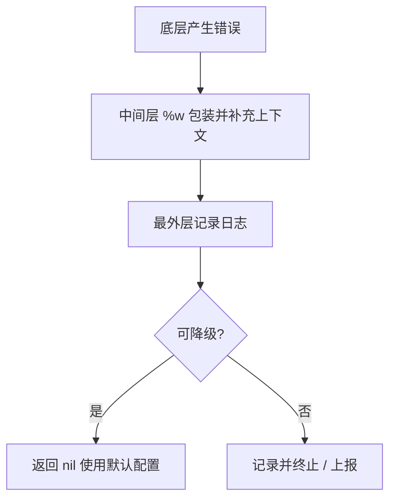

# Go 项目开发: 错误处理的设计与常见反模式

Go 没有 `try/catch`，错误就是**函数返回值的一部分**：调用者拿到 `error`，自己判断、自己决定要不要升级成 `panic`。这种高度自主的模式是 Go 的特色，但也带来两个现实问题 —— 业务代码里堆满 `if err != nil`，以及出错时缺少堆栈导致排查低效。

## 纲要

- error 的本质：一个只有一个方法的接口
- 自定义错误：把错误信息结构化
- 判断错误类型的正确姿势
- 四种反模式与对应的优化写法
- 工程实践中的六条经验
- 现代 Go 的标准写法（`%w` / `errors.Is` / `errors.As`）
- 完整可运行的示例

## error 的本质

`error` 在标准库里就是一个接口：

```go
package main

import "fmt"

// myError 自定义错误类型：只要实现 Error() string 就是 error
type myError struct {
	Msg string
}

func (e *myError) Error() string { return e.Msg }

func main() {
	var err error = &myError{Msg: "something wrong"}
	fmt.Println(err)                    // something wrong
	fmt.Printf("%T\n", err)             // *main.myError —— 底层就是普通类型
}
```

`errors.New` 返回的 `*errorString` 只是个包了字符串的指针，它实现了 `Error()` 方法，所以是 `error`。理解这一点很重要 —— **错误可以是任何实现了 `Error() string` 的类型**，这正是自定义错误的空间。

## 自定义错误：把错误信息结构化

标准库的 `*os.PathError` 是个值得抄的范本，它把"操作、路径、底层错误"三个维度都记下来：

```go
package main

import (
	"fmt"
	"os"
)

// PathError 结构化错误：记录操作、路径与底层原因
type PathError struct {
	Op   string
	Path string
	Err  error
}

func (e *PathError) Error() string {
	return fmt.Sprintf("%s %s: %v", e.Op, e.Path, e.Err)
}

// Unwrap 暴露底层错误，使 errors.Is / errors.As 能穿透包装链
func (e *PathError) Unwrap() error { return e.Err }

func open(name string) error {
	f, err := os.Open(name)
	if err != nil {
		return &PathError{Op: "open", Path: name, Err: err}
	}
	_ = f.Close()
	return nil
}

func main() {
	err := open("not-exist.txt")
	fmt.Println(err) // open not-exist.txt: open not-exist.txt: no such file or directory
}
```

关键在 `Unwrap` —— 有了它，`errors.Is` 和 `errors.As` 才能穿过你的包装直达底层错误。

## 判断错误类型的正确姿势

**用类型断言或 `errors.As`，不要用错误字符串做匹配。**

字符串匹配是脆弱的：一旦中间某层对错误做了包装，描述文本就变了，判断逻辑随之失效。正确做法是判断类型，或者在自定义错误里放**错误码**字段。

```go
package main

import (
	"errors"
	"fmt"
	"os"
)

type PathError struct {
	Op   string
	Path string
	Err  error
}

func (e *PathError) Error() string { return fmt.Sprintf("%s %s: %v", e.Op, e.Path, e.Err) }
func (e *PathError) Unwrap() error { return e.Err }

func main() {
	_, err := os.Open("not-exist.txt")
	var pe *PathError
	// 反例：字符串匹配，一包装就失效
	if err != nil && err.Error() == "open not-exist.txt: no such file or directory" {
		fmt.Println("【不推荐】字符串匹配命中")
	}
	// 正例：类型断言 / errors.As
	if errors.As(err, &pe) {
		fmt.Printf("【推荐】结构化错误: op=%s path=%s\n", pe.Op, pe.Path)
	}
	if errors.Is(err, os.ErrNotExist) {
		fmt.Println("【推荐】命中哨兵错误 os.ErrNotExist")
	}
}
```

## 四种反模式

### 反模式一：既记录日志又返回错误

同一个错误被处理两次 —— 本层记一次日志，调用方拿回去再记一次，日志里全是重复内容。

```go
package main

import (
	"errors"
	"fmt"
	"log"
)

var ErrQuery = errors.New("query failed")

func query(id int) error {
	err := ErrQuery
	if err != nil {
		log.Printf("query failed: %v", err) // 反模式：这里记了日志
		return err                          // 又返回给上层，上层大概率再记一次
	}
	return nil
}

// queryFixed 优化：只包装上下文，不记日志，交给最外层统一处理
func queryFixed(id int) error {
	err := ErrQuery
	if err != nil {
		return fmt.Errorf("query id=%d: %w", id, err) // 带上关键上下文 id
	}
	return nil
}

func main() {
	_ = query(1001)
	if err := queryFixed(1001); err != nil {
		log.Printf("handle: %v", err) // 只在最外层记录
	}
}
```

顺带一提：记录日志时**必须带上关键上下文**（比如这里的 `id`），否则排查时只知道"失败了"，不知道是谁失败了。

### 反模式二：先判成功再判错误

把正常逻辑包在 `if err == nil { ... }` 里，会多一层缩进，函数一长可读性就崩了。**代码首先是写给人看的。**

```go
package main

import (
	"errors"
	"fmt"
	"os"
)

func readBad(name string) (int, error) {
	f, err := os.Open(name)
	if err == nil { // 反模式：正常路径被包进分支，多一层缩进
		defer f.Close()
		b := make([]byte, 64)
		n, err2 := f.Read(b)
		if err2 == nil {
			return n, nil
		}
		return 0, err2
	}
	return 0, err
}

func readGood(name string) (int, error) {
	f, err := os.Open(name)
	if err != nil {
		return 0, err // 先拦错误，正常路径保持顶层对齐
	}
	defer f.Close()
	b := make([]byte, 64)
	n, err := f.Read(b)
	if err != nil {
		return 0, err
	}
	return n, nil
}

func main() {
	n, err := readGood("go.mod")
	fmt.Println(n, err, errors.Is(err, os.ErrNotExist))
}
```

### 反模式三：能直接返回却多包一层

`return err` 一行能解决的事，不要写成 `if err != nil { return err }` 之外的多余分支。

```go
package main

import (
	"errors"
	"fmt"
	"os"
)

func inner() error { return os.ErrNotExist }

// bad 多余包装
func bad() error {
	err := inner()
	if err != nil {
		return errors.New(err.Error()) // 丢掉原始错误链
	}
	return nil
}

// good 直接返回，保留错误链
func good() error {
	return inner()
}

func main() {
	fmt.Println(errors.Is(bad(), os.ErrNotExist))  // false：错误链断了
	fmt.Println(errors.Is(good(), os.ErrNotExist)) // true
}
```

### 反模式四：出错只记日志不 return

这是**最容易引发线上事故**的一种：反序列化失败后只打了日志却没返回，于是非法格式的数据被继续写入下游。

```go
package main

import (
	"encoding/json"
	"errors"
	"fmt"
	"log"
)

type Order struct {
	ID    int    `json:"id"`
	Title string `json:"title"`
}

// parseBad 反模式：出错不返回，调用方拿到零值继续用
func parseBad(s string) Order {
	var o Order
	if err := json.Unmarshal([]byte(s), &o); err != nil {
		log.Printf("unmarshal failed: %v", err) // 只记日志
	}
	return o // 返回零值，非法数据就此流向下游
}

// parseGood 正确处理：错误必须向上传递
func parseGood(s string) (Order, error) {
	var o Order
	if err := json.Unmarshal([]byte(s), &o); err != nil {
		return Order{}, fmt.Errorf("parse order: %w", err)
	}
	return o, nil
}

func main() {
	o := parseBad("{bad json")
	fmt.Printf("反模式结果: %+v\n", o) // 拿到零值，业务继续跑
	_, err := parseGood("{bad json")
	fmt.Println("正确结果:", errors.Is(err, nil), err != nil)
}
```

## 工程实践六条经验

- **不打算在本层处理的错误，就包装它** —— 用 `fmt.Errorf("...: %w", err)` 保留堆栈与原始错误链。
- **包装时带上上下文** —— 文件不存在就把路径写进去，查询失败就把 id 写进去。
- **函数一旦确定降级方案且降级成功，就返回 `nil`** —— 此时错误已经不是错误了。
- **`%w` 包装用在应用层**；可复用度高的基础包只返回原始错误，不要替调用方决定上下文。
- **日志只在程序最外层记** —— 调用链中间层用返回值传递，避免一条错误刷出十几行日志。
- **拿最原始的错误** —— 老项目用 `github.com/pkg/errors` 的 `Cause`，新代码用标准库 `errors.Is` / `errors.As`；打印堆栈用 `fmt.Printf("%+v", err)`。

## API 速览

| API | 所属库 | 签名 | 参数说明 | 返回值 |
| --- | --- | --- | --- | --- |
| `errors.New` | `errors` | `New(text string) error` | 错误文本，用于定义哨兵错误 | `error` |
| `fmt.Errorf` | `fmt` | `Errorf(format string, a ...any) error` | 含 `%w` 时把错误包进链（**最多一个 `%w`**） | `error` |
| `errors.Is` | `errors` | `Is(err, target error) bool` | 判断错误链中是否包含目标错误 | `bool` |
| `errors.As` | `errors` | `As(err error, target any) bool` | 在错误链中查找指定类型，`target` 传指针的指针 | `bool` |
| `errors.Unwrap` | `errors` | `Unwrap(err error) error` | 返回被包装的下一层错误 | `error` |
| `os.IsNotExist` | `os` | `IsNotExist(err error) bool` | 判断是否"不存在"类错误（新代码建议用 `errors.Is(err, os.ErrNotExist)`） | `bool` |

自定义错误时实现 `Unwrap() error` 方法，错误链才能被 `Is` / `As` 穿透。

## Demo 示例

一个**完整可运行**的端到端示例：定义结构化错误 → 逐层包装 → 最外层统一记录 → 用 `Is`/`As` 判断 → 降级处理。

```go
package main

import (
	"errors"
	"fmt"
	"log"
	"os"
)

// ErrConfigNotFound 哨兵错误，供上层用 errors.Is 判断
var ErrConfigNotFound = errors.New("config not found")

// PathError 结构化错误：操作 + 路径 + 底层原因
type PathError struct {
	Op   string
	Path string
	Err  error
}

func (e *PathError) Error() string { return fmt.Sprintf("%s %s: %v", e.Op, e.Path, e.Err) }
func (e *PathError) Unwrap() error { return e.Err } // 关键：让 Is/As 能穿透

// readConfig 底层：把底层错误映射成哨兵错误并结构化
func readConfig(path string) ([]byte, error) {
	b, err := os.ReadFile(path)
	if err != nil {
		if errors.Is(err, os.ErrNotExist) {
			return nil, &PathError{Op: "read", Path: path, Err: ErrConfigNotFound}
		}
		return nil, &PathError{Op: "read", Path: path, Err: err}
	}
	return b, nil
}

// loadConfig 中间层：只补充上下文，不记日志
func loadConfig(path string) ([]byte, error) {
	b, err := readConfig(path)
	if err != nil {
		return nil, fmt.Errorf("load config %q: %w", path, err)
	}
	return b, nil
}

func main() {
	cfg, err := loadConfig("/no/such/config.yaml")

	// 只在最外层记录一次日志
	if err != nil {
		log.Printf("启动失败: %v", err)

		// 按类型取结构化信息
		var pe *PathError
		if errors.As(err, &pe) {
			log.Printf("结构化信息: op=%s path=%s", pe.Op, pe.Path)
		}

		// 按哨兵错误判断是否可降级
		if errors.Is(err, ErrConfigNotFound) {
			log.Printf("配置文件缺失，使用默认配置继续启动（降级）")
		} else {
			log.Fatalf("不可恢复的错误，终止启动")
		}
	}
	fmt.Printf("最终配置长度: %d\n", len(cfg))
}
```

**运行说明**

```bash
mkdir err-demo && cd err-demo
go mod init err-demo
go run main.go
```

**代码说明**

- `PathError.Unwrap` 是整套判断能生效的前提，没有它 `errors.Is` 只能看到最外层。
- 中间层 `loadConfig` **只包装不记录日志**，日志集中在 `main`，避免了重复日志。
- 降级分支里"用默认配置继续"，符合「确定处理方案后错误不再是错误，返回 nil」这条经验。

**技术点总结**

- `fmt.Errorf` 的 `%w` 建立错误链，`errors.Is` / `errors.As` 沿链查找。
- 结构化错误要记录可排查的维度（操作、路径、ID），不要只留一句文本。
- 错误处理的分界线：中间层传递并补充上下文，**最外层记录并决策**。

## 错误处理流程示意



## 分层结构速览

```dir
order-service/
├── main.go                 最外层：记录日志 + 决策（降级/退出）
├── handler/                接入层：只把错误向上传
│   └── http.go             返回 HTTP 错误码
├── service/                业务层：包装上下文 %w
│   └── order.go            fmt.Errorf("...: %w", err)
├── repository/             数据层：返回原始错误
│   └── db.go               不替调用方决定上下文
└── model/                  结构化错误定义
    ├── PathError.go        Op + Path + Err + Unwrap
    └── sentinel.go         哨兵错误 ErrConfigNotFound
```

## 总结

优雅的错误处理可以压成一句话：**底层产生并结构化，中间层传递并补充上下文，最外层记录并决策**。守住"不重复记录、不吞掉错误、不靠字符串匹配"这三条线，Go 的错误处理就能既清晰又可排查。

