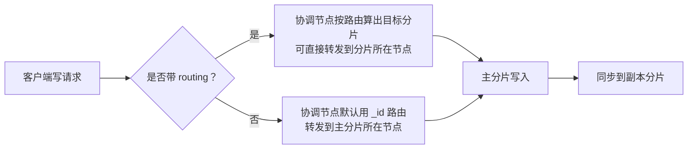
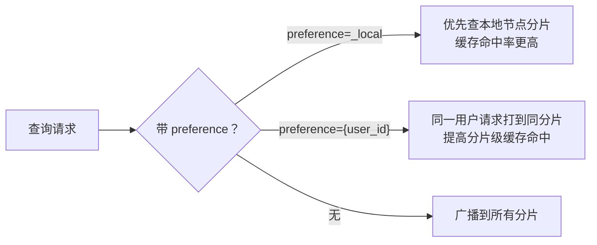
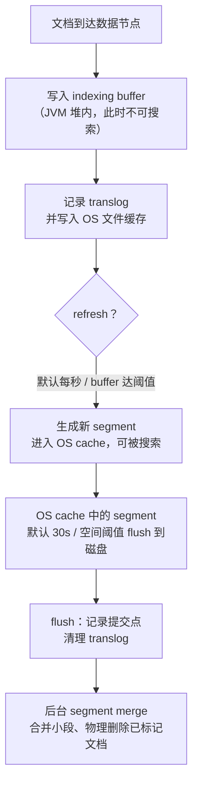

# 从写入原理深入ES写优化

上一节我们从写入原理讲起，这一节继续深入：**路由如何减少一次网络转发、查询如何就近读、文档 `_id` 的唯一性边界，以及一条文档从内存到落盘的完整链路**。把这些环节想清楚，写优化的方向自然就出来了。

## 纲要

- 副本分片为什么不能和主分片同节点
- 写入请求能否直接打到目标分片所在节点（routing）
- 查询路由：`preference=_local` 与按用户 ID 亲和
- `_id` 的唯一性是分片级，不是集群级（routing 的影响）
- 文档落盘全链路：buffer → translog → refresh → OS cache → flush → merge
- 段合并（segment merge）解决什么问题
- 写优化的三个方向：产品调整、架构设计、ES 参数

## 分片分配与路由

先想一个问题：**为什么 ES 不允许主副本分片、以及相同的副本分片分配到同一个节点上？**

副本分片本质是「替补」，主分片不可用时顶上。如果主副本在同一节点，该节点宕机就导致主副本全部丢失，替补失去意义。

既然文档最终落到哪个分片由**路由算法**决定，那能不能**直接把写请求发到目标分片所在节点**？这样可以省掉协调节点的一次转发，减少节点间网络传输。事实上已有第三方网关（如课程提到的极限网关）支持这种做法，也可以根据路由算法自己实现。



## 查询的路由与就近读

查询的路由过程和写入很相似：客户端发起查询时，ES 也会根据请求中的路由定位到不同分片；**如果查询没指定路由，就会广播到所有数据节点的所有分片**，无疑增加集群负担。

更进一步，协调节点已包含索引的全部数据，**能否避免跨节点转发、优先在本地节点获取？** 可以：在查询请求后加 `preference=_local`，指定优先查本地节点的分片。跨节点转发要走网络，一般不比本地直接读更快。



要点：

- `preference=_local`：优先读本地分片；若索引更新频率不高，相同搜索打到相同分片，**分片级缓存利用率更高**。
- `preference={user_id}`（或筛选 ID 这类唯一值）：让同一用户的请求优先打到同一分片，提高缓存命中。
- **自定义 `preference` 值不能以 `_` 开头**，因为下划线开头是 ES 预设值（如 `local`）。

## `_id` 唯一性：分片级而非集群级

很多人以为 ES 的 `_id` 全局唯一，其实**不一定**。验证方式：建一个多分片索引，用相同 `_id` 写入多条文档，但分别带不同的 `routing`。

| 操作 | 行为 |
| --- | --- |
| 相同 `_id`、不同 `routing` 写入 | 生成多篇文档，`_id` 相同但 routing 不同 |
| `GET /_doc/{id}`（不带 routing） | 命中默认 routing = `_id` 的那篇（即不带 routing 写入的那篇） |
| `GET /_doc/{id}?routing=xxx` | 命中对应 routing 的那篇 |
| `DELETE /_doc/{id}`（不带 routing） | 删除的是默认 routing 的那篇，带 routing 的删不掉（返回 not_found） |

结论：

1. 文档带 `routing` 时，`_id` **不保证集群唯一**，唯一性体现在**分片级别**；只设一个分片时只会生成一篇。
2. 不指定 routing，ES 默认用 `_id` 作为 routing 来定位文档。
3. **带 routing 的文档，删除/获取也必须显式带 routing 才能命中**。

## 文档落盘全链路

文档经路由到达数据节点后，写入流程如下（以 6.x/7.x 通用机制为例）：



各环节要点：

- **indexing buffer**：ES 管理的 JVM 堆内内存，默认占堆的 **10%**，最小 **48MB**，无上限。文档在这里时**不可被搜索**。
- **refresh**：默认每秒一次（且过去 30s 内至少有一次搜索请求才会主动触发），把 buffer 刷到 OS cache 生成 segment，文档变为**可搜索**；refresh 不记录提交点。
- **OS cache（page cache）**：操作系统管理的堆外内存，是加速访问的关键。ES 近实时（NRT）正是基于「buffer → OS cache 即可搜」。
- **translog**：先写 translog 防进程异常退出丢数据；OS cache 中的 translog 默认每 5 秒落盘一次，在 **flush** 时清理。
- **flush**：默认 30s 或达空间阈值触发，记录提交点（所有已落盘段），并删除 translog。6.x 之前 flush 会顺带触发 refresh，新版本不再如此。
- **merge（段合并）**：多个小段合并为大段，删除文档在合并时物理清除。

> 注：`in-memory buffer` 与 `OS cache` 不同——前者是内核缓冲区（用于合并 IO），后者是文件页缓存（加速读）。ES 的 indexing buffer 是堆内、由 ES 管理；OS cache 是堆外、由操作系统管理。

## 为什么段不可修改 & 段合并

段（segment）是含多个文档的文件，**不支持原地修改**——若允许直接改，会引入并发锁、且文件缓存频繁失效。因此：

- **删除**：通过 `.del` 文件记录已删文档 ID，查询时按此过滤；直到段合并才真正从磁盘清除。
- **更新**：先标记旧文档删除，再写入新文档；旧版本在合并时丢弃。

所以**删除大量文档后不会立刻回收磁盘空间**，可用 `_forcemerge` 触发合并，并指定 `only_expunge_deletes=true` 只处理删除文档，降低对集群的压力。

```dir
es-write-stack/
├── 写入路径
│   ├── indexing_buffer       堆内，不可搜
│   ├── translog              故障恢复保障
│   └── OS_cache              refresh 后可见
├── 段生命周期
│   ├── segment               不可变文件
│   ├── .del                 删除标记
│   └── merge                合并 + 物理清理
└── 优化抓手
    ├── 产品交互调整
    ├── 架构设计（网关/读写分离）
    └── ES 参数（refresh/translog/merge）
```

## 写优化从哪里入手

文档从写入请求到落盘，每个环节都可能消耗系统资源（尤其 IO）。优化就从这里找抓手，通常三个方向：

| 方向 | 思路 | 例子 |
| --- | --- | --- |
| 产品调整 | 改交互方式降低写压力 | 需结合场景，常兼顾用户体验，难找突破口 |
| 架构设计 | 分离一部分写请求 | 引入极限网关减少节点间转发；把高频但不参与搜索的字段拆到别的存储 |
| ES 参数 | 调写入相关参数 | refresh 间隔、translog 刷盘策略、merge 策略、bulk 批量 |

特别地：如果索引只有**部分字段更新频繁，且这些字段不参与搜索/过滤**，完全可以**不在 ES 索引中存这些字段，或改用其他存储引擎**，从而大幅减少 ES 的写请求。

## 总结

写优化的本质，是**沿着「请求 → 路由 → 内存 → 缓存 → 落盘 → 合并」这条链路，逐个环节压低资源（尤其 IO）消耗**：

- **路由**能省一次网络转发（写入直发目标分片、查询 `_local` 就近读、按用户亲和提缓存命中）；
- **`_id` 唯一性只在分片内成立**，带 routing 的文档增删改查都要带 routing；
- **落盘链路**里 refresh 决定近实时性、translog 决定安全性、flush/merge 决定磁盘与段健康；
- **优化三板斧**：产品调整、架构设计、ES 参数，其中「不搜的字段不进 ES」是性价比极高的架构级手段。
