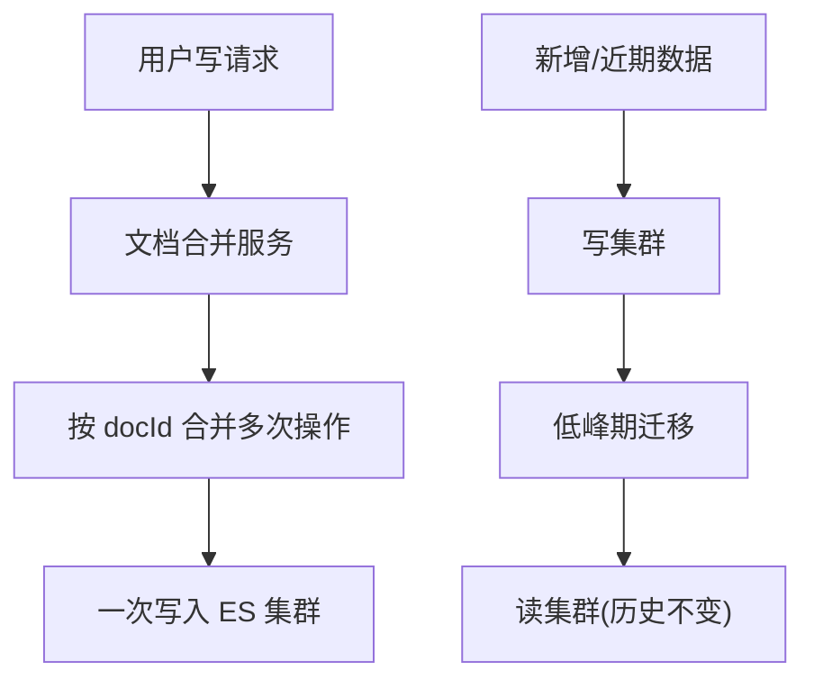
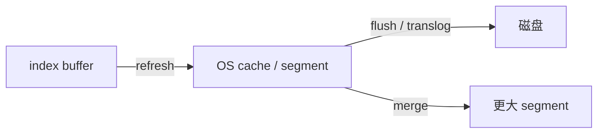

# 从写入原理深入ES写优化

ES 的写入优化贯穿整个使用周期。深入理解写入与查询的原理细节，才能针对性能问题的本质做优化，而不是盲目套用网上的「调参秘籍」。本节从**架构设计**与**参数调整**两条主线，系统梳理降低 ES 写入压力的手段。

## 纲要

- 架构层面：拆分存储、冷热读写分离、延迟建索引、文档合并
- 参数层面：refresh / flush(translog) / merge 三阶段调优
- 系统层面：关闭 swap、设置 swappiness、锁定堆内存
- 自定义 ID：垂直搜索业务建议用业务主键做 `_id`

## 架构设计：从源头削减写入

**1. 拆分存储。** 把不需要检索、且更新频繁的字段放到外部存储（如 MongoDB），只把需要检索的字段写入 ES。查询时先拿 ES 返回的文档 ID，再去 MongoDB 补齐缺失字段。由于搜索通常分页返回几十条，一次批量补齐即可大幅减少 ES 的写请求。

**2. 冷热读写分离。** 数据越久远更新频率越低（日志、订单、物流等）。可拆成两个集群：**写集群**承接新增与近期可变数据，**读集群**承接历史不变数据；业务低峰期把写集群中已完成、不再变更的数据（如已完成订单）迁移到读集群。这样大量写操作只打在较小的写集群，保证大读集群查询高效。

**3. 延迟/按需建索引。** 并非所有场景都要实时建索引。对大文本、日活不高的场景，可在用户发起搜索时再触发索引构建；甚至对长期无搜索行为的用户清理其索引，节省存储与重建开销。可配合「半读写分级」：首次搜索触发的重建数据单独写入一个集群，夜间闲时再搬迁到全量集群。

**4. 文档合并。** 对实时编辑类文档（如云笔记），用户短时间多次保存会产生大量写入。可在应用层加一个「文档合并服务」，按文档 ID 将多次增/改/删合并成一次写入 ES。对实时性要求不高的场景，甚至可把白天全部文档合并后夜间统一写入。



## 参数调整：refresh / translog / merge

ES 写入过程大致分为 refresh、flush（translog 持久化）、merge 三个阶段，对应不同的调优点。

- **refresh 阶段**：文档从 index buffer 刷到 OS cache，默认 1 秒一次。调大 `refresh_interval` 可生成更大的 segment，降低 IO 与后续 merge 压力；批量导入时可设 `refresh_interval=-1`，导入完成再改回。若业务允许无副本，也可临时去掉副本省去同步开销。大文本场景下还可适当调大 `indices.memory.index_buffer_size`（默认 JVM 堆的 10%，可调到 20%，**静态配置，需改 elasticsearch.yml 并重启**）。
- **flush / translog 阶段**：默认 `index.translog.durability=request`，每个请求都刷盘，可靠性高但性能差。若可接受一定概率的数据丢失，可改为异步刷盘：`durability=async`，并增大刷盘间隔与触发阈值（如 `flush_threshold_size=512mb`、`flush_interval=180s`）。
- **merge 阶段**：相关参数（如 `segments_per_tier` 默认 10、`max_merged_segment` 默认 5gb、`floor_segment` 默认 2mb）**不建议随意调整**，建议用线上数据压测验证后再决定。手动 `force_merge` 会占用大量系统资源、影响查询，务必在夜间业务低峰执行。



```dir
write-optimize/
├── 架构设计/
│   ├── 拆分存储/        # ES + MongoDB
│   ├── 冷热分离/        # 写集群 + 读集群
│   ├── 延迟建索引/
│   └── 文档合并服务/
└── 参数调整/
    ├── refresh_interval
    ├── translog.durability
    └── merge 策略
```

| 阶段 | 关键参数 | 调优建议 | 注意 |
| --- | --- | --- | --- |
| refresh | `refresh_interval` | 调大或导入时设 -1 | 影响可见性延迟 |
| translog | `durability` / `flush_threshold_size` | 改 async、512mb、180s | 可能丢数据 |
| merge | `max_merged_segment` 等 | 默认即可，压测后再调 | 手动 merge 选低峰 |
| 堆内存 | `index_buffer_size` | 10%→20% | 静态配置需重启 |

## 系统层面与自定义 ID

**关闭 swap。** 对 IO 密集的 ES 而言，swap 会严重拖慢性能。两步操作：先 `swapoff -a` 临时禁用（重启失效），再注释 `/etc/fstab` 中含 swap 的行永久禁用。同时设置 `vm.swappiness=1`，紧急情况下仍允许交换但不主动换出。

**锁定堆内存。** 在 elasticsearch.yml 中设 `bootstrap.memory_lock=true`，避免 JVM 大 GC 时堆内存页被换出到磁盘导致磁盘抖动。

**自定义 ID vs 自动生成 ID。** 网上常说要用 ES 自动生成 ID 以避免写时查旧文档。但**垂直搜索业务**的更新本就依赖原文档 ID；若每次更新都先查原文档 ID，对系统压力更大。改用业务主键做 `_id`，还能通过 bulk 批量写入，收益比「先查后改」更高。因此垂直搜索业务更建议用业务主键作为 ES 的 `_id`。

## 总结

ES 写入优化应优先从**架构设计**入手：拆分存储、冷热读写分离、按需建索引、文档合并，这些手段能从源头削减写入量，效果往往优于单纯调参。参数层面则围绕 refresh、translog、merge 三阶段下手，**批量导入时设 `refresh_interval=-1`、无副本，导入后恢复**是性价比最高的操作；translog 改异步能降 IO 但需接受丢数据风险；merge 参数不要盲调。

系统层面务必关闭 swap 并锁定堆内存。最后要纠正一个误区：垂直搜索业务应当**用业务主键做 `_id`**，而非盲目追求自动生成 ID。网上的优化手段可以试，但只有具备 ES 体系化知识、结合业务本质做针对性优化，才是正确的方向。
