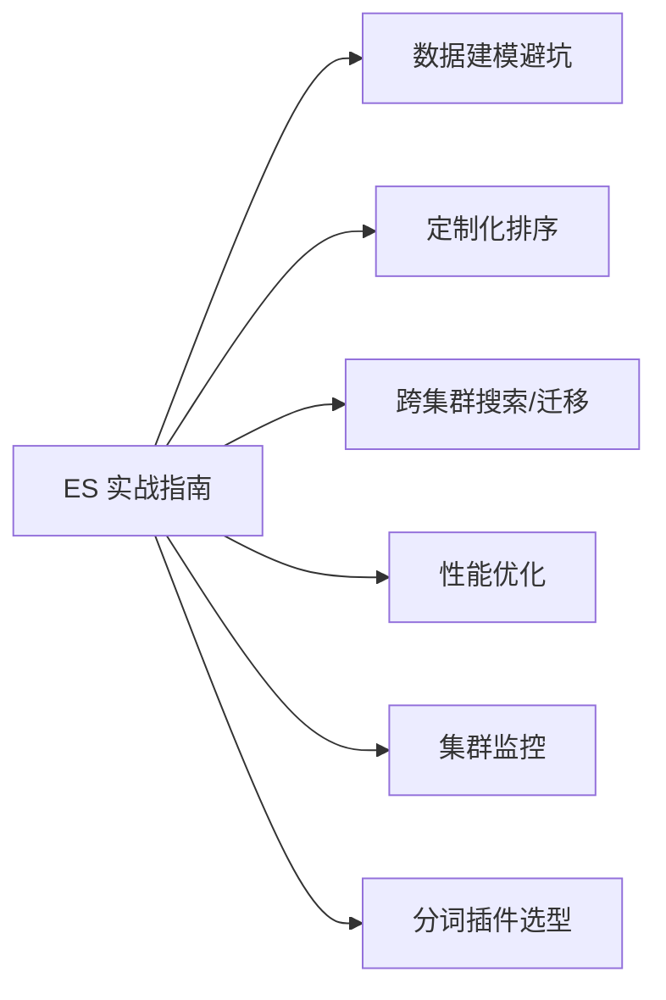

# ES实战指南-章节导学

ES 开箱即用很简单，但「用好」很难。横向加机器确实能提升吞吐，可真实业务里大量场景是加机器也解决不了的：分片数怎么定这种千古难题、数据建模踩坑后不知如何排查、定制化排序怎么做、跨集群搜索与数据迁移怎么落地。本章结合实际工作中踩过的坑，总结一套可复用的 ES 最佳实践。

## 纲要

- 痛点盘点：分片规划、数据建模、定制化排序、跨集群、性能与监控
- 讲解方式：原理 + 实践双线并进
- 受众：开发同学与运维同学都适用（开发重点看 3/4/10 节）
- 学习心法：多听多看多对比，反复学才能温故知新

## 第一节 为什么需要一本「实战指南」

作者多年 ES 开发与运维中，帮很多业务组构建搜索工程时反复遇到同类问题：分片数拍脑袋定、mapping 随意、排序需求一来就改不动、集群一告警就无从下手。这些问题文档里零散，实战中又环环相扣，所以本章把它们体系化，从原理讲到落地。

本章会带大家解决：分片数如何确定、数据建模如何避坑、高度定制化排序如何提升体验、集群内/集群间数据如何迁移、跨集群搜索如何实现、性能如何优化、集群如何监控、分词插件怎么选，以及使用过程中的各类坑。

## 第二节 本章内容地图

开发同学建议重点学习第 3、4、10 节（数据建模、定制化排序、性能优化），运维同学则更关注监控与迁移。下面用一张图给出整体脉络。



```dir
es-in-action/
├── modeling/           # 数据建模
│   ├── shard_plan
│   └── mapping_pit
├── sorting/            # 定制化排序
├── cross-cluster/      # 跨集群搜索与迁移
├── performance/        # 性能优化
├── monitoring/         # 监控与告警
└── analyzer/           # 分词插件
```

| 主题 | 开发关注点 | 运维关注点 |
| --- | --- | --- |
| 数据建模 | mapping 与字段选型 | 分片/索引治理 |
| 排序 | 业务排序表达式 | 排序对资源的影响 |
| 跨集群 | 查询改写 | 版本兼容与证书 |
| 性能/监控 | 慢查询治理 | 集群健康与容量 |

## 总结

本章的核心主张是「结合原理与实践来掌握 ES 核心技能」。不管是开发还是运维，都能从中找到对自己有用的部分。学习时不要只听一遍：多对比、多思考，把知识往自己实际工作里套，才能真正少走弯路、少踩坑。

随着理解的加深，反复学习会有新收获。每节作业我会留一些思考题，请大家结合实际场景去回答——只有经过思考内化，这些经验才算真正变成你的能力。
