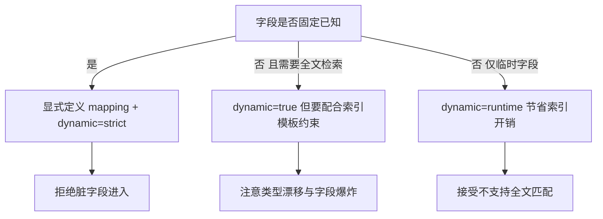

# Go 项目开发: Dynamic Mapping 的类型推断与四种 dynamic 策略

Elasticsearch 的 mapping 相当于 MySQL 的表结构定义，但有一个关键差异：**MySQL 不允许插入表结构中未定义的字段，而 ES 默认允许写入 mapping 里没定义过的字段**，甚至不用提前建索引，字段类型会按写入数据的 JSON 类型自动推断。

这个特性叫 dynamic mapping。它让上手变得极快，也是生产事故的常见源头 —— 所以叫它"特性也有毒性"。

## 纲要

- dynamic mapping 的类型推断规则
- 写入失败也会创建索引：第一个坑
- 数组、null、object 的特殊推断行为
- dynamic 的四种策略与实测表现
- `true` 与 `runtime` 的推断差异
- 生产环境该怎么选

## 类型推断规则

写入 JSON 后，ES 按以下规则推断字段类型（以 8.x 为例）：

| JSON 类型 | 推断出的 ES 类型 |
| --- | --- |
| 字符串（非日期格式） | `text`，并附加 `keyword` 子字段 |
| 字符串（日期格式） | `date` |
| 整数 | `long` |
| 浮点数 | `float`（`dynamic=true` 时） |
| 布尔 | `boolean` |
| 对象 | `object`，字段被打散成子字段 |
| 数组 | **按第一个非空元素**的类型推断 |
| `null` | **不写入 mapping** |

## 写入失败也会创建索引

这是最容易踩的第一个坑。向一个不存在的索引写数据，即使**写入报错返回 400，索引依然会被创建出来**，只是 mapping 是空的。

```http
# 索引不存在，写入一条类型非法的文档
PUT /test_index/_doc/1
{
  "int_field": [100, "3.14"]   # 数值 + 数值字符串混合
}
# → 400 写入失败

# 但索引已经被创建，且 mapping 为空
GET /test_index/_mapping
```

后果是：集群里会堆积一批"空 mapping 的僵尸索引"，占用元数据与分片资源。**生产环境应当显式预建索引并定义 mapping，或者开启索引模板与 `action.auto_create_index` 管控。**

## 数组、null 与 object 的特殊行为

- **数组混合类型直接失败** —— `[100, "3.14"]` 里整数与浮点字符串混合，推断不出统一类型，写入报错。
- **数组按第一个非空元素推断** —— 后面的元素若类型不同，同样可能失败。
- **日期字符串会被识别成 `date`** —— `["2023-01-01", "abc"]` 这种混合也会失败，因为前者推断为 date、后者是 string。
- **`null` 值字段不进 mapping** —— 写入 `{"long_field": null}`，mapping 里不会出现该字段。
- **object 会被打散** —— `{"obj": {"k1": "str", "k2": 1}}` 存成 `obj.k1`（text + keyword 子字段）、`obj.k2`（long），**不是严格意义上的 object 类型**。这个打散行为正是下一节要讲的"嵌套查询坑"的根源。

## dynamic 的四种策略

`dynamic` 属性有四个取值，行为差异很大：

| 取值 | 新字段行为 | 能否写入 | 能否搜索 |
| --- | --- | --- | --- |
| `true`（默认） | 自动推断并加入 mapping | 能 | 能 |
| `false` | 不加入 mapping，但保留在 `_source` | 能 | **不能** |
| `strict` | 未在 mapping 定义的字段**直接拒绝写入** | 不能 | — |
| `runtime` | 存为运行时字段（runtime field） | 能 | 能，但**不支持全文模糊匹配** |

```txt
PUT /idx_false
{
  "mappings": {
    "dynamic": "false",
    "properties": {}
  }
}

PUT /idx_strict
{
  "mappings": {
    "dynamic": "strict",
    "properties": {}
  }
}

PUT /idx_runtime
{
  "mappings": {
    "dynamic": "runtime",
    "properties": {}
  }
}
```

实测表现：

- **`false`**：写入成功、`GET` 能拿到 `_source` 里的原始值，**但用 query 搜不到**。数据存了却搜不着，排查起来很费劲。
- **`strict`**：必须先 `PUT mapping` 把字段定义好，否则**文档直接写不进去**。这是生产上最安全的选择。
- **`runtime`**：字段能搜到，但做全文模糊匹配时查不到 —— 看 mapping 会发现它被映射成了 **`keyword`** 类型，自然不支持全文检索。

## `true` 与 `runtime` 的推断差异

同样的 JSON，两种策略推断出的类型并不一样：

| JSON 类型 | `dynamic=true` | `dynamic=runtime` |
| --- | --- | --- |
| 浮点数 | `float` | `double` |
| 字符串（非日期） | `text` + `keyword` 子字段 | `keyword` |
| object | 展开成多个子字段 | **打平存储**，再按普通字段规则定型 |
| 数组 | 按第一个非空元素推断 | 同左 |

`runtime` 把对象打平存储，意味着层级关系进一步丢失，且不再支持全文检索。

## 生产环境该怎么选



- **字段固定**：显式建 mapping，配 `dynamic=strict`，脏字段直接挡在外面。
- **字段不固定且要检索**：用 `true`，但必须配索引模板限制，否则字段数会失控（字段爆炸直接拖垮集群元数据）。
- **临时/低频字段**：`runtime` 更省，代价是不支持全文匹配。

## API 速览

| API | 方法 | 说明 |
| --- | --- | --- |
| `PUT /<index>` | 建索引 | 请求体中用 `mappings.dynamic` 设置策略，`mappings.properties` 定义字段 |
| `GET /<index>/_mapping` | 查 mapping | 查看推断或定义后的字段类型 |
| `PUT /<index>/_mapping` | 更新 mapping | `strict` 模式下必须先定义字段才能写入 |
| `PUT /<index>/_doc/<id>` | 写文档 | 触发类型推断的入口 |
| `GET /<index>/_doc/<id>` | 取文档 | `dynamic=false` 时仍能从 `_source` 看到原始值 |
| `POST /<index>/_search` | 搜索 | `dynamic=false` 时新字段搜不到；`runtime` 时不支持全文匹配 |

## 策略结构速览

```dir
dynamic-mapping/
├── true（默认）
│   ├── 自动推断类型
│   ├── 新字段可写入
│   └── 新字段可搜索
├── false
│   ├── 不进 mapping
│   ├── 保留在 _source
│   └── 写入能 搜索不能
├── strict
│   └── 未定义字段直接拒绝
└── runtime
    ├── 存为 runtime field
    └── 不支持全文匹配
```

## 总结

dynamic mapping 的毒性集中在三点：**写入失败仍会建空索引**、**类型推断看第一个元素导致混合类型直接失败**、**`false` 模式下数据存了却搜不到**。生产环境的稳妥做法是预建 mapping 并把 `dynamic` 设为 `strict`，把不确定性挡在写入之前。

