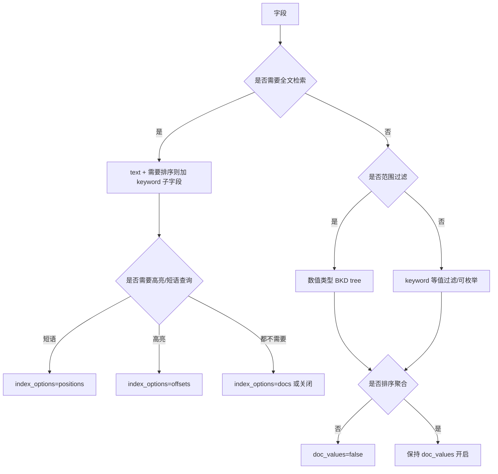

# Go 项目开发: Elasticsearch 字段属性确定与建模避坑

刚接触 Elasticsearch 时最容易埋的坑，是**字段属性设置不合理**。而 ES 的字段属性大部分**不支持直接修改**，最终只能重建索引 —— 数据规模越大，重建成本越高。TB 级的索引想靠 reindex 重来，基本不可行。

所以建模阶段把属性定对，比事后优化重要得多。

## 纲要

- 建模坑的根源：属性不可改，改就要重建
- `_source` 的取舍与过滤规则
- `index` / `enable` / `store` 三个开关
- `doc_values` 与 `fielddata`：正排索引的两种实现
- 用 `_id` 排序的坑
- 倒排索引的四部分组成
- `index_options` 四档与 `norms` / `similarity`
- 确定字段属性的四步法
- 数值类型与 keyword 到底怎么选

## `_source` 的取舍

`_source` 存的是原始文档，占大量存储空间（内部做了压缩，读取有额外解压开销）。存在的原因很直接：**倒排索引存不了原文**。文本交给 ES 后会被分析器打散成 term —— 去标点、统一大小写、英文还要还原词根，原文"面目全非"，必须有地方存原文，才能在命中后返回内容、做高亮、做 reindex。

实测：**大文本字段不保存 `_source` 可节约约 30% 磁盘**。但禁用后下面这些能力会一起失效：

- `update` / `update_by_query` / `reindex`
- 高亮
- 返回字段原文
- 修改 mapping
- ES 大版本升级

如果只是为了省空间，**更推荐改用 `best_compression` 压缩方式**，同样能省约 30%，且不损失上述能力。

```txt
PUT /idx_compress
{
  "settings": {
    "index.codec": "best_compression"
  }
}
```

### 只保存部分字段

`_source` 支持 `includes` / `excludes` 过滤，两者冲突时**以 `excludes` 为准**：

```txt
PUT /idx_source_filter
{
  "mappings": {
    "_source": {
      "includes": ["*.count", "meta.*"],
      "excludes": ["meta.description", "meta.other*"]
    }
  }
}
```

被排除的字段仍可检索（能匹配到文档），只是不出现在返回的文档里。

## 三个开关：index / enable / store

| 属性 | 含义 | 默认 | 关闭后的影响 |
| --- | --- | --- | --- |
| `index` | 是否进入倒排索引 | 开 | 不分词、不建倒排 → **不可搜索**；但仍存 `_source` 与 `doc_values`，**仍可排序聚合** |
| `enable` | `index` 与 `doc_values` 的总开关 | 开 | 不可排序、不可聚合；仍可从 `_source` 取原值 |
| `store` | 是否单独存储该字段 | 关 | 不单独存，靠 `_source` 返回 |

`store` 与 `_source` 是独立的，同时开启会把同一份内容存两遍。`store` 的价值在于**长短文本混存的场景**：如果 `_source` 里有一篇长文和很短的标题，只取标题时 ES 仍要读整个 `_source`，额外 IO。此时把 `title` 的 `store` 设为 true，就能单独取回。

代价是 `store` 在磁盘上**存储不连续**，取多个 `store` 字段需要多次磁盘寻道 —— 所以要避免在查询里一次取回多个 `store` 字段。

## `doc_values` 与 `fielddata`

倒排索引擅长全文检索，但**无法支持排序与聚合**。这件事由正排索引来做，ES 提供了两种实现。

| 维度 | `doc_values` | `fielddata` |
| --- | --- | --- |
| 存储位置 | OS 缓存 + 磁盘 | **JVM 堆内存** |
| 默认 | **开启**（`text` 类型不支持） | **关闭**（`text` 除外） |
| 适用字段 | `keyword`、数值、IP 等非分词字段 | 可用于分词字段（`text`） |
| 构建成本 | 落盘，低成本 | 加载昂贵，常驻堆内存，可能引发读写延迟 |
| 释放 | — | 可用 API 手动清除 |

两者都是**列式存储**，目的都是支持聚合、排序与脚本访问。区别在于一个落盘、一个在内存。

`fielddata` 的内存限制（节点级配置）：

| 限制项 | 默认值 |
| --- | --- |
| `indices.fielddata.cache.size` | 堆的 40% |
| 查询/聚合操作内存 | 堆的 60% |
| 总熔断（`breaker.total.limit`） | 堆的 95%（`use_real_memory=true`）/ 75%（`false`） |

一次查询加载的 fielddata 超过总内存会内存溢出，ES 的**断路器**会估算大小并直接让查询失败。限制得太死又会导致频繁驱逐重载，带来 IO 损耗、内存碎片与 GC。

**实践建议：用 `doc_values` 代替 `fielddata`**，大文本或 TB 级索引不要开启 `fielddata`。

### 用 `_id` 排序的坑

`_id` 字段不会开启 `fielddata`，也不会主动构建。但一旦不小心用 `_id` 排序，就会把它的 fielddata 加载进堆内存 —— 低版本 ES 的熔断器不完善，可能导致不断 GC 直至节点 OOM。**官方不建议使用 `_id` 排序，ES 8.0 起默认直接报错。**

正确做法：**把业务 ID 单独存成一个字段并开启 `doc_values` 用于排序**，自定义 ID 场景尤其要注意。

## 倒排索引的四部分组成

理解 `index_options` 之前，先要理解倒排索引的结构。

| 组成 | 说明 | 磁盘文件 |
| --- | --- | --- |
| `term` | 原文经分词后的一个个词 | — |
| `term dictionary` | 排序后的全部 term 集合（排序是为了二分查找） | `.tim` |
| `term index` | term dictionary 的索引，树形结构（FST），存 term 前缀到 block 的映射，可缓存进内存 | `.tip` |
| `posting list` | 出现过某 term 的文档 ID 集合，附带词频、位置、偏移量；每条记录叫一个 posting | — |

类比现代汉语词典：`term` 是词语，`term dictionary` 是词典正文，`term index` 是词典前面的目录索引。

查询路径是：`term index` → 定位 `term dictionary` 的位置 → 找到 `posting list` → 拿到文档 ID → 再从 `_source` 取原文。


顺带一个版本差异：**ES 7.3 起把 FST 从 JVM 堆移到 OS cache 管理**。原因很实际 —— JVM 压缩指针只在堆小于 32GB 时生效，堆内存"不可扩展"，而 1TB 索引的 FST 通常也就几 GB，交给 OS 管理更合理。7.3 是一个值得关注的版本。

## `index_options` 四档

`index_options` 决定 posting list 里存哪些信息：

| 档位 | 存储内容 | 能力 |
| --- | --- | --- |
| `docs` | 仅文档 ID | 只能知道 term 出现在哪些文档 |
| `freqs` | + 词频 | 支持基于词频的算分 |
| `positions` | + 位置 | 支持短语查询、临近查询 |
| `offsets` | + 起止偏移量 | 支持 postings 高亮 |

默认值：**分词字段（`text`）为 `positions`，其他字段（`keyword`、数值）为 `docs`**。

也就是说，若想用 postings 高亮，必须显式设为 `offsets`；仅 `docs` 时既无法做临近查询，也无法做依赖偏移量的高亮。

## `norms` 与 `similarity`

- **`norms`** 存归一化参数（主要是字段长度），默认开启。开启后**字段长度参与算分**：同样的关键词，出现在短字段里得分更高。仅用于过滤或聚合的字段可以关闭，关了之后**不能再开启**；关闭后新增文档不再存储，已有值会在段合并过程中逐步移除。
- **`similarity`** 配置相似度算法，默认 **BM25**，只对 `text` / `keyword` 生效，数值类型不可用。若字段查询不参与相似度算分（比如纯过滤的 keyword），可直接设为 `boolean`，省掉算分开销。

## 确定字段属性的四步法



- **第一步 定类型**：全文检索用 `text`；精确匹配与可枚举值用 `keyword`；范围过滤用数值类型。
- **第二步 定分词与高亮**：不需要分词 → `index=false`；需要短语/临近查询 → `index_options=positions`；需要 postings 高亮 → `offsets`。
- **第三步 定排序与聚合**：不需要就 `doc_values=false`；`text` 字段要排序**不要开 fielddata**，加一个 `keyword` 子字段专门用于排序。
- **第四步 定单独存储**：不需要高亮、不需要展示原文、不需要 reindex 与脚本 → 可不存 `_source`；只要取少数短字段 → 给这些字段开 `store`。

## 数值类型还是 keyword

这是个高频决策点，判断依据不是"值是不是数字"，而是**怎么用**：

| 场景 | 选择 | 原因 |
| --- | --- | --- |
| 需要范围过滤（range） | **数值类型** | 数值用 BKD tree 存储，范围查询、多维空间查询表现好 |
| 需要按数值大小排序 | **数值类型** | keyword 排序是**字典序**，100 会排在 99 前面（因为 "9" > "1"） |
| 只做精确等值过滤 | **keyword** | 数值类型走 BKD 树查找，还要转成 range query；keyword 可直接命中 term，且组合查询能用跳表 |
| 值可枚举（性别、状态 ID） | **keyword** | 压缩率更高，占存储更少 |

那个经典的翻车现场：把销量字段设成 `keyword` 再排序，结果 **99 排在 100 前面** —— 因为比较的是字符串 "9" 和 "1"。改成 `long` 才符合预期。

## API 速览

| 配置 | 作用 |
| --- | --- |
| `index.codec: best_compression` | 提高压缩率，省约 30% 空间且不丢功能 |
| `_source.includes` / `excludes` | 控制哪些字段存原文，冲突时 `excludes` 优先 |
| `index` | 是否入倒排索引（影响能否搜索） |
| `enable` | `index` + `doc_values` 总开关 |
| `store` | 单独存储字段，长文混短字段场景可用 |
| `doc_values` | 正排列式存储，排序/聚合/脚本依赖它 |
| `fielddata` | 内存版正排，默认关闭，慎用 |
| `index_options` | `docs` / `freqs` / `positions` / `offsets` |
| `norms` | 归一化参数，关闭后不可再开 |
| `similarity` | 相似度算法，默认 BM25，纯过滤可设 `boolean` |

## 建模要素速览

```dir
field-modeling/
├── 倒排索引（检索）
│   ├── term / term dictionary
│   └── posting list（词频/位置/偏移）
├── 正排索引（排序聚合）
│   ├── doc_values（落盘，默认开）
│   └── fielddata（堆内存，慎用）
├── 开关三件套
│   ├── index（入倒排）
│   ├── enable（总开关）
│   └── store（单独存）
└── _source（原始文档）
    ├── includes / excludes
    └── best_compression
```

## 总结

建模的核心不是背参数，而是**按字段的实际用途倒推配置**：搜不搜、排不排、聚不聚、要不要高亮、要不要展示原文。五个问题回答完，属性就定了。尤其要记住三条硬规则 —— **排序必须用数值类型不能用 keyword**、**text 排序靠 keyword 子字段而不是 fielddata**、**不要用 `_id` 排序**。

