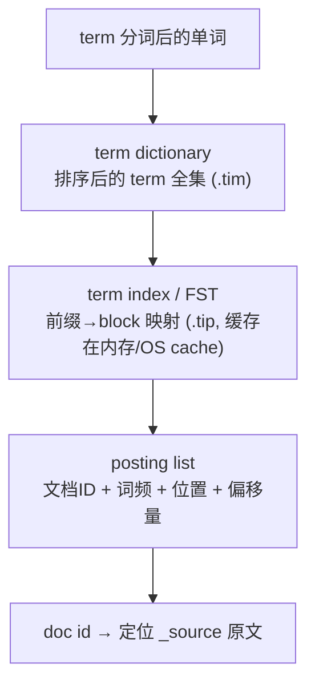

# 字段属性的确定，数据建模填坑（二）：倒排存储、排序聚合与 mapping 决策

上一节我们聊了字段数据类型怎么选，这一节钻进**字段属性的内部**：一个字段在倒排索引里到底存了什么、这些存储如何影响搜索 / 排序 / 评分 / 高亮，以及——当我们拿到一个字段时，**按什么步骤把它的 mapping 属性一次性定对**。

这些配置设得合不合理，直接决定集群性能，是 ES 知识体系的重点，也是数据建模最容易踩坑的地方。

## 纲要

- `index_options`：倒排索引到底存了哪些信息（DOCS / freqs / positions / offsets）
- 倒排索引的四件套：term、term dictionary、term index（FST）、posting list
- `norms`：归一化参数与排序算分，关了就不能再开
- `similarity`：BM25 与「不参与评分」的 keyword
- mapping 属性确认四步法：类型 → 分词/高亮 → 排序/聚合 → 单独存储
- `keyword` 还是数值类型？一个真实的排序翻车案例

## index_options：倒排索引里存了什么

`index_options` 决定**倒排索引存储哪些信息**，它直接影响搜索、排序、评分和高亮能力。要理解它的四个取值，得先理解倒排索引的组成。



- **term**：字段原文经分词处理后的一个个单词。
- **term dictionary（词典）**：排序后的全部 term 集合，排序是为了二分查找。ES 中存储后缀是 `.tim`。
- **term index（词典索引）**：term dictionary 的索引，树形结构，存 term 前缀与 dictionary block 的映射关系；结合压缩技术可缓存到内存，快速定位 dictionary 的 block，再回磁盘查 term，**大幅减少磁盘随机读**。磁盘文件后缀是 `.tip`。内存中的 term index 叫 **FST（有限状态机）**。
  - **ES 7.3 起把 FST 从 JVM heap 移到了 OS cache**（操作系统 page cache）管理。由于 JVM 压缩指针只在堆 ≤32G 时开启，heap 不可无限扩展，这一改动对堆内存压力是重大缓解。FST 通常就是占用最大的那块「词典内存」。
  - **ES 7.0 起，`_id` 字段的 term index 也移到了 OS cache**。版本选型值得重视，**强烈建议逐版阅读 release notes**。
- **posting list（倒排列表）**：记录出现过某 term 的所有文档 ID 集合。每行（一个 posting）除文档 ID 外，还含**词频（term 出现次数）**和**偏移量（offset）**，可用于临近查询和依赖偏移的高亮。

类比现代汉语词典：term 是词语，term dictionary 是词典本身，term index 是词典的目录索引。

## index_options 的四个取值

回到 `index_options`，它就是用来设置 posting list 要存哪些信息的：

| 取值 | 存储内容 | 能做的查询 | 不能做的 |
| --- | --- | --- | --- |
| **DOCS** | 仅文档 ID | 判断 term 出现在哪些文档 | 无词频→无法算分；无位置→无法 phrase/proximity；无 offset→无法高亮 |
| **freqs** | 文档 ID + 词频 | 评分（重复出现评分更高） | 无位置→无法 phrase 查询；无 offset→无法高亮 |
| **positions** | ID + 词频 + 位置 | phrase / proximity 查询 | 无 offset→无法高亮 |
| **offsets** | ID + 词频 + 位置 + 起止字符偏移 | 以上全部 + **position 高亮** | —— |

**默认值分两类**：被分词器分析过的字段（`text` 类型）默认用 `positions`；其他字段（`keyword`、数值等）默认用 `DOCS`（一般只存文档 ID）。

想看某个字段的倒排索引到底存了上面哪些部分？用 **`_termvectors` API** 查看具体文档某字段的 term、position、起始位置等信息即可。

## norms：归一化与排序算分

`norms` 控制是否存储**归一化相关参数**（主要是字段长度信息），默认开启（`true`），用于评分。

- 开启后，即使文档里没有这个字段，也会占用一定存储空间。
- 若字段**仅用于过滤**，可以把 `norms` 关掉：`PUT` mapping 时设 `"norms": false`。
- **注意：一旦关闭就不能再次开启**。关闭后，新增文档不再存 norms；旧 norms 会在段合并过程中逐渐被移除。
- **影响排序**：开启 norms 后，文档长度会参与排序算分。比如三个文档 `name` 分别是「测试」「测试名」「比较长的测试名」，查「测试」时，短的排前面、长的排后面。

## similarity：算分算法

`similarity` 配置字段的文本算分 / 相似度算法，**默认 BM25**。

- 只能对 `text` 和 `keyword` 配置，**数值类型用不了**。
- 如果某字段不参与相似度算分（如 `keyword` 类型），可直接设 `"similarity": "boolean"`，关掉评分、只做命中。

## mapping 属性确认四步法

确定字段的 mapping 属性，按这四步走，基本不会漏：

```dir
mapping 属性确认四步法
├── 第一步：定数据类型
│   ├── 全文检索 → text
│   ├── 等值/枚举过滤 → keyword
│   └── 范围过滤/多维空间 → 数值（block KD tree）
├── 第二步：分词与高亮
│   ├── 不搜索不排序 → enabled=false
│   ├── 需 phrase 查询 → index_options=positions
│   └── 需高亮 → index_options=offsets
├── 第三步：排序与聚合
│   ├── 不需排序 → doc_values=false
│   └── text 要排序 → 加 keyword 子字段
└── 第四步：是否单独存储
    ├── 只取少量字段 → store=true 省 IO
    └── 其余 → 走 _source（用 includes/excludes 裁剪）
```

### 第一步：确定数据类型

- 需要全文检索 → `text`；否则 `keyword` 或数值；还有地理位置等类型。
- **`keyword` vs 数值类型怎么选？**
  - 需要**范围过滤**（`range` 查询）→ 推荐数值类型，因为数值类型存的是 **block KD tree**，对范围、邻近查询（尤其多维空间）支持极好。
  - 若想**按数值大小排序**，必须用数值类型；`keyword` 数值排序**不走数值大小**，会按字典序排。
  - 字段**只做数值过滤（精确等值查找）**，数值类型也要设成 `keyword` 更好：数值类型经 block KD tree 存储，`term` 查询要在树形结构上找；而 `keyword` 可直接通过 term index 定位，还能利用跳表，等值查询更快。
  - 字段值**可枚举**（性别、城市 ID）→ 更推荐 `keyword`，压缩率更高、存储更少。

### 第二步：确定是否需要分词和高亮

- 不需要分词的字段，`index` 可设 `false`（注意：`keyword` 类型 `index` **默认是 `true`**，可被 term 查询命中；把它设 `false` 才是关闭搜索）。
- 需要搜索和高亮的字段，`index` 设 `true`（`text` 默认 `true`）。
- 字段不用于搜索也不用于排序 → 设 `enabled=false`，只把值存在 `_source` 里。
- 需要 `match_phrase` / proximity 查询 → `index_options=positions`；还需要 position 相关高亮 → `index_options=offsets`。

### 第三步：确定是否需要排序和聚合

- 不需要排序的 `keyword` / 数值字段 → `doc_values=false`。
- **需要分词的字段也要排序**：不推荐直接开 `doc_values`，而是给 `text` 字段加一个 `keyword` **子字段**专门排序：

```json
{
  "name": {
    "type": "text",
    "fields": { "keyword": { "type": "keyword" } }
  }
}
```

### 第四步：确定是否需要单独存储

- 不需要高亮、不展示原值、不重建索引、不做脚本 → 可不单独存储该字段（`store` 默认 `false`，从 `_source` 取即可），节省空间。
- 但若 `_source` 里混着长文本（文章）和短文本（标题），只取标题时 ES 要读整个 `_source` 再截取 `title`，带来额外 IO。此时把 `title` 的 `store=true`，在 `_source` 外单独存一份原值，读取就不必读整个 `_source`。
- 注意：`store` 在磁盘上**不连续**，多个 `store` 字段意味着多次独立磁盘操作，所以**不要用 `store` 来取多个字段**。也可以用 `_source` 的 `includes` / `excludes` 裁剪字段。

## 一个真实的排序翻车案例

把「销量 `sales`」设成 `keyword` 类型，写入 `100` 和 `99` 两个文档，再按 `sales` 倒序排：结果是 `99` 排前面、`100` 排后面——因为 `keyword` 按字典序逐字符比较，「9」>「1」，所以 `99` 在前。

改成 `long` 类型后同样排序，`100` 正确排到前面。**结论：要基于数值大小排序，字段必须设成数值类型，不能图省事用 `keyword`。**

## 总结

字段属性是数据建模的「毛细血管」，每一项都在悄悄影响性能：

- **`index_options`** 决定倒排里存 DOCS / freqs / positions / offsets，对应「能不能算分、能不能 phrase 查询、能不能高亮」三道门槛；默认值 `text` 走 positions、`keyword`/数值走 DOCS。
- **`norms`** 管归一化与排序算分，关了不能开；**`similarity`** 默认 BM25，`keyword` 可设 `boolean` 关评分；**`doc_values`** 管排序聚合，`text` 排序要走 `keyword` 子字段。
- 定属性别忘了四步法：**类型 → 分词/高亮 → 排序/聚合 → 单独存储**，每一步都把「这个字段到底怎么被用」想清楚。

这些配置是否合理，是集群性能的命门。建议把本节实验至少亲手练一遍，再用思维导图讲给朋友听，把知识真正消化。
