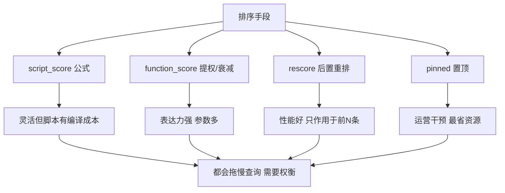

# Go 项目开发: Elasticsearch 定制化排序的六种手段

关键词召回大量相关文档之后，真正决定用户体验的是**排序** —— 让用户最可能点击的文档排在前面。排序是优化搜索质量的主要手段，也是搜索系统里最值得投入的部分。

## 纲要

- 保住相关度得分的权重
- 多字段排序的局限
- `script_score`：用公式自定义算分
- `function_score`：提权与衰减函数
- `rescore`：后置重排序，兼顾召回与性能
- `pinned` query：热点文档置顶
- 性能与效果的权衡

## 保住相关度得分的权重

先说一个容易忽略的细节：**过滤条件也会贡献得分**。

一个查询里同时有 `term`（过滤）和 `match_phrase`（名称匹配）时，最终分数是两者叠加的，量级会从 0.01 变成 1 点几 —— 名称相关度的权重被稀释了。

解决方式是把过滤条件包进 `constant_score` 并把 `boost` 设为 0：

```txt
POST /goods/_search
{
  "query": {
    "bool": {
      "must": [
        { "match_phrase": { "name": "iphone" } }
      ],
      "filter": [
        { "constant_score": { "filter": { "term": { "brand": "apple" } }, "boost": 0 } }
      ]
    }
  }
}
```

这样只有名称字段贡献相关度得分，量级回到 0.01 级别，排序口径才干净。

## 多字段排序的局限

最朴素的写法是先按 `_score`、再按销量、收藏数、上架时间依次排序：

```txt
POST /goods/_search
{
  "query": { "match_phrase": { "name": "iphone" } },
  "sort": [
    { "_score": "desc" },
    { "last_month_sales": "desc" },
    { "favorites": "desc" },
    { "on_shelf_time": "desc" }
  ]
}
```

问题在于：**权重完全由先后顺序机械决定**。销量比收藏数重要，但重要多少？不同字段量级差异巨大，且业务权重会变。真实场景里最终得分往往是多个字段按公式叠加的结果。

## `script_score`：用公式自定义算分

ES 7.0 起提供 `script_score`，允许在检索时灵活改写文档得分，**性能远高于 `function_score`**。

```txt
POST /goods/_search
{
  "query": {
    "script_score": {
      "query": { "match_phrase": { "name": "iphone" } },
      "script": {
        "source": "_score * 1.0 + doc['last_month_sales'].value * params.salesW + doc['favorites'].value * params.favW",
        "params": {
          "salesW": 0.5,
          "favW": 0.1
        }
      }
    }
  }
}
```

两个要点：

- **系数一定要通过 `params` 传入，不要硬编码进脚本**。脚本会被编译，编译结果有缓存；把系数写死在脚本里，每次改系数都会产生一个新脚本，缓存命中率暴跌。
- 公式设计要考虑量级归一：比如"多少个收藏相当于卖出一件商品"，把不同量级的因子换算到同一维度，结果才合理。

同时要**保留相关度权重** —— 如果热度因子的得分远高于相关度，用户会看到一堆"很热但不是想要的"商品。

## `function_score`：提权与衰减函数

### 按条件提权

把包含指定关键词的文档权重提升：

```txt
POST /goods/_search
{
  "query": {
    "function_score": {
      "query": { "match_phrase": { "name": "iphone" } },
      "functions": [
        {
          "filter": { "match": { "name": "plus" } },
          "weight": 2
        }
      ],
      "boost_mode": "multiply"
    }
  }
}
```

命中 `plus` 的文档得分直接翻倍。实际业务中可以用来给"用户画像推断出的类目"提权。

### 前缀匹配提权

联系人搜索这类场景，希望前缀命中的文档排前面。

```txt
POST /contact/_search
{
  "query": {
    "function_score": {
      "query": { "match": { "name": "测试" } },
      "functions": [
        {
          "script_score": {
            "script": {
              "source": "doc['name.keyword'].value.startsWith(params.prefix) ? 1 : 0",
              "params": { "prefix": "测试" }
            }
          }
        }
      ],
      "boost_mode": "sum"
    }
  }
}
```

**这里有个必踩的坑**：脚本里 `doc['name']` 拿不到 `text` 字段的原始值 —— 文本已被分词处理得面目全非。必须给字段配一个 `keyword` 子字段，通过 `doc['name.keyword']` 取原值。

更准确的规则是：**脚本只对开启了 `doc_values` 的字段才能取到原始值**，`text` 字段默认没有 `doc_values`，所以要靠 keyword 子字段。大文本字段要谨慎，别为此给长文本开 `doc_values`。

### 三种衰减函数

对"随时间/距离衰减"的业务，衰减函数是最合适的工具。

| 函数 | 形状 | 特点 |
| --- | --- | --- |
| `linear` | 直线 | 匀速衰减 |
| `exp` | 指数曲线 | 先剧烈衰减，后变缓 |
| `gauss` | 钟形（高斯） | 先缓慢 → 变快 → 放缓，**最常用** |

四个参数：

| 参数 | 含义 |
| --- | --- |
| `origin` | 中心点/最佳值，落在这里的文档得满分 1.0 |
| `offset` | 从 origin 起的偏移范围，该范围内同样满分 |
| `scale` | 衰减率，控制分数下降速度 |
| `decay` | 衰减到 scale 位置时的得分，默认 0.5 |

```txt
POST /goods/_search
{
  "query": {
    "function_score": {
      "query": { "match": { "name": "iphone" } },
      "functions": [
        {
          "gauss": {
            "price": {
              "origin": "2500",
              "offset": "2500",
              "scale": "2000"
            }
          }
        }
      ],
      "boost_mode": "multiply"
    }
  }
}
```

以 iPhone 价格为例：`origin=2500`、`offset=2500`，意味着 0~5000 元区间都是满分，超过后才开始衰减 —— 契合"越便宜越受欢迎"的实际偏好。

典型场景：新闻/短视频的浏览量随时间衰减、商品上架时间、O2O 团购的地理位置衰减。

### `boost_mode` 五种组合

| 取值 | 含义 |
| --- | --- |
| `sum` | 相关度得分 + 函数得分（默认） |
| `multiply` | 两者相乘 |
| `avg` | 取平均 |
| `min` | 取最小 |
| `max` | 取最大 |

## `rescore`：后置重排序

`match` 召回率高、性能好；`match_phrase` 精度高但**性能差约 10 倍**（要计算 term 位置距离）。

`rescore` 的思路是：**先用 `match` 召回，再对前 N 条结果用 `match_phrase` 重排**。参与短语计算的文档数大幅下降，性能与精度兼得。

```txt
POST /goods/_search
{
  "query": {
    "match": { "name": { "query": "测试", "boost": 0.7 } }
  },
  "rescore": {
    "window_size": 10,
    "query": {
      "rescore_query": {
        "match_phrase": { "name": { "query": "测试", "boost": 1.2 } }
      },
      "query_weight": 0.7,
      "rescore_query_weight": 1.2
    }
  }
}
```

主查询权重 0.7、重排权重 1.2，完全匹配的文档自然排到前面。

## `pinned` query：热点文档置顶

ES 7.5 起提供 `pinned` query，字面意思就是"钉住" —— 指定文档 ID 直接置顶，适合把热点/运营文档拉到最前。

```txt
POST /goods/_search
{
  "query": {
    "pinned": {
      "ids": ["6", "8"],
      "organic": {
        "bool": {
          "must": [{ "match_phrase": { "name": "iphone" } }]
        }
      }
    }
  }
}
```

6 号和 8 号文档被钉在最前，其余结果走 `organic` 里的正常查询。

## 性能与效果的权衡



所有额外排序手段都会拖慢查询速度。**在响应时间与排序质量之间必须做权衡**：能用 mapping 阶段解决的（比如预排序字段）就别放到查询期；能用 `rescore` 限制影响范围的就别全量重算。

## API 速览

| API / 参数 | 作用 |
| --- | --- |
| `constant_score` + `boost: 0` | 让过滤条件不贡献得分，保住相关度权重 |
| `script_score` | 用脚本公式改写得分（ES 7.0+），系数走 `params` |
| `function_score` | 提权、衰减函数、`boost_mode` 组合 |
| `gauss` / `exp` / `linear` | 三种衰减函数，`origin`/`offset`/`scale`/`decay` 四参数 |
| `boost_mode` | `sum`/`multiply`/`avg`/`min`/`max` |
| `rescore` + `window_size` | 对前 N 条结果后置重排 |
| `pinned` + `organic` | 指定文档置顶（ES 7.5+） |

## 排序手段速览

```dir
sort-strategies/
├── 保相关度权重
│   └── constant_score + boost:0
├── 公式改写得分
│   └── script_score（系数走 params）
├── 提权与衰减
│   ├── function_score（boost_mode）
│   └── gauss / exp / linear
├── 后置重排
│   └── rescore（window_size 前 N 条）
└── 运营置顶
    └── pinned（organic 其余）
```

## 总结

排序手段的选择顺序建议是：**先保住相关度权重**（constant_score 隔离过滤条件）→ **需要公式就用 `script_score`**（系数走 params）→ **需要衰减或条件提权用 `function_score`** → **性能敏感用 `rescore`** → **运营干预用 `pinned`**。每一种都有代价，组合使用时盯住响应时间的实际变化。

