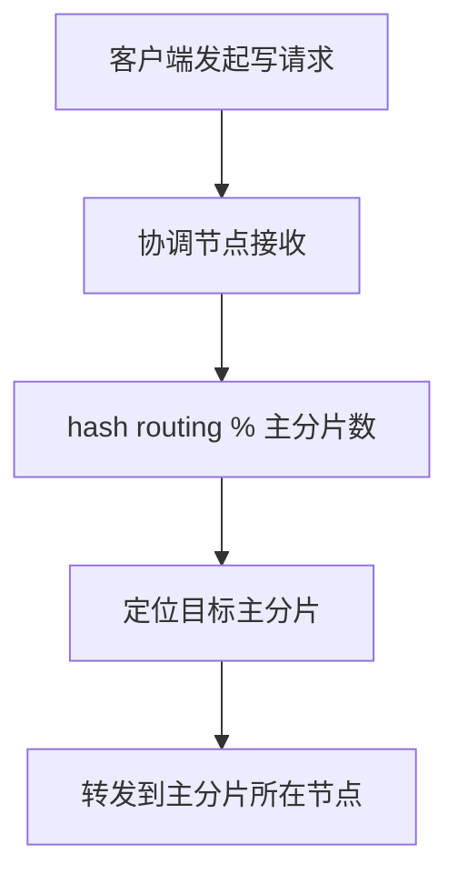
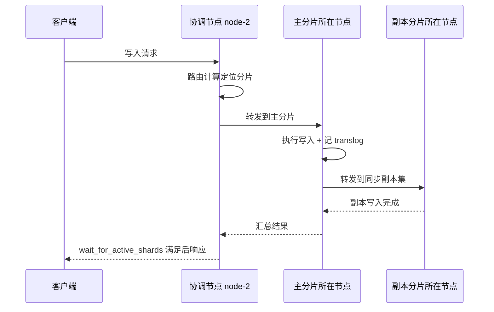
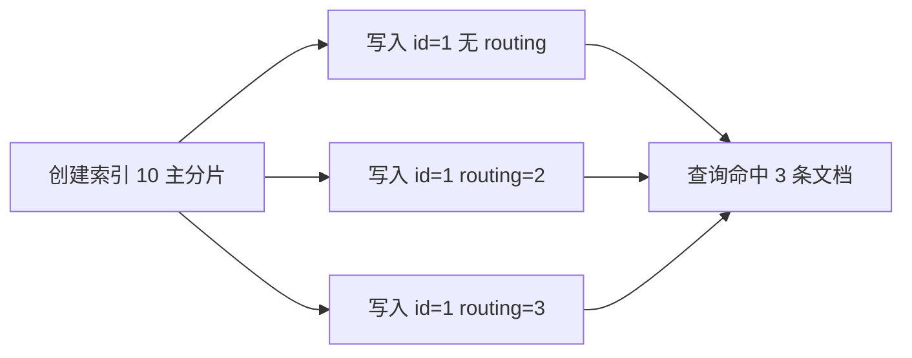

# Go 项目开发: 从写入原理深入 Elasticsearch 写优化

Elasticsearch 的读与写在工程上是两条独立链路，但它们**共享同一份机器资源**。写入压力一旦吃满 IO 和 CPU，查询延迟会立刻被拖垮。对垂直搜索这类对查询延迟敏感的业务，压低写入侧的资源占用，本身就是一种查询优化。

优化的前提是搞清楚文档到底是怎么落到磁盘上的。本文从写入链路的原理出发，逐步拆解每一个可优化的环节。

## 纲要

- 单条写与批量写的本质差异，以及批量大小该怎么定
- 文档不是随机落分片的：路由算法与分片定位
- 写入链路全貌：协调节点、主分片、同步副本集与响应时机
- 查询侧的分片定位策略与 `preference` 的两种用法
- 文档 ID 的唯一性边界：分片级唯一，而非集群全局唯一
- 落盘真相：从 index buffer 到 commit point 的完整路径
- 段不可变与段合并：删除为什么不立刻回收磁盘
- 写优化的三个方向：产品调整、架构设计、参数调优
- 操作系统层面的两个必做项
- 垂直搜索该不该用自定义 ID

## 单条写与批量写的本质差异

向 Elasticsearch 提交写入请求有两种方式：一次一条，或者使用 `_bulk` 一次提交多条。

**两者的本质区别不在写入路径，而在网络与 IO 的批处理效率。** 文档提交到集群后，最终走的是同一套写入方法，区别只在于批量请求把多条文档打包，摊薄了每个文档的网络往返和 IO 开销，因此写入效率可以高出数倍。

需要注意两点：

- **同一个 bulk 请求内，对同一个文档的操作是有序的**，这是业务正确性的底线；跨批次之间不保证有序。
- 文档在 `refresh` 之前不可见。早期版本里，如果同一批中包含自动生成的 ID 且连续出现 create 与 update，可能生成两条重复文档。该问题在 **6.3 版本已修复** —— ES 改为从 translog 中获取最近写入操作，规避了"写了但暂时搜不到"导致的重复。

## 批量大小怎么定

没有放之四海皆准的答案，**必须用真实数据在同等硬件上压测**。做法是逐步提高每批的文档数，直到集群的 IO 或 CPU 达到饱和；过程中要盯住返回状态码，**出现 `429` 说明写入已达系统瓶颈**。

| 约束项 | 建议值 |
| --- | --- |
| 每批文档数 | 1000 ~ 5000 条（大文本场景取下限） |
| 每批体积 | 5 ~ 15 MB |
| 硬上限 | 100 MB（`http.max_content_length` 默认限制，超出直接失败） |

如果对查询延迟要求高，还要主动控制写入速度，别让写入挤占查询资源。

## 文档不是随机落分片的

文档落到哪个分片由路由算法决定：

```
shard = hash(routing) % number_of_primary_shards
```

未显式指定 routing 时，默认使用文档的 `_id` 作为 routing。由于算法基于**主分片数**取余，这也是主分片数不可直接修改的原因 —— 改了主分片数，历史文档的路由结果就全变了。



## 写入链路全貌

一次写入请求要经历协调节点、主分片、副本同步三个阶段，最后才向客户端返回。



几个容易踩的点：

- 主分片写入完成后**不会**转发给该分片的所有副本，ES 由主节点维护**同步副本集**（in-sync replicas）列表，只同步给列表内的分片。
- `wait_for_active_shards` 的计数**包含主分片**。想保证至少一个副本写入成功，必须设为 `2`。
- 副本数为 0 时把该值设成 `2` 必然超时 —— 只有一个分片，永远等不到第二个。
- 一主三副但只有三个数据节点时，第四个副本无法分配（主副本不能同节点），设 `4` 同样必然超时。
- 副本同步会加重磁盘 IO。对可靠性要求不高的日志类系统，或批量导入期间，可以先设 `number_of_replicas=0`，导入完成后再打开。

主副本之所以不能分配到同一节点，是因为副本的核心使命是**可用性替补**。主副同节点，该节点宕机即全部丢失，副本形同虚设。

## 查询侧的分片定位

查询请求的分片定位逻辑与写入相似：请求中带 routing 就按 routing 定位，不带则广播到索引的所有分片，这会给集群带来额外开销。

两种常用手段：

- **`preference=_local`** —— 优先查询本地节点上的分片，避免跨节点转发。跨节点网络传输通常不会比本地取数更快。
- **把 `preference` 设为用户维度的唯一值**（如 UID、会话 ID）—— 同一用户的查询总是打到相同分片，能显著提高分片级缓存命中率。

要注意 **`preference` 的值不能以 `_` 开头**，下划线开头是 ES 保留值（`_local` 就是其中之一）。

## 文档 ID 的唯一性边界

`_id` 只在**分片级别唯一**，并非集群全局唯一。可以用一个实验验证：



三条 `_id` 都是 `1` 的文档因为 routing 不同落在不同分片，因此可以共存。由此带来三个必须记住的结论：

- 不指定 routing 时，`get` 使用**默认 routing（即 `_id` 本身）**，只能取到那条未指定 routing 的文档。
- 文档写入时带了 routing，那么 **`get` 和 `delete` 也必须带 routing**，否则必然返回 `not found`。
- 删除时若不带 routing，文档会被判定不存在，实际仍留在索引里。

## 落盘真相：不是直接落盘

文档到达数据节点后，并不是直接写盘，而是走一条"内存 → 缓存 → 磁盘"的路径。


要点拆解：

- **index buffer** 是 ES 自己管理的 JVM 堆内存，默认占堆的 **10%**，下限 48MB，无上限。
- **OS cache** 是操作系统页缓存，属于堆外内存，由内核管理。文档从 buffer 进入 OS cache 后即可被搜索，ES 的近实时特性正是基于此。
- `refresh` 默认 1 秒一次，但前提是过去 30 秒内有搜索请求，否则不会主动触发。
- 清空 index buffer **不会**清空 translog；translog 只在 `flush` 时清理。
- **6.x 之前 `flush` 会顺带触发 `refresh`，之后不再触发**，这是一个版本行为差异。

段（segment）是包含多个文档的文件，**不可变更改**。因此：

- 删除文档时写 `.del` 文件记录被删 ID，查询时过滤。
- 更新文档 = 标记旧版本删除 + 写入新版本。
- 被标记删除的数据只在**段合并**时才真正物理删除，所以批量删除后磁盘空间不会立刻回收。
- 需要定向回收时，用 `forcemerge?only_expunge_deletes=true`，只处理含删除标记的段，对集群压力小得多。

## 写优化的三个方向

### 产品调整

通过改变交互方式减少写入量，例如把高频保存改成定时保存。这类优化要兼顾用户体验，突破口不多，但值得优先思考。

### 架构设计

```dir
├── 应用服务
├── 文档合并服务
├── 写集群（承接实时写入）
└── 读集群（存量只读数据）
```

四种被验证有效的架构手段：

- **冷字段外置** —— 不参与检索但更新频繁的字段存 MongoDB，只把需要检索的字段写进 ES；查询时先用 ES 取 `_id`，再回 MongoDB 补全字段。分页场景下每页几十条结果，一次回填即可，写入压力大幅下降。
- **读写分离双集群** —— 新增与近期变更数据放写集群，久远不再变更的数据定期迁移到读集群，保证存量大数据量集群的查询效率。
- **半读写分级** —— 并非所有场景都需要实时建索引。大文本、日活不高的场景，可在用户首次搜索时触发索引重建，夜间低峰再迁入全量集群。若每用户 1000 条数据、每秒触发 10 个用户重建，ES 就要额外承受每秒一万条写入，用写集群承接这部分压力更合理。
- **文档合并** —— 实时协作类文档（笔记、文档协同编辑）把用户 100 次保存合并成 1 次写入；非实时场景甚至可把白天的写入全部合并，夜间低峰再批量写入。

### 参数调优

对应写入过程的三个阶段分别调整：

| 阶段 | 参数 | 作用与代价 |
| --- | --- | --- |
| refresh | `index.refresh_interval` | 拉长间隔生成更大的 segment，降低 IO 与 merge 压力；**支持动态调整**，导入期可设 `-1` |
| buffer | `index.buffer_size` | 大文本场景可调到堆的 20%；**静态配置，需改主配置文件并重启** |
| translog | `translog.durability` | 默认 `request` 每请求刷盘；改 `async` 降低 IO，代价是接受一定概率的数据丢失 |
| translog | `translog.flush_threshold_size` | 达到阈值强制刷盘，默认间隔 180 秒 |
| merge | `index.merge.flow_segment` | 默认 2MB，小于该值的段优先被合并 |
| merge | `index.merge.merge_at_once` | 默认一次合并 10 个段 |
| merge | `index.merge.max_merge_segment` | 默认 5GB，超过该大小的段不参与合并 |

merge 相关参数**不建议随意调整**，需用线上数据压测验证后再定。手动触发 `forcemerge` 会占用大量系统资源，应安排在业务低峰，并预留足够执行时间。

## 操作系统层面的两个必做项

- **关闭 swap** —— IO 密集的 ES 服务开 swap 会严重拖慢性能。临时关闭用 `swapoff -a`，永久生效需注释 `/etc/fstab` 中的 swap 行。两步都要做。
- **设置 `vm.swappiness=1`** —— 正常情况下内核不做交换，紧急时仍允许交换；并在 ES 配置中开启 `bootstrap.memory_lock: true`，避免 JVM 大 GC 时堆内存页被换出导致的磁盘抖动。

## 垂直搜索该不该用自定义 ID

网上很多文章建议用 ES 自动生成的 ID，理由是自定义业务 ID 写入时会多一次磁盘 IO（需要判断原文档是否存在）。这个结论**要结合业务场景看**。

垂直搜索业务的文档必须支持更新，而更新依赖原文档 ID。如果每次更新都要先按业务字段查出 ES 的 `_id`，查询本身的开销远大于写入时那次 IO。因此**垂直搜索业务更应使用业务主键作为 `_id`，并配合 bulk 写入**。只有在日志这类不存在更新的场景下，自动生成 ID 才是更优选择。

## 总结

理解写入链路的每一个环节，才能定位性能问题的真正原因。网上的优化手段可以试用，但不一定有效；正确的做法是建立 ES 体系化的知识储备，结合业务场景判断瓶颈本质，再针对性优化。

