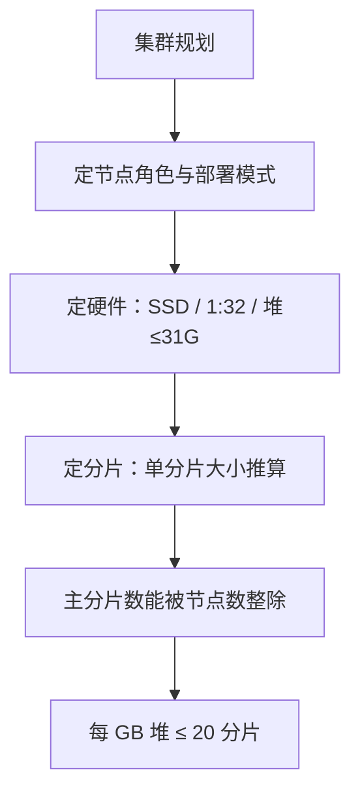

# Go 项目开发: ES 集群规划与分片设计

搭集群时最困扰人的往往不是"怎么搭"，而是"搭多大" —— 什么配置、几个节点、几个分片、几个副本。**尤其是主分片数：它参与文档的哈希路由，一旦设定就无法直接修改，后期调整代价极高。**

## 纲要

- 节点角色与两种部署模式
- 哪些角色该独立部署
- 硬件选型：磁盘、内存、CPU、网络
- 分片数过多与过少的代价
- 分片规划的五条经验
- 索引拆分的坑
- 用 `shrink` / `split` 调整主分片数

## 节点角色

| 角色 | 职责 | 资源消耗 |
| --- | --- | --- |
| `data` | 存储与检索（CRUD、搜索、聚合） | 存储 / 内存 / 计算都很高 |
| `master` | 管理集群状态、保存元数据 | 都很低 |
| `ingest` | 写入前预处理（pipeline） | **计算（CPU）非常高** |
| `coordinating` | 转发读写请求、合并结果 | 取决于聚合量 |
| `ml` | 机器学习任务 | 内存 + 计算高 |
| `remote_cluster_client` | 跨集群搜索 | — |
| `transform` | 把现有索引转化成汇总数据 | — |

`data` 角色在分层部署下细分为 `data_hot` / `data_warm` / `data_cold` / `data_frozen` / `data_content`。

查看节点角色：

```http
GET /_cat/nodes?v
GET /_nodes/<node_id>
```

## 两种部署模式

- **通用部署** —— 数据节点只有 `data` 一个角色，所有存储与操作统一进行。**垂直搜索业务一般用这种**，因为冷热数据界限难划分，不能简单靠索引生命周期管理。
- **多层部署** —— 按读写频率把 data 拆成 hot / warm / cold / frozen，**适合日志监控这类持续写入的时序场景**：新日志进热节点，随时间迁移到低配节点，便于控制成本。

七版本之后配置简化，一个 `node.roles` 数组搞定：

```txt
# 独立数据节点
node.roles: [ data ]

# 独立主节点
node.roles: [ master ]

# 独立协调节点：数组置空即开启协调角色
node.roles: [ ]

# 独立预处理节点
node.roles: [ ingest ]
```

## 哪些角色该独立

| 角色 | 什么时候独立 | 理由 |
| --- | --- | --- |
| `data` | **10 节点以上、业务较重要时必要** | 数据节点最耗资源，独立可避免与其他角色互相抢占 |
| `master` | 节点 > 10，或在意稳定性 | 主节点兼数据节点时，主节点故障会让集群在一段时间内处于 red/yellow；独立后新主当选即可迅速恢复 green |
| `coordinating` | 有大量聚合查询 | 深度聚合易 OOM；协调节点**不存数据也不当主节点，即使 OOM 也不影响集群稳定性** |
| `ingest` | 确需预处理 | 耗 CPU；**更建议把预处理前置到业务代码**，让 ES 专注搜索 |
| `ml` / `transform` | 有较大机器学习/转换任务 | 常规业务很少用到 |

初始建议配 3 个 master 节点；设了独立 master 之后，数据节点就不要再带 master 角色。

## 硬件选型

- **磁盘**：除 data 节点外，其他角色 10~40GB 即可（系统盘够用）。master 节点存集群元数据，**建议用 SSD**；data 节点**尽可能用 SSD** —— 不做其他优化，仅把机械盘换成固态，搜索性能往往就有 **10 倍甚至更大的提升**，数据量越大越明显。
- **内存磁盘比建议 1:32**（64GB 内存配 2~3TB 磁盘）。原因：随数据量增长，倒排索引的部分数据会被加载进内存（尤其占用 JVM 堆），**往往是磁盘还没满、堆先满了**。
- **CPU / 内存**：master 初始 4C8G 起；data 按压测结果定。**JVM 堆不要超过 31GB** —— 超过 32GB 就无法使用压缩指针，内存利用率下降；剩下的内存留给操作系统文件缓存。
- 通用部署下**同角色节点配置要统一**，尤其是 data 节点的磁盘大小。
- **网络**：不考虑多机房高可用时尽量同机房；跨机房需内网专线；至少千兆网卡。

前期配置可以让集群**稳定跑半年**即可，但机器资源不足带来的运维成本，远高于用稍高配置机器的成本。常用参考：64GB 内存 + 16 核计算型 CPU。

## 分片数：过多与过少的代价

主分片数参与路由，设置后不能直接改，所以规划阶段必须谨慎。

**分片过多的代价**

- master 维护集群元数据的负担变重；集群分片数到 10 万以上时，创建/删除索引会出现明显延时，节点重启后恢复时间更长。
- 小分片**开销比例更大**，搜索效率更低 —— 搜索 50 个 1GB 分片，比搜索一个 50GB 分片更费资源。
- 未指定路由的查询会打到**全部分片**，耗时上升。
- 每个索引和分片都占内存与 CPU；分片越多，段越多，堆内存里保存的段元数据也越多。

**分片过少的代价**

- 分片数少于数据节点数时，**无法最大化利用集群资源**，影响读写并发度。
- 分片数刚好等于节点数时，后续加节点也**无法再分配分片**，等于锁死了横向扩展。
- 大分片在故障恢复、数据更新、分片迁移与重平衡时都很慢 —— **100GB 分片的恢复时间是 50GB 的两倍**（要通过网络复制分片内容）。
- 数据增长而分片数不变，单分片会越来越大。

## 分片规划五条经验

- **按单分片大小推算**：业务最佳分片大小若为 20GB，2000GB 数据就需要约 100 个分片。
- **用真实数据在同配置节点压测**。单分片大小没有硬性标准：日志与时序数据 **10~50GB** 通常效果不错（用 ILM 时把 rollover 的主分片阈值设为 50GB）；垂直搜索的企业级场景，较小分片更合适。
- **每 GB 堆内存保持 20 个以下分片**。一个数据节点能容纳的分片数与堆内存成正比；超过这个量就考虑加节点或减分片。
- **主分片数要能被数据节点数整除**，让分片均匀分布 —— 既能充分利用资源，也便于后续扩容。前期设成 33 这种质数，后面加节点就很难均匀了，这一点最容易被忽视。
- 实在无法均匀分布时，可设置**只允许主分片自动分配**，存量分片用 `reroute` 手动迁移。

副本按**可用性要求与存储成本**权衡：日志与大文本基于成本可以不给副本；副本占与主分片同等的 CPU、内存与磁盘资源，**不是越多越好**。副本支持动态调整，但增加副本会带来很大系统负载，**要在业务闲时操作**。

## 索引拆分的坑

某商城商品索引有 1000 个分片，单分片已超 100GB，希望控制在 20GB，于是拆成 50 个索引、每个 100 分片。三种拆分方案：

| 方案 | 做法 | 问题 |
| --- | --- | --- |
| 按 ID 取模 | ID 对 100 取模存到对应索引 | 设计简单，但系统刚上线就会产生 100 个索引 |
| 按预估总量 | 用三年后的商品总量推算每索引文档数，前期集中在前几个索引 | 依赖估算准确性 |
| 按类目取模 | 类目 ID 对 50 取模作为索引后缀 | **类目商品数不均 → 索引大小不均** |

**三种方案的共同坑**：假设用商品类目做 routing，查询类目 1、3、5 的商品时，ES 会在 **50 个索引中分别用 1、3、5 作为 routing 查询**，需要查 `50 × 3 = 150` 个分片 —— 而单索引只需要 3 个。查询的类目越多，性能下降越严重，最终可能到秒级。

**关键限制：ES 的多索引查询不支持为每个索引单独指定 routing**，所以无法避免多余的分片查询。ES 也提供了配置项限制单次查询路由到的分片数，超过就直接拒绝请求，用于保护集群稳定。

为什么查更多分片会慢？每个节点的 CPU 有限，搜索有独立线程池，**每个分片在一个 CPU 线程上执行搜索**；节点并发搜索的分片数默认上限是 **5**（可通过请求参数调整）。多余的分片路由白白占用集群资源，而且写入与 merge 同样消耗 CPU —— 这也是写入量大时查询性能会下降的原因之一。

## 调整主分片数

虽然代价大，但主分片数并非不能改，ES 提供了两个 API。

### `shrink`：减少分片

ES 5.0+ 支持。**不直接改原索引**，而是用相同配置创建新索引，且**新索引的主分片数必须是原索引的因数**（8 → 4 / 2 / 1）。

```txt
# 1）按原索引的 mapping/settings 创建目标索引 index_b（主分片数设为 4）
PUT /index_b

# 2）原索引副本设 0、全部分片迁到同一节点、设为只读
PUT /index_a/_settings
{
  "index.number_of_replicas": 0,
  "index.routing.allocation.require._name": "node-1",
  "index.blocks.write": true
}

# 3）等迁移完成后执行 shrink
POST /index_a/_shrink/index_b
```

**前置条件**：目标索引必须已存在；集群状态 green；原索引主分片数大于目标且是其倍数；若缩到 1 个分片，文档数不能超过 `2^31 - 128`（约 21 亿）；目标节点要有足够空间容纳原索引全部分片。

**原理**：以相同配置建目标索引，从原索引的 Lucene 分段创建**硬链接**到目标索引；若文件系统不支持硬链接则复制全部分段（非常耗时）；随后对目标索引执行恢复，相当于重新打开一个关闭的索引。

### `split`：增加分片

ES 6.1+ 支持。同样是建新索引，**目标主分片数必须是原索引的倍数**。

```txt
# 1）原索引设为只读
PUT /index_a/_settings
{ "index.blocks.write": true }

# 2）执行 split，目标索引不能提前创建
POST /index_a/_split/index_b
{
  "settings": { "index.number_of_shards": 16 }
}
```

**前置条件**：目标索引**不能提前存在**（与 shrink 相反）；集群 green；目标主分片数是原索引的倍数；处理节点有足够空间容纳第二个副本；原索引必须为只读。

## 规划流程示意



## 角色与拓扑速览

```dir
es-cluster/
├── master（主节点，独立部署）
│   └── 管理元数据 / 选主
├── data（数据节点）
│   ├── data_hot（热）
│   ├── data_warm（温）
│   ├── data_cold（冷）
│   └── data_frozen（冻结）
├── ingest（预处理，耗 CPU）
├── coordinating（协调节点，数组置空）
└── 选型
    ├── 磁盘 SSD
    ├── 内存磁盘比 1:32
    └── JVM 堆 ≤ 31G
```

## 总结

集群规划可以按这个顺序推进：**先定节点角色与部署模式**（垂直搜索用通用部署）→ **再定硬件**（data 用 SSD、内存磁盘比 1:32、JVM ≤ 31G）→ **最后定分片**（按单分片大小推算、能被节点数整除、每 GB 堆内存 ≤ 20 分片）。索引拆分前一定要先想清楚 routing 会不会导致分片数爆炸 —— 这是数据上量后才暴露、且最难回头的问题。

