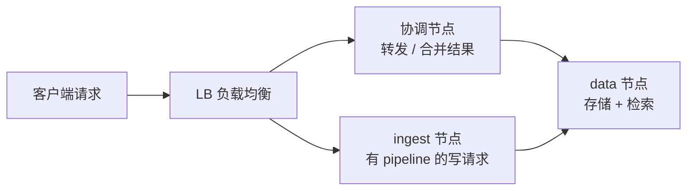
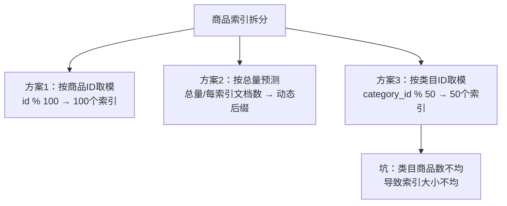

# ES集群及节点角色规划实践

节点角色规划是集群能否「扛得住、稳得住、好扩展」的前提。本节给出各类角色的部署建议、资源画像，以及最容易被忽视的两件事：**内存与磁盘的比例**、**分片数怎么定**。

## 纲要

- 部署形态：多层部署 vs 通用部署，是否独立 master
- 各类节点角色与资源消耗画像
- 磁盘规划：SSD 的价值、内存:磁盘比 1:32
- 内存与 CPU 规划：JVM 堆 31G 与压缩指针
- 网络规划：同机房、万兆网卡
- 分片规划：过多 / 过少的代价与拆索引方案

## 节点角色与部署建议

| 角色 | 职责 | 资源消耗 | 规划建议 |
| --- | --- | --- | --- |
| master | 管理集群状态/元数据 | 存储、内存、计算、网络都**低** | 大规模集群务必独立；小集群为成本可酌情合并 |
| data | 存储 + 检索数据 | 存储、内存、计算都**高** | 实际数据节点，核心资源投放点 |
| ingest | 转换/预处理输入数据 | **CPU 极高**（转换耗 CPU） | 有 ingest pipeline、转换/ML 预处理任务才需要 |
| ML | 机器学习任务 | 内存 + 计算（尤其计算） | 有重 ML 任务才独立部署 |
| coordinating-only | 转发读写、合并分片结果 | 依请求量而定 | 大量聚合/协调节点 OOM 也不影响集群稳定 |

部署建议：

- **实际数据节点**建议多层部署（独立 master + data）；其他情况用**通用部署**即可。
- 节点规模很小的集群，出于成本可酌情不单独设 master；**大规模集群必须独立 master**，且初始建议 3 个。设了独立 master 后，data 节点就不要再承担 master 角色。
- 有较重 ML / 转换 / 基于 pipeline 的任务才考虑独立 ML / ingest / 预处理节点。
- 节点需要执行更多聚合操作时，可考虑独立**协调节点**：它不存数据、不作 master，即使 OOM 也不影响集群稳定性。

## 请求路由的两种隔离形态

垂直搜索（非日志类业务搜索）常用如下架构：客户端请求经 LB 分发，读写请求转给协调节点；若涉及 ingest pipeline，则把需要转换的请求转发到 ingest 节点。



另一种更进一步的形态是**把读、写请求分别发到不同的协调节点组**，起到隔离作用——不同角色节点对机器存储与计算资源的消耗不同，隔离后互不拖累。

## 磁盘规划

除 data 节点需要存大量数据外，其他角色一般给 **10~40GB** 存储即可，用服务器自带系统盘，无需额外加硬盘。

- **master 节点**虽把元数据加载进内存，但仍建议用 **SSD** 存元数据，尤其大规模集群。
- 垂直搜索（非日志类）在通用部署下，**data 节点尽量用 SSD**——不做其他优化，仅把机械盘换 SSD，搜索性能往往有 **10 倍甚至更大**提升，数据量越大越明显。
- data 节点磁盘大小需结合业务做压缩比预估。经验上**内存:磁盘比建议控制在 1:32**，即 64GB 内存的机器配 **2~3TB** 磁盘。

> 为什么磁盘不是越大越好、要和内存成比例？因为数据增长后，为加速查询，部分索引数据（尤其会被加载进堆外内存的字段数据）会进内存；常常磁盘还没到上限，JVM/堆外内存就已到顶。所以必须限制磁盘与内存的比例。

## 内存与 CPU 规划

- **master 节点**初始可从 4G / 8G 起步；其他角色结合上表资源画像与压测决定。
- **JVM 堆不要超过 32GB**：超过 32G 后无法使用**压缩指针（compressed ordinary object pointers）**，内存利用率反而下降。一般设堆为 **31GB**，剩下的留给操作系统做文件系统缓存。

```dir
cluster-plan/
├── master 节点（独立）
│   ├── 堆 4~8G 起步
│   └── 元数据用 SSD
├── data 节点（核心）
│   ├── 堆 ≤31G（压缩指针）
│   ├── 内存:磁盘 ≈ 1:32
│   └── 尽量 SSD
├── ingest 节点（按需）
│   └── 高 CPU
└── coordinating 节点（按需）
    └── 不存数据、不作 master
```

- 各角色**相同角色的节点要统一规格**，尤其 data 节点的磁盘大小要一致。
- 前期机器配置可稍高、节点数可少一些，确保资源充裕（如 64GB 内存、16 核计算增强型）。资源不足导致运维事故的人工成本，远高于稍高配置。
- **DSL 支持横向扩展**：即便用物理机不能动态改配置，也能把更高配机器加入集群，再用 API 把原节点上的数据驱逐（explain/reroute），方便地完成「换机器」。

## 网络规划

- 不考虑多机房高可用时，**尽量同机房**，跨机房走内网延迟高。
- 建议**万兆（10GbE）网卡**。

## 分片规划（本节重点）

主分片数参与数据路由，**一旦设定，后期调整代价很大**。一个索引到底设多少分片是索引设计的难题，过多与过少都有坑。

| 问题 | 表现 |
| --- | --- |
| 分片过多 | master 维护负担重；分片元数据操作（建索引等）出现内网延时；节点重启后分片恢复更慢；小分片开销占比更大、搜索效率更低；无路由的查询会打到全部分片，耗时升高 |
| 分片过少 | 单分片只能分配到集群中有限节点，无法最大化利用资源、影响并发度；无法随集群扩节点再分配；单分片过大导致查询/更新/迁移/恢复都变慢（100GB 分片恢复比 50GB 慢一倍） |

> 索引/分片的元数据保存在堆内存中，用于快速检索倒排数据。分片越多，堆内元数据越多。大多情况下，相同文档数的大分片比许多小分片更省资源。

**单分片大小要关注**，可用如下 API 查看（单位可调，避免小索引显示 0）：

```bash
GET /_cat/shards/{index}?bytes=gb
# 或 bytes=kb 看小索引
```

分片过大的两种解法：

1. **索引拆分（split）**：如把 10 主分片的索引拆成两个各 10 主分片的索引，总分片变 20、单分片变小。ES 提供 `_split` API（后续详述）。难点在于**不是所有场景都能找到合适的拆分维度**——用错维度，单索引查询变多索引查询会打更多分片，数据量上来后是灾难。
2. **前期压测预估**：用线上数据导入单节点做压测，验证业务数据在单节点上的性能，从而合理预估主分片数。

以商城商品索引为例（1000 分片，商品 ID 自增，单分片已超 100G，目标控到 20G），三种拆分方案：



- **方案1**：按商品 ID 取模，设计简单；但不想一上来就 100 个索引时不好控节奏。
- **方案2**：用「预计三年总量 / 每索引文档数」推算后缀，前期文档集中在前几个索引，随数据增长再建后续索引，节奏可控。
- **方案3**：按类目取模；但**各类目商品数可能不均**，基数不够大时会导致索引大小不均匀——三种方案共同的坑是**拆分维度选错**。

## 总结

集群规划的两大核心约束是**内存与磁盘的比例**和**分片数**：

- 角色要分清楚——master 独立保稳定、data 配 SSD 与 31G 堆、ingest/coordinating 按需；同角色节点**规格统一**。
- **内存:磁盘 ≈ 1:32**，JVM 堆 ≤31G 以保留压缩指针；磁盘在 SSD 加持下搜索性能可提升十倍级。
- **分片数宁可控勿失控**：过多拖累 master、过少限制并发与扩展；拆索引要选对维度，维度错了查询反而更慢。前期机器稍高配、节点少一些，比后期运维事故更划算。
