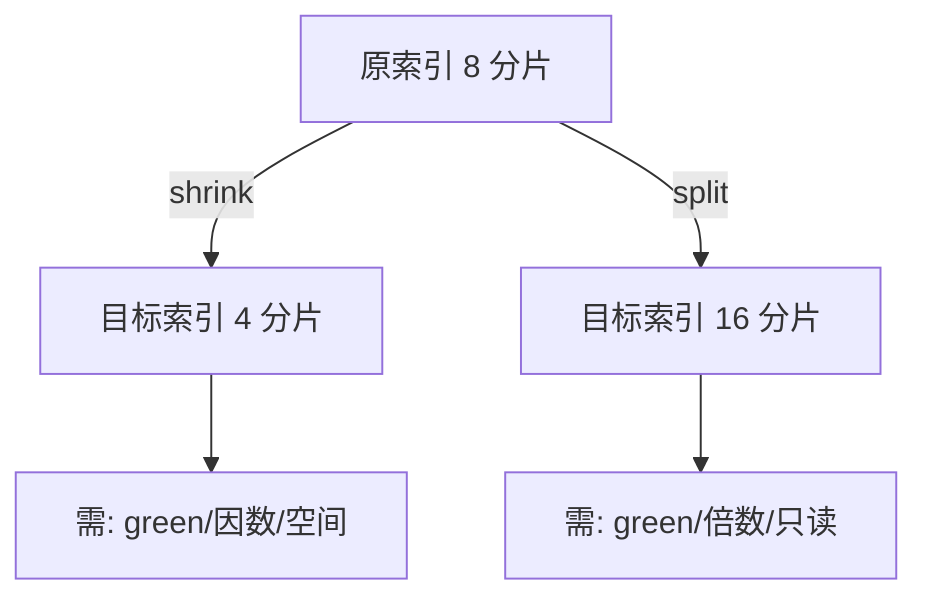

# ES集群及节点角色规划实践

集群规划做得好不好，直接决定集群能否长期稳定。本节先剖析「按类目拆分索引 + routing」带来的分片膨胀坑，再给出分片与副本的规划经验，最后讲解如何用 shrink / split API 在后期调整主分片数。

## 纲要

- routing 跨多索引查询会放大分片数，拖累性能
- 单次查询的分片并发受 `max_concurrent_shard_requests` 限制（默认 5）
- 分片规划四要素：单分片大小、堆内存分片比、均匀分布、压测验证
- 副本规划：按可用性与存储成本权衡，支持动态调但需选闲时
- 后期用 shrink（减）/ split（增）调整主分片数及前提条件

## routing 与分片数的博弈

假设按商品类目把数据拆成 50 个索引，每种类目又用类目 ID 作为 routing。当用户搜索类目 1、3、5 时，查询会在 50 个索引上各以 `routing=1/3/5` 路由，需查询的分片总数 = 50 × 3 = **150 个**；而单索引方案只需 3 个分片。索引拆得越多，查询性能下降越严重，甚至到秒级。

ES 提供了集群配置来限制单次查询可路由的分片数量，超过阈值查询会被拒绝以保护集群稳定。此外，每个节点并发搜索的分片数也有限制（通过请求参数 `max_concurrent_shard_requests` 控制，**默认 5**）。原因在于：每个节点的 CPU 资源有限，搜索和写入各有独立线程池，跨大量分片的搜索会占满搜索线程池；写入量大时查询也会变慢。所以索引拆分必须预估「拆分后单条查询要打多少分片」。


## 分片规划四要素

1. **按单分片大小推算数量**：如最佳单分片 20GB、总数据 2000GB，则分片数 ≈ 100。不同业务读写频率、硬件差异大，没有统一标准，**先用与线上同配置的节点 + 真实数据压测**。
2. **日志 / 时序数据**：单分片 10GB~50GB 通常效果良好；用 ILM 的 rollover 时，把 `max_primary_shard_size` 设为 50GB 即可避免超大分片。
3. **堆内存分片比**：尽量保持每 GB 堆内存 **不超过 20 个分片**。数据节点的分片容量与堆内存成正比，超过该比例就应考虑加节点或减分片。
4. **均匀分布**：让每个索引的主分片数能被数据节点数整除，分片才能均匀落在各节点，平衡负载。例如前期设了 33 个分片，后续加节点就很难均匀分配。

```dir
cluster-plan/
├── 分片规划/
│   ├── 单分片大小/       # 10~50GB
│   ├── 堆内存比/         # ≤20 分片/GB
│   └── 均匀分布/         # 主分片数可整除节点数
└── 副本规划/
    ├── 可用性要求
    └── 存储成本
```

| 规划维度 | 经验值 / 建议 | 说明 |
| --- | --- | --- |
| 单分片大小 | 10–50GB（日志/时序） | 用 ILM 限制 50GB |
| 堆内存分片比 | ≤ 20 分片 / GB 堆 | 超限就加节点或减分片 |
| 均匀分布 | 主分片数整除节点数 | 避免负载倾斜 |
| 并发分片 | `max_concurrent_shard_requests=5` | 默认每节点并发 |

若实在无法避免分布不均且多索引共存，可只允许**新增主分片**自动分配，旧分片通过 `reroute` 手动迁移（如把索引的分片 1 从 node1 迁到 node2）。

## 副本与后期调整

副本数要权衡**可用性**与**存储成本**：日志 / 大文本索引出于成本可不设副本（副本是主分片的拷贝，也占 CPU / 内存 / 存储）；但副本能响应查询、容忍少数节点离线。副本支持动态调整（如 `PUT /<index>/_settings {"index.number_of_replicas":1}`），但调整（尤其加副本）负载大，建议业务闲时进行。

主分片数后期调整代价大，但 ES 提供了两个 API：

- **shrink（ES 5.0+，减分片）**：用相同配置新建索引，仅减少主分片数，且目标主分片数必须是原索引的**因数**（如 8→4/2/1）。步骤：①按原 mapping/setting 建目标索引；②把原索引副本设为 0、分片迁到同一节点、设为只读；③执行 `_shrink`。条件：目标索引需提前存在、集群 green、原主分片数 > 目标且为目标的倍数、若缩到 1 则文档数 ≤ 2^31−128（约 21 亿）、目标节点有足够空间容纳全部原分片（靠硬链接，需同主机）。
- **split（ES 6.1+，增分片）**：同样建新索引但**目标索引不能提前存在**，主分片数必须是原索引的**倍数**。条件：目标索引不存在、集群 green、目标主分片数为原倍数、节点有足够空间、原索引只读。



## 总结

集群规划的核心是**分片规划**。用类目做 routing 跨多索引查询会把分片数放大数十倍，必须预估单条查询的命中分片数，并理解每个节点并发搜索分片受 `max_concurrent_shard_requests`（默认 5）约束。分片大小建议 10–50GB（日志/时序），堆内存每 GB 不超过 20 个分片，且主分片数要能被节点数整除以保证均匀分布。

副本按可用性与成本权衡、可动态调但选闲时。后期若需改主分片数，用 **shrink 减（目标为原因数）** 或 **split 增（目标为原倍数）**，两者都靠「同配置新索引 + 硬链接」实现，操作前务必满足集群 green、空间充足、原索引只读（split 还要求目标索引不存在）等前提条件。依据这些原则规划，能较好保证集群稳定，也便于新集群评估规模。
