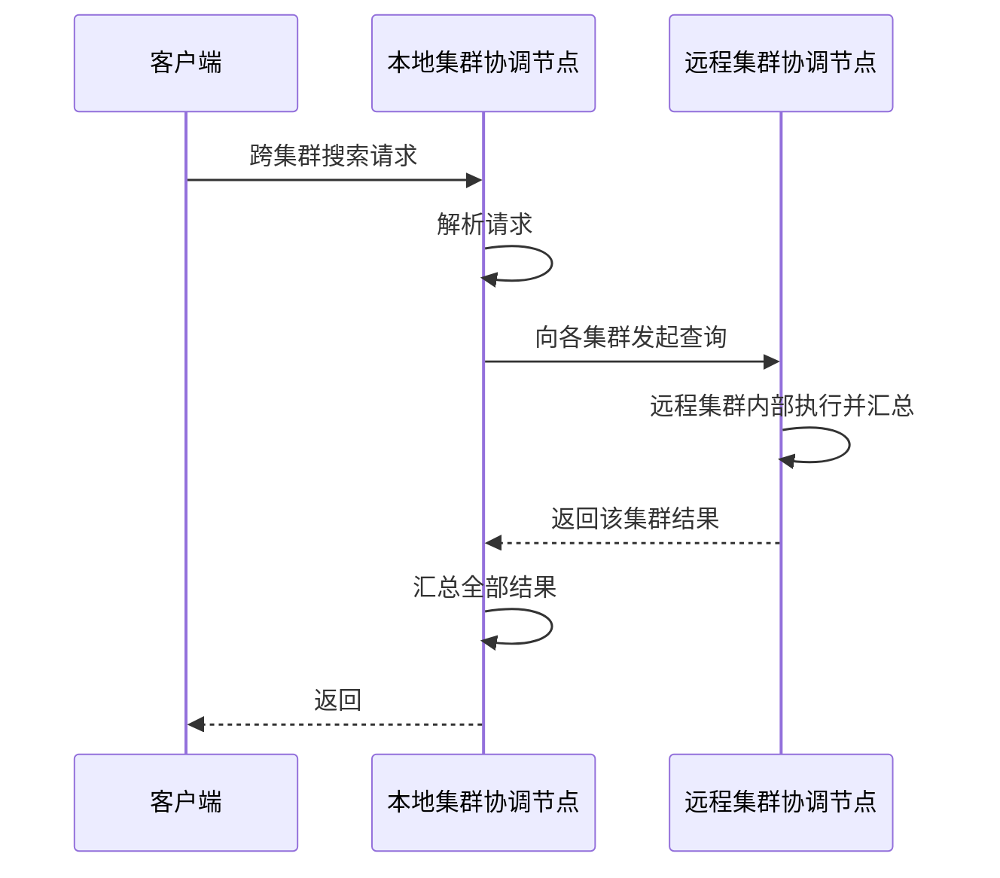
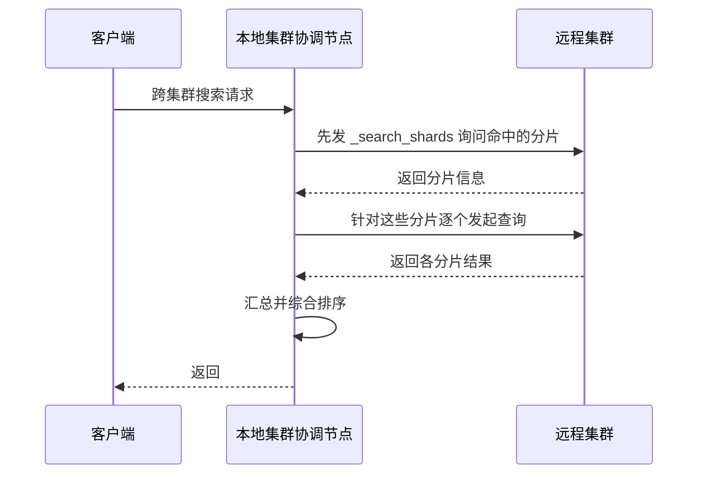

# Go 项目开发: ES 跨集群搜索的配置与原理

ES 天然支持横向扩展，分片设置合理的前提下，业务后期加节点就能扩容。上百个节点的集群只要规划合理一般问题不大，但**节点达到几百上千甚至更大规模时，问题就来了**。

## 纲要

- 集群过大带来的三个问题
- 跨集群搜索的配置方式
- 两种连接模式与关键参数
- 查询语法与本地集群的坑
- 两种查询流程：最小化与非最小化网络往返
- 版本兼容规则
- 注意事项与多集群方案对比

## 集群过大带来的问题

- **元数据维护压力大** —— 集群要维护节点、索引 mapping、索引与集群配置、集群状态等大量元数据。新增字段、删除索引这类操作需要同步到全集群所有节点，修改集群配置也会变慢。
- **配置变更变慢**。
- **分片重平衡与重启恢复时间变长**。

这时候可以把数据**均匀分布到多个集群**中，通过跨集群搜索对外提供统一的检索能力。

## 配置远程集群

在**本地集群**（充当查询入口的集群）上，通过 cluster settings 注册远程集群：

```txt
PUT /_cluster/settings
{
  "persistent": {
    "cluster": {
      "remote": {
        "test2": {
          "mode": "sniff",
          "seeds": ["127.0.0.1:9302"],
          "transport.compress": true,
          "skip_unavailable": true
        }
      }
    }
  }
}
```

| 参数 | 含义 |
| --- | --- |
| `mode` | `sniff`（默认，嗅探模式）/ `proxy`（代理模式） |
| `seeds` | 远程集群的种子节点列表 |
| `transport.compress` | 节点间通信是否压缩传输 |
| `skip_unavailable` | 远程集群不可用时是否跳过（默认 `false`） |
| `transport.ping_schedule` | 心跳间隔，默认 `-1`（不发送应用级心跳） |

### 两种连接模式

- **嗅探模式（sniff）** —— 默认模式。用**集群名称 + 种子节点列表**配置远程集群；注册时本地集群通过种子节点获取远程集群状态，最多有 3 个网关节点参与远程请求。**要求种子节点的连接地址可被本地集群访问**。
- **代理模式（proxy）** —— 用**集群名称 + 代理地址**注册，通过可配置数量的套接字连到代理地址，再由代理路由到远程集群。**不要求远程节点的发布地址可被访问**。

两种模式可以共存，对不同集群分别指定即可（不写 `mode` 的走默认嗅探模式）。

### `skip_unavailable` 一定要想清楚

默认 `false`：任何一个远程集群不可用，整个搜索直接返回错误。**生产环境通常希望尽可能返回结果**，此时应设为 `true` 跳过不可用集群，出错信息会在返回结果的 `_cluster.skip_unavailable` 字段里 —— **这个字段需要接入监控**。测试环境建议保持 `false`，便于暴露问题。

```txt
PUT /_cluster/settings
{
  "persistent": {
    "cluster.remote.test2.skip_unavailable": true
  }
}
```

### 两个易踩的运维细节

- 修改 `transport.compress` 或 `transport.ping_schedule` **任意一个，都会导致现有连接关闭后重连**，此时进来的请求会出现连接失败。这两项更新要放在业务低峰期。
- 心跳更推荐靠**正确配置 TCP keepalive**（由操作系统处理，ES 在远程连接上默认启用），而不是配 `ping_schedule`。

验证连接是否成功：

```http
GET /_remote/info
# connected 为 true 即已连上
```

## 查询语法

```txt
# 查指定远程集群的指定索引
GET /test2:test_index/_search

# 查所有远程集群的某索引（* 只匹配远程集群，不含本地）
GET /*:test_index/_search

# 查多个集群的多个索引，逗号分隔
GET /test2:test_index,test3:my_index/_search

# 本地索引 + 远程索引混查
GET /test_index,test2:test_index/_search
```

**本地集群有两个坑**：

- 通配符 `*` **不能匹配本地集群**（本地集群不属于"远程集群"）。
- **不能指定本地集群的名称去查询** —— 会直接报错，因为本地集群并没有注册为远程集群。

## 两种查询流程

### 最小化网络往返（默认）



远程集群内部完成自己的查询与汇总，只把结果回传，网络传输次数最少。

### 非最小化网络往返

在 URL 上带 `ccs_minimize_roundtrips=false` 开启。流程多两步：



**scroll 滚动查询、`inner_hits` 这类大查询不支持最小化模式**，必须显式使用非最小化。

## 版本兼容规则

本地集群与远程集群版本可以不同，但有以下约束：

- 同一主版本内的任意节点可互相通信（7.0 可与任何 7.x 通信）。
- **只有某个主版本的最后一个次要版本，才能与下一个主版本及其次要版本通信** —— 例如 6.8 可与任何 7.x 通信，而 6.7 只能与 7.0 通信。
- 兼容性是**对称的**（6.7 可与 7.0 通信，反之亦然）。

即便如此，仍然建议跨集群搜索使用**相同版本**。

## 注意事项

- **跨集群比单集群需要更多网络请求，同等条件下查询性能通常更差**。只有当集群规模已成为系统瓶颈时才考虑它。
- **多集群方案往往更优**：按用户维度拆分，把同一用户的数据写入同一个集群，查询时只查该集群，性能明显好于跨集群。
- **跨集群与索引拆分有同样的 routing 问题**：查询中指定的 routing 会被应用到所有集群的所有索引上，**ES 不支持为某个集群的某个索引单独指定 routing**；不指定 routing 时，会查询所有集群、所有索引的全部分片。数据量与分片数多时，这就是性能杀手。
- 开启安全功能时，**所有集群必须使用同一套证书**。建议部署完第一个集群后直接复制安装包到其他集群，只改集群名、节点名、IP，或把生成好的证书拷到其他集群的配置中。

## 跨集群拓扑速览

```dir
ccs-arch/
├── 本地集群（查询入口）
│   └── cluster.remote.<name>
│       ├── mode: sniff / proxy
│       ├── seeds / proxy address
│       └── skip_unavailable
├── 远程集群（test2）
│   └── 3 个网关节点参与
└── 查询流程
    ├── 最小化往返（默认）
    └── 非最小化（ccs_minimize_roundtrips=false）
```

## 总结

跨集群搜索是"集群长太大"之后的解法，不是银弹。用之前先确认三件事：**规模是否真的已成为瓶颈**（否则不如用多集群按用户拆分）、**routing 会不会导致分片查询爆炸**、**各集群版本是否满足兼容规则**。上线前务必用业务真实数据和查询语句验证跨集群的查询性能。

