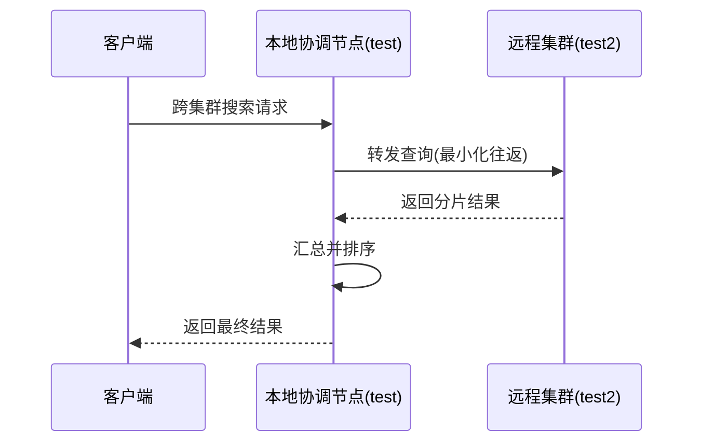
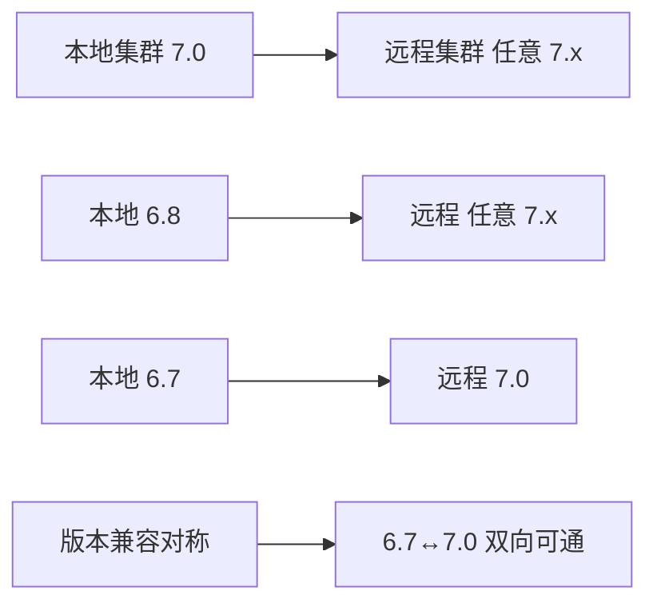

# ES跨集群搜索原理和实战

当单个集群的规模成为系统瓶颈，或业务需要按用户维度隔离数据却又偶尔要跨集群检索时，跨集群搜索（Cross-Cluster Search，简称 CCS）就派上用场了。它通过在本地集群注册若干远程集群，让客户端只连接一个集群就能拿到多个集群汇总后的结果。本节拆跨集群搜索的两种模式、完整查询流程、版本兼容规则与关键注意事项。

## 纲要

- 两种模式：最小化网络往返（默认）与非最小化网络往返
- 查询流程：协调节点转发、远程集群执行、本地汇总
- 版本兼容：主版本对称、末次次要版本可跨主版本
- 注意事项：性能更差、routing 作用于全部集群、安全证书统一
- 方案对比：跨集群 vs 多集群（按用户分簇）

## 第一节 两种搜索模式

跨集群搜索支持两种模式，通过 URL 参数 `ccs_minimize_roundtrips` 控制（默认 `true`，即最小化网络往返）。

- **最小化网络往返（默认）**：本地协调节点一次性把查询发给各远程集群，远程集群返回最终结果，网络次数少、查询效率高。但 `scroll`、评分滚动查询、`index stats` 等不支持该模式，此时需显式设为 `false`。
- **非最小化网络往返**：本地协调节点先向各远程集群发 `_search_shards` 查询「命中了哪些分片」，拿到分片清单后再向每个分片发独立查询，最后汇总排序。多几跳网络，但兼容性更好。

## 第二节 查询流程与版本兼容

最小化模式的查询链路如下：客户端 → 本地集群协调节点 → 各远程集群 → 返回结果给本地协调节点 → 汇总后回客户端。



版本兼容规则（建议实测以目标版本为准）：



- 任意节点可与**同主版本**的其它节点通信（如 7.0 与任意 7.x）。
- 只有某主版本的**最后一个次要版本**能与下一主版本通信：6.8 可与任意 7.x 通信，而 6.7 只能与 7.0 通信。
- 兼容具有**对称性**：6.7 能与 7.0 通信，7.0 也能与 6.7 通信。

```dir
cross-cluster/
├── setup/              # 集群注册
│   ├── remote_seeds
│   └── cert_copy
├── query/              # 查询模式
│   ├── minimize_true
│   └── minimize_false
├── version/            # 版本兼容矩阵
└── ops/                # 运维注意
    ├── routing
    └── certs
```

| 模式 | 网络次数 | 适用场景 | 限制 |
| --- | --- | --- | --- |
| 最小化往返(默认) | 少 | 绝大多数普通查询 | 不支持 scroll/评分滚动等 |
| 非最小化往返 | 多 | 大查询/兼容优先 | 性能更差 |

## 总结

跨集群搜索能兼容一部分跨版本场景，但仍**强烈建议使用相同版本**做跨集群，省去兼容排查成本。它要比同规模单集群多花网络请求，通常情况下查询性能甚至可能比单集群差，所以只有在集群规模已成瓶颈、或需要把不同用户数据落到不同集群时再考虑。

落地时有三个坑务必记住：**其一**，跨集群与索引拆分一样，会对查询指定的每个集群的每个索引使用同一 `routing`，不支持「某集群某索引单独指定 routing」；不指定 routing 时会扫描每个集群每个索引的每个分片，分片过多就是性能杀手。**其二**，若开启了安全功能，必须为全部集群使用相同 CA 生成的证书——部署第一个集群后，直接拷贝证书或复制安装包改集群名/节点名最省事。**其三**，真要上跨集群，务必用真实业务数据和查询语句压测验证性能。作业：自己动手配置一次跨集群搜索，并对比「多集群方案」与「跨集群方案」的优劣与适用场景。
