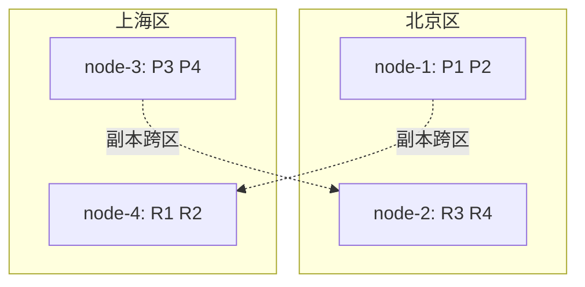

# Go 项目开发: ES 集群多可用区容灾的原理与部署

多可用区高可用的最终目标是：**允许至少一个可用区的机器全部无法访问时，集群仍能正常提供服务**。ES 实现这件事的机制并不复杂 —— 靠的是机架感知（allocation awareness）。

## 纲要

- 五种容灾方案与选型
- 核心原理：主副分片跨可用区分配
- 机架感知的三步配置
- 为什么必须配 `force` 策略
- 双可用区部署：节点规划与分片分布
- 三可用区部署：容忍两个区故障
- 硬性约束清单

## 五种容灾方案

| 方案 | 做法 | 评价 |
| --- | --- | --- |
| 跨机房部署 | 节点分布到不同机房 + 副本 + 机架感知 | **实现最简单、最普遍**，本节主线 |
| 快照备份 | 定期快照到外部存储，备集群恢复 | 只适合小索引；**无法实时**，恢复期数据可能丢失 |
| 消息队列双写 | MQ 开多个消费者，分别写主备集群 | 主备需在不同可用区；应用层要改 |
| CCR 跨集群复制 | ES 6.7+ 白金版功能 | 付费；集群间同步有性能开销；主备切换麻烦、易丢数据、有同步延时 |
| 网关异步双写 | 网关接收写请求并异步写备集群 | 实现成本低，无需应用层处理，且支持主备切换 |

## 核心原理

ES 的做法很直接：**让同一个索引的主分片与副本分片分配到不同的可用区**。这样任何一个区整体不可用，其余区仍持有完整数据。

这件事通过**机架感知**完成 —— 给节点打上可用区属性，ES 在分配分片时会避开"同区分片"。

## 机架感知三步配置

```txt
# 1）主配置文件 elasticsearch.yml：声明机架感知的属性名
cluster.routing.allocation.awareness.attributes: zone

# 2）每个节点上声明自己属于哪个区
node.attr.zone: 北京区     # node-1 / node-2 / node-5
node.attr.zone: 上海区     # node-3 / node-4 / node-6
node.attr.zone: 广州区     # node-7

# 3）强制策略：其他位置的节点恢复可用之前，不主动分配丢失的副本
cluster.routing.allocation.awareness.force.zone.values: 北京区,上海区
```

## 为什么必须配 `force`

默认情况下，某个区故障后 ES 会把丢失的分片重新分配给其余健康节点。这看起来是"自愈"，实际有三个问题：

- 其余健康节点**不一定有足够的空间**承接这些分片。
- 重新分配**消耗大量集群资源**，读写都会受影响。
- 副本被分配到现存的可用区，一旦该区再故障，**高可用就被破坏了**。

`force.zone.values` 的作用就是：在这些区的节点恢复可用之前，不允许把丢失的副本分配出去。节点离线后应当通过监控告警人工介入恢复，而不是让集群自己把副本塞进剩下的区里。

## 双可用区部署

以 4 个数据节点 + 3 个 master 节点为例：

```dir
├── 北京区
│   ├── node-1  (data)
│   ├── node-2  (data)
│   └── node-5  (master)
├── 上海区
│   ├── node-3  (data)
│   ├── node-4  (data)
│   └── node-6  (master)
└── 广州区
    └── node-7  (master)
```

**master 节点数量是关键**：不设独立主节点时两个可用区就够；一旦设独立主节点，**至少需要三个**，且必须分布在不同可用区 —— 否则同区放两个 master，该区不可用时会直接选不出主节点。



主分片 1、2 落在北京区，3、4 落在上海区；而对应的副本**不会落在同区**（机架感知约束），只能去对方区。结果是：

- 每个区都持有**完整数据**（4 个分片的主或副）。
- 任一区整体不可用，另一区仍能对外提供全部数据。

## 三可用区部署

三区高可用的实现方式与双区基本一致，在广州区**新增两个数据节点**即可。

| 目标 | 要求 |
| --- | --- |
| 容忍 1 个区故障 | 至少 1 个副本 |
| 容忍 2 个区故障 | 至少 2 个副本 |

三节点单副本（3 个可用区、至少 6 个数据节点）：分片均匀分布在 6 个节点上，每个区都有一份完整分片数据，任一区故障集群正常。

三节点两副本：主分片配两个副本，**任意两个区故障后分片依然完整**。

## 硬性约束清单

- **各可用区之间需要内网专线**，保障节点间通信效率。
- **数据节点个数必须是可用区数量的倍数** —— 三个区就要 3 / 6 / 9 / 12 个数据节点，否则分布不均。
- **至少设置一个副本** —— 想允许一个区的机器宕机，双区、三区都一样。
- master 节点要跨区分布，且数量为奇数个（至少 3）。

## 总结

多可用区容灾的实现可以压成一句话：**给节点打可用区标签，让主副分片跨区分配，并配 `force` 策略防止故障期副本被塞进同一个区**。真正容易出错的不是配置本身，而是节点数量规划 —— 数据节点数必须是区数的倍数、副本数要匹配你想容忍的故障区数、master 要跨区且奇数个。

