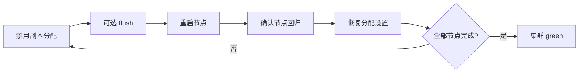

# Go 项目开发: ES 集群运维实践经验总结

ES 集群的异常，绝大多数**只有一个共同根因：存在未正常分配的分片**。搞清楚这句话，就掌握了运维排查的主线 —— 不管集群显示为 yellow 还是 red，第一步都应该是「把未分配的分片找出来，问清楚它为什么没分配」。

本节把日常运维中反复出现的几类问题串成一条可复用的处置流程：**定位状态异常 → 拆解未分配原因 → 排查内存与线程池 → 滚动重启集群**。

## 纲要

- 集群状态异常的判定标准，以及 red / yellow 背后的共同根因
- 用 allocation explain 精确定位分片未分配的原因
- 分片未分配的六类常见原因与对应处置手段
- 磁盘三个水位线的作用与设置方式
- JVM 堆内存的五块消耗来源
- 内存与 GC 的排查工具链
- 线程池与热点线程：被拒绝请求意味着什么
- 生产环境高发的三类资源问题
- 集群滚动重启的五个步骤

## 集群状态异常的判定标准

正常情况下集群是 **green**。异常状态只有两种：

| 集群状态 | 触发条件 | 含义 |
| --- | --- | --- |
| green | 主分片与副本分片全部正常分配 | 健康 |
| yellow | 有副本分片未分配 | 数据完整，**无副本冗余**，单点故障即风险 |
| red | 有主分片未分配 | **数据丢失风险**，该分片上的数据暂时搜不到 |

如果集群里既有 yellow 又有 red 的索引，**对外展示的是严重级别更高的那个 —— red**。

关键认知：**不论 yellow 还是 red，根本原因都指向同一个 —— 存在未正常分配的分片**。两者的区别只在于「未分配的是副本还是主分片」。red 之所以危险，是因为主分片缺失意味着这部分数据已经不可服务。

## 用 allocation explain 定位原因

red 状态一定出现了主分片未分配，也可能主副本同时未分配。定位原因的命令是：

```txt
GET _cluster/allocation/explain
```

返回结果会列出是哪个索引、哪个分片、是否为主分片未能分配。

```txt
{
  "index": "mail_index",
  "shard": 0,
  "primary": true,
  "current_state": "unassigned",
  "unassigned_info": {
    "reason": "INDEX_CREATED"
  },
  "assignee": null,
  "node_explanation": {
    "unassigned_info": { ... },
    "can_allocate": "NO",
    "explanation": "the shard cannot be allocated to any node..."
  },
  "cluster_explanation": {
    "explanation": "..."
  }
}
```

返回结构里三层信息要逐层看：

- **`reason` / `unassigned_info.reason`** —— 触发未分配的**操作**，例如 `INDEX_CREATED` 表示是创建索引时就没分配上。
- **`node_explanation`** —— 说明该分片为什么**无法分配到任何节点**。
- **`cluster_explanation.explanation`** —— 集群层面的判定结论。

把 `index` / `shard` / `primary` 这几个字段在请求里指定好，就能只查某一个索引某一个分片的未分配原因。系统有几十上百个异常索引时，全量返回会长到没法看，按需过滤是必做动作：

```txt
GET _cluster/allocation/explain
{
  "index": "mail_index",
  "shard": 0,
  "primary": true
}
```

## 分片未分配的六类常见原因

### 一、节点离线 —— 生产环境最常见的场景

节点进程挂掉、机器重启、网络抖动，都会让该节点上的分片落在未分配状态。**处置方式就是重启离线的节点**，让分片重新分配回去。

### 二、分片分配规则的限制

ES 有三条硬性分配规则，都会造成「明明有空节点，分片就是分配不上去」：

1. **主分片与它的副本不能分配到同一个节点** —— 否则主副本一起挂就全没了。
2. **同一个主分片的多个副本之间也不能同节点**。
3. **7.x 之后单节点总分片数限制默认为 1000** —— 分片数开得太多时，新节点入集群反而分配不进去。

突破第三条需要改这个配置：

```txt
# cluster.routing.allocation.total_shards.per_node
PUT _cluster/settings
{
  "transient": {
    "cluster.routing.allocation.total_shards.per_node": "2000"
  }
}
```

**transient 与 persistent 的区别**：transient 只在当前集群生命周期内生效，重启即失效；persistent 写入集群状态，重启后保留。运维临时放量一般先用 transient。

### 三、磁盘水位线触发

磁盘占用越线会让节点直接拒绝承接分片，详见下一节。

### 四、分配重试次数耗尽

分片分配失败后会**自动重试**（受 `cluster.allocation.retry.count` 限制，默认 5 次），但节点负载过高、网络抖动等导致重试次数耗尽后，分片就**不再自动尝试**了，状态会一直卡在未分配，且不会自己恢复。

手动触发重新分配：

```txt
POST _cluster/reroute?retry_failed=true
```

这个接口在**绝大多数场景下都应该优先试一次**，成本极低，往往一次就把问题解决了。

### 五、副本分片同步异常或副本损坏

除了分配规则（含机架感知 `awareness`）的限制，这类情况的成因通常是历史版本 bug：副本同步完成后文档数与主分片不一致，或者副本分片意外损坏。

处置方式是**把索引副本数先设为 0，再设回原值**，让 ES 重新分配副本：

```txt
PUT /mail_index/_settings
{
  "number_of_replicas": 0
}
```

等副本分配完成、集群恢复 green 后，再改回原来的副本数。这一步能解决大部分「副本死活起不来」的问题。

### 六、磁盘损坏导致索引不可修复（下策）

没有副本、磁盘又出故障、索引损坏无法修复时，正确顺序是：**先保住集群可用，再从上游业务库重建数据**。

具体操作是用 reroute 把损坏的空分片摘掉，并显式声明允许数据丢失：

```txt
POST _cluster/reroute
{
  "commands": [
    {
      "allocate_empty_primary": {
        "index": "mail_index",
        "shard": 3,
        "node": "node-2",
        "accept_data_loss": true
      }
    }
  ]
}
```

`allocate_empty_primary` 的作用是**从集群元数据里剔除掉这个分片的信息**，让它变成空主分片，集群状态因此恢复。

**必须明确的前提**：只有确认磁盘损坏、短期内无法修复，才走这一步。如果节点只是短暂离线就执行此操作，会**直接造成离线节点数据的永久丢失** —— 节点重启后这些分片也不会再回来。

主分片损坏且没有可晋升的副本时，思路相同：用 reroute 把旧的副本分片强制升为主分片，同样要带 `accept_data_loss`。这份旧副本的数据未必最新，但能换来集群恢复、绝大部分数据可用。

## 磁盘的三个水位线

水位线是「磁盘快满了」引发分片未分配的唯一成因，三档各有明确语义：

| 水位线 | 默认值 | 作用 |
| --- | --- | --- |
| low（低水位） | 85% | 新创建的主分片不受影响；旧分片和副本**不会**分配到占用超 85% 的节点 |
| high（高水位） | 90% | 达到 90% 时，ES 会尝试把分片重新分配到低于此线的节点 |
| flood（洪水线） | 95% | 超过 95%，**索引变为只读**，写入直接失败 |

配置时支持写**具体容量**或**百分比**，但**两者不能混用**（85% 加 90GB 这种写法不合法）：

```txt
# 按百分比
PUT _cluster/settings
{
  "transient": {
    "cluster.routing.allocation.disk.watermark.low": "80%",
    "cluster.routing.allocation.disk.watermark.high": "88%",
    "cluster.routing.allocation.disk.watermark.flood_stage": "95%"
  }
}
```

```txt
# 按具体容量
PUT _cluster/settings
{
  "transient": {
    "cluster.routing.allocation.disk.watermark.low": "100GB",
    "cluster.routing.allocation.disk.watermark.high": "50GB",
    "cluster.routing.allocation.disk.watermark.flood_stage": "20GB"
  }
}
```

遇到水位线触发的分片未分配，可选项有三个：**临时调低水位线**、**扩容磁盘**、**清理旧索引数据**。

## JVM 堆内存的五块消耗来源

ES 底层基于 Lucene，为了提供高效检索能力，需要把 Lucene 的特定数据结构**加载进内存**。集群内节点数量越多、分片越多，需要驻留内存的信息就越多。

**JVM 堆一般设 32G 以内** —— 因为 G1 压缩指针（compressed oops）在 32G 以内能正常把对象指针压到 4 字节，超过这个阈值指针膨胀、实际更吃内存；同时还要**留一半内存给操作系统文件缓存**，Lucene 的依赖文件页缓存命中率直接决定查询速度。

ES 7.x 之后自身熔断机制比较完善，一般不会因为单次查询消耗过大而 OOM。**内存问题几乎都会先反映在 GC 上** —— 所以 GC 监控是内存运维的核心。

堆内存的消耗分成这几块：

### 一、index buffer

文档写入时**不直接落盘**，而是先写进 index buffer，再经过 refresh 进入 OS cache，最后经过 flush 才落盘。index buffer 就在 **JVM 堆内**，默认大小为**堆的 10%**。

### 二、node query cache

**节点级别**的查询缓存 —— 节点上所有分片共享。使用 **LRU** 淘汰，只缓存 filter 查询的结果，默认大小为**堆的 10%**。

### 三、shard request cache

**分片级别**的查询缓存，缓存 `size=0` 的查询请求、聚合结果、搜索建议（suggest）以及命中结果的总数，同样用 LRU 淘汰。

### 四、fielddata

倒排索引结构，**主要用于排序和聚合**，官方更推荐用 **doc_values** 替代它。早期版本里 term index 也放在堆内存中，占用量非常可观（"loadname" 那个庞大的东西就是它）。

### 五、其他杂项

文档删除队列（delayed queue）、transport 层、集群状态、索引与分片管理信息等，都会占一部分堆内存。

## 内存与 GC 的排查工具链

**第一层：节点堆内存使用率**

```txt
GET _cat/nodes?h=heap.percent
```

加上过滤参数，可以只取出关心的字段 —— 节点名、节点堆内存、index 数据内存、fielddata 大小等：

```txt
GET _cat/nodes?h=name,heap.percent,heap.current,fielddata.memory_size,indices.query_cache.memory_size
```

**第二层：GC 曲线**

如果部署了 Kibana，或按前文讲过的 Prometheus + Grafana 方案做了监控，可以直接看节点的 GC 状况，重点盯两条曲线：**GC 速率**和 **GC 耗时**。这两条曲线一旦**大幅增长，集群大概率已经出问题**。

**第三层：JDK 命令行**（无监控环境时的兜底）

```txt
jstat -gc <ES进程PID>
```

查看节点堆内存占用的关键指标名：`heap.percent`，配合 `fielddata.memory_size`、`query_cache.memory_size` 一起看，能直接定位是哪一块在涨。

## 线程池与热点线程

ES 的读写等所有操作都跑在线程池上。写入或查询量超过处理能力时，线程池被打满，**ES 会拒绝一部分请求**。

```txt
GET _cat/thread_pool
```

重点关注两列：**队列中的数量（queue）**和**被拒绝的数量（rejected）**。

**一旦出现 rejected，说明集群已经超过处理能力。** 写线程被拒绝尤其危险 —— 这部分数据**可能直接被丢弃、根本没写进 ES**，所以**业务代码里必须做重试**，重试策略通常加上指数退避。

另外还要盯一个接口：

```txt
GET _cat/hot_threads
```

它返回当前正在跑的**热点线程**，能看出哪些操作在大量吃 CPU 或内存。数据量小的集群返回条目少，线上大集群这里会刷出大量明细。

**GC 曲线的稳定，直接决定集群稳定性与查询延迟。** 保持 GC 频率和 GC 耗时在一个相对稳定的水位，是 ES 运维的基本盘。

## 生产高发的三类资源问题

### 一、几十亿数据量上的多层嵌套聚合

深度聚合极其消耗节点资源，尤其是多层嵌套。这类查询最容易把单个节点的 CPU 和堆一起打爆。

**处置**：业务侧限流或加超时；用 `search.max_buckets` 设硬上限；能不用嵌套就不用，改成多次查询在应用层合并。

### 二、writer/search 线程大量 reject

通过 `_cat/thread_pool` 看到 `search` 或 `write` 线程大量 reject，同时伴随节点响应缓慢、GC 频繁 —— 典型原因是 **bulk 队列过大**。

bulk queue 越大看起来越能扛，但**节点处理不过来的数据会全堆在内存里**，大文本场景尤其严重。数据滞留队列 → 频繁 GC → 响应更慢 → 堆积更多，直接滚成雪崩，甚至节点被 GC 拖到离线。

**处置**：适当调小 bulk queue 的等待，同时把批量大小压到合理区间（1000~5000 条 / 5~15MB），别用大请求硬扛。

### 三、fielddata 吃满堆内存

两种典型触发：

- **7.7 之前按 ES 文档 ID（`_id`）排序**，会把 `_id` 字段的 fielddata 加载进堆内存，占用量很吓人。
- 对某些字段**开启了 fielddata 并做排序**，大文本字段尤其危险 —— **fielddata 一旦加载进内存就不会主动回收**。

**处置三选一**：

1. **排序字段一律用 doc_values** —— 这是正解。
2. 非要对大文本排序，**只取开头几个字单独放一个 keyword 字段**，用 doc_values 排序。
3. 已经吃满就清缓存止血：

```txt
POST /mail_index/_cache/clear?field=content
```

## 集群滚动重启的五个步骤

改配置、装插件都需要重启节点。ES **必须逐节点滚动重启**，必须**等集群状态恢复之后再动下一个节点**。



**第一步：只允许主分片分配**

数据节点离线超过 1 分钟，ES 就会从其他节点恢复丢失的副本，这一恢复会带来大量 IO 和网络开销。滚动重启期间禁用副本分配可以规避：

```txt
PUT _cluster/settings
{
  "transient": {
    "cluster.routing.allocation.enable": "primary_only"
  }
}
```

**第二步（可选）：停止索引写入并执行 flush**

关掉索引写入 + 主动 flush，**能大幅加快分片恢复速度**。业务上允许短暂停写的话建议做。

**第三步：重启节点，确认是否回到集群**

重启后短时间内集群可能只剩两个节点，被重启的节点要过一会儿才重新加入。反复执行下面这个命令观察：

```txt
GET _cat/nodes?v
```

**第四步：节点回归后置空 allocation 设置**

恢复全部分片分配：

```txt
PUT _cluster/settings
{
  "transient": {
    "cluster.routing.allocation.enable": null
  }
}
```

两个坑要注意：

- **这个值用 `null` 或空字符串表示恢复默认**，不是写 `all`（虽然语义接近，但别写错）；
- **绝对不能用 `none`** —— 那是禁止任何分片分配。

**这一步之后集群大概率会短暂 yellow 或 red**，因为分片正在批量恢复。不要慌，等一会儿再看：

```txt
GET _cluster/health?wait_for_status=green&timeout=60s
```

**第五步：重复第一步到第四步，直到所有节点重启完成**

## 运维主线速览

```dir
es-ops/
├── 状态异常判定
│   ├── green / yellow / red
│   └── 根因：未分配分片
├── allocation explain 定位
│   └── reason / node_explanation
├── 六类未分配原因
│   ├── 节点离线 / 规则限制
│   ├── 水位线 / 重试耗尽
│   └── 副本损坏 / 磁盘损坏
└── 滚动重启
    └── 禁分配 → 重启 → 恢复
```

## 总结

运维 ES 集群的完整心法可以压成一句话：**先看状态，再找未分配的分片，问清楚它为什么没分配，对症下药。**

- 状态异常的根因**永远指向未分配的分片**，yellow 和 red 的差别只在「缺的是副本还是主分片」。
- 排查顺序建议固定：`_cluster/allocation/explain` 定位 → 判断属于哪一类原因（节点离线 / 规则限制 / 水位线 / 重试耗尽 / 副本损坏 / 磁盘损坏）→ 对应处置。
- 内存问题先看 GC，GC 异常再回到堆内存构成（index buffer、query cache、request cache、fielddata）去找是谁在涨。
- 线程池 reject 是**业务可见**的信号，必须让业务侧知道并做重试，别指望集群自己扛过去。
- 重启一定要滚动，且**每一步都等集群恢复**再走下一步，贪快只会把一次小维护变成一次故障。

生产里大部分问题的起因都比较简单，**只有少数情况才需要导出堆做内存分析、甚至读源码**。把上面这条主线和几个命令练熟，能省下绝大部分深夜救火的时间。

