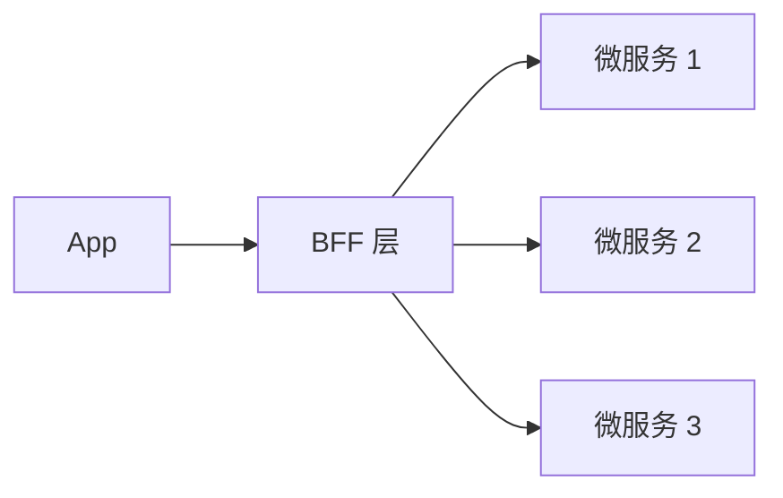
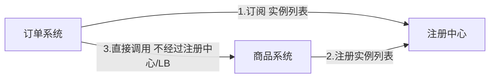

# Go 项目开发: 电商微服务架构演进与 BFF 层的由来

很多开发人员甚至架构师都会混淆 **BFF** 和**网关**。厘清这两者的区别，也就理清了电商架构从单体走向微服务的整条演进路线。

## 纲要

- BFF 是什么、为什么会出现
- BFF 的三个阶段：引入、膨胀、拆分
- 网关与 BFF 的职责边界
- 从单体到 SOA 到去中心化

## BFF 是什么

BFF 是 **Backend For Frontend** 的缩写，"服务于前端的后端"。它是一种**逻辑分层**的思想 —— 在微服务与各端之间加一层适配服务，专门负责后端服务的适配，为 Web、PC、APP 等端提供统一友好的 API。

## BFF 是怎么被逼出来的

2012 年起无线应用快速发展，企业纷纷做自己的 App。App 想调用内部服务时，四个问题摆在一起：

- **耦合** —— App 直接调微服务会与内部服务深度耦合，任何一方变化都可能影响另一方；服务端一变，所有无线端都要跟着改。
- **重复适配** —— 一个功能可能要调多个内部服务；后端返回的结果偏通用，App 屏幕小要裁剪内容，iPad 屏幕大少裁一些 —— 设备类型越多，裁剪与适配的重复劳动越多。
- **传统 Web 服务器不适用** —— 它们连前后端分离都还没实现，直接渲染 HTML 页面，App 无法使用。
- **体验分裂** —— 后端只提供基础服务接口，App 的个性化需求没地方放。

于是在微服务与 App 端之间引入一层，让无线端通过它接入微服务 —— **这就是 BFF**。



BFF 的价值：App 端变化无需后端适配，直接在 BFF 完成；后端变化经 BFF 适配后 App 也不受影响；甚至一些功能可以由前端同学在 BFF 层自己实现。

## BFF 的膨胀与拆分

业务进一步发展后，BFF 自身出了三个问题：

- 各端都有不同研发团队，**共享同一个 BFF 带来团队沟通成本**。
- 安全认证、熔断、限流等功能全塞进 BFF，**代码越来越复杂、bug 增多、开发效率下降**。
- 最致命的是 **BFF 单点问题** —— 它一旦出问题，全部无线端都不可用。

解法是引入 **API Gateway**：

- App 通过网关调用微服务，网关把**不同的端转发到各自的 BFF**。
- 部署**多个 API Gateway**，解决单点问题。
- **BFF 按团队或业务线解耦**，拆分成若干个 BFF 服务，各业务线并行开发、交付各自的 BFF 与微服务。
- 安全认证、限流这些功能**从 BFF 层上移到网关层**；网关同时承担负载均衡。

随后传统 Web 端也完成前后端分离改造，并开放第三方接入。第三方应用 → 第三方网关 → 第三方 BFF；无线端与 H5 各走各的网关与 BFF。至此形成通用的现代微服务架构：

```dir
├── 用户体验层（App / Web / H5 / 第三方应用）
├── 网关层（各端网关：路由 / 认证 / 限流 / 负载均衡）
├── BFF 层（按业务线拆分的适配层）
└── 微服务层
```

## 网关与 BFF 的职责边界

这才是两者区别的核心：

| 层 | 职责 |
| --- | --- |
| **网关** | 负载均衡、鉴权验证、限流、防爬等**横切能力** |
| **BFF** | 对端进行**适配、裁剪、聚合**等面向端的能力 |

一句话：**网关管"能不能进"，BFF 管"给你什么"。**

## 电商架构的微服务化演进

### 单体架构

所有模块在一个应用里，问题前面已详细讨论过。

### SOA 架构

面向服务的架构，服务化的产物：各端请求经负载均衡器转发到电商系统的各个子服务，子服务之间也有调用关系（比如订单系统调用商品系统，通过内部 LB 转发）。

SOA 在很大程度上解决了单体膨胀导致的代码与团队双重耦合，降低了相互影响的风险，提高了开发部署效率，扩展性也增强了。

### SOA 的雪崩问题与去中心化

SOA 的隐患：**子系统之间的访问通过 Nginx 等负载均衡服务，流量大时节点过载，容易引发雪崩**。

解法是让服务调用**去中心化** —— 用注册中心代替负载均衡：



- 各子服务启动时把自己的**实例列表注册到注册中心**。
- 子服务与注册中心维持长链接，实时获取可用服务实例。
- 订单系统要调商品系统时，**不经过注册中心**，而是根据本地的商品服务实例列表直接调用。

到这里，去中心化架构已经具备了微服务架构的雏形。它与微服务的区别，除了自动化持续集成/发布与全链路监控，**基本上就是拆分粒度上的差异**。

## 总结

BFF 与网关是两件事：**网关解决"统一入口与安全治理"，BFF 解决"面向不同端的适配"**。演进顺序是 —— 单体 → SOA（LB 串联子服务）→ 去中心化（注册中心 + 本地直调）→ 微服务（加上网关与 BFF 的完整分层）。每一次演进都在回答同一个问题：**上一层的瓶颈在哪，就把那层独立出来。**

