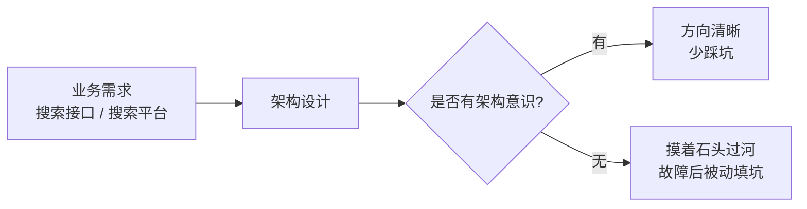
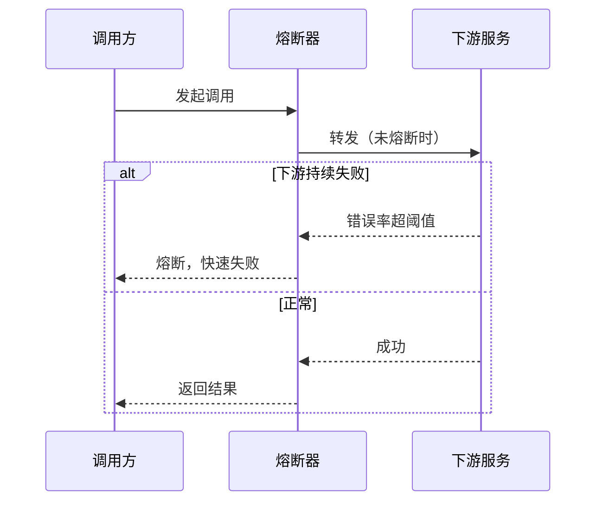

# 微服务设计：章节导学 —— 从演进、拆分到 AKF 与高可用设计

在当今的互联网技术环境里，**微服务的思想已经非常普及**，各家企业也都有适合自身特色的微服务实践方式。但一个现实是：底层开发者能参与微服务「从零到一」建设的很少，许多新同事对微服务只有**碎片化的了解**，缺乏系统性认知。与此同时，大厂基本都已通过微服务来构建和发布应用。

这一章，我们就把「微服务」这头大象完整地看一遍——既讲设计思想与原则，也讲一线大厂的实战技巧。

## 纲要

- 为什么要系统学微服务：每个开发者都是架构师
- 本章路线图：设计思想、演进、拆分、BFF、扩展与高可用
- AKF 扩展立方体：X / Y / Z 三维伸缩
- 微服务高可用设计：隔离、限流、降级、过载保护、熔断、超时控制
- 核心心法：没有最好的架构，只有最合适的架构

## 为什么要系统学微服务

互联网发展到今天，**每个开发者其实都是架构师**。小到一个搜索接口的实现，大到整个搜索平台的建设，都需要一定的架构设计思想和意识。



但现实中，很多同学面对架构设计是**摸着石头过河**——前期该考虑的必要问题没考虑，等到故障发生了才被动填坑。架构设计的意识，需要不断强化；它能在实际工作中给你一个方向，避免凭感觉实现。

## 本章路线图

本章围绕微服务架构设计展开，内容分两条主线：

| 主线 | 内容 |
| --- | --- |
| 设计思想与演进 | 微服务设计思想、设计原则、演进过程、拆分方式、如何判断拆分合理性、BFF 层的由来 |
| 扩展与高可用 | AKF 扩展立方体；微服务高可用设计：隔离、限流、降级、过载保护、熔断、超时控制 |

```dir
微服务设计章节结构
├── 设计思想
│   ├── 微服务设计原则
│   └── 架构演进过程
├── 服务拆分
│   ├── 拆分方式
│   ├── 拆分合理性评判
│   └── BFF 层的由来
└── 扩展与高可用
    ├── AKF 扩展立方体（X/Y/Z）
    ├── 隔离 / 限流 / 降级
    └── 过载保护 / 熔断 / 超时控制
```

## AKF 扩展立方体

扩展设计是微服务绕不开的话题，**AKF 扩展立方体**用三个轴把「怎么伸缩」讲透：

| 轴 | 含义 | 典型手段 |
| --- | --- | --- |
| **X 轴** | 水平复制（克隆） | 无差别多副本，负载均衡分摊流量 |
| **Y 轴** | 功能 / 服务拆分 | 按业务域把单体拆成独立服务 |
| **Z 轴** | 数据分片 / 按客户路由 | 按用户 ID 等维度分片，就近路由 |

实践中往往是三轴组合：用 **Y 轴**按业务拆服务，用 **X 轴**给每个服务加副本，用 **Z 轴**按用户把数据和请求分片，三者叠加才能支撑海量规模。

## 微服务高可用设计

服务拆开后，稳定性要靠一整套「兜底机制」来保障，本章会重点拆解：

- **隔离**：故障不扩散，一个服务出问题不拖垮整体。
- **限流**：控制单位时间请求量，保护系统不被洪峰打垮。
- **降级**：依赖不可用时，牺牲非核心功能保主流程。
- **过载保护**：系统接近饱和时主动拒绝，避免雪崩。
- **熔断**：依赖持续失败则快速失败、不再无谓重试。
- **超时控制**：任何跨服务调用都必须有超时，避免线程被长期占用。



## 总结

微服务不是「把服务拆小」这么简单，而是一套从**设计思想 → 演进拆分 → 扩展伸缩 → 高可用兜底**的完整方法论。

记住一句话：**没有最好的架构，只有最合适的架构**。架构设计需要不断学习与实践，它既需要架构知识的支撑，也需要对业务的深入理解和全局把控。根据业务的不同发展阶段，选用与之适配的架构，才能在前期规避那些「等故障发生才被迫填坑」的被动局面。
