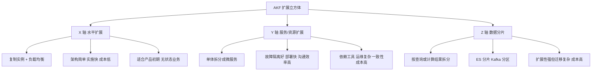
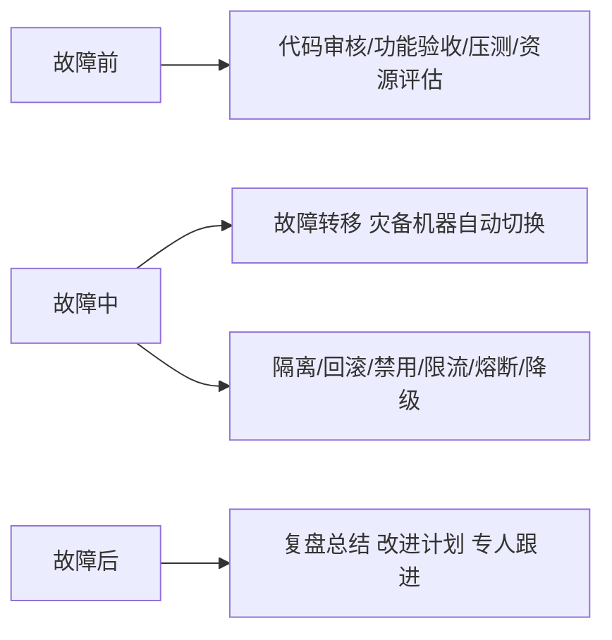

# Go 项目开发: 架构设计的六条原则

架构设计不只出现在面试里。日常开发中，做一个功能、解决一个问题、主导一个模块乃至一整个服务，本质上都是架构设计。掌握一些架构知识，处理实际问题时才不至于手忙脚乱。

## 纲要

- 设计前要考虑的三个维度
- 避免过度设计
- 优先使用成熟技术
- 可扩展原则与 AKF 扩展立方体
- 高可用：按故障阶段采取措施
- 隔离原则
- 自动化驱动原则

## 设计前考虑三个维度

| 维度 | 要考虑什么 |
| --- | --- |
| 团队 | 人员的接受能力、可投入的人力资源 |
| 技术 | 当前已有的技术体系、技术成熟度、掌控力度（能否支持定制化需求） |
| 业务 | 当前业务体量、业务的加速度、业务发展方向 |

架构的目标是解决实际问题、提升可用性与扩展性、控制成本。**但可用性与成本是矛盾对立的关系** —— 高可用的架构设计通常需要冗余机器，成本随之上升。这个取舍是架构决策的核心张力。

## 原则一：避免过度设计

本质是**避免设计超过实际需求的架构**，从而降低复杂性、提升可扩展性、缩短实现周期、节省开发成本。

按二八定律，80% 的产出源自 20% 的投入 —— 先简化范围找到那 20% 需要努力的点，再投入 80% 的时间去设计它。

过度设计的代价：复杂的解决方案**实践成本和维护成本都很高**，且会限制系统的可扩展性；业务是不断变化的，架构方案需要持续优化演进甚至推翻重来，一开始就追求完美架构极可能脱离当前实际需求，浪费大量人力与硬件；复杂架构实现周期长，影响产品发布计划，最终高成本低收益。

**怎么验证是否过度设计**：把方案展示给公司内不同的技术团队，参与者要覆盖不同经验水平和不同任期时间（考虑任期是防止新成员虽然经验丰富但不熟悉公司业务）。如果每个团队都能轻松理解，并且能在无人协助的情况下向其他人讲清楚，就认为通过；否则应当进一步讨论方案是否过于复杂。

## 原则二：优先使用成熟技术

开发人员喜欢尝鲜，但新技术未经充分验证难免踩坑，学习成本高、实施周期长、出问题排查解决更困难。作为架构师应当**求稳** —— 成熟技术落地更快，维护成本更低。

## 原则三：可扩展

扩展性的表象是"应对不断变化的业务"，但**本质是通过设计合理的模块关系来控制系统复杂度，把业务变化带来的系统调整降到最低**。

### AKF 扩展立方体



| 轴 | 做法 | 适用 | 特点 |
| --- | --- | --- | --- |
| **X 轴** | 水平扩展：复制实例，前端负载均衡分摊压力 | 产品初期；**无状态业务**（有状态如 MySQL 主从不适用） | 架构简单、实施快、成本低，保持无状态即可 |
| **Y 轴** | 按服务/资源扩展：单体演进到微服务 | 业务逻辑复杂、数据关联性不强、团队规模大、代码规模大 | 故障隔离好、部署快、沟通效率高；但对工具依赖高、资源消耗多、运维复杂、一致性成本高 |
| **Z 轴** | 按查询或计算结果拆分，即**分片思想** | 数据规模非常大的大型分布式系统；X/Y 轴解决不了时 | 扩展性极强、突破单表规模效果显著；但架构复杂、数据迁移复杂、实现成本非常高 |

## 原则四：高可用

故障是不可避免的，提高可用性要**按故障发生的阶段分别采取措施**。



- **故障前**：避免故障发生 —— 上线前代码审核、功能验收、压测、服务器资源评估。
- **故障中**：先做**故障转移**（提供灾备机器，自动切换）；问题没解决就设法减少影响，尤其是减少对核心服务的影响 —— 隔离、回滚、禁用、限流、熔断、降级。这些策略本质是在**争取时间**，以便尽快恢复可用性。
- **故障后**：做好复盘总结，针对原因制定改进计划并专人跟进。**故障总结会不是批斗会**，不追责，而是以开放包容的心态探讨如何不让故障再次发生。

具体手段：

| 手段 | 含义 |
| --- | --- |
| 可回滚 | 谁也无法保证升级后不出问题，改造越大越要准备回滚方案 |
| 可禁用 | 对新功能提供启用/禁用能力，出问题可快速禁用使其恢复（如新的排序算法、推荐引擎） |
| 限流 | 流量超过负荷后只处理部分请求，其余直接丢弃，保障整体可用 |
| 降级 | 放弃非核心功能，保障核心功能可用 |
| 熔断 | 像保险丝一样主动断开，避免占用大量系统资源 |

## 原则五：隔离

隔离能**有效控制故障影响范围**，也能减少服务之间的相互影响。前面讲过的 ES 节点角色隔离，就是这一思想的体现。

## 原则六：自动化驱动

Google SRE 的数据显示，**约 70% 的生产事故来源于变更**。传统行业实现高可用靠严格的流程把控、减少变更频率 —— 为此不得不投入更多测试人员甚至用绩效约束开发人员，这也是传统行业转型互联网后跟不上节奏的原因。

微服务拆分后服务数量快速增长，**部署与运维成本随服务数量呈指数级增长**（每个服务都要部署、监控、日志分析）。所以在服务拆分之前，就应当先构建自动化工具与环境：

- 代码提交后自动编译、构建、测试；
- 上线过程一键发布，既避免人为失误，又化解微服务带来的运维复杂度；
- **几乎任何重复性工作都应该自动化**。

## 原则结构速览

```dir
architecture-principles/
├── 避免过度设计
│   └── 二八定律：20% 投入 80% 产出
├── 优先成熟技术
├── 可扩展（AKF 立方体）
│   ├── X 轴 水平扩展
│   ├── Y 轴 微服务
│   └── Z 轴 数据分片
├── 高可用（按阶段）
│   ├── 故障前 / 中 / 后
│   └── 限流 熔断 降级
├── 隔离原则
└── 自动化驱动
```

## 总结

两条核心思想值得记住：**在能解决问题的前提下，架构越简单越好**；**架构是不断演化的，绝不是一步到位** —— 业务在变化，架构可以持续完善，到一定阶段甚至重构或重写都是正常的。先按简单方式设计，随业务发展迭代完善。

