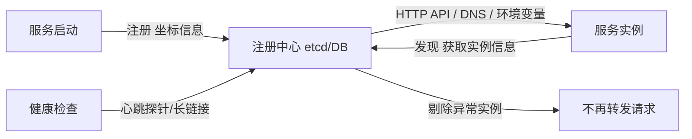
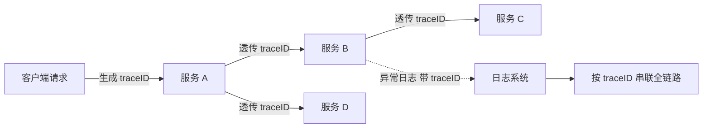

# Go 项目开发: 单体架构的痛点与微服务治理

早期互联网发展没那么快，为了降低开发、部署和维护成本，会把全部功能塞进一个单体应用 —— 代码与功能打包在一起，部署在同一套环境，连同一个数据库。电商系统里的商品、订单、用户、物流、运营、数据分析全都在一份代码里。

## 纲要

- 单体架构的四个痛点
- 九个维度的正面对比
- 从服务化到微服务的演进路径
- 演进中的五个难题与对策
- 链路追踪怎么做

## 单体架构的四个痛点

- **耦合度太高** —— 一个模块出问题，整个应用都无法提供服务。
- **维护成本变高** —— 项目越来越复杂，一处改动可能涉及多个模块。
- **打包部署慢** —— 项目初期几千行代码，构建一次几秒，可以频繁上线；发展到上百万行代码时，一次构建（编译 + 单元测试 + 打包 + 上传）可能要十几分钟，**任何小修改都要全量构建**，上线变更非常不灵活。
- **协作成本高** —— 业务扩张后多个部门开发同一套代码，迭代进度难同步、职责难划分。

## 九个维度的对比

| 维度 | 单体架构 | 微服务架构 |
| --- | --- | --- |
| 交付速度 | 慢 | **快**，各服务可并行开发测试部署 |
| 故障隔离范围 | 差 | **好**，进程隔离，可按业务重要程度分级，从数据库到服务都能有效隔离 |
| 持续演进灵活度 | 差，容易演变成大规模重构 | **好**，粒度小、影响面小 |
| 沟通效率 | 低 | **高**，按业务建全功能团队，权利向上无决策瓶颈，沟通规模小 |
| 技术栈选择 | 受限，基本由第一个依赖决定 | **灵活**，可按服务选技术栈甚至不同语言 |
| 可扩展性 | 只能整体扩展 | **以服务为粒度**，符合 AKF 的 Y 轴扩展 |
| 可重用性 | 低 | **高**，以服务为粒度提供接口共享 |
| 复杂问题分解 | 困难 | **容易**，业务边界清晰 |
| 产品创新复杂度 | 高 | **低**，团队有更多自主决策权与试错机会 |

代码规模越大，微服务的优势越明显。

## 演进路径：服务化 → 微服务

**服务化**是把单体应用中的本地调用改造成远程调用：把通用的业务逻辑抽象成独立模块，通过 RPC / IPC 调用。比如用户模块几乎被所有模块依赖，就可以把它从单体里拆出来，独立开发、部署、测试和发布，交给专门团队管理。

服务化在很大程度上解决了单体膨胀导致的代码与团队双重耦合，也降低了事故相互影响的风险。随着多核技术发展与 DevOps 思想普及，服务化进一步演化为今天的**微服务**。

典型的微服务整体架构：

```dir
├── 流量接入 → 负载均衡
├── 微服务集群（基于 K8s 部署）
│   ├── 配置中心（如 Apollo）
│   ├── 注册中心（如 Consul / etcd）
│   └── 业务服务
├── 基础服务（元数据 / 调度 / 搜索）
│   └── 依赖中间件：ES、对象存储
├── 中间件：MySQL、Kafka、Redis
├── 日志分析：ELK
├── 监控：Prometheus + Grafana
└── 自动化运维平台
    ├── 自动编译打包 → 部署测试环境
    ├── 自动化测试平台 + 结果通知
    └── 发布平台：测试环境验收后一键发布线上
```

## 演进中的五个难题

### 拆分的边界在哪里

**当不知道是否应该拆分时，可以暂时不拆分。** 等业务发展到一定程度，界限往往就变得清晰了。

### 服务数量暴增带来的运维负担

解法是上一节的**自动化驱动原则**。最好在微服务化之前就开始建设自动化，任何重复性操作都优先考虑自动化解放人力。

### 这么多小服务怎么管理：服务治理



- **服务注册** —— 服务启动时通过调用 API、产生事件、发送消息等方式，把自己的坐标信息记录到注册中心（etcd、数据库等）。可以由应用自己完成，也可以由 K8s 完成。
- **服务发现** —— 服务实例通过注册中心获取其他实例信息，再请求其服务；可通过 HTTP API、DNS 或 K8s 注入的环境变量完成。
- **服务剔除** —— 注册中心把出问题的服务自动移出可用列表，恢复前不再转发请求；通常通过长链接心跳探针或进程监测实现。

### 服务之间怎么通信

| 方式 | 适用 | 特点 |
| --- | --- | --- |
| RESTful | 跨语言、跨端 | 标准，不受语言与端约束 |
| RPC | 内部服务 / 进程间 | 像调用本地服务一样调用远程服务，屏蔽底层传输与调用细节 |
| **消息队列** | **能异步优先用它** | 服务间进一步解耦，不必担心各服务处理能力不一致 |

### 出问题怎么自动处理

靠容错：**隔离、超时、限流、熔断、降级**。

## 出问题怎么排查：链路追踪

微服务化之后，一个请求会穿过多个服务，没有追踪手段几乎无法定位问题。

做法是：**为每个请求生成全局唯一的 `traceID`，透传到下游全部调用链**；每个节点自身再生成一个服务 ID。这样就能通过 traceID 把各个服务中的异常日志串联起来，还原整个请求的处理流程，并判断异常由哪个服务产生、上下游关系如何。



开源方案里 **Zipkin**（Twitter 开源）是常用选择：支持分布式系统的问题追踪、事务监控、依赖分析、性能优化，提供 SDK 埋点、收集器、存储插件、查询服务与 UI 界面，接入也比较简单。

## 总结

单体架构的问题归结起来是**耦合** —— 代码层面和团队层面的双重耦合，最终表现为故障影响面大、部署慢、协作难。微服务通过进程隔离与服务化拆分解决这些问题，但代价是运维复杂度、服务治理与排查难度的上升。所以在拆之前，先把**自动化、监控、链路追踪**这三件事准备好，否则只是把代码复杂度换成了运维复杂度。

