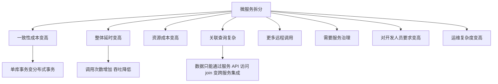

# Go 项目开发: 单体架构拆分成微服务的时机与粒度

微服务不是银弹。拆早了是灾难，拆晚了是负担。这一节讨论三件事：**什么时候拆**、**拆多细**、**拆完要付什么代价**。

## 纲要

- 什么是微服务
- 什么时候开始微服务化
- 拆分粒度：三个火枪手原则
- 怎么衡量粒度是否合适
- 三条拆分原则
- 拆分带来的八个问题

## 什么是微服务

微服务是在服务化基础上进一步演化的结果：**强调服务彻底拆分、服务原子化**，小到一个进程都可以是一个微服务。每个服务独立部署、独立运行、独立升级、独立扩展，拥有自己的数据库。

它的定义可以这样理解：一种通过**小型服务组合**来构建单个应用的架构风格，这些服务围绕**业务能力**而非特定技术标准来构建，可以采用不同的编程语言、不同的数据存储技术，运行在不同的进程中，通过轻量级通信机制与自动化部署机制完成通信与运维。

## 什么时候开始微服务化

产品初期**先用单体**。原因很实际：业务发展初期很难准确预测方向，单体架构简单得多，后续还能继续演进；加上初期研发资源与硬件资源都是高成本，此时上微服务风险较大。

**当单体架构过于庞大、不得不拆的时候，再开始微服务化** —— 微服务化是业务发展到一定阶段后顺势而为的事情。

拆分之前，基础设施与公共基础服务应当先就绪：

- 通过**监控**快速定位故障
- 通过**工具**自动化部署与管理服务
- 通过**服务化框架**降低服务开发复杂度
- 通过**灰度发布**提升可用性
- 通过**资源调度服务**快速申请与释放资源
- 通过**弹性伸缩**快速扩展应用

## 拆分粒度：三个火枪手原则

"微"**不代表拆得越细越好**，应当理解为**合适** —— 把合适做到极致。这需要让对业务理解足够深入的员工参与粒度划分，并且随着业务发展与人员水平提升，粒度本身也会演化。

如果实在拿不准，可以参考这个权重：

| 依据 | 权重 | 说明 |
| --- | --- | --- |
| **团队规模** | 50% | 参考"三个火枪手"原则：**三个人负责一个微服务** |
| 交付速度要求 | 30% | 拆分粒度越小，交付时受到的约束越小，速度越快 |
| 其他 | 20% | 资源占用、性能、一致性、架构演进速度、创新速度等 |

### 为什么是三个人

- **系统规模**：三人开发一个系统，复杂度刚好达到"每个人能全面理解整个系统，又能进行分工"的粒度。两人则复杂度不够，四人以上则无法让每个人都深入了解细节。
- **团队管理**：三人形成稳定备份，一人休假或调岗，剩余两人仍能支撑；两人撤掉一人压力巨大；一人是单点，很危险。
- **技术提升**：三人既能形成有效讨论，又能快速达成一致；两人可能互不相让或经验不足导致设计缺陷；一人容易陷入思维盲区；四人以上则有人可能只是完成任务、并不深入参与。

该原则主要应用于**设计与开发阶段**。服务进入维护期后，一人维护一个甚至多个微服务都可以；但考虑人员备份，**每个微服务最好安排两个人维护**。

## 怎么衡量粒度是否合适

从复杂度看，拆分过程中有两个复杂度要平衡：

- **内部复杂度（单体复杂度）** —— 单个对象内部的复杂度，可用**参与开发的人员数量**衡量，所以三个火枪手原则在这里适用。
- **外部复杂度（群体复杂度）** —— 拆分后多个对象之间关系的复杂度，可用**一次业务流程涉及的对象数量**衡量。一次用户请求涉及 5 个子系统比较合理；涉及 20 个子系统就过高了。

另外两个信号：

- **交付周期** —— 微服务架构下交付周期应当**以天为单位**。如果一个小功能改动要几周甚至几个月，往往意味着拆分粒度过大、冲突太多、要等代码合并。
- **团队沟通成本** —— 看大多数功能修改能否**在一个服务内完成**。如果经常需要跨团队联合开发才能完成新功能，说明拆分存在问题。

## 三条拆分原则

- **内外平衡原则** —— 内部复杂度与外部复杂度是天平的两端，一方降低另一方必然升高，原则在于**平衡**。
- **先粗后细原则** —— 把握不准就先少拆一些，后面发现问题再继续拆。
- **两年原则与演进原则** —— 只预测两年内可能的变化，不要试图预测十年后。不知道会不会用到的组件先不要封装或实现，用到时再重构。例如准备接入微信支付，预测接入支付宝是很自然的，但数字钱包就没必要提前准备。**架构前期越简单越好**。

## 拆分带来的八个问题



| 问题 | 说明 |
| --- | --- |
| 一致性实现成本变高 | 服务 A 同时调用 B 和 C，如何同时成功或失败？单库事务变成了**分布式事务** |
| 整体延时变高 | 调用次数增加，链路响应时间增加，吞吐量降低 |
| 资源成本变高 | 吞吐下降意味着需要更多资源，小规模部署的交互型项目尤其致命 |
| 关联查询复杂 | 一个服务的数据只能通过它的 API 访问，原本一次 join 能完成的需求，现在要跨多个服务集成查询 |
| 更多远程调用 | 需要额外考虑序列化、通信协议、数据压缩、服务间负载均衡与容错 |
| 需要服务治理 | 服务的注册、发现、依赖关系治理 |
| 对开发人员要求变高 | 一人要同时考虑接口定义与数据库设计 |
| 对工具与运维依赖变高 | 服务数量多，监控、健康检查要求更高 |

## 拆分决策速览

```dir
microservice-split/
├── 何时拆：先单体
│   └── 基础设施就绪再拆
├── 粒度：三个火枪手
│   └── 三人一个服务
├── 三条拆分原则
│   ├── 内外平衡
│   ├── 先粗后细
│   └── 两年原则
└── 八个代价
    ├── 分布式事务
    ├── 关联查询复杂
    └── 运维复杂度高
```

## 总结

拆分决策可以压成三句话：**初期用单体，被迫才拆分**；**粒度看团队规模，三个火枪手是基准**；**把握不准就先粗后细，只预测两年内的变化**。同时要清醒地认识到，拆分不是百利而无一害 —— 一致性、延时、关联查询、运维复杂度都会随之上升，这些代价必须在拆分前就算清楚。

