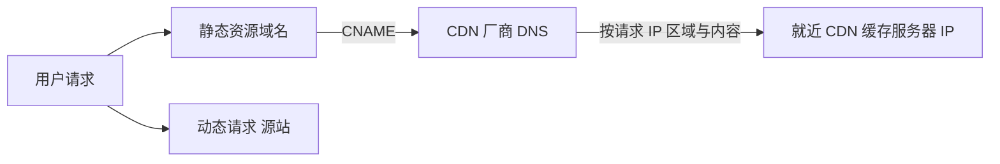

# Go 项目开发: 微服务可用性之服务隔离

隔离的目的只有一个：**系统发生故障时，限制它的影响范围**。就像高速公路的应急车道 —— 车坏了可以临时停在那儿，不至于堵住整条路。

## 纲要

- 线程级与进程级隔离
- 资源隔离与快慢隔离
- 热点隔离与 CAP 理论
- 按业务核心程度隔离
- 读写隔离与动静分离
- 应用隔离与物理隔离

## 线程级隔离

在微服务内部，把不同的任务分配到**不同的线程池**中执行。线程之间一般用共享变量（全局变量）通信，这是最简单的隔离方式。

## 进程级隔离

业务发展到一定规模后，把所有功能放在一起会导致系统过于复杂。此时把业务能力拆分到不同服务，部署到不同机器上，就实现了资源隔离 —— 一台机器故障不会波及全部服务，某个进程故障也不会进一步扩散。

进程间通信按是否同机分两类：

| 场景 | 通信方式 |
| --- | --- |
| 不同机器 | RPC、REST API、消息队列、套接字 |
| 同一机器 | 共享内存、管道、消息队列、信号 |

- **共享内存**：多个进程共享一块指定的内存存储区。
- **管道**：Linux 下的特殊文件，支持普通文件的读写操作，但不属于任何文件系统，是内存中固定大小的缓冲区；通常用于有关系的进程（父子、兄弟）之间。
- **消息队列**：数据交换以格式化的消息为单位，通过系统提供的发送/接收动作完成；可以把消息挂到接收方的消息缓冲队列，也可以放到中间实体等待取走。
- **信号**：比如服务关闭时监听操作系统发出的退出信号。

## 资源隔离

典型场景是虚拟化：用容器限制资源使用上限，或用虚拟机把一台物理机切成多台。如果某个服务的资源消耗远高于其他服务，就把它部署到单独的机器或集群 —— 一方面让它独享资源，避免争抢；另一方面避免它消耗过大影响其他业务。

## 快慢隔离

处理业务数据时，不同环节甚至同一队列里不同消息的处理速度都可能不同。放在一起处理会拖慢整体进度。

- 视频审核：不同长度的视频审核耗时不同，把长视频单独放到其他队列或线程，保证大部分视频的处理速度。
- 图片服务：系统 CPU 被大图耗尽会导致小图无法展示，把大图小图处理隔离开。
- **日志**：大量 `debug` / `info` 日志会导致日志采集延迟，进而推迟故障发现时间。把 `error` 级别与非 `error` 级别日志**分别存储、分别采集**，避免非 error 日志影响 error 日志采集的实时性。

## 热点隔离

### 热点操作

例如大量刷新页面、双十一零点集中下单。分读写两类处理：写瓶颈通常在存储层，优化思路是按 CAP 理论做平衡，**一般用确保最终一致性来换取写效率**。

### CAP 理论

2000 年由加州大学伯克利分校的 Eric Brewer 提出猜想，2002 年 MIT 的 Gilbert 与 Lynch 发表证明，使其成为分布式计算领域的公认定理。

**在一个分布式计算系统（相互连接并共享数据节点的集合）中，设计读写操作时，只能保证一致性、可用性、分区容错性三者中的两个，另一个必须牺牲。**

| 要素 | 含义 |
| --- | --- |
| **一致性 C** | 对某个指定的客户端来说，读操作保证能返回最新的写操作结果 |
| **可用性 A** | **非故障节点**在合理的时间范围内返回合理的响应（不是错误、不是超时） |
| **分区容错性 P** | 出现网络分区后系统仍能继续发挥作用（网络丢包、连接中断、网络拥堵等） |

两个重要限定：一是限定为**互联且共享数据**的节点集合（memcached 集群节点之间既不互联也不共享数据，不适用）；二是**只针对读写场景**，不是分布式系统的全部场景（例如 ES 的整体机制就不在 CAP 限定范围内）。

### 热点数据

- **静态热点**：能提前预测的热点数据，通过数据分析获取具有一定规律的部分。
- **动态热点**：无法提前预测，需要实现**动态发现热点**的能力，收集并汇总发布给关注的系统。

处理手段：提前预热缓存、使用本地缓存加快访问、用单独服务处理热点数据。核心目标是 —— **不让 0.01% 的数据或请求，影响 99.99% 的数据或用户**。

## 按业务核心程度隔离

不同业务的核心程度不同。账号服务几乎被所有服务依赖，一旦不可用影响面巨大。如果它与其他服务部署在同一集群或共用数据库，其他服务异常就很容易波及它。

做法是按核心程度给服务分级：**重要程度高的服务使用单独资源**（应用服务本身以及它依赖的消息队列、缓存等），并提供冗余资源提高容灾能力；非核心应用从节省资源角度可以混部。

## 读写隔离

读写分离不限于数据库。前面讲过的 ES 读写分离与半读写分级架构，既提高了集群可用性，也显著提升了业务性能。甚至在接收请求时，可以**让不同的协调节点分别处理读请求与写请求**，从而隔离节点资源消耗与故障影响面。

## 动静分离

### 表设计层面

MySQL 的页缓存用于缓存表中的行数据。**如果字段更新频繁，会导致缓存命中率下降**。所以设计表时，尽量让主表字段的更新频率低，把更新频率高的字段放到另一张表。

例如视频的基础信息（创建后改动很少）放主表，播放量与点赞数这些高频更新字段单独放一张表。

### CDN 层面

网站应用中静态资源占了流量的大多数。动静分离后可把静态资源交给 CDN 加速，静态请求大部分由就近部署的 CDN 服务器提供，用户延迟明显降低，网站服务器则专注处理动态流量，带宽压力也随之下降。



部署时静态资源要配**单独的域名**，该域名通过 CNAME 解析到另一个域名（而非 IP），CNAME 映射到 CDN 服务商的 DNS 服务器，CDN DNS 根据请求 IP 所在区域与资源内容返回就近的 CDN 缓存服务器 IP，后续请求都转到这个 IP。

## 应用隔离与物理隔离

- **应用隔离** —— 按规则把系统划分成若干服务模块，模块间相互独立、无强依赖，故障发生时能把问题隔离在模块内部。微服务本身就是一种应用隔离；单体应用中，一个功能 panic 或耗尽本地端口，所有功能都可能受影响。
- **物理隔离** —— 服务器、机房、集群维度的隔离，典型场景是**异地多活**：逻辑上是一个应用，物理上部署多套。

## 隔离维度一览

```dir
隔离维度/
├── 线程级隔离          线程池分配不同任务
├── 进程级隔离          业务拆服务、跨机部署
│   ├── 资源隔离        容器/虚拟机限制资源
│   ├── 快慢隔离        长视频/大图/日志分管
│   └── 热点隔离        静态/动态热点、CAP 取舍
├── 业务核心度隔离      核心服务独占资源
├── 读写隔离            协调节点分别处理读写
├── 动静分离
│   ├── 表设计层面      高频字段拆表
│   └── CDN 层面        静态资源走 CDN
└── 应用/物理隔离       模块独立、异地多活
```

## 总结

隔离的维度从细到粗依次是：线程池 → 进程/服务 → 资源 → 处理速度 → 热点 → 业务核心度 → 读写 → 动静 → 应用 → 物理。**真正重要的是具备隔离设计的意识** —— 每写一个服务都问一句：它挂了会影响谁？我能不能把它隔开？

