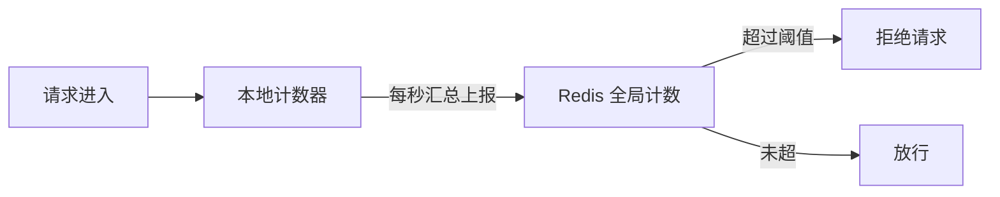
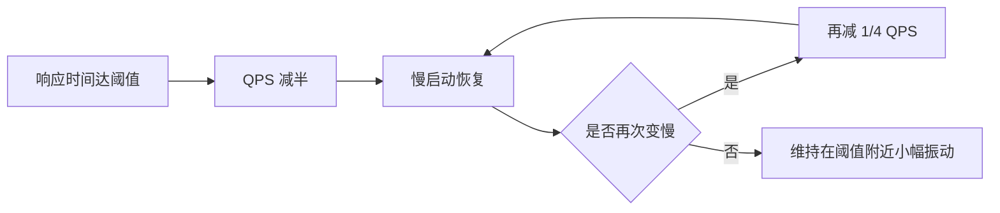

# Go 项目开发: 微服务可用性之服务限流

限流就是**在一段时间内定义某个应用或客户端可以处理/接收多少个请求**。

## 纲要

- 为什么要限流、在哪儿限流
- 分布式限流的实现
- 阈值怎么定：从压测到全链路压测
- 固定阈值为什么靠不住
- 动态限流：借鉴 TCP 拥塞控制
- 限流设计的三个注意点

## 为什么要限流

- **应对突发流量** —— 过滤掉产生流量峰值的客户端或微服务，确保应用在自动扩容之前不会过载。
- **防止资源被耗尽** —— 避免某个用户把系统资源吃光，影响其他用户正常使用。
- **控制成本** —— 不为极少的峰值流量把系统扩容到最大，让系统在有限资源下稳定提供服务。

## 在哪儿限流

| 位置 | 做法 |
| --- | --- |
| **请求入口处** | 用 Nginx / 网关，**效果最好** |
| 业务服务入口 | 依赖微服务框架，或用后文的动态限流策略 |
| 公共基础服务入口 | 重要级别高，出问题影响面大，一般也要限流 |

## 分布式限流

令牌桶与漏桶算法只能针对**单个节点**限流。而针对每个用户的限流通常是必要的 —— 这就需要**分布式限流**，一般用 Redis 实现，控制的是整个应用的全局流量。



注意：如果每次请求都上报 Redis，流量峰值时会对 Redis 造成很大压力。做法是**牺牲一点实时性，每秒把本地汇总的请求频率上报到 Redis**，大幅降低峰值对 Redis 的冲击。

## 阈值怎么定

通常靠压测评估系统能承受的最大压力，常用工具有 JMeter、wrk、ab 等。互联网公司普遍采用**全链路压测**：在请求入口处进行真实流量复制。

流量复制的实现方式：

- 用 **TCPCopy** 复制真实流量，简化模拟数据成本，还可通过参数调节压力；
- 用**消息中间件**存储请求数据，在压测平台回放；
- 使用开源的全链路压测工具。

**全链路压测的三个注意点**：

- **只针对核心流程** —— 全链路压测成本巨大，不可能全做；一个系统里核心流程可能只占 20%，那就是压测目标。
- **选择合适的隔离方式** —— 独立环境压测：隔离效果好、简单方便，但成本高；与线上环境混合：通过参数识别，在框架和服务处特殊处理，创建与线上结构一致的**影子库表**，真实性高、节省资源，但隔离性差。
- **缩小依赖服务范围** —— 目标服务依赖的其他服务是否配合压测要实际评估，不需要的可以通过参数绕过。

## 固定阈值为什么靠不住

压测得出的固定阈值有几个硬伤：

- 业务代码不断变更，执行所消耗的资源也在变，可能每次大版本都要重新压测。
- 服务依赖数据库、缓存、文件系统等中间件，不同请求对中间件造成不同压力；随着数据量增长，数据库性能也会变化。
- 很多情况下没有与线上完全一样的环境来压测，很难找到合适阈值。
- 不同 API、不同微服务需要设置不同的限流值，服务多了很难管理。

**结论：限流值一般没办法直接设成固定值。**

## 动态限流：借鉴 TCP 拥塞控制

TCP 的拥塞算法用 **RTT（往返时延）** 探测网络延时，从而设定滑动窗口大小，让发送速率与网络性能相适应。限流可以照抄这个思路。

**判定**：记录每次调用后端请求的响应时间，在一个时间区间（如 5 秒）内计算 **P90 或 P99** —— 把过去 5 秒的响应时间排序，看 90% 或 99% 位置的延时是多少。若 P90/P99 超过设定阈值，就触发自动限流。

请求量很大时，P99/P90 的计算本身也消耗 CPU，此时可用**采样**方式统计。

**流量控制（退避算法）**：



响应时间达到阈值就把 QPS 减半，然后像 TCP 一样走慢启动；如果又开始变慢，再减去 1/4 QPS，再慢启动；之后再触发阈值就减 1/8 —— 类似阻尼运动，把流量限定在一个值上下做小幅振动。**后端扩容后，系统会自适应地达到最大性能。**

对于不提供 HTTP/RPC 请求的服务（例如图片转换服务，CPU 通常是瓶颈），可以**基于系统资源使用率动态限流**：统计一段时间内的 CPU 消耗，达到设定值就触发流量限制。一般基于资源使用率来实现，比基于 QPS 更能充分利用系统资源。

## 限流设计的三个注意点

- **限流需要开关控制，可随时禁用** —— 这正是架构设计原则里的"可禁用"。
- **限流发生要触发监控告警**，让负责业务的同学及时跟进。
- **限流发生后要让调用方知道** —— 对已拒绝的请求约定特定的错误状态码；对正常响应的请求，可以在 header 中加上限流标识，让服务端决定是否重试或降级。**限流触发后，调用方应避免自动重试**，否则会进一步加重系统压力。

## 限流体系一览

```dir
限流体系/
├── 限流位置
│   ├── 请求入口        Nginx/网关，效果最好
│   ├── 业务服务入口    框架或动态限流
│   └── 公共基础服务入口 重要级别高
├── 分布式限流          Redis 全局计数
│   └── 本地汇总上报     降低 Redis 压力
├── 阈值确定            压测/全链路压测
└── 动态限流            借鉴 TCP 拥塞控制
    ├── P90/P99 判定   响应时间超阈值触发
    └── 流量退避        QPS 减半→慢启动
```

## 总结

限流的实施路径是：**入口处先挡一道（Nginx/网关）**，**全局用 Redis 分布式限流**（本地汇总上报降低 Redis 压力），**阈值不要写死** —— 用 P90/P99 响应时间配合退避算法做动态限流，让系统随后端容量自适应。最后别忘了给限流装开关、接告警、并告知调用方。

