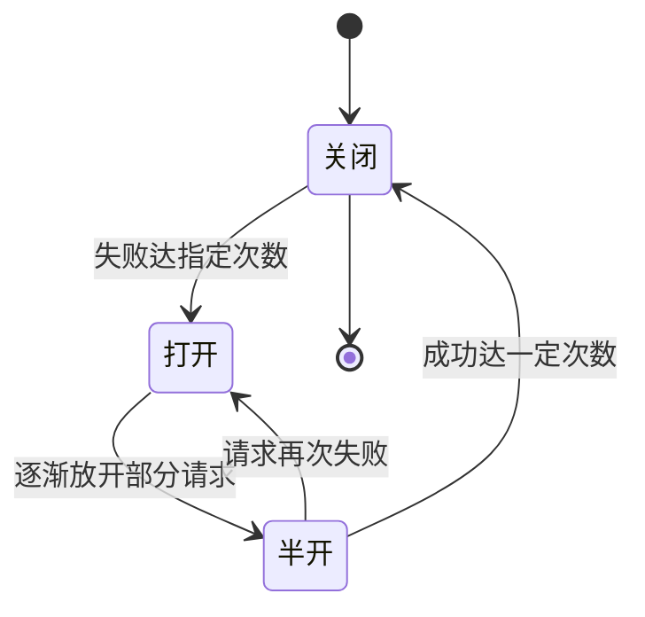

# Go 项目开发: 微服务可用性之服务降级与熔断

降级是**通过降低回复调用方的质量来减少系统工作量，或放弃不重要的请求**。本质是提供"阉割版"服务，目的是用有限资源保障核心功能可用。它是不得已的兜底操作 —— 但比大面积不可用的体验好得多。

## 纲要

- 什么是降级
- 服务雪崩是怎么发生的
- 熔断：断路器模式
- 什么时候触发降级
- 六种降级手段
- 降级的三个注意点

## 什么是降级

常见形态：

- 推荐系统出问题，直接返回**预设的默认商品**。
- 定期缓存一批数据，触发降级时返回这些缓存数据。
- **暂时关闭功能** —— 例如双十一高峰期临时关闭退款、确认收货等操作。

## 服务雪崩

**局部故障引发全局故障，就是雪崩。** 一个典型场景：


订单服务调用消息服务时，消息服务因资源不足无法响应，导致订单服务的请求被阻塞、占用的资源得不到释放，进而拖垮订单服务，再波及依赖订单服务的其他服务。

典型解法就是**熔断降级**。

## 熔断：断路器模式

当订单服务调用消息服务在一定时间内出现一定数量的错误响应时，后续请求在短时间内**不再调用**消息服务；直到尝试调用成功后，再逐渐恢复调用。



| 状态 | 含义 |
| --- | --- |
| **关闭** | 初始状态，请求正常放行 |
| **打开** | 失败达指定次数后打开，请求不再发出 |
| **半开** | 逐渐放开一部分请求试探；失败则回到打开，成功达一定次数则回到关闭 |

熔断是**比降级更不得已的方案，属于有损的降级机制**。不仅服务间调用要用熔断，调用 Redis、Kafka 这类组件时同样可以考虑。

## 什么时候触发降级

- 依赖的服务不可用。
- 调用其他服务时，响应时间**持续超时**。
- 系统吞吐量过大，为保障整体运行而主动降级。

## 六种降级手段

- **服务定级** —— 把不可降级的核心服务定为一级；三级服务可视情况降级；三级以上按级别从高到低依次或同时降级。通过配置约束"哪些服务降级"与"触发条件"。
- **降低返回结果的准确度** —— 库存暂时只显示有货/无货；商品价格降级使用缓存（浏览的人多、真正下单的人少，下单时再查最新价格即可）。
- **请求短路** —— 请求进来不走 DB，直接返回缓存结果。
- **简化流程，放弃部分操作** —— 例如放弃发送"下单成功"的短信或通知，这类操作并非核心。
- **延时执行** —— 对实时性要求不高的任务（积分扣减、发送通知消息等），等系统资源充裕时再执行。
- **关闭某些功能** —— 页面部分模块不加载、禁用某些操作；关闭消耗资源的定时任务（例如每晚执行的统计任务可以推迟）。

## 降级的三个注意点

- **自动降级要定期小规模演练**。降级不常触发，不演练就无法确保功能正常。
- **降级条件不应过于苛刻**，不该经常被触发；对突发流量要给予一定的缓冲时间，避免误触发。
- **触发降级要有告警通知**。如果服务还被其他服务调用，可以在 header 中约定参数传给下游，让下游知道当前拿到的是降级结果。

## 降级与熔断一览

```dir
降级与熔断/
├── 降级                 主动放弃质量保核心
│   ├── 服务定级         核心不可降、三级可降
│   ├── 降低准确度       库存只显有无货
│   ├── 请求短路         不走 DB 直接返回缓存
│   ├── 简化流程         放弃短信/通知
│   ├── 延时执行         积分/通知延后
│   └── 关闭功能         禁用定时任务
└── 熔断                 断路器模式防雪崩
    ├── 关闭             正常放行
    ├── 打开             失败达次数不再调用
    └── 半开             试探恢复
```

## 总结

降级与熔断是同一套思路的两端：**降级是主动放弃质量保核心，熔断是主动断开依赖防雪崩**。要做对这件事，前提是先把服务定好级 —— 哪些绝对不能降（一级），哪些可以随时降（三级）。定级不清，降级就只能靠拍脑袋，反而可能在故障时误伤核心链路。

