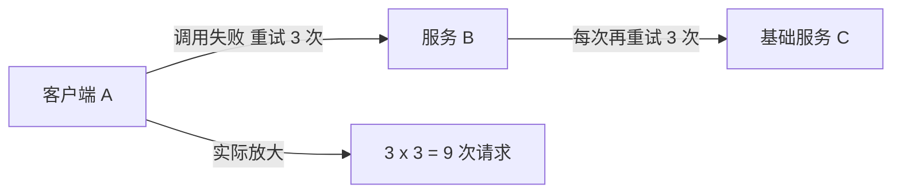
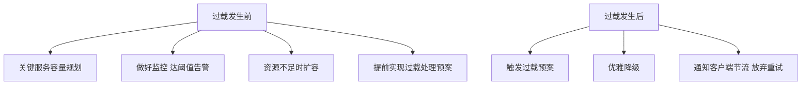

# Go 项目开发: 微服务可用性之过载保护

过载保护是**把系统接近过载时的峰值作为限流阈值来进行流量控制**：当系统接近过载时主动放弃一部分请求，避免真正超过负载。**目的是自保。**

## 纲要

- 哪些情况容易过载
- 重试放大：一个最危险的放大器
- 过载后的连锁反应
- 过载前与过载后分别怎么做
- 三种实现方式

## 哪些情况容易过载

- 遇到**突发流量**。
- **故障节点离线**导致资源不足。
- 业务发展使系统数据达到瓶颈，**数据库响应缓慢、处理能力下降**。
- 故障发生后**调用方大量重试**。

## 重试放大：最危险的放大器

假设一个 API 请求失败时重试 3 次，而**客户端和服务端都做了重试**，那么实际请求次数会达到 **9 次**。



A 调 B 失败，A 重试 3 次，而每一次都会造成 B 对下游的 3 次重试。所以**过载发生后必须及时反馈给调用端，让调用端放弃重试** —— 否则重试本身就会成为压垮系统的最后一根稻草。

## 过载后的连锁反应

系统过载时，直观表现是 CPU 等资源持续占用过高。此时可能出现两种情况：一段时间后自行恢复，或者继续恶化。

持续高负载下，大量请求进入排队状态，导致**内存、网络连接以及后端资源的消耗持续增加**。过载往往伴随着一系列连锁反应，而且**很难追溯到问题的根源** —— 这也是过载比普通故障更棘手的原因。

## 过载前与过载后分别怎么做



- **过载前**：对关键服务提前做好容量规划与监控；资源达到阈值就触发告警并考虑扩容，尽可能降低过载发生概率；**提前实现过载处理预案**。
- **过载后**：触发预案，对服务进行优雅降级。

## 三种实现方式

| 方式 | 说明 |
| --- | --- |
| **基于系统资源使用率** | 一般比基于 QPS 更能充分利用系统资源（对处理能力的预估往往并不准确） |
| **负载均衡器调度** | 检测到负载高的节点，尽量把请求路由到其他节点，防止该节点过载 |
| **客户端节流控制** | 系统临近过载时，通过响应告知客户端过载状态，客户端限制请求频率并**放弃重试**，能大幅降低过载负载 |

基于资源使用率的方式前面已有详细介绍（统计一段时间内的 CPU 等资源消耗，达到设定值即触发限流）；这里要特别强调的是**客户端节流** —— 它是唯一能从源头掐断重试放大的手段。

## 过载保护一览

```dir
过载保护/
├── 易过载场景           突发流量/故障离线/数据瓶颈/重试
├── 重试放大             客户端+服务端重试 → 9 倍
├── 过载前               容量规划/监控告警/预案
└── 过载后
    ├── 触发预案         优雅降级
    ├── 客户端节流       通知放弃重试
    └── 实现方式
        ├── 资源使用率
        ├── 负载均衡调度
        └── 客户端节流
```

## 总结

过载保护的设计可以压成三句话：**提前规划容量并监控告警**，**过载时优雅降级而不是硬扛**，**一定要把过载状态通知到客户端让它停止重试**。过载持续的时间通常很短，让系统自动应对过载、保障可用性，才是这套设计的重点。

