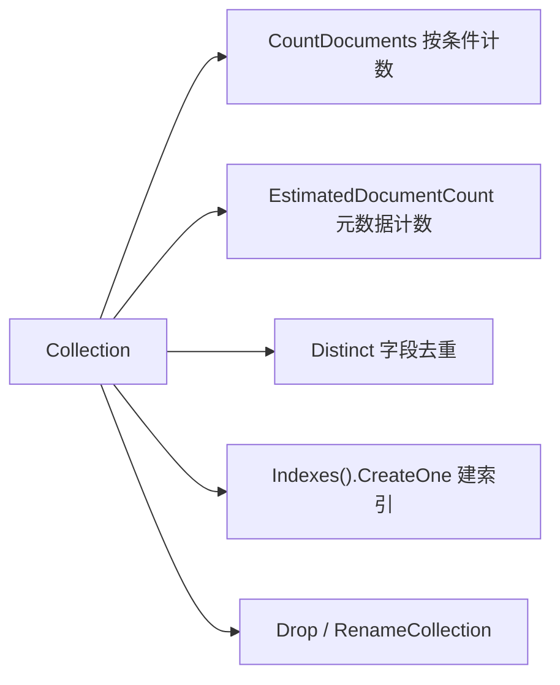

# Go集成MongoDB细节揭秘

用 Go 操作 MongoDB（官方 driver `go.mongodb.org/mongo-driver` v4.4.2）时，有几个细节最容易被忽略：`_id` 的类型约束、混用自定义 ID 与自动 ID 导致查不出数据、游标 callback 超时断开、重命名集合需要 admin 权限等。本篇按「增删改查 + 索引 + 连接」的顺序把 SDK 封装要点讲清楚。

## 纲要

- 计数与去重：`CountDocuments` / `EstimatedDocumentCount` / `Distinct`
- 索引创建 `CreateOne`、`Drop`、`RenameCollection`（需 admin）、`$out` 备份
- 插入：`InsertOne` 结构体 vs map；用 `bson:"_id"` 指定主键；混用 ID 类型查不出
- 更新：`UpdateOne` 与 `ReplaceOne`（不存在即插入）
- 查询：`Find` 条件、游标 callback 注意事项、`DeleteMany` 容错
- 连接初始化 `InitMongoClient` 与 `Close`

## 计数、去重与索引



```go
// 按条件计数（options 一般传 nil）
count, _ := coll.CountDocuments(ctx, bson.M{"name": "test"}, nil)

// 直接从元数据拿总量，效率最高
est, _ := coll.EstimatedDocumentCount(ctx)

// 字段去重，类似 MySQL distinct
vals, _ := coll.Distinct(ctx, "name", bson.M{})

// 建唯一索引
_, _ = coll.Indexes().CreateOne(ctx, mongo.IndexModel{
    Keys:    bson.D{ {Key: "name", Value: 1} },
    Options: options.Index().SetUnique(true),
})
```

> 多字段同时建唯一索引时，要么全唯一要么全不唯一，无法逐字段分开设置。

重命名集合需要 `admin` 库权限，普通用户执行会失败；把一张表备份到另一张表则用聚合的 `$out`：

```go
// 重命名（admin 权限）
db.RunCommand(ctx, bson.D{
    {Key: "renameCollection", Value: "srcDB.coll1"},
    {Key: "to", Value: "srcDB.coll2"},
})

// 备份：从 primary 取最新数据写入新表
coll.Aggregate(ctx, mongo.Pipeline{
    bson.D{ {Key: "$out", Value: "coll_backup"} },
})
```

## 插入与主键 _id

`InsertOne` 既可用结构体也可用 `map`，**生产更推荐结构体**（可读性好）。MongoDB 主键是 `_id`，直接写 `id` 字段只会被当成普通字段。要指定主键，用 `bson` tag：

```go
type UserWithID struct {
    ID   int    `bson:"_id"` // 指定为 MongoDB 主键
    Name string `bson:"name"`
}

// 自动生成的主键是 objectId（本质 string），自定义的是 int/long
_, _ = coll.InsertOne(ctx, UserWithID{ID: 4, Name: "test4"})
```

```dir
Go MongoDB SDK 封装/
├── client/
│   ├── InitMongoClient   # 初始化连接
│   └── Close             # 关闭连接
├── crud/
│   ├── InsertOne         # 结构体 / map
│   ├── UpdateOne         # $set 更新
│   ├── ReplaceOne        # 不存在则插入
│   ├── Find              # 条件 + 游标
│   └── DeleteMany        # 容错删除
└── index/
    ├── CreateOne         # 建索引
    └── Distinct          # 去重
```

**重要坑**：同一个字段混用「自定义 int 主键」和「系统自动生成的 objectId（string）」时，查询会返回空集——因为结构体映射无法兼容多类型值。务必保证同一集合内 `_id` 数据类型一致。

## 更新、查询与游标

`UpdateOne` 按条件更新；`ReplaceOne` 整文档替换，条件不存在时**会直接插入一条**。

```go
// 更新 id=3 的 name
coll.UpdateOne(ctx, bson.M{"_id": 3}, bson.M{"$set": bson.M{"name": "test33"}})

// ReplaceOne：id=8 不存在 → 插入
coll.ReplaceOne(ctx, bson.M{"_id": 8}, User{ID: 8, Name: "x"})
```

查询用 `bson.M` 构造条件，游标遍历：

```go
cur, _ := coll.Find(ctx, bson.M{"_id": bson.M{"$gt": 0}})
defer cur.Close(ctx)
for cur.Next(ctx) {
    var u User
    cur.Decode(&u)
    // ⚠ 不要在 callback/循环体里做耗时操作
}
```

> 游标回调里做重活会触发超时，游标被断开后后续数据拿不到。正确做法：先把结果攒到本地 slice/map，循环外统一处理。

`DeleteMany` 传入不存在的 ID 不会报错，只删掉命中的：

```go
// 删 4 和 7，7 不存在也不报错
coll.DeleteMany(ctx, bson.M{"_id": bson.M{"$in": []int{4, 7}}})
```

| 操作 | 方法 | 注意点 |
| --- | --- | --- |
| 条件计数 | `CountDocuments` | options 一般传 nil |
| 元数据计数 | `EstimatedDocumentCount` | 高效 |
| 字段去重 | `Distinct` | 类似 SQL distinct |
| 指定主键 | `bson:"_id"` tag | 混类型会导致查空 |
| 整文档替换 | `ReplaceOne` | 不存在即插入 |
| 游标遍历 | `Find` + `Next/Decode` | callback 忌耗时操作 |

## 总结

Go 集成 MongoDB 的「细节」基本都围绕两点：**`_id` 是主键且类型必须一致**（用 `bson:"_id"` 指定，混用 int 与 objectId 会查空）；**游标与集合级操作有隐藏约束**（游标 callback 不能做重活会超时断开，`RenameCollection` 需 admin，`ReplaceOne` 会「不存在则插入」，`DeleteMany` 容错不报错）。把连接初始化、增删改查、索引封装成独立 SDK 层，并在查询里统一用结构体映射，是工程里最稳的做法。
