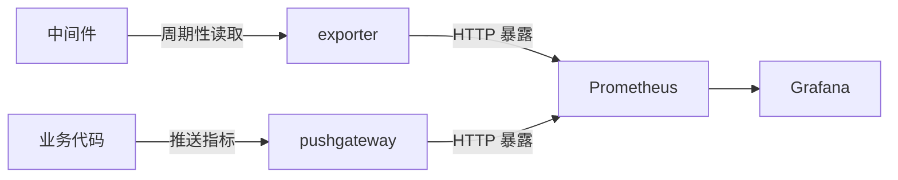

# Go 项目开发: Go 集成 Prometheus 细节揭秘

Prometheus 是搜索服务里**业务指标**的标准出口：接口 QPS、耗时分位数、缓存命中率、队列积压……这些数字 протe 进来，才有据可谈的优化。

但 Prometheus 本体是**拉模型（pull）**：它周期性去"拉"目标的地址。业务进程自己不会主动敞开被拉，中间就得靠 **pushgateway 接住业务推上来的指标**。本节就把这条链路讲透：**原理 → 组件安装 → Go SDK 封装 → 业务上报 → Grafana 画图**。

## 纲要

- Prometheus 的抓取原理与两种上报链路
- 指标的数据结构与四种类型
- pushgateway 的安装与端口开放
- 把 pushgateway 配进 Prometheus
- Go 侧 SDK 封装：初始化注册与定时上报调度
- 业务指标声明：Counter 与 Histogram 的用法
- 异步上报的一个反直觉细节
- Grafana 里的四条常用 PromQL

## 抓取原理

Prometheus **通过 HTTP 协议周期性抓取被监控组件的指标，并以时间序列的形式存储**。

既然是 HTTP 抓取，被监控对象就必须**自己提供一个 HTTP 接口把指标吐出来**。这里有个值得想清楚的问题：**指标本身是怎么产生的？**

答案是分两条路：

- **中间件（MySQL、Redis、Kafka、Elasticsearch……）**：这类组件自己不会说话，但社区为每个组件都配了对应的采集程序，它连上中间件、周期性地读取运行时指标，再以 HTTP 形式暴露出去。**这个采集程序就叫 exporter。** 前面讲过的 `elasticsearch_exporter` 属于这一类。
- **业务进程**：订单量、接口 QPS、调用耗时这些业务指标，只能由业务代码产出。路子是把指标先**推给 pushgateway**，再由 Prometheus 去拉 pushgateway。



两条链路在 Prometheus 眼里是一样的：都是配一个地址，周期去拉。

## 指标的数据结构与四种类型

Prometheus 里一条指标 = **一个 labelset + 一个值**。用 JSON 表达大概是这个形状：

```txt
{
  "timestamp": 1760529000000,
  "metric": "order_total",
  "labels": { "host": "node-3", "api": "/search" },
  "value": 128
}
```

labels 由若干「label name → label value」组成，**业务方就是靠标签做过滤和聚合的**。所以设计指标时，标签该带什么（路由、实例、状态码、用户维度）必须在建模阶段定好，上线后再补会污染历史数据。

四种指标类型：

| 类型 | 特点 | 典型场景 |
| --- | --- | --- |
| **Counter** | 只增不减 | 应用重启次数、接口调用次数、订单数 |
| **Gauge** | 可增可减 | 当前可用内存、CPU 使用率、队列长度 |
| **Histogram** | 时间范围内的直方图，自动分桶 | 接口耗时分布、P99 / P95 分位数 |
| **Summary** | 客户端内聚合并算分位数 | GC 相关这类不需要集中聚合的单体指标 |

几个要记牢的点：

- **Counter 只能增**：减了就是数据异常（进程重启会重置，PromQL 用 `irate` / `rate` 处理重置）。
- **Summary 与 Histogram 都算分位数，但聚合位置不同**：Summary 在**客户端**算，Histogram 在**服务端**（Prometheus）聚合 —— 所以 Histogram 可以跨实例汇总，Summary 只适合单体指标。这也是 GC 类指标用 Summary 的原因。
- **Histogram 的桶（bucket）必须提前声明**，客户端按桶边界把样本落进去。值 4 落进 `0~5` 的桶，7 落进 `0~10`，12 落进 `0~15`。

## pushgateway 的安装

到 GitHub 发布页下载压缩包，解压：

```txt
cd /opt/apps
wget https://github.com/prometheus/pushgateway/releases/download/v1.8.0/pushgateway-1.8.0.linux-amd64.tar.gz
tar -zxvf pushgateway-1.8.0.linux-amd64.tar.gz
```

写 systemd 启动脚本（`/usr/lib/systemd/system/pushgateway.service`）：

```txt
[Unit]
Description=pushgateway
After=network.target

[Service]
Type=simple
WorkingDirectory=/opt/apps/pushgateway-1.8.0.linux-amd64
Restart=on-failure
ExecStart=/opt/apps/pushgateway-1.8.0.linux-amd64/pushgateway

[Install]
WantedBy=multi-user.target
```

三个配置项别漏：**`WorkingDirectory`**（相对路径找配置会失败）、**`Restart=on-failure`**（挂了自动拉起）、**`ExecStart` 指向二进制全路径**。

启动并设开机自启：

```txt
systemctl daemon-reload
systemctl enable pushgateway.service
systemctl start pushgateway
systemctl status pushgateway
```

CentOS 7 默认开了防火墙，要放行端口后重载：

```txt
firewall-cmd --zone=public --add-port=9091/tcp --permanent
firewall-cmd --reload
```

pushgateway 默认端口是 **9091**。浏览器打开 `http://<ip>:9091`，能看到当前收集的指标和启动参数，说明服务起来了。

## 配进 Prometheus

编辑 Prometheus 配置，把 pushgateway 作为一个 job 加进去：

```yaml
scrape_configs:
  - job_name: 'pushgateway'
    static_configs:
      - targets: ['192.168.1.10:9091']
```

改完必须**重启 Prometheus 服务**才生效（配置热加载也需要触发，重启最稳）。

## Go 侧 SDK 封装

用的包是 `github.com/prometheus/client_golang`。封装思路是：**本地 registry 缓存所有已声明的指标 → 起一个 ticker 定时整体推给 pushgateway**。

```go
package main

import (
	"fmt"
	"time"

	"github.com/prometheus/client_golang/prometheus"
	"github.com/prometheus/client_golang/prometheus/push"
)

const defaultPushInterval = 60 * time.Second

// PushSchedule 负责把本地注册的指标按固定间隔推给 pushgateway
type PushSchedule struct {
	pusher *push.Pusher
}

// InitPrometheus 初始化注册器并连上 pushgateway，metrics 为业务声明的所有指标
func InitPrometheus(url, job, instance string, pushInterval time.Duration, metrics ...prometheus.Collector) *PushSchedule {
	if pushInterval <= 0 {
		pushInterval = defaultPushInterval
	}

	// registry 是本地缓存：业务侧 Inc/Observe 只改本地，定时器到点整体推送
	reg := prometheus.NewRegistry()
	reg.MustRegister(metrics...)

	pusher := push.New(url, job).Gatherer(reg).Grouping("instance", instance)

	return &PushSchedule{pusher: pusher}
}

// Run 起一个 ticker，每隔一个周期把本地指标推一次
func (s *PushSchedule) Run(interval time.Duration) {
	ticker := time.NewTicker(interval)
	defer ticker.Stop()

	for range ticker.C {
		if err := s.pusher.Push(); err != nil {
			fmt.Println("push metric failed:", err)
		}
	}
}

// Stop 服务退出前主动推最后一次，避免丢失一个采集周期的指标
func (s *PushSchedule) Stop() {
	_ = s.pusher.Push()
}

func main() {
	// 业务侧只需要声明指标并往里累加，推送由 PushSchedule 托管
	hit := prometheus.NewCounterVec(prometheus.CounterOpts{
		Name: "demo_hit_total",
		Help: "搜索接口命中次数",
	}, []string{"api"})

	s := InitPrometheus("http://127.0.0.1:9091", "test", "demo-node", 60*time.Second, hit)
	go s.Run(10 * time.Second)

	hit.With(prometheus.Labels{"api": "/search"}).Inc()
	time.Sleep(15 * time.Second)
	s.Stop()
}
```

RequestCounter 与 RequestDuration 在上一段声明，这里只作注册用；真实项目里还应把 `InitPrometheus` 的调用挪到服务启动处，指标声明放进独立的 metrics 包。

三个设计点：

- **本地缓存**：指标只在本地 registry 里累加，定时器到点统一 push。所以业务代码里的 `Inc()` 是纯内存操作，**无锁之外的开销**。
- **`Grouping("instance", instance)`**：分组标签决定了指标在 pushgateway 里归到哪一组，多实例部署时靠它区分；不给的话，两个实例的同名指标会互相覆盖。
- **间隔**：演示环境可以设短一点（比如 2 秒看效果），**线上按 30 秒或 60 秒**设。太短会放大 pushgateway 的压力，太长则指标延迟明显。

## 业务指标声明与上报

```go
package main

import (
	"fmt"
	"math/rand"
	"os"

	"github.com/prometheus/client_golang/prometheus"
)

// host 是常量标签：所有上报都带上当前主机名，方便图上按实例过滤
var host, _ = os.Hostname()

// RequestCounter 接口调用次数。
// 带动态标签必须用 Vec 类型，否则 With 方法不存在、也拿不到分维度的时间序列
var RequestCounter = prometheus.NewCounterVec(prometheus.CounterOpts{
	Name: "counter_test", // Counter 导出时自动补 _total，PromQL 里用 counter_test_total
	Help: "接口请求次数统计",
	ConstLabels: prometheus.Labels{
		"host": host, // 常量标签：所有上报都带上主机名，方便按实例过滤
	},
}, []string{"tag"})

// RequestDuration 接口耗时分布，Histogram 类型，桶和前端图表必须对齐
var RequestDuration = prometheus.NewHistogramVec(prometheus.HistogramOpts{
	Name:    "histogram_test",
	Help:    "接口耗时分布统计",
	Buckets: prometheus.DefBuckets, // 默认步长桶，画图时按这组桶相减
}, []string{"tag"})

// Report 业务关键节点上报：一次请求 Inc 一次，一次耗时 Observe 一次
func Report(total int) {
	for i := 0; i < total; i++ {
		tag := "a"
		if i%2 == 0 {
			tag = "b"
		}
		RequestCounter.With(prometheus.Labels{"tag": tag}).Inc()

		// 这里用随机数假装是一次的接口耗时（毫秒）
		RequestDuration.With(prometheus.Labels{"tag": tag}).Observe(float64(rand.Intn(20)))
	}
}

func main() {
	fmt.Println("hostname:", host)

	// 模拟一次真实请求：请求进来 Inc 一次，处理完 Observe 一次耗时
	RequestCounter.With(prometheus.Labels{"tag": "a"}).Inc()
	RequestDuration.With(prometheus.Labels{"tag": "a"}).Observe(7)
}
```

要点：

- **常量标签 `host`** 在指标声明时就绑死；动态标签（如 `tag`）通过 `With(prometheus.Labels{...})` 传，**同一个 label 组合对应一条时间序列**，别在运行时乱拼 label value，否则时间序列爆炸。
- **Counter 名字习惯带 `_total` 后缀**，PromQL 里 `irate(xxx[2m])` 能自动识别。
- **Histogram 的 `Buckets` 一旦定下，画图时就要按这组桶减**，改桶等于换了一条指标。

上报之后主进程如果立刻退出，**最后一批指标会跟着主进程一起消失** —— 这就是演示代码里"跑完要 sleep 十几秒"的原因。生产上正确做法是：**上报放 goroutine 异步跑，主进程退出前等一个推送周期**（或显式停 ticker + `Stop()` 补推一次）。

```txt
go schedule.Run(2 * time.Second)
Report(100)
time.Sleep(15 * time.Second) // 等最后一次异步推送完成
```

## Grafana 里的四条常用 PromQL

**一、接口 QPS**

先 `sum` 把同名指标的所有标签加起来，再用 `irate` 算瞬时增长率：

```txt
sum(irate(counter_test_total[2m]))
```

图上大约稳定在 1 左右。加上时间范围（比如最近 15 分钟）看趋势更直观。

**二、按标签过滤**

要拆奇偶两个 tag 看，就在指标名后面加花括号过滤：

```txt
sum(irate(counter_test_total{tag="a"}[2m]))
```

`tag="a"` 的 QPS 约 0.5，`tag="b"` 同样 0.5 —— 总速率正好是分速率之和，这是校验标签维度是否正确的好办法。

**三、耗时分布**

Histogram 会被自动拆成 `xxx_bucket` 序列，**画图要写的是 `histogram_test_bucket`，不是 `histogram_test`**：

```txt
sum(increase(histogram_test_bucket[2m])) by (le)
```

这里有个必踩的坑：**指标名后面既要有 `_bucket` 后缀，整体又必须用一组花括号**，写成 `sum(increase(histogram_test_bucket)[2m]))}` 多一个大括号会直接报解析错误。

拿到各桶的计数后，区间分布靠**相邻桶相减**：

| 区间 | PromQL |
| --- | --- |
| < 5ms | `sum(increase(histogram_test_bucket{le="5"}[2m]))` |
| 5~10ms | `sum(increase(histogram_test_bucket{le="10"}[2m])) - sum(increase(histogram_test_bucket{le="5"}[2m]))` |
| 10~15ms | `le="15"` 的桶 减 `le="10"` 的桶 |
| 15~20ms | `le="20"` 的桶 减 `le="15"` 的桶 |

**桶的边界必须和代码里声明的 `Buckets` 完全一致**，漏一个或多写一个，曲线就会莫名偏移。

**四、分位数**

```txt
histogram_quantile(0.99, sum(increase(histogram_test_bucket[2m])) by (le))
```

把 0.99 换成 0.95、0.9，就得到 P99 / P95 / P90 三条曲线，从上到下依次是 P99、P95、P90。

`histogram_quantile` 的第一个参数是**小于该值的样本占比**，别当成百分比写 99。

## Prometheus 链路一览

```dir
Prometheus 监控链路/
├── 抓取模型             pull 拉取
│   ├── exporter         中间件指标暴露
│   └── pushgateway      业务指标中转
├── 指标类型
│   ├── Counter          只增不减
│   ├── Gauge            可增可减
│   ├── Histogram        服务端分桶
│   └── Summary          客户端聚合
├── Go 封装              registry + ticker 推送
└── Grafana 画图         PromQL
```

## 总结

整条链路上要记住的四件事：

1. **Prometheus 是拉模型**，中间件走 exporter 暴露 HTTP 接口，业务侧走 pushgateway 中转 —— 两条路最终都在 Prometheus 的配置里配成一个 target。
2. **指标设计横向靠标签、纵向靠类型**：Counter 数次数、Gauge 看瞬时值、Histogram 出分位数、Summary 留客户端聚合；标签维度上线前定死。
3. **Go 封装的核心是本地 registry + ticker 定时推**，推送间隔线上取 30~60 秒，退出前补推一次，别让最后一批指标丢在主进程里。
4. **画图时盯住 `bucket` 后缀和花括号**，桶边界与代码声明对齐，QPS 用 `irate` 加 `sum` 聚合，分位数用 `histogram_quantile`。

跑通之后，接口 QPS 和耗时分位数就有了客观数据 —— 前面聊的那些"优化前后效果对比"，才有得比。

