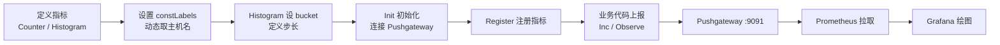

# Go集成Prometheus细节揭秘

前面我们封装好了 Prometheus SDK，这一节把**指标怎么定义、怎么上报、怎么在 Grafana 画出 QPS 与耗时分布/分位数**彻底讲透。所有「普罗米修斯 / 剖析格的 way / horogram」等机翻噪声，下面统一用正确术语。

## 纲要

- 两种指标类型：Counter 与 Histogram
- 常量标签（constLabels，动态取主机名）与自定义标签（tag）
- Pushgateway：默认端口 9091，初始化与上报间隔
- 上报代码：Counter.Inc() 与 Histogram.Observe()
- Grafana 绘图：QPS（irate）、耗时分布（bucket 相减）、分位数（histogram_quantile）
- 桶（bucket）步长必须与代码定义一致

## 指标定义

我们准备两类指标，它们的参数结构高度相似：

| 指标 | 类型 | 名称 | 标签 |
| --- | --- | --- | --- |
| `countertest` | Counter | 计数类，统计 QPS | constLabels: 主机名 |
| `histgramtest` | Histogram | 统计接口耗时分布 | constLabels: 主机名；自定义 label: `tag` |

- **Counter**：只增不减的计数器，适合统计「请求次数」。每来一个请求 `Inc()` 一次。
- **Histogram**：带 **bucket（桶）** 的指标，适合统计「耗时分布 / 大小分布」。例如指标值 4 落入 0~5 桶，7 落入 0~10 桶，12 落入 0~15 桶（默认步长的桶）。



**常量标签 vs 自定义标签**

- `constLabels`：值通常**动态获取**，如当前主机名；所有上报自动带上。
- 自定义 `tag`：值由外部代码通过参数传入，用于后续图表过滤（如区分 a/b 两组流量）。

## 初始化与上报

连接地址是本地测试机的 Pushgateway，其**默认端口 9091**：

```go
// 初始化：传入 Pushgateway URL、上报间隔、job 名（应用名）、HTTP Client
pusher := initPrometheus(
    "http://localhost:9091", // Pushgateway 地址
    2 * time.Second,          // 演示用 2s；线上一般 30s 或 60s
    "test",                   // job name，线上按业务节点命名
    httpClient,
)
// 把上面声明的两个指标注册进来
pusher.Register(countertest, histgramtest)
```

> 线上 `job` 名一般直接用应用名；上报间隔短（如 2s）只是为了演示，生产环境 30~60s 一次即可。

**上报演示**：用 0~100 的循环判断奇偶，给 `tag` 赋 `a`/`b`，然后上报。

```go
// Counter：每来一次请求 Inc 一次，可统计接口 QPS
for i := 0; i < 100; i++ {
    tag := "b"
    if i%2 == 0 { tag = "a" }
    if err := countertest.WithLabelValues(tag).Inc(); err == nil {
        // 业务处理……
    }
}

// Histogram：Observe 一个 float64，这里用随机数模拟接口耗时（毫秒）
for i := 0; i < 100; i++ {
    tag := "b"
    if i%2 == 0 { tag = "a" }
    dur := rand.Float64() * 20 // 0~20ms
    _ = histgramtest.WithLabelValues(tag).Observe(dur)
}
```

注意上报是**后台异步**进行的，演示程序退出前要 `sleep` 足够时间（如 15s），否则主进程退出会丢尚未推送的指标。

## Grafana 绘图

### 1. QPS（基于 Counter）

用 `irate` 取近期增长率，指标名 `countertest`，窗口 2 分钟：

```promql
irate(countertest[2m])
```

聚合所有 label 后刷新即可看到 QPS 曲线（演示约 1）。可加 `tag="a"` 过滤只看某组：

```promql
irate(countertest{tag="a"}[2m])
```

### 2. 耗时分布（基于 Histogram bucket）

Histogram 自动生成带 `_bucket` 后缀的指标。想看「小于 5ms」的量：

```promql
increase(histgramtest_bucket{le="5"}[2m])
```

桶之间用**减法**得到区间分布（注意括号匹配，写错会报语法错误）：

```promql
# 5~10ms
increase(histgramtest_bucket{le="10"}[2m]) - increase(histgramtest_bucket{le="5"}[2m])
# 10~15ms
increase(histgramtest_bucket{le="15"}[2m]) - increase(histgramtest_bucket{le="10"}[2m])
# 15~20ms
increase(histgramtest_bucket{le="20"}[2m]) - increase(histgramtest_bucket{le="15"}[2m])
```

```dir
grafana-panels/
├── QPS 面板
│   └── irate(countertest[2m])
├── 耗时分布面板
│   ├── <5ms      bucket le=5
│   ├── 5~10ms    le=10 - le=5
│   ├── 10~15ms   le=15 - le=10
│   └── 15~20ms   le=20 - le=15
└── 分位数面板
    ├── P99  histogram_quantile(0.99, ...)
    ├── P95  histogram_quantile(0.95, ...)
    └── P90  histogram_quantile(0.90, ...)
```

> 关键：**图表里的桶步长必须和代码里定义的完全一致**。代码用默认桶（`[]float64{5,10,15,20,...}`），图表就按 5/10/15/20 依次相减。步长对不上，分布图就失真。

### 3. 分位数（P99 / P95 / P90）

用 `histogram_quantile`：

```promql
# P99
histogram_quantile(0.99, sum(rate(histgramtest_bucket[2m])) by (le))
# P95
histogram_quantile(0.95, sum(rate(histgramtest_bucket[2m])) by (le))
# P90
histogram_quantile(0.90, sum(rate(histgramtest_bucket[2m])) by (le))
```

三条曲线从上到下依次是 P99、P95、P90。

## 总结

Go 集成 Prometheus 的要点就三步闭环：**定义指标（Counter 计数、Histogram 看分布）→ 业务里上报（`Inc` / `Observe`）→ Grafana 用 PromQL 把指标画出来**。

- Counter 配 `irate` 出 QPS；Histogram 配 `bucket` 相减出耗时区间分布，配 `histogram_quantile` 出分位数。
- `constLabels` 动态取主机名、自定义 `tag` 用于过滤；上报经 **Pushgateway（默认 9091）** 中转，Prometheus 再拉取。
- 最容易踩的坑是**桶步长代码与图表不一致**，以及**异步上报未 sleep 导致丢指标**——这两点盯住，监控面板就能稳定出数。
