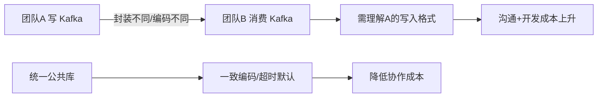

# Go中间件集成实战-章节导学

在 Go 工程化实践中我们强调过：**越早沉淀公共库，对企业越有利**。本章聚焦「Go 集成各类中间件的最佳实践」，讲解在真实工作中集成中间件需要考虑的问题、消息中间件的选型，以及如何把 Kafka、MySQL、MongoDB、Prometheus 等封装得既好用又统一。

## 纲要

- 为什么要沉淀公共库：避免各团队各封装一套带来的不一致
- 典型痛点：编码方式不同、HTTP 超时默认值不一致
- 本章覆盖：消息中间件选型、Kafka 使用、MySQL/ES 集成要点
- 还包括：MongoDB 与 Prometheus 的 Go 集成
- 学习方法：中间件集成必须动手，动手再动手

## 为什么要沉淀公共库

企业项目里，MySQL、RabbitMQ、Kafka 等中间件几乎每个团队都要用。早期各项目组各自封装公共库，虽然 SDK 功能齐全，但接口偏原子化，还得按业务场景二次封装、隐藏细节。一方面要考虑在线重连、调试等功能；另一方面封装后代码更简洁、学习成本更低，经验不足的同学也能快速上手。

更现实的问题是**跨团队协作成本**：A 团队把数据写入 Kafka 后，B 团队来消费。若两家对 Kafka 组件的封装不同、用了不同的编码（序列化）方式，B 团队就得去研究 A 团队的数据是怎么写入的，沟通与开发成本陡增。再比如各业务组自定义的 HTTP 请求超时时间不一致，可能出现「客户端已超时、服务端还在处理」的尴尬局面。



因此，把中间件的通用能力沉淀成统一公共库，对整个后端开发都不可或缺。

## 本章内容地图

本章会讲解：实际工作中用 Go 集成中间件要考虑哪些方面、哪些场景需要引入消息中间件、消息中间件怎么选、如何正确使用 Kafka；以及 Go 操作 ES、MySQL 需要解决的关键问题，还有 Go 中如何集成 MongoDB 与 Prometheus。

```dir
go-middleware/
├── 消息中间件/
│   ├── Kafka 封装
│   ├── RabbitMQ 选型
│   └── 编码/序列化统一
├── 数据存储/
│   ├── MySQL 集成
│   ├── Elasticsearch 集成
│   └── MongoDB 集成
└── 可观测性/
    └── Prometheus 集成
```

| 中间件 | 本章关注点 | 常见坑 |
| --- | --- | --- |
| Kafka | 封装、消费组、编码统一 | 各团队序列化方式不一致 |
| MySQL | 连接池、超时 | 超时默认值不统一 |
| Elasticsearch | 客户端封装、HTTPS | 证书/TLS 配置 |
| MongoDB | 连接与数据卷 | 文件系统挂载（Windows） |
| Prometheus | 指标上报 | 指标命名与 bucket 设计 |

## 总结

本章主题是「Go 中间件集成最佳实践」。核心动机是**用统一公共库消除团队间的封装差异**——不一致的编码方式与超时默认值会直接转化为沟通与开发成本。公共库应在项目早期就沉淀，既隐藏重连、调试等细节，又让经验不足的同学快速上手。

本章将贯穿整个项目开发，覆盖消息中间件选型、Kafka 的正确使用、Go 操作 ES/MySQL 的关键问题，以及 MongoDB 与 Prometheus 的集成。学习方法只有一条：**动手，动手，再动手**——把知识转化为技能、再内化为熟练度，别无捷径。
